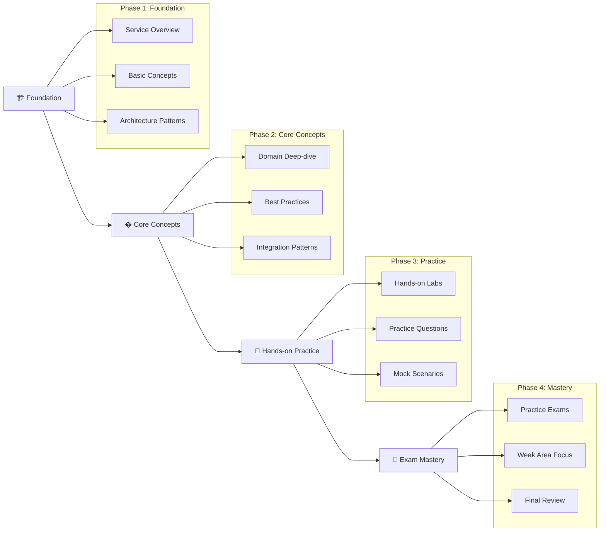

# 🎓 Certifications Journey

Welcome to your comprehensive certification hub! 🚀 This repository is your one-stop destination for mastering data engineering, cloud technologies, and agile methodologies. Each certification comes with detailed study guides, practice questions, visual diagrams, and hands-on examples to accelerate your learning journey.

## 🌟 Certification Progress Overview

| Provider | Certifications | Status | Difficulty |
|----------|---------------|--------|------------|
| 🟧 AWS | 2 certifications | 🔥 Active | ⭐⭐⭐ |
| 🟪 Databricks | 3 certifications | 🔥 Active | ⭐⭐⭐⭐ |
| 🟦 Azure | 1 certification | 📚 Ready | ⭐⭐ |
| ☁️ Google Cloud | 1 certification | 📚 Ready | ⭐⭐⭐ |
| 🔄 Agile/Scrum | 6 certifications | 📚 Ready | ⭐⭐ |
| 🌊 Airflow | Coming Soon... | 🛠️ Prep | ⭐⭐⭐ |

## 📋 Complete Certification Catalog

### 🟧 Amazon Web Services (AWS)
*Building scalable cloud data solutions with industry-leading services*

#### 🏗️ Data Engineering & Analytics
- **[📊 Data Engineer Associate (DEA-C01)](./aws/data-engineer-associate/)**
  - ✅ Complete study guide with 4 domains
  - 🎯 34% Data Ingestion & Transformation
  - 🎯 26% Data Store Management  
  - 🎯 22% Data Operations & Support
  - 🎯 18% Data Security & Governance
  - 📈 65 questions | 130 minutes | Score: 720/1000

#### ☁️ Cloud Architecture
- **[🏛️ Solutions Architect Associate (SAA-C03)](./aws/solutions-architect-associate/)**
  - ✅ Comprehensive architecture patterns
  - 🎯 Design resilient architectures (30%)
  - 🎯 Design high-performing architectures (28%)
  - 🎯 Design secure applications (24%)
  - 🎯 Design cost-optimized architectures (18%)
  - 📈 65 questions | 130 minutes | Score: 720/1000

---

### 🟪 Databricks
*Unified analytics platform for big data and machine learning*

#### 🔧 Data Engineering Track
- **[⚙️ Data Engineer Associate](./databricks/databricks-certified-data-engineer-associate/)**
  - ✅ Databricks fundamentals & SQL mastery
  - ✅ Data ingestion & ETL workflows
  - ✅ Delta Lake architecture & optimization
  - ✅ Unity Catalog governance
  - 📈 45 questions | 90 minutes

- **[🚀 Data Engineer Professional](./databricks/databricks-data-engineer-professional/)**
  - ✅ Advanced data modeling & design
  - ✅ Complex data processing & engineering
  - ✅ Enterprise data storage & management
  - ✅ Security & governance at scale
  - ✅ Monitoring, logging & troubleshooting
  - 📈 60 questions | 120 minutes

#### 🤖 AI/ML Track
- **[🧠 Generative AI Engineer Associate](./databricks/databricks-generative-ai-engineer-associate/)**
  - ✅ Generative AI fundamentals
  - ✅ Databricks AI platform mastery
  - ✅ Prompt engineering & design
  - ✅ RAG application development
  - ✅ Document processing & chunking
  - ✅ Model selection & optimization
  - 📈 40 questions | 75 minutes

---

### 🟦 Microsoft Azure
*Comprehensive cloud platform for enterprise solutions*

#### ☁️ Fundamentals
- **[🌐 Azure Fundamentals (AZ-900)](./azure/az-900/)**
  - ✅ Cloud concepts & Azure services
  - ✅ Core Azure workloads & security
  - ✅ Azure pricing & support
  - 📈 40-60 questions | 85 minutes | Score: 700/1000

---

### ☁️ Google Cloud Platform (GCP)
*Leading cloud platform for data analytics and ML*

#### 📊 Data Engineering
- **[🔬 Professional Data Engineer](./gcp/professional-data-engineer/)**
  - ✅ Designing data processing systems
  - ✅ Building & operationalizing data processing systems
  - ✅ Operationalizing machine learning models
  - ✅ Ensuring solution quality
  - 📈 50-60 questions | 120 minutes

---

### 🔄 Agile & Scrum Methodologies
*Master agile project management and team collaboration*

#### 👨‍💼 Product Owner Track
- **[📋 Professional Product Owner I](./agile/scrum/product-owner/professional-product-owner-i/)**
  - ✅ Product ownership fundamentals
  - ✅ Backlog management
  - ✅ Stakeholder collaboration
  - 📈 80 questions | 60 minutes | Score: 85%

- **[📊 Professional Product Owner II](./agile/scrum/product-owner/professional-product-owner-ii/)**
  - ✅ Advanced product ownership
  - ✅ Evidence-based management
  - ✅ Product strategy & vision
  - 📈 30 questions | 60 minutes | Score: 85%

- **[🎯 Professional Product Owner III](./agile/scrum/product-owner/professional-product-owner-iii/)**
  - ✅ Expert-level product ownership
  - ✅ Organizational product management
  - ✅ Advanced stakeholder management
  - 📈 40 questions | 120 minutes | Score: 85%

#### 🏃‍♂️ Scrum Master Track
- **[🎯 Professional Scrum Master I](./agile/scrum/scrum-master/professional-scrum-master-i/)**
  - ✅ Scrum framework fundamentals
  - ✅ Team facilitation
  - ✅ Scrum events & artifacts
  - 📈 80 questions | 60 minutes | Score: 85%

- **[⚡ Professional Scrum Master II](./agile/scrum/scrum-master/professional-scrum-master-ii/)**
  - ✅ Advanced Scrum mastery
  - ✅ Coaching & facilitation
  - ✅ Organizational change
  - 📈 30 questions | 90 minutes | Score: 85%

- **[🚀 Professional Scrum Master III](./agile/scrum/scrum-master/professional-scrum-master-iii/)**
  - ✅ Expert Scrum Master skills
  - ✅ Organizational transformation
  - ✅ Leadership & coaching mastery
  - 📈 30 questions | 120 minutes | Score: 85%

---

### 🌊 Apache Airflow
*Workflow orchestration for data engineering pipelines*

#### �️ Coming Soon...
- **Airflow Fundamentals**
- **Advanced DAG Development**
- **Production Deployment Strategies**

---

## 🎯 Study Resources & Features

### 📚 What's Inside Each Certification
- **📖 Comprehensive Study Guides**: Detailed coverage of all exam domains
- **🎨 Visual Learning**: Mermaid diagrams for architecture understanding  
- **❓ Practice Questions**: 10+ questions per domain with detailed explanations
- **🔗 Official Documentation**: Direct links to authoritative sources
- **🏗️ Hands-on Examples**: Real-world implementation scenarios
- **⏰ Study Timelines**: Structured learning paths with milestones

### 🛠️ Interactive Elements
- **Architecture Diagrams**: Visual representation of complex systems
- **Code Examples**: Practical implementations and best practices
- **Multi-domain Scenarios**: Real-world problem-solving exercises
- **Quick Reference Guides**: Cheat sheets for exam day

### 🎓 Learning Methodology
Our study materials follow a proven 4-phase approach:

## 🚀 Quick Start Guide

### 🎯 For Data Engineers
1. **Start Here**: [AWS Data Engineer Associate](./aws/data-engineer-associate/)
2. **Next Level**: [Databricks Data Engineer Associate](./databricks/databricks-certified-data-engineer-associate/)
3. **Expert Path**: [Databricks Data Engineer Professional](./databricks/databricks-data-engineer-professional/)

### ☁️ For Cloud Architects
1. **Foundation**: [Azure Fundamentals (AZ-900)](./azure/az-900/)
2. **AWS Track**: [Solutions Architect Associate](./aws/solutions-architect-associate/)
3. **Multi-cloud**: [GCP Professional Data Engineer](./gcp/professional-data-engineer/)

### 🔄 For Agile Practitioners
1. **Product Focus**: [Professional Product Owner I](./agile/scrum/product-owner/professional-product-owner-i/)
2. **Team Leadership**: [Professional Scrum Master I](./agile/scrum/scrum-master/professional-scrum-master-i/)
3. **Advanced**: Continue with Level II and III certifications

## � Certification Value Matrix

| Certification | Industry Demand | Salary Impact | Prerequisites | Time Investment |
|---------------|----------------|---------------|---------------|----------------|
| AWS Data Engineer | 🔥🔥🔥🔥🔥 | $15-25k | Cloud basics | 8-12 weeks |
| Databricks DE Pro | 🔥🔥🔥🔥 | $20-30k | DE Associate | 12-16 weeks |
| AWS Solutions Architect | 🔥🔥🔥🔥🔥 | $20-35k | AWS basics | 10-14 weeks |
| Azure Fundamentals | 🔥🔥🔥 | $5-10k | None | 3-4 weeks |
| Scrum Master | 🔥🔥🔥🔥 | $10-20k | None | 2-4 weeks |

## 🏆 Success Tips

### 💡 Study Strategies
- **🎯 Focus on Practice**: Hands-on experience beats theory every time
- **📊 Use Visual Learning**: Leverage our Mermaid diagrams for complex concepts
- **🔄 Active Recall**: Test yourself regularly with practice questions
- **🤝 Community Learning**: Join certification study groups and forums
- **⏰ Consistent Schedule**: Set aside dedicated study time daily

### 📅 Planning Your Journey
- **🎯 Set Clear Goals**: Choose 1-2 certifications per quarter
- **📈 Build Progressively**: Start with fundamentals, advance to specializations
- **🔄 Regular Review**: Revisit completed certifications annually
- **🎉 Celebrate Milestones**: Acknowledge your progress and achievements

## 🌟 Community & Support

### 🤝 Get Connected
- **💬 Discussion Forums**: Share experiences and get help
- **📺 Study Groups**: Join virtual study sessions
- **🎯 Practice Partners**: Find accountability partners
- **🏆 Success Stories**: Learn from others' certification journeys

### 🆘 Need Help?
- **📧 Questions**: Open an issue for study material questions
- **🐛 Corrections**: Help us improve the materials
- **💡 Suggestions**: Propose new certifications or improvements
- **🤝 Contributions**: Add your own study notes and experiences

---

## 🎉 Ready to Start?

Choose your certification path and dive in! Remember, every expert was once a beginner. Your journey to mastering cloud technologies, data engineering, and agile methodologies starts with a single step.

**Happy learning and best of luck with your certifications!** 🚀✨

---

*Last updated: July 29, 2025 | Total Certifications: 13+ | Active Study Paths: 6*
