# Professional Product Owner I (PSPO I) Study Guide

## Table of Contents
1. [Introduction](#introduction)
2. [Product Owner Role and Accountability](#product-owner-role-and-accountability)
3. [Value Maximization](#value-maximization)
4. [Product Backlog Management](#product-backlog-management)
5. [Stakeholder Collaboration](#stakeholder-collaboration)
6. [Product Vision and Strategy](#product-vision-and-strategy)
7. [Working with Development Teams](#working-with-development-teams)
8. [Metrics and Validation](#metrics-and-validation)
9. [Practice Questions](#practice-questions)
10. [Official Documentation](#official-documentation)

## Introduction

The Professional Product Owner I (PSPO I) certification demonstrates fundamental knowledge of the Product Owner role within the Scrum framework. This certification validates understanding of how to maximize product value through effective product backlog management and stakeholder collaboration.

**Exam Details:**
- 80 multiple-choice questions
- 60 minutes duration
- Passing score: 85%
- Online proctored exam
- Available in multiple languages

## Product Owner Role and Accountability

### Core Accountability

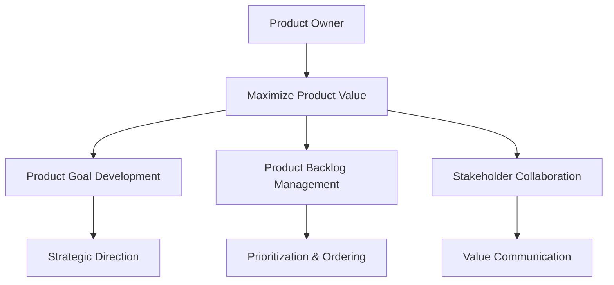

The Product Owner is accountable for maximizing the value of the product resulting from the work of the Scrum Team. This is achieved through effective Product Backlog management and stakeholder engagement.

### Key Responsibilities

**Product Backlog Management:**
- Developing and explicitly communicating the Product Goal
- Creating and clearly communicating Product Backlog items
- Ordering Product Backlog items
- Ensuring the Product Backlog is transparent, visible, and understood

**Stakeholder Engagement:**
- Working with stakeholders to understand their needs
- Communicating product direction and priorities
- Managing expectations and trade-offs
- Gathering feedback and market insights

### Authority and Decision Rights

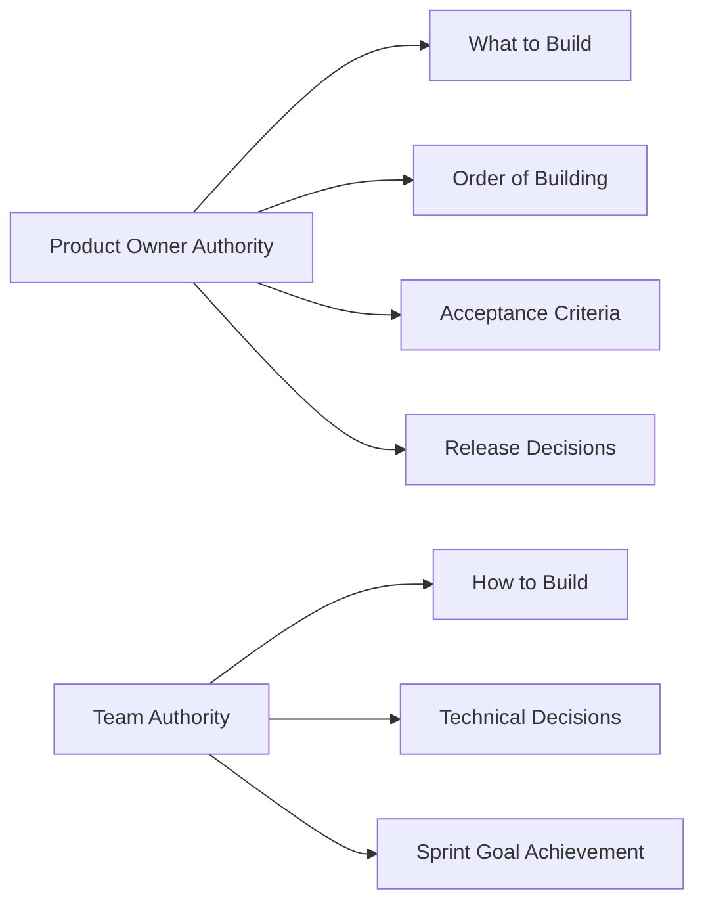

**Product Owner Can:**
- Decide what gets built and in what order
- Accept or reject work done by the Development Team
- Determine when to release product increments
- Set acceptance criteria for Product Backlog items

**Product Owner Cannot:**
- Tell the team how to do their work
- Change the Sprint scope during the Sprint (except in collaboration with the team)
- Assign work to individual team members

## Value Maximization

### Understanding Value

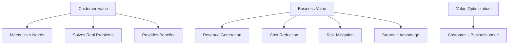

**Types of Value:**
- **Customer Value**: Benefits realized by users and customers
- **Business Value**: Benefits realized by the organization
- **Social Value**: Benefits to society and the environment
- **Innovation Value**: Learning and new capabilities developed

### Value-Based Prioritization

**Prioritization Techniques:**
1. **Value vs. Effort Matrix**: High value, low effort items prioritized first
2. **Kano Model**: Basic needs, performance needs, excitement factors
3. **Cost of Delay**: Economic impact of delaying features
4. **MoSCoW**: Must have, Should have, Could have, Won't have
5. **Buy a Feature**: Stakeholders "purchase" features with limited budget

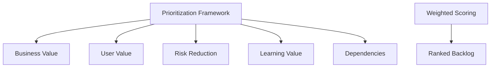

### Continuous Value Delivery

**Value Delivery Principles:**
- Deliver working software frequently
- Prefer valuable features over comprehensive documentation
- Respond to change over following a plan
- Focus on outcomes over outputs

## Product Backlog Management

### Product Backlog Characteristics

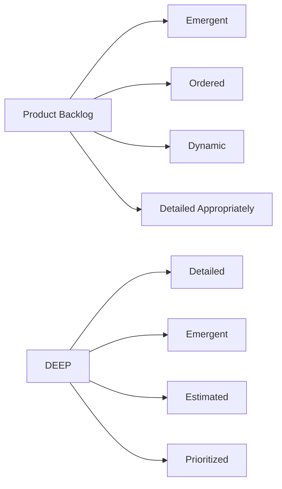

**DEEP Characteristics:**
- **Detailed**: Items at the top are more detailed than those at the bottom
- **Emergent**: The backlog evolves as more is learned about the product and users
- **Estimated**: Items have size estimates (relative sizing preferred)
- **Prioritized**: Items are ordered by value, risk, and dependencies

### Product Backlog Items

**User Story Format:**
```
As a [type of user]
I want [some goal]
So that [some reason/value]
```

**Acceptance Criteria:**
- Specific conditions that must be met for the story to be considered complete
- Written in business language, not technical terms
- Testable and verifiable
- Focused on the "what," not the "how"

**INVEST Criteria for Good User Stories:**
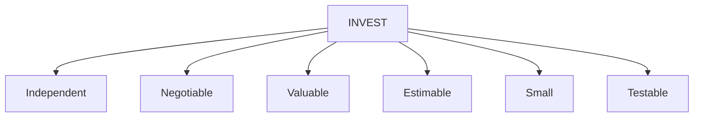

### Product Backlog Refinement

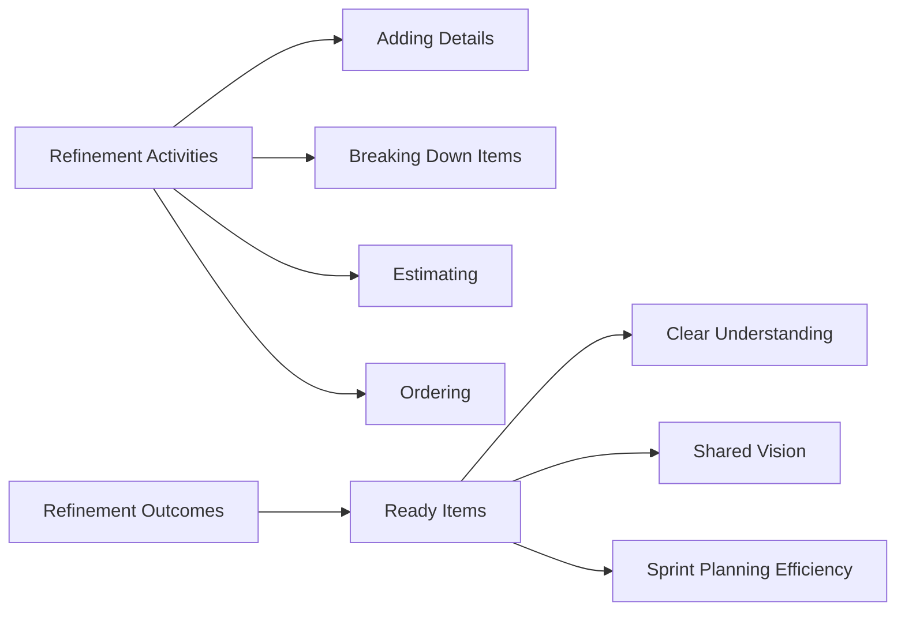

**Refinement Activities:**
- Breaking down large items into smaller, more manageable pieces
- Adding acceptance criteria and details to items
- Estimating the effort required for items
- Re-ordering items based on new information
- Removing items that are no longer relevant

**Definition of Ready:**
While not mandated by Scrum, many teams find it useful to define criteria for when a Product Backlog item is ready for Sprint Planning:
- User story is written from the user's perspective
- Acceptance criteria are defined
- Dependencies are identified
- Item is estimated
- Item is small enough to complete in one Sprint

## Stakeholder Collaboration

### Stakeholder Identification and Analysis

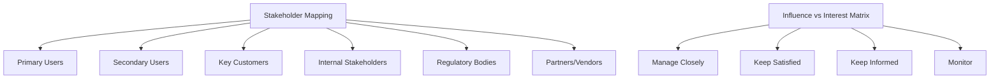

**Stakeholder Categories:**
- **Users**: People who directly interact with the product
- **Customers**: People who buy or make buying decisions
- **Sponsors**: People who fund the product development
- **Influencers**: People who can affect product success
- **Regulators**: Organizations that set compliance requirements

### Stakeholder Engagement Strategies

**Communication Techniques:**
1. **Regular Updates**: Sprint Reviews, newsletters, dashboards
2. **Collaborative Planning**: Stakeholder involvement in visioning and planning
3. **Feedback Loops**: Surveys, interviews, user testing
4. **Transparent Roadmaps**: Visible product direction and priorities

### Managing Stakeholder Expectations

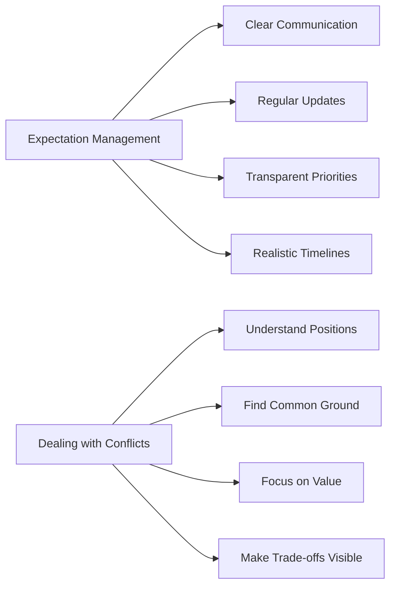

**Strategies for Managing Competing Priorities:**
- Use objective criteria for prioritization
- Make trade-offs visible and explicit
- Focus discussions on value and outcomes
- Involve stakeholders in prioritization decisions
- Communicate the impact of changes clearly

## Product Vision and Strategy

### Product Vision

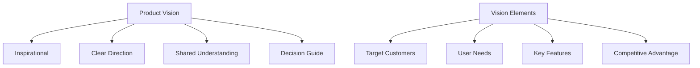

**Vision Statement Template:**
```
For [target customers]
Who [statement of need/opportunity]
The [product name] is a [product category]
That [key benefit/compelling reason to buy]
Unlike [primary competitive alternative]
Our product [statement of primary differentiation]
```

### Product Strategy

**Strategic Elements:**
1. **Market Analysis**: Understanding the competitive landscape
2. **User Research**: Deep insights into user needs and behaviors
3. **Value Proposition**: Clear articulation of product benefits
4. **Go-to-Market Strategy**: How the product will reach users
5. **Success Metrics**: How success will be measured

### Product Roadmap

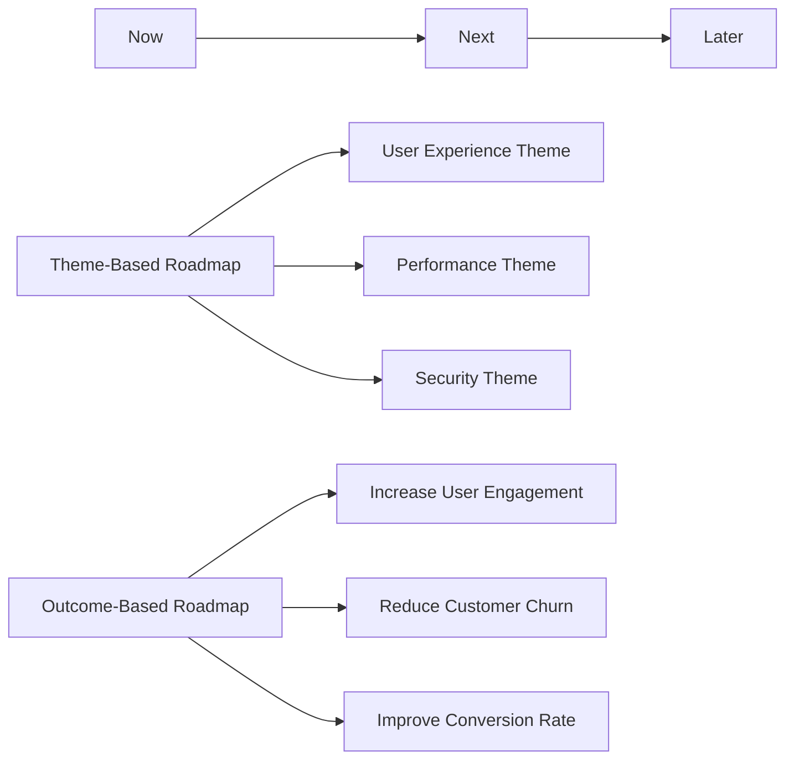

**Roadmap Characteristics:**
- Focus on outcomes rather than features
- Organized by themes or goals
- Shows general timeframes, not specific dates
- Evolves based on learning and feedback
- Communicates strategic direction

## Working with Development Teams

### Collaboration Principles

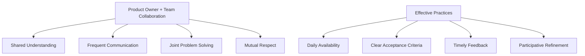

**Best Practices:**
- Be available for questions and clarifications
- Participate actively in Sprint events
- Provide timely feedback on work completed
- Trust the team's technical expertise
- Focus on the "what" and "why," let the team determine "how"

### Sprint Events Participation

**Sprint Planning:**
- Present and explain Product Backlog items
- Answer questions about requirements
- Collaborate on Sprint Goal creation
- Clarify acceptance criteria

**Daily Scrum:**
- Generally not required to attend
- Available for questions if needed
- Should not interfere with team self-organization

**Sprint Review:**
- Demonstrate completed work to stakeholders
- Gather feedback from attendees
- Discuss what was learned
- Plan next steps based on feedback

**Sprint Retrospective:**
- May be invited to discuss collaboration improvements
- Should not attend the entire retrospective
- Focus on process improvements, not individual performance

### Definition of Done

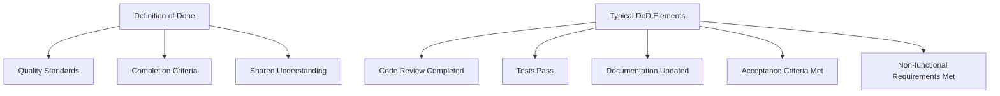

The Definition of Done is a shared understanding of what it means for work to be complete. While the Development Team creates and owns the Definition of Done, the Product Owner should understand and respect it.

## Metrics and Validation

### Product Metrics

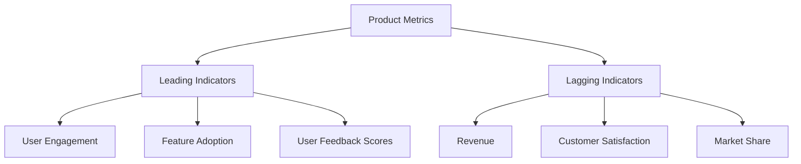

**Key Metrics Categories:**
1. **Business Metrics**: Revenue, profit, market share, cost savings
2. **User Metrics**: Active users, engagement, retention, satisfaction
3. **Product Metrics**: Feature adoption, usage patterns, performance
4. **Process Metrics**: Lead time, cycle time, defect rates

### Hypothesis-Driven Development

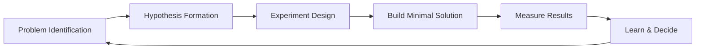

**Hypothesis Template:**
```
We believe that [building this feature]
For [these people]
Will result in [this outcome]
We will know we have succeeded when [we see this signal]
```

### Validation Techniques

**User Research Methods:**
- **User Interviews**: Direct conversations with users
- **Surveys**: Quantitative feedback collection
- **Usability Testing**: Observing users interact with the product
- **A/B Testing**: Comparing different versions of features
- **Analytics**: Analyzing user behavior data

**Validation Cadence:**
- Continuous collection of user feedback
- Regular review of product metrics
- Post-release analysis of feature impact
- Periodic user research sessions

## Practice Questions

### Question 1
**Who is responsible for managing the Product Backlog?**
A) Scrum Master
B) Product Owner
C) Development Team
D) Project Manager

**Answer: B) Product Owner**
*Explanation: The Product Owner is accountable for effective Product Backlog management, including developing and communicating the Product Goal, creating Product Backlog items, and ordering them.*

### Question 2
**When should Product Backlog refinement occur?**
A) Only during Sprint Planning
B) Only during a dedicated refinement meeting
C) Continuously throughout the Sprint
D) Only at the end of the Sprint

**Answer: C) Continuously throughout the Sprint**
*Explanation: Product Backlog refinement is an ongoing activity where items are broken down, detailed, estimated, and ordered. It's not a formal Scrum event but happens throughout the Sprint.*

### Question 3
**What is the primary purpose of the Sprint Review?**
A) To plan the next Sprint
B) To inspect the Increment and adapt the Product Backlog
C) To review team performance
D) To update project status

**Answer: B) To inspect the Increment and adapt the Product Backlog**
*Explanation: The Sprint Review is held at the end of the Sprint to inspect the Increment and determine future adaptations to the Product Backlog based on stakeholder feedback.*

### Question 4
**Which statement best describes the Product Backlog?**
A) A detailed project plan with fixed requirements
B) An emergent, ordered list of what is needed to improve the product
C) A list of tasks for the Development Team
D) A document that never changes once created

**Answer: B) An emergent, ordered list of what is needed to improve the product**
*Explanation: The Product Backlog is dynamic and evolves as more is learned about the product and its users. It's ordered by value, risk, and dependencies.*

### Question 5
**Who can change the order of items in the Product Backlog?**
A) Anyone on the Scrum Team
B) The Scrum Master
C) The Product Owner
D) Stakeholders

**Answer: C) The Product Owner**
*Explanation: The Product Owner has the authority to order Product Backlog items. While they may consider input from others, the final decision on ordering belongs to the Product Owner.*

### Question 6
**What is the recommended approach for writing acceptance criteria?**
A) Very detailed technical specifications
B) Business-readable conditions that can be tested
C) General guidelines that are open to interpretation
D) Code-level implementation details

**Answer: B) Business-readable conditions that can be tested**
*Explanation: Acceptance criteria should be written in business language, be specific enough to be testable, and focus on what needs to be achieved rather than how to achieve it.*

### Question 7
**How should a Product Owner handle conflicting stakeholder demands?**
A) Always prioritize the highest-ranking stakeholder
B) Try to satisfy everyone equally
C) Use objective criteria to make prioritization decisions
D) Let the Development Team decide

**Answer: C) Use objective criteria to make prioritization decisions**
*Explanation: Product Owners should use objective criteria such as value, risk, and strategic alignment to make prioritization decisions rather than just stakeholder hierarchy.*

### Question 8
**What is the Product Owner's role during the Daily Scrum?**
A) Must attend and provide daily direction
B) Should attend to answer any questions
C) Generally not required but may attend if needed
D) Must lead the meeting

**Answer: C) Generally not required but may attend if needed**
*Explanation: The Daily Scrum is for the Development Team to synchronize and plan their day. The Product Owner may attend but should not interfere with the team's self-organization.*

### Question 9
**When can the Product Owner cancel a Sprint?**
A) Never, only the Scrum Master can cancel a Sprint
B) When the Sprint Goal becomes obsolete
C) When the team is behind schedule
D) When stakeholders are unhappy

**Answer: B) When the Sprint Goal becomes obsolete**
*Explanation: The Product Owner has the authority to cancel a Sprint if the Sprint Goal becomes obsolete due to changes in company direction or market conditions.*

### Question 10
**What should drive the ordering of the Product Backlog?**
A) Technical complexity
B) Stakeholder preferences
C) Value, risk, and dependencies
D) Development team capacity

**Answer: C) Value, risk, and dependencies**
*Explanation: Product Backlog items should be ordered considering the value they deliver, the risk they address or represent, and any dependencies between items.*

## Official Documentation

### Primary Resources
1. **[The Scrum Guide](https://scrumguides.org/)** - Essential foundation for understanding the Product Owner role
2. **[Professional Product Owner Landing Page](https://www.scrum.org/courses/professional-product-owner-training)** - Official training information
3. **[Evidence-Based Management Guide](https://www.scrum.org/resources/evidence-based-management-guide)** - Framework for measuring value

### Product Management Resources
1. **[Product Owner Learning Path](https://www.scrum.org/pathway/product-owner-learning-path)** - Structured learning progression
2. **[Scrum.org Blog](https://www.scrum.org/resources/blog)** - Latest insights and case studies
3. **[Product Backlog Management](https://www.scrum.org/resources/blog/product-backlog-management)** - Deep dive into backlog practices

### Recommended Books
1. **"Scrum: The Art of Doing Twice the Work in Half the Time"** by Jeff Sutherland
2. **"User Story Mapping"** by Jeff Patton
3. **"Inspired: How to Create Tech Products Customers Love"** by Marty Cagan
4. **"The Lean Startup"** by Eric Ries
5. **"Crossing the Chasm"** by Geoffrey Moore

### User Research and Validation
1. **"The Mom Test"** by Rob Fitzpatrick - How to talk to customers and learn if your business is a good idea
2. **"Lean UX"** by Jeff Gothelf and Josh Seiden - Applying lean principles to user experience design
3. **"Measuring the User Experience"** by William Albert and Thomas Tullis - Quantitative approaches to UX

### Prioritization and Strategy
1. **"Good Strategy Bad Strategy"** by Richard Rumelt
2. **"Playing to Win"** by A.G. Lafley and Roger Martin
3. **"Strategize"** by Roman Pichler - Product strategy and product roadmap practices

### Practice Assessments
- **[Product Owner Open Assessment](https://www.scrum.org/open-assessments/product-owner-open)** - Free practice test
- **[Scrum Open Assessment](https://www.scrum.org/open-assessments/scrum-open)** - General Scrum knowledge test
- **[Nexus Open Assessment](https://www.scrum.org/open-assessments/nexus-open)** - Scaling knowledge test

---

**Note**: This study guide covers the fundamental aspects of the Product Owner role. Success in the PSPO I certification requires understanding how to maximize product value through effective backlog management and stakeholder collaboration within the Scrum framework.
