# Professional Product Owner II (PSPO II) Study Guide

## Table of Contents
1. [Introduction](#introduction)
2. [Advanced Product Ownership](#advanced-product-ownership)
3. [Evidence-Based Product Management](#evidence-based-product-management)
4. [Product Strategy and Vision](#product-strategy-and-vision)
5. [Advanced Stakeholder Management](#advanced-stakeholder-management)
6. [Scaling Product Ownership](#scaling-product-ownership)
7. [Product Discovery and Validation](#product-discovery-and-validation)
8. [Business Agility and Organizational Context](#business-agility-and-organizational-context)
9. [Practice Scenarios](#practice-scenarios)
10. [Official Documentation](#official-documentation)

## Introduction

The Professional Product Owner II (PSPO II) certification is designed for Product Owners with at least one year of experience who want to demonstrate advanced knowledge and application of Product Owner practices. This certification focuses on real-world application of product ownership principles in complex environments.

**Exam Details:**
- 30 multiple-choice, multiple-answer, and true/false questions
- 90 minutes duration
- Passing score: 85%
- Online proctored exam
- Requires PSPO I certification

## Advanced Product Ownership

### Strategic Product Ownership

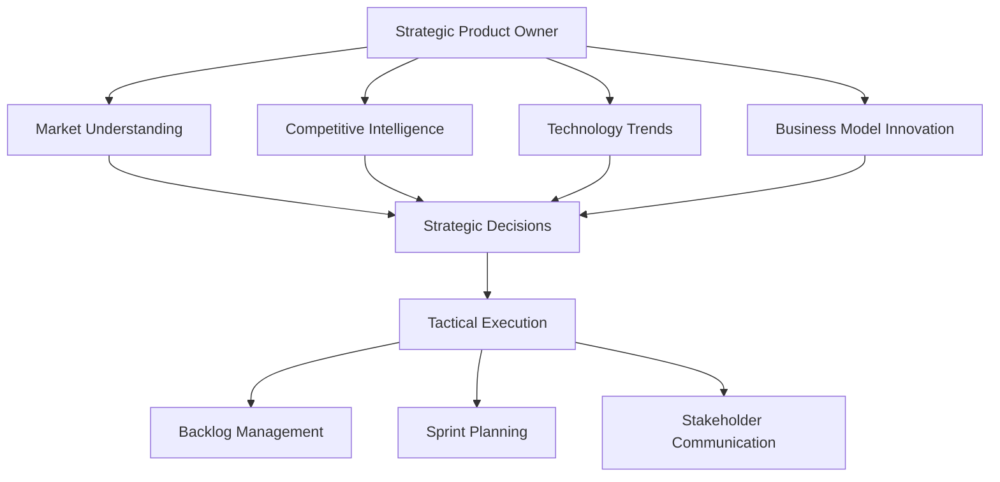

**Strategic Responsibilities:**
- Understanding market dynamics and competitive landscape
- Aligning product development with business strategy
- Identifying and evaluating new market opportunities
- Making build vs. buy vs. partner decisions
- Defining product differentiation and positioning

### Product Owner Anti-Patterns

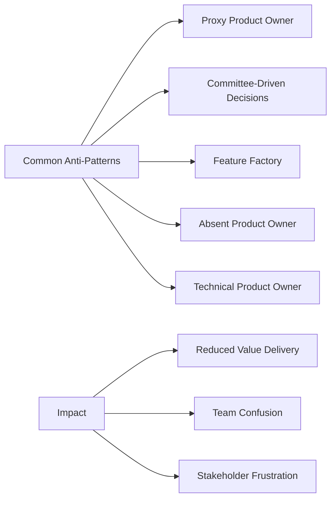

**Anti-Patterns to Avoid:**
1. **Proxy Product Owner**: Someone else making product decisions
2. **Committee-Driven Decisions**: Decisions made by committee rather than empowered individual
3. **Feature Factory**: Focus on output rather than outcomes
4. **Absent Product Owner**: Not available for team questions and decisions
5. **Technical Product Owner**: Focusing on technical implementation rather than user value

### Product Owner Maturity Model

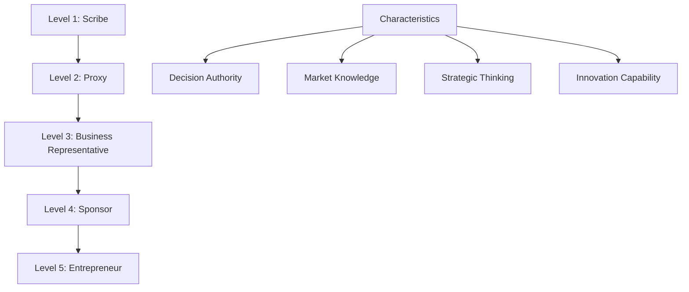

**Maturity Levels:**
- **Level 1 - Scribe**: Writing down requirements from others
- **Level 2 - Proxy**: Representing someone else's decisions
- **Level 3 - Business Representative**: Making decisions within constraints
- **Level 4 - Sponsor**: Having authority and accountability for product success
- **Level 5 - Entrepreneur**: Driving innovation and market creation

## Evidence-Based Product Management

### Evidence-Based Management Framework

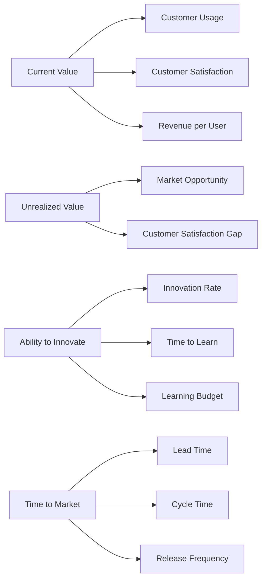

**Key Value Areas (KVAs):**
1. **Current Value (CV)**: The value currently being realized
2. **Unrealized Value (UV)**: The potential value that could be realized
3. **Ability to Innovate (A2I)**: The organization's ability to deliver new value
4. **Time to Market (T2M)**: The organization's ability to quickly deliver value

### Measurement and Metrics Strategy

**Leading vs. Lagging Indicators:**
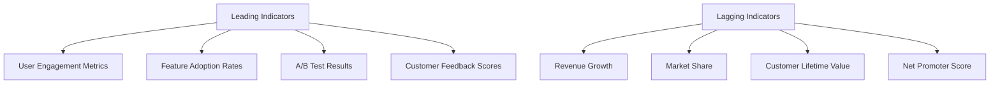

**Metric Selection Criteria:**
- **Actionable**: Can drive specific decisions and actions
- **Accessible**: Easy to collect and understand
- **Auditable**: Can be verified and trusted
- **Aligned**: Connected to business objectives

### Hypothesis-Driven Product Development

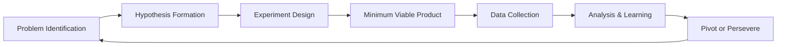

**Hypothesis Framework:**
```
We believe that [this solution]
Will result in [this outcome]
For [this user segment]
We will know this when [this metric changes]
```

**Experiment Types:**
- **Fake Door Tests**: Testing demand before building
- **A/B Tests**: Comparing different approaches
- **Concierge MVP**: Manual service before automation
- **Wizard of Oz**: Simulating functionality that doesn't exist yet

## Product Strategy and Vision

### Creating Compelling Product Vision

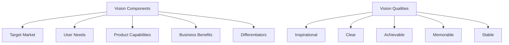

**Vision Statement Template:**
```
For [target customer]
Who [statement of need or opportunity]
The [product name] is a [product category]
That [key benefit, compelling reason to buy]
Unlike [primary competitive alternative]
Our product [statement of primary differentiation]
```

### Product Strategy Development

**Strategy Canvas:**
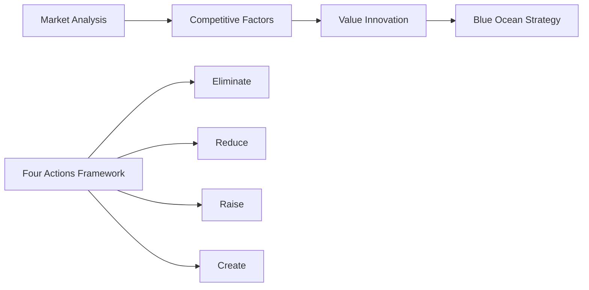

**Strategic Frameworks:**
1. **Porter's Five Forces**: Industry competition analysis
2. **SWOT Analysis**: Strengths, Weaknesses, Opportunities, Threats
3. **Jobs-to-be-Done**: Understanding customer motivations
4. **Blue Ocean Strategy**: Creating uncontested market space
5. **Lean Canvas**: Business model hypothesis testing

### Product Roadmap Strategy

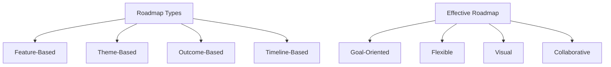

**Roadmap Best Practices:**
- Focus on outcomes rather than features
- Maintain flexibility for learning and adaptation
- Communicate confidence levels for different timeframes
- Include both customer-facing and internal improvements
- Regular review and updates based on evidence

## Advanced Stakeholder Management

### Stakeholder Ecosystem Mapping

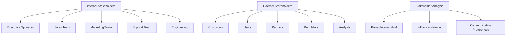

**Stakeholder Management Strategies:**
- **Manage Closely**: High power, high interest (key players)
- **Keep Satisfied**: High power, low interest (context setters)
- **Keep Informed**: Low power, high interest (subjects)
- **Monitor**: Low power, low interest (crowd)

### Managing Conflicting Priorities

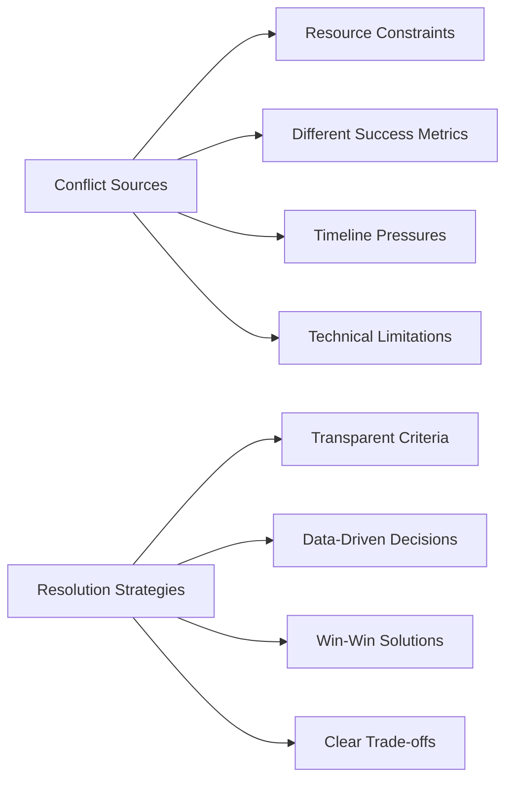

**Conflict Resolution Techniques:**
1. **Objective Criteria**: Use measurable factors for decisions
2. **Value-Based Prioritization**: Focus on business and user value
3. **Time-Boxing**: Limit discussion time to force decisions
4. **Escalation Path**: Clear process for unresolved conflicts
5. **Regular Review**: Periodic reassessment of priorities

### Stakeholder Communication Strategy

**Communication Planning:**
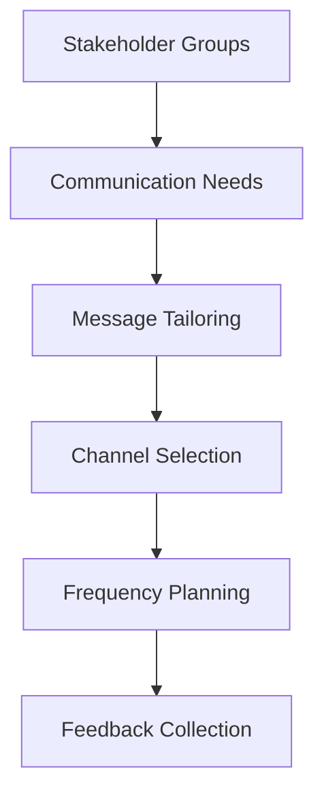

**Communication Techniques:**
- **Executive Dashboards**: High-level metrics and trends
- **User Stories**: Feature context and value proposition
- **Prototypes**: Visual representation of concepts
- **Data Visualizations**: Making complex data accessible
- **Storytelling**: Compelling narratives about user needs

## Scaling Product Ownership

### Product Owner Team Patterns

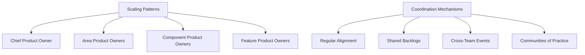

**Scaling Challenges:**
- Maintaining product coherence across teams
- Managing dependencies between features
- Ensuring consistent user experience
- Coordinating release planning
- Sharing market insights and feedback

### Nexus and Product Ownership

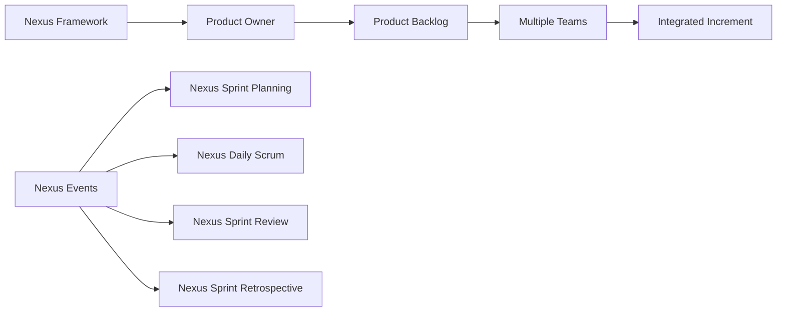

**Product Owner Responsibilities in Nexus:**
- Managing the single Product Backlog for all teams
- Ensuring Sprint Goals are aligned
- Coordinating with Nexus Integration Team
- Managing dependencies between teams
- Representing integrated product to stakeholders

### Large-Scale Product Management

**Organizational Patterns:**
1. **Product Lines**: Multiple related products with shared platforms
2. **Product Portfolios**: Collection of products serving different markets
3. **Product Ecosystems**: Interconnected products and services
4. **Platform Products**: Products that enable other products

## Product Discovery and Validation

### Customer Development Process

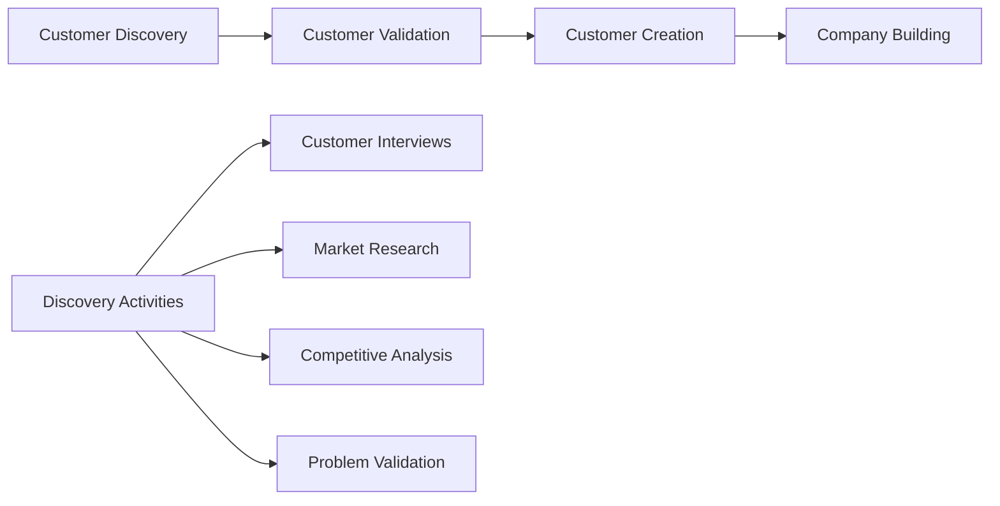

**Discovery Techniques:**
- **Customer Interviews**: Deep understanding of user needs
- **Ethnographic Research**: Observing users in their environment
- **Survey Research**: Quantitative validation of hypotheses
- **Competitive Analysis**: Understanding market landscape
- **Jobs-to-be-Done Interviews**: Understanding user motivations

### Lean Startup Methodology

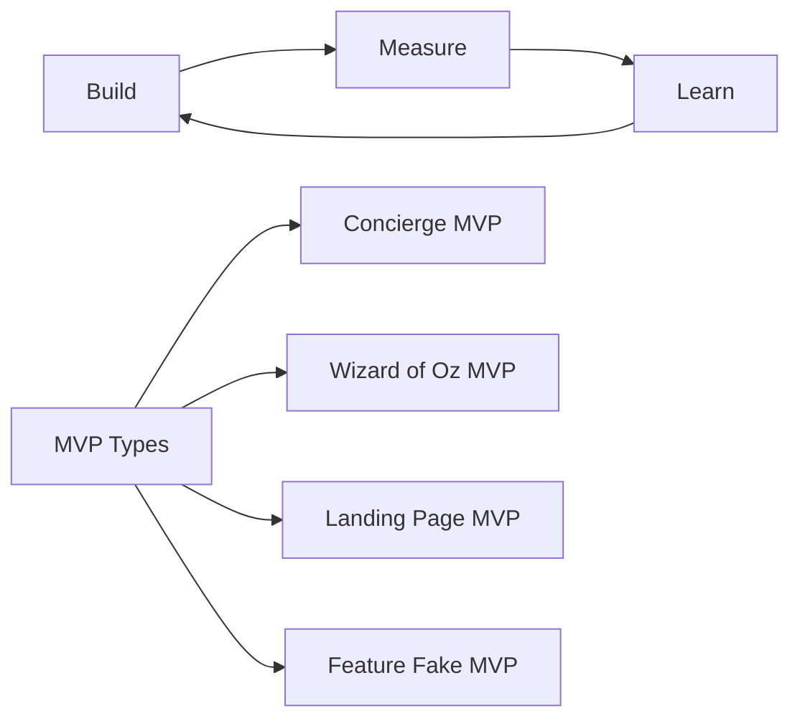

**Build-Measure-Learn Cycle:**
- **Build**: Create minimum viable solutions to test hypotheses
- **Measure**: Collect data on user behavior and outcomes
- **Learn**: Analyze data to validate or invalidate hypotheses

### User Research Integration

**Research Methods:**
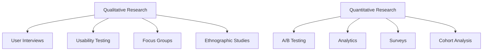

**Research Planning:**
- Define clear research questions
- Choose appropriate methods for questions
- Plan for both qualitative and quantitative insights
- Include research in product development timeline
- Share insights across the organization

## Business Agility and Organizational Context

### Business Agility Assessment

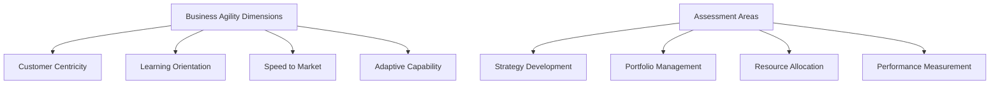

**Agility Enablers:**
- **Empowered Teams**: Decision-making authority at the right level
- **Continuous Learning**: Regular experimentation and adaptation
- **Customer Focus**: Direct connection to customer needs
- **Rapid Feedback**: Short cycles for validation and correction
- **Flexible Resources**: Ability to reallocate based on learning

### Organizational Design for Product Success

**Conway's Law Implications:**
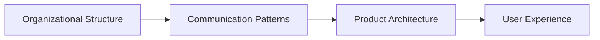

**Product-Focused Organization:**
- Teams organized around products, not projects
- Clear product ownership and accountability
- Cross-functional teams with all necessary skills
- Direct customer feedback loops
- Outcome-based performance measurement

### Change Management for Product Organizations

**Change Strategy:**
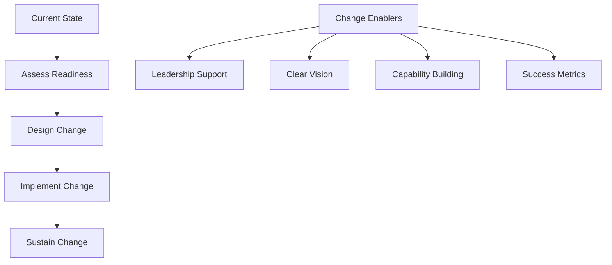

**Transformation Challenges:**
- Shifting from project to product mindset
- Building product management capabilities
- Changing funding and budgeting models
- Evolving performance measurement systems
- Creating customer-centric culture

## Practice Scenarios

### Scenario 1: Competing Stakeholder Demands

**Situation**: You're the Product Owner for a B2B software platform. The sales team wants new features to close a major deal, the support team needs bug fixes to reduce ticket volume, the marketing team wants analytics features for a campaign, and the engineering team wants to pay down technical debt. All requests seem urgent and important.

**Key Challenges:**
- Multiple urgent priorities from different stakeholders
- Limited development capacity
- Different success metrics for each stakeholder group
- Pressure to satisfy everyone

**Your Approach:**
1. **Establish Clear Value Criteria**: Define objective measures for evaluating requests
2. **Quantify Impact**: Work with stakeholders to estimate business impact of each request
3. **Assess Effort**: Collaborate with the development team to estimate implementation effort
4. **Create Value Matrix**: Plot requests on value vs. effort matrix
5. **Communicate Trade-offs**: Make the cost of choices visible to all stakeholders
6. **Implement Transparent Process**: Use consistent criteria for all future prioritization decisions

### Scenario 2: Product Market Fit Challenges

**Situation**: Your product launched six months ago with high expectations, but user adoption is slower than projected. Customer interviews reveal mixed feedback - some love certain features while others find the product confusing. The executive team is pressuring for rapid feature additions to attract more users, but data suggests current users aren't fully engaged.

**Key Challenges:**
- Unclear product-market fit
- Pressure for feature expansion vs. optimization
- Mixed user feedback requiring interpretation
- Executive pressure for growth

**Your Approach:**
1. **Deep Customer Analysis**: Segment users by engagement and satisfaction levels
2. **Identify Success Patterns**: Understand what makes successful users successful
3. **Focus on Core Value**: Identify and strengthen the primary value proposition
4. **Reduce Friction**: Address usability issues preventing user success
5. **Measure Leading Indicators**: Track engagement metrics that predict retention
6. **Educate Stakeholders**: Share insights about the importance of retention before growth

### Scenario 3: Technical Debt vs. New Features

**Situation**: Your development team reports that technical debt is significantly slowing down development velocity. They estimate that 40% of their time is spent working around existing code issues. Meanwhile, competitive pressure requires rapid feature delivery, and stakeholders are frustrated with the pace of visible progress.

**Key Challenges:**
- Invisible technical debt impacting delivery speed
- Stakeholder focus on visible features over infrastructure
- Developer frustration with code quality
- Competitive pressure for rapid delivery

**Your Approach:**
1. **Make Technical Debt Visible**: Create metrics showing the impact on delivery speed
2. **Calculate Cost of Delay**: Quantify how technical debt affects time to market
3. **Propose Balanced Approach**: Allocate percentage of capacity to technical improvements
4. **Show Progressive Improvement**: Demonstrate velocity improvements from debt reduction
5. **Link to Business Impact**: Connect technical improvements to business outcomes
6. **Set Quality Standards**: Establish Definition of Done that prevents future debt accumulation

## Official Documentation

### Primary Resources
1. **[The Scrum Guide](https://scrumguides.org/)** - Foundation for Product Owner role
2. **[Evidence-Based Management Guide](https://www.scrum.org/resources/evidence-based-management-guide)** - Framework for measuring value
3. **[Professional Product Owner II Assessment](https://www.scrum.org/assessments/professional-product-owner-ii-assessment)** - Official exam information

### Advanced Product Management
1. **[Nexus Guide](https://www.scrum.org/resources/nexus-guide)** - Scaling Product Ownership
2. **[Product Owner Learning Path](https://www.scrum.org/pathway/product-owner-learning-path)** - Advanced learning progression
3. **[Scrum.org Blog](https://www.scrum.org/resources/blog)** - Latest insights and case studies

### Recommended Reading
1. **"Inspired: How to Create Tech Products Customers Love"** by Marty Cagan
2. **"The Lean Startup"** by Eric Ries
3. **"Escaping the Build Trap"** by Melissa Perri
4. **"Continuous Discovery Habits"** by Teresa Torres
5. **"Good Strategy Bad Strategy"** by Richard Rumelt

### Research and Validation
1. **"The Mom Test"** by Rob Fitzpatrick
2. **"Talking to Humans"** by Giff Constable
3. **"Lean Customer Development"** by Cindy Alvarez
4. **"UX Research"** by Brad Nunnally and David Farkas

### Metrics and Analytics
1. **"Lean Analytics"** by Alistair Croll and Benjamin Yoskovitz
2. **"Actionable Agile Metrics for Predictability"** by Daniel Vacanti
3. **"The Startup Way"** by Eric Ries

### Strategy and Vision
1. **"Playing to Win"** by A.G. Lafley and Roger Martin
2. **"Blue Ocean Strategy"** by W. Chan Kim and Renée Mauborgne
3. **"Crossing the Chasm"** by Geoffrey Moore
4. **"The Innovator's Dilemma"** by Clayton Christensen

---

**Note**: PSPO II certification requires applying Product Owner knowledge in complex, real-world scenarios. Focus on understanding the strategic aspects of product ownership, evidence-based decision making, and stakeholder management in challenging organizational contexts.
