# Professional Product Owner III (PSPO III) Study Guide

## Table of Contents
1. [Introduction](#introduction)
2. [Strategic Product Leadership](#strategic-product-leadership)
3. [Advanced Evidence-Based Management](#advanced-evidence-based-management)
4. [Product Portfolio Management](#product-portfolio-management)
5. [Innovation and Market Creation](#innovation-and-market-creation)
6. [Organizational Product Management](#organizational-product-management)
7. [Advanced Stakeholder Ecosystem Management](#advanced-stakeholder-ecosystem-management)
8. [Product Culture and Capability Building](#product-culture-and-capability-building)
9. [Complex Scenarios and Case Studies](#complex-scenarios-and-case-studies)
10. [Official Documentation](#official-documentation)

## Introduction

The Professional Product Owner III (PSPO III) certification represents the highest level of Product Owner certification. It validates mastery of product ownership in complex organizational environments and the ability to drive strategic product decisions that create significant business value. This certification is for expert practitioners who can demonstrate advanced product leadership capabilities.

**Assessment Details:**
- Essay-based questions requiring comprehensive analysis
- Complex scenario-based problems
- 120 minutes duration  
- Passing score: 85%
- Online proctored exam
- Requires PSPO II certification

## Strategic Product Leadership

### Product Leadership Framework

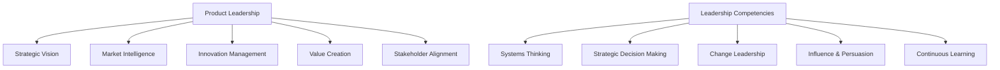

**Strategic Product Leader Characteristics:**
- **Visionary**: Ability to see future market opportunities and trends
- **Analytical**: Data-driven decision making with strategic intuition
- **Collaborative**: Building alignment across diverse stakeholder groups
- **Adaptive**: Pivoting strategy based on market feedback and learning
- **Inspirational**: Motivating teams and organizations toward common goals

### Business Model Innovation

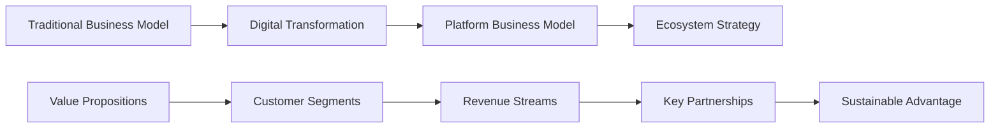

**Business Model Patterns:**
1. **Platform Models**: Creating value through network effects
2. **Subscription Models**: Recurring revenue through ongoing value delivery
3. **Marketplace Models**: Facilitating transactions between parties
4. **Freemium Models**: Free basic service with premium upgrade options
5. **Ecosystem Models**: Integrated suite of products and services

### Strategic Decision-Making Frameworks

**ICE Framework (Impact, Confidence, Ease):**
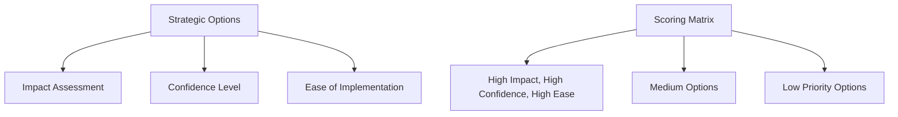

**RICE Framework (Reach, Impact, Confidence, Effort):**
- **Reach**: How many people will be affected
- **Impact**: How much will it impact each person
- **Confidence**: How confident are we in our estimates
- **Effort**: How much effort will it require

### Market Sensing and Intelligence

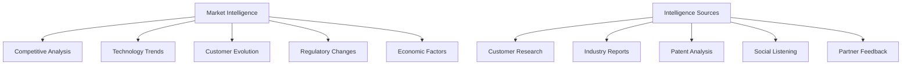

**Strategic Market Analysis:**
- **Porter's Five Forces**: Industry structure and competitive dynamics
- **PESTEL Analysis**: Political, Economic, Social, Technological, Environmental, Legal factors
- **Technology S-Curves**: Understanding technology lifecycle and disruption points
- **Ecosystem Mapping**: Understanding value network relationships
- **Scenario Planning**: Preparing for multiple possible futures

## Advanced Evidence-Based Management

### Sophisticated Measurement Systems

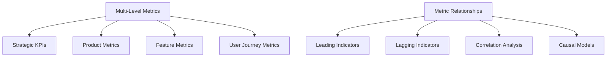

**Advanced Metric Categories:**
1. **Ecosystem Metrics**: Cross-product and platform metrics
2. **Cohort Analysis**: User behavior patterns over time
3. **Attribution Models**: Understanding cause and effect relationships
4. **Predictive Analytics**: Forecasting future outcomes
5. **Real-time Dashboards**: Immediate feedback on key indicators

### Experimental Design and Statistical Analysis


**Advanced Experimentation:**
- **Multivariate Testing**: Testing multiple variables simultaneously
- **Sequential Testing**: Adaptive experiments that can stop early
- **Bayesian Methods**: Incorporating prior knowledge into analysis
- **Network Effects Testing**: Experiments in networked environments
- **Long-term Impact Analysis**: Understanding delayed and indirect effects

### Value Stream Economics

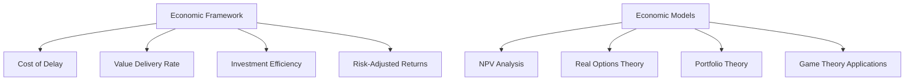

**Economic Analysis Tools:**
- **Weighted Shortest Job First (WSJF)**: Prioritization using economic principles
- **Cost of Delay Modeling**: Understanding the economic impact of time
- **Real Options Valuation**: Treating investments as options
- **Portfolio Optimization**: Balancing risk and return across initiatives
- **Lean Economics**: Minimizing waste while maximizing value flow

## Product Portfolio Management

### Portfolio Strategy and Architecture

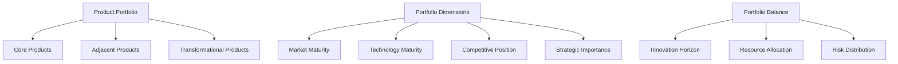

**Three Horizons Model:**
- **Horizon 1**: Core business optimization (70% of investment)
- **Horizon 2**: Emerging opportunities (20% of investment)
- **Horizon 3**: Transformational innovations (10% of investment)

### Platform Product Strategy

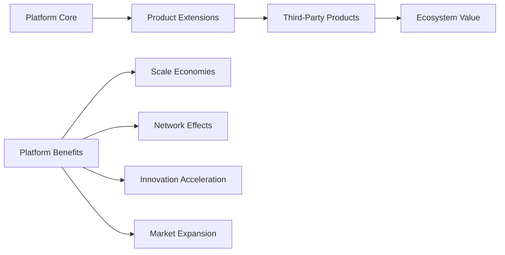

**Platform Strategy Elements:**
- **Core Platform**: Foundational capabilities and APIs
- **Complementary Products**: Products that enhance platform value
- **Developer Ecosystem**: Third-party innovation on the platform
- **Data Network Effects**: Platform improvement through usage data
- **Governance Model**: Balancing openness with control

### Resource Allocation and Investment Decisions

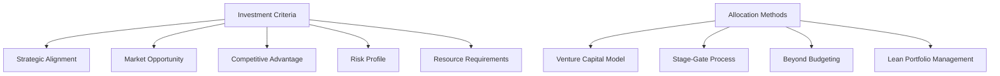

**Advanced Resource Allocation:**
- **Dynamic Budgeting**: Reallocating resources based on learning
- **Options-Based Funding**: Incremental investment with kill criteria
- **Lean Portfolio Management**: Continuous flow of value-driven investments
- **Participatory Budgeting**: Involving teams in allocation decisions
- **Outcome-Based Funding**: Funding based on achieved outcomes rather than activities

## Innovation and Market Creation

### Innovation Management Framework

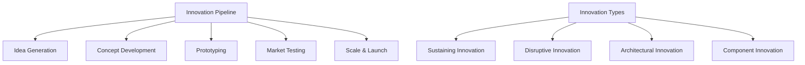

**Innovation Categories:**
1. **Product Innovation**: New or improved products/services
2. **Process Innovation**: New ways of creating or delivering value
3. **Business Model Innovation**: New approaches to value creation and capture
4. **Platform Innovation**: Creating foundations for ecosystem innovation
5. **Experience Innovation**: Reimagining customer interactions and journeys

### Market Creation and Blue Ocean Strategy

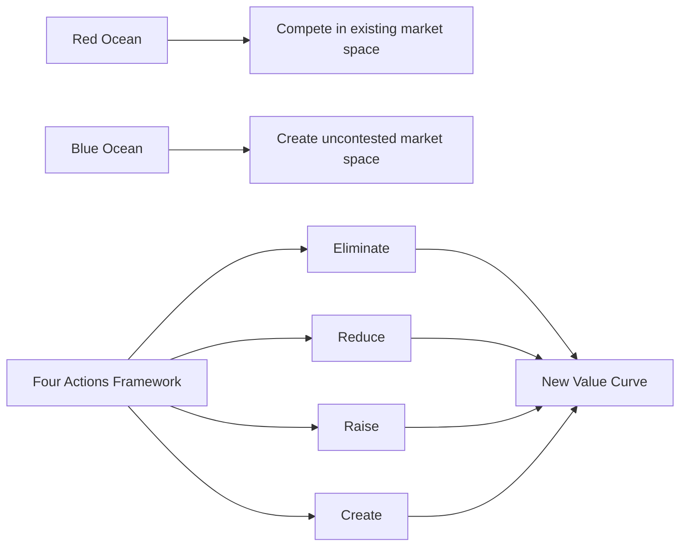

**Market Creation Strategies:**
- **Value Innovation**: Simultaneous pursuit of differentiation and low cost
- **Non-Customer Analysis**: Understanding why people don't use current solutions
- **Alternative Industry Analysis**: Learning from other industries
- **Strategic Groups Analysis**: Understanding different competitive approaches
- **Chain of Buyers Analysis**: Focusing on different participants in the buying process

### Disruptive Innovation Management

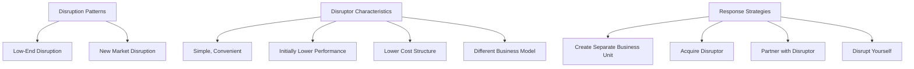

**Managing Disruption:**
- **Early Warning Systems**: Detecting potential disruption sources
- **Innovation Labs**: Separated units for exploring new models
- **Acquisition Strategy**: Buying disruptive capabilities
- **Cannibalization Strategy**: Deliberately disrupting your own products
- **Ecosystem Defense**: Building switching costs and network effects

## Organizational Product Management

### Product Operating Model Design

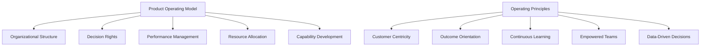

**Operating Model Components:**
- **Structure**: How teams are organized around products and customers
- **Governance**: Decision-making processes and accountability
- **Processes**: How work flows through the organization
- **People**: Skills, roles, and career paths for product professionals
- **Technology**: Tools and platforms supporting product development

### Scaling Product Management Capabilities


**Capability Development Framework:**
- **Core Skills**: Product fundamentals, market analysis, user research
- **Leadership Skills**: Influence, communication, strategic thinking
- **Technical Skills**: Understanding of technology and data analysis
- **Business Skills**: Financial analysis, business model design
- **Domain Expertise**: Deep knowledge of specific market or industry

### Product Culture Transformation

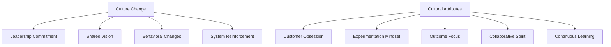

**Culture Transformation Elements:**
- **Customer-Centric Mindset**: Making decisions based on customer value
- **Experimentation Culture**: Embracing failure as learning
- **Outcome Orientation**: Focusing on results rather than activities
- **Data-Driven Decisions**: Using evidence to guide choices
- **Empowerment**: Giving teams authority to make decisions

## Advanced Stakeholder Ecosystem Management

### Complex Stakeholder Networks

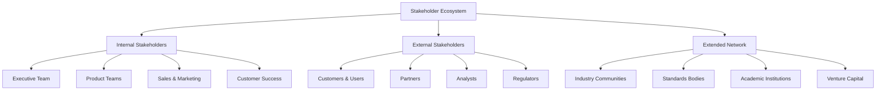

**Stakeholder Management Strategies:**
- **Ecosystem Mapping**: Understanding all stakeholder relationships
- **Influence Network Analysis**: Identifying key influence patterns
- **Stakeholder Journey Mapping**: Understanding stakeholder experiences
- **Multi-Stakeholder Value Propositions**: Creating value for different groups
- **Stakeholder Advisory Boards**: Formal structures for ongoing input

### Strategic Partnership Management

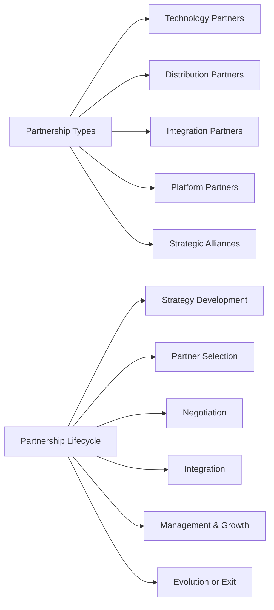

**Partnership Strategy Framework:**
- **Strategic Rationale**: Clear value proposition for partnership
- **Partner Assessment**: Capabilities, culture, and strategic fit
- **Value Creation Model**: How partnership creates mutual value
- **Governance Structure**: Decision-making and conflict resolution
- **Performance Metrics**: Success measures for partnership
- **Exit Strategy**: Conditions and process for partnership termination

### Industry Ecosystem Leadership

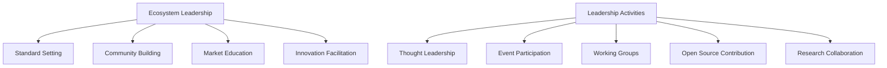

**Ecosystem Leadership Strategies:**
- **Platform Orchestration**: Enabling and coordinating ecosystem participants
- **Standard Setting**: Influencing industry standards and practices
- **Community Building**: Creating and nurturing professional communities
- **Knowledge Sharing**: Contributing to industry knowledge and best practices
- **Innovation Catalysis**: Facilitating innovation across the ecosystem

## Product Culture and Capability Building

### Product Management Maturity Model

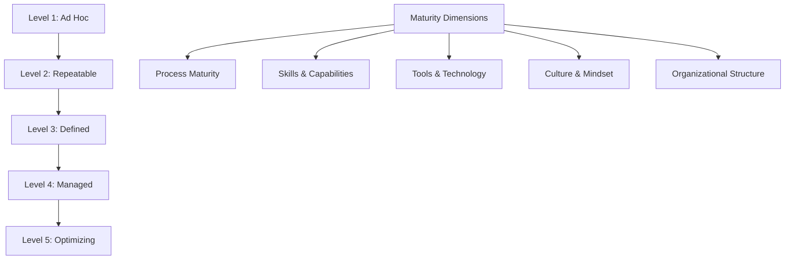

**Maturity Assessment Areas:**
- **Strategy & Vision**: Clarity and alignment of product strategy
- **Discovery & Research**: Systematic approach to understanding customers
- **Planning & Prioritization**: Evidence-based decision making
- **Delivery & Execution**: Efficient value delivery processes
- **Measurement & Learning**: Continuous improvement based on data

### Capability Development Programs

```mermaid
flowchart LR
    A[Capability Building] --> B[Skills Assessment]
    B --> C[Learning Paths]
    C --> D[Training Programs]
    D --> E[Mentoring & Coaching]
    E --> F[Practical Application]
    F --> G[Performance Evaluation]
    G --> B
```

**Learning and Development Framework:**
- **Competency Models**: Defining required skills and behaviors
- **Learning Paths**: Structured progression for different roles
- **Mentoring Programs**: Pairing experienced with developing professionals
- **Communities of Practice**: Peer learning and knowledge sharing
- **External Learning**: Conferences, courses, and certifications
- **On-the-Job Learning**: Real-world application with support

### Change Management for Product Organizations

```mermaid
flowchart TD
    A[Change Strategy] --> B[Vision & Case for Change]
    A --> C[Coalition Building]
    A --> D[Quick Wins]
    A --> E[Capability Building]
    A --> F[System Integration]
    A --> G[Culture Reinforcement]
    
    H[Change Challenges] --> I[Resistance to Change]
    H --> J[Competing Priorities]
    H --> K[Skill Gaps]
    H --> L[Process Dependencies]
    H --> M[Technology Constraints]
```

**Change Management Strategies:**
- **Burning Platform**: Creating urgency for change
- **Vision Alignment**: Ensuring shared understanding of desired future state
- **Pilot Programs**: Demonstrating success on smaller scale
- **Champions Network**: Identifying and empowering change advocates
- **Success Stories**: Celebrating and sharing wins
- **Continuous Communication**: Regular updates on progress and challenges

## Complex Scenarios and Case Studies

### Scenario 1: Platform Ecosystem Development

**Situation**: You're the Chief Product Officer for a successful SaaS company that wants to transition from a single product to a platform ecosystem. The executive team wants to enable third-party developers to build on your platform while maintaining quality standards and customer experience. You need to design the platform strategy, partner program, and governance model while continuing to deliver value to existing customers.

**Key Challenges:**
- Balancing platform openness with quality control
- Designing partner incentive structures
- Managing potential channel conflicts
- Maintaining focus on core customers while building ecosystem
- Technical platform architecture decisions

**Strategic Considerations:**
1. **Platform Architecture**: API design, developer tools, documentation
2. **Business Model**: Revenue sharing, pricing strategy, partner tiers
3. **Go-to-Market**: Partner recruitment, onboarding, support
4. **Governance**: Quality standards, certification process, conflict resolution
5. **Ecosystem Health**: Metrics for platform and partner success

### Scenario 2: Market Disruption Response

**Situation**: A well-funded startup has launched a product that directly competes with your core offering using a fundamentally different approach and business model. Their solution is simpler, cheaper, and gaining rapid adoption among smaller customers. Your traditional enterprise customers are starting to ask questions, and your growth rate is slowing. The executive team is debating whether to compete directly, acquire the competitor, or develop a separate disruptive offering.

**Key Challenges:**
- Assessing the true threat level and timeline
- Understanding why customers are switching
- Balancing response speed with strategic thinking
- Managing internal resources and attention
- Communicating with stakeholders during uncertainty

**Strategic Options Analysis:**
1. **Direct Competition**: Matching features and pricing
2. **Differentiation**: Emphasizing unique value propositions
3. **Market Segmentation**: Focusing on defensible customer segments
4. **Acquisition**: Buying the disruptor
5. **Internal Innovation**: Creating separate disruptive offering
6. **Partnership**: Collaborating rather than competing

### Scenario 3: Global Product Localization

**Situation**: Your successful domestic product is expanding internationally, but initial launches in three different regions have shown mixed results. Cultural differences, regulatory requirements, and local competition are creating challenges. Some features that work well domestically are irrelevant or problematic in international markets. The regional teams want significant product customization, but engineering is concerned about maintaining a unified platform.

**Key Challenges:**
- Balancing global consistency with local relevance
- Managing engineering complexity and costs
- Understanding diverse cultural and regulatory requirements
- Coordinating across time zones and languages
- Measuring success across different markets

**Localization Strategy Framework:**
1. **Market Analysis**: Deep understanding of local contexts
2. **Feature Prioritization**: Core vs. customizable functionality
3. **Architecture Design**: Platform flexibility for localization
4. **Regulatory Compliance**: Meeting local legal requirements
5. **Go-to-Market**: Local partnerships and distribution strategies
6. **Success Metrics**: Market-specific and global measures

## Official Documentation

### Primary Resources
1. **[The Scrum Guide](https://scrumguides.org/)** - Foundation for Product Owner role
2. **[Evidence-Based Management Guide](https://www.scrum.org/resources/evidence-based-management-guide)** - Advanced measurement framework
3. **[Nexus Guide](https://www.scrum.org/resources/nexus-guide)** - Scaling product ownership
4. **[Professional Product Owner III Assessment](https://www.scrum.org/assessments/professional-product-owner-iii-assessment)** - Official exam information

### Strategic Product Management
1. **"Good Strategy Bad Strategy"** by Richard Rumelt - Strategic thinking fundamentals
2. **"Playing to Win"** by A.G. Lafley and Roger Martin - Strategy development process
3. **"Blue Ocean Strategy"** by W. Chan Kim and Renée Mauborgne - Market creation strategies
4. **"The Innovator's Dilemma"** by Clayton Christensen - Disruption theory
5. **"Platform Revolution"** by Geoffrey Parker, Marshall Van Alstyne, and Sangeet Paul Choudary

### Innovation and Market Creation
1. **"The Lean Startup"** by Eric Ries - Innovation methodology
2. **"Crossing the Chasm"** by Geoffrey Moore - Technology adoption lifecycle
3. **"The Innovation Book"** by Max McKeown - Comprehensive innovation guide
4. **"Competing Against Luck"** by Clayton Christensen - Jobs-to-be-Done framework
5. **"The Mom Test"** by Rob Fitzpatrick - Customer development techniques

### Evidence-Based Management
1. **"Lean Analytics"** by Alistair Croll and Benjamin Yoskovitz - Data-driven product decisions
2. **"Actionable Agile Metrics for Predictability"** by Daniel Vacanti - Flow metrics
3. **"The Startup Way"** by Eric Ries - Entrepreneurial management
4. **"Escaping the Build Trap"** by Melissa Perri - Outcome-focused product management

### Organizational Design and Culture
1. **"Team Topologies"** by Matthew Skelton and Manuel Pais - Organizing for fast flow
2. **"Accelerate"** by Nicole Forsgren, Jez Humble, and Gene Kim - High-performing organizations
3. **"The Fifth Discipline"** by Peter Senge - Learning organizations
4. **"Organizational Culture and Leadership"** by Edgar Schein - Culture change

### Stakeholder Management and Influence
1. **"Getting to Yes"** by Roger Fisher and William Ury - Negotiation principles
2. **"Influence: The Psychology of Persuasion"** by Robert Cialdini - Influence techniques
3. **"Crucial Conversations"** by Kerry Patterson et al. - Difficult conversations
4. **"The Trusted Advisor"** by David Maister - Building trust and credibility

### Research and Case Studies
1. **Harvard Business Review** - Strategic management articles
2. **MIT Sloan Management Review** - Innovation and strategy research
3. **Stanford Graduate School of Business** - Case studies and research
4. **McKinsey Quarterly** - Management insights and trends
5. **BCG Insights** - Strategic consulting perspectives

### Industry Reports and Analysis
1. **Gartner Research** - Technology trends and market analysis
2. **Forrester Research** - Customer experience and technology insights
3. **CB Insights** - Startup and venture capital trends
4. **PwC Strategy& Reports** - Industry transformation insights
5. **Deloitte Insights** - Business and technology trends

---

**Note**: PSPO III certification requires demonstrating mastery of complex product management scenarios. Focus on developing strategic thinking capabilities, understanding complex organizational dynamics, and the ability to drive product success in challenging and ambiguous environments. The assessment evaluates your ability to handle sophisticated product leadership challenges that require deep expertise and sound judgment.
