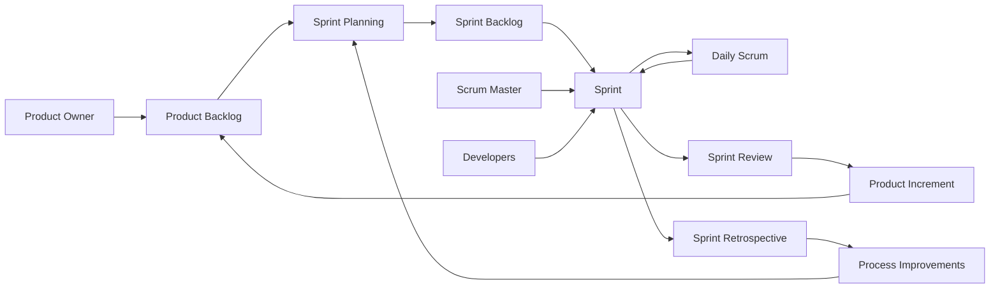
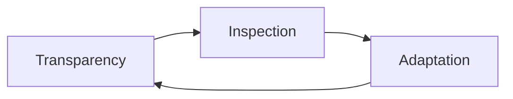
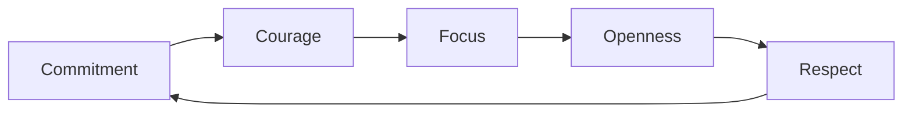
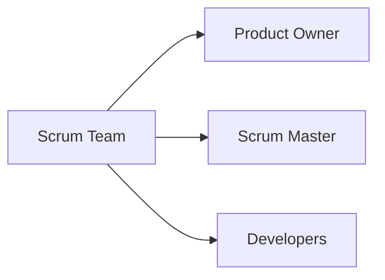
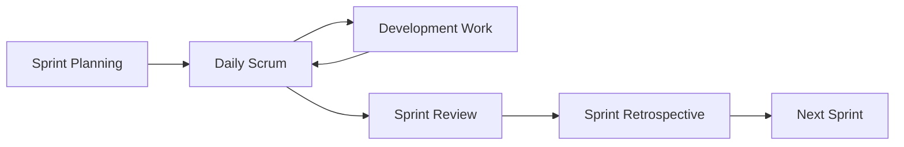
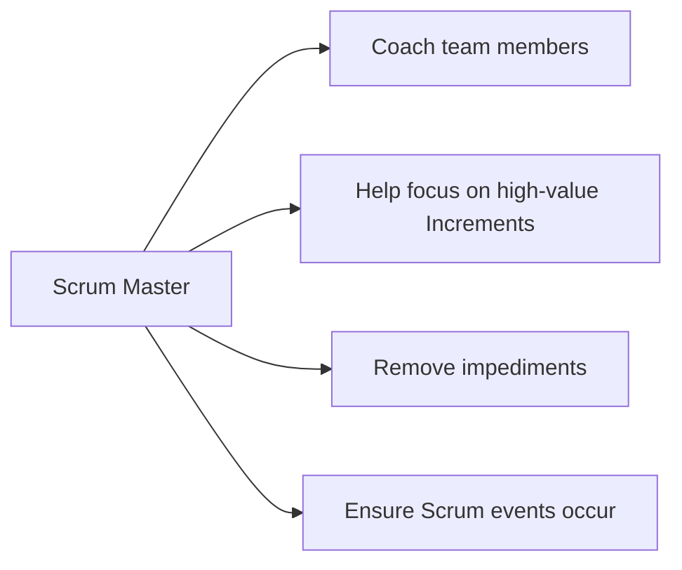

# Professional Scrum Master I (PSM I) Study Guide

## Table of Contents
1. [Introduction](#introduction)
2. [Scrum Framework Overview](#scrum-framework-overview)
3. [Scrum Theory and Values](#scrum-theory-and-values)
4. [Scrum Roles](#scrum-roles)
5. [Scrum Events](#scrum-events)
6. [Scrum Artifacts](#scrum-artifacts)
7. [The Scrum Master Role](#the-scrum-master-role)
8. [Practice Questions](#practice-questions)
9. [Official Documentation](#official-documentation)

## Introduction

The Professional Scrum Master I (PSM I) certification demonstrates a fundamental understanding of the Scrum framework and the role of the Scrum Master. This certification is for practitioners who want to prove their knowledge and understanding of Scrum.

**Exam Details:**
- 80 multiple-choice questions
- 60 minutes duration
- Passing score: 85%
- Online proctored exam
- Available in multiple languages

## Scrum Framework Overview

Scrum is a lightweight framework that helps people, teams, and organizations generate value through adaptive solutions for complex problems. It is founded on empiricism and lean thinking.

### Key Principles:
- **Empiricism**: Knowledge comes from experience and making decisions based on what is observed
- **Lean Thinking**: Reduce waste and focus on the essentials
- **Self-Management**: Teams choose how best to accomplish their work
- **Cross-Functional**: Teams have all competencies needed to accomplish the work

## Scrum Theory and Values

### Empirical Process Control
Scrum is founded on empirical process control theory (empiricism), which asserts that knowledge comes from experience and making decisions based on what is known.

**Three Pillars:**
1. **Transparency**: The emergent process and work must be visible to those performing the work and those receiving the work
2. **Inspection**: The Scrum artifacts and the progress toward agreed goals must be inspected frequently and diligently
3. **Adaptation**: If any aspects of a process deviate outside acceptable limits, the process or the material being processed must be adjusted

### Scrum Values

1. **Commitment**: The Scrum Team commits to achieving its goals and to supporting each other
2. **Courage**: The Scrum Team members have the courage to do the right thing and work on tough problems
3. **Focus**: Everyone focuses on the work of the Sprint and the goals of the Scrum Team
4. **Openness**: The Scrum Team and its stakeholders agree to be open about all the work and the challenges
5. **Respect**: Scrum Team members respect each other to be capable, independent people

## Scrum Roles

### The Scrum Team

The Scrum Team consists of one Scrum Master, one Product Owner, and Developers. Within a Scrum Team, there are no sub-teams or hierarchies.

### Product Owner
**Accountability**: Maximizing the value of the product resulting from the work of the Scrum Team

**Responsibilities:**
- Developing and explicitly communicating the Product Goal
- Creating and clearly communicating Product Backlog items
- Ordering Product Backlog items
- Ensuring that the Product Backlog is transparent, visible, and understood

### Scrum Master
**Accountability**: Establishing Scrum as defined in the Scrum Guide and helping everyone understand Scrum theory and practice

**Responsibilities:**
- Coaching the team members in self-management and cross-functionality
- Helping the Scrum Team focus on creating high-value Increments
- Causing the removal of impediments to the Scrum Team's progress
- Ensuring that all Scrum events take place and are positive, productive, and kept within the timebox

### Developers
**Accountability**: Creating a plan for the Sprint (Sprint Backlog), instilling quality by adhering to a Definition of Done, and adapting their plan each day toward the Sprint Goal

**Responsibilities:**
- Creating a plan for the Sprint (Sprint Backlog)
- Instilling quality by adhering to a Definition of Done
- Adapting their plan each day toward the Sprint Goal
- Holding each other accountable as professionals

## Scrum Events

### Sprint

**Duration**: 1 month or less
**Purpose**: Container for all other events

### Sprint Planning
**Duration**: Maximum of 8 hours for a one-month Sprint
**Purpose**: Initiate the Sprint by laying out the work to be performed

**Topics Addressed:**
1. Why is this Sprint valuable?
2. What can be Done this Sprint?
3. How will the chosen work get done?

### Daily Scrum
**Duration**: 15 minutes
**Purpose**: Inspect progress toward the Sprint Goal and adapt the Sprint Backlog as necessary

**Key Points:**
- For the Developers of the Scrum Team
- Held at the same time and place every working day
- Reduces complexity

### Sprint Review
**Duration**: Maximum of 4 hours for a one-month Sprint
**Purpose**: Inspect the outcome of the Sprint and determine future adaptations

**Activities:**
- Scrum Team presents the results of their work to key stakeholders
- Progress toward the Product Goal is discussed
- Attendees collaborate on what to do next

### Sprint Retrospective
**Duration**: Maximum of 3 hours for a one-month Sprint
**Purpose**: Plan ways to increase quality and effectiveness

**Focus Areas:**
- Individuals, interactions, processes, tools, and Definition of Done
- Most impactful improvements
- Ways to implement improvements

## Scrum Artifacts

### Product Backlog
**Commitment**: Product Goal

An emergent, ordered list of what is needed to improve the product. It is the single source of work undertaken by the Scrum Team.

### Sprint Backlog
**Commitment**: Sprint Goal

Composed of the Sprint Goal, the set of Product Backlog items selected for the Sprint, plus an actionable plan for delivering the Increment.

### Increment
**Commitment**: Definition of Done

A concrete stepping stone toward the Product Goal. Each Increment is additive to all prior Increments and thoroughly verified.

## The Scrum Master Role

### Serving the Scrum Team

- Coaching the team members in self-management and cross-functionality
- Helping the Scrum Team focus on creating high-value Increments
- Causing the removal of impediments to the Scrum Team's progress
- Ensuring that all Scrum events take place

### Serving the Product Owner

- Helping find techniques for effective Product Goal definition
- Helping the Scrum Team understand the need for clear and concise Product Backlog items
- Helping establish empirical product planning for a complex environment
- Facilitating stakeholder collaboration as requested or needed

### Serving the Organization

- Leading, training, and coaching the organization in its Scrum adoption
- Planning and advising Scrum implementations within the organization
- Helping employees and stakeholders understand and enact an empirical approach
- Removing barriers between stakeholders and Scrum Teams

## Practice Questions

### Question 1
**What is the recommended size for a Development Team?**
A) 3-9 people
B) 5-7 people  
C) 10 or fewer people
D) As many as needed

**Answer: C) 10 or fewer people**
*Explanation: According to the Scrum Guide, the Scrum Team is small enough to remain nimble and large enough to complete significant work within a Sprint, typically 10 or fewer people.*

### Question 2
**Who is responsible for managing the Product Backlog?**
A) Scrum Master
B) Product Owner
C) Development Team
D) All of the above

**Answer: B) Product Owner**
*Explanation: The Product Owner is accountable for effective Product Backlog management, including developing and communicating the Product Goal, creating Product Backlog items, and ordering them.*

### Question 3
**What happens if the Development Team cannot finish its work by the end of the Sprint?**
A) The Sprint is extended
B) The remaining work is moved to the next Sprint
C) The Sprint is cancelled
D) The Definition of Done is changed

**Answer: B) The remaining work is moved to the next Sprint**
*Explanation: Sprints have fixed timeboxes. If work remains undone at the end of a Sprint, it should be reviewed and potentially moved to the Product Backlog for future Sprints.*

### Question 4
**Which Scrum event is timeboxed to a maximum of 8 hours?**
A) Daily Scrum
B) Sprint Review
C) Sprint Planning
D) Sprint Retrospective

**Answer: C) Sprint Planning**
*Explanation: Sprint Planning is timeboxed to a maximum of 8 hours for a one-month Sprint. For shorter Sprints, the event is usually shorter.*

### Question 5
**What is the main responsibility of the Scrum Master?**
A) Managing the team's work
B) Ensuring Scrum is understood and enacted
C) Writing user stories
D) Reporting to management

**Answer: B) Ensuring Scrum is understood and enacted**
*Explanation: The Scrum Master is accountable for establishing Scrum as defined in the Scrum Guide and helping everyone understand Scrum theory and practice.*

### Question 6
**When does a Sprint Goal get created?**
A) During Sprint Planning
B) During Daily Scrum
C) During Sprint Review
D) Before Sprint Planning

**Answer: A) During Sprint Planning**
*Explanation: The Sprint Goal is created during Sprint Planning and provides guidance to the Development Team on why it is building the Increment.*

### Question 7
**What does it mean to say that an event has a timebox?**
A) The event can take up to a maximum amount of time
B) The event must take exactly the specified amount of time
C) The event is divided into time segments
D) The event is scheduled at a specific time

**Answer: A) The event can take up to a maximum amount of time**
*Explanation: A timebox is a maximum amount of time allocated for an event. The event can end earlier if its purpose is achieved, but it should not exceed the timebox.*

### Question 8
**Who can cancel a Sprint?**
A) Scrum Master
B) Product Owner
C) Development Team
D) Stakeholders

**Answer: B) Product Owner**
*Explanation: Only the Product Owner has the authority to cancel a Sprint if the Sprint Goal becomes obsolete.*

### Question 9
**What is the purpose of the Sprint Retrospective?**
A) To demonstrate the work done during the Sprint
B) To plan the next Sprint
C) To inspect and adapt the process
D) To review the Product Backlog

**Answer: C) To inspect and adapt the process**
*Explanation: The Sprint Retrospective is an opportunity for the Scrum Team to inspect itself and create a plan for improvements to be enacted during the next Sprint.*

### Question 10
**Which statement best describes the Product Backlog?**
A) It is a detailed project plan
B) It is an emergent, ordered list of what is needed to improve the product
C) It contains only technical requirements
D) It is created at the beginning of the project and never changes

**Answer: B) It is an emergent, ordered list of what is needed to improve the product**
*Explanation: The Product Backlog is a living artifact that evolves as more is learned about the product and its users.*

## Official Documentation

### Primary Resources
1. **[The Scrum Guide](https://scrumguides.org/)** - The definitive guide to Scrum by Ken Schwaber and Jeff Sutherland
2. **[Scrum.org](https://www.scrum.org/)** - Official website with resources, assessments, and training
3. **[Professional Scrum Master Learning Path](https://www.scrum.org/learning-paths)** - Structured learning path for PSM

### Additional References
1. **Scrum Glossary** - [https://www.scrum.org/resources/scrum-glossary](https://www.scrum.org/resources/scrum-glossary)
2. **Evidence-Based Management Guide** - [https://www.scrum.org/resources/evidence-based-management-guide](https://www.scrum.org/resources/evidence-based-management-guide)
3. **Nexus Guide** - [https://www.scrum.org/resources/nexus-guide](https://www.scrum.org/resources/nexus-guide)

### Books Recommended by Scrum.org
1. "Scrum: The Art of Doing Twice the Work in Half the Time" by Jeff Sutherland
2. "The Professional ScrumMaster's Handbook" by Stacia Viscardi
3. "Agile Retrospectives: Making Good Teams Great" by Esther Derby and Diana Larsen

### Practice Assessments
- **Open Assessment**: Free practice test available at scrum.org
- **Product Owner Open Assessment**: Additional practice for understanding the Product Owner role
- **Developer Open Assessment**: Practice for understanding the Developer role

---

**Note**: This study guide is based on the 2020 version of the Scrum Guide. Always refer to the latest version at scrumguides.org for the most current information.
