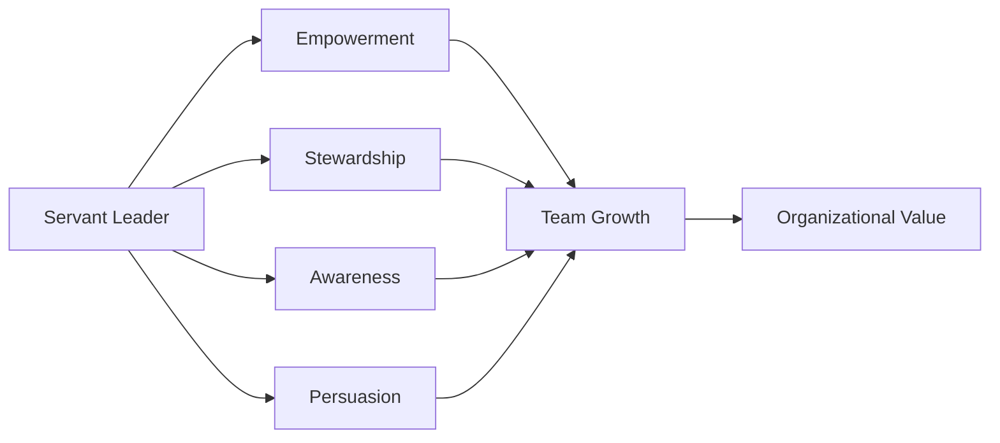
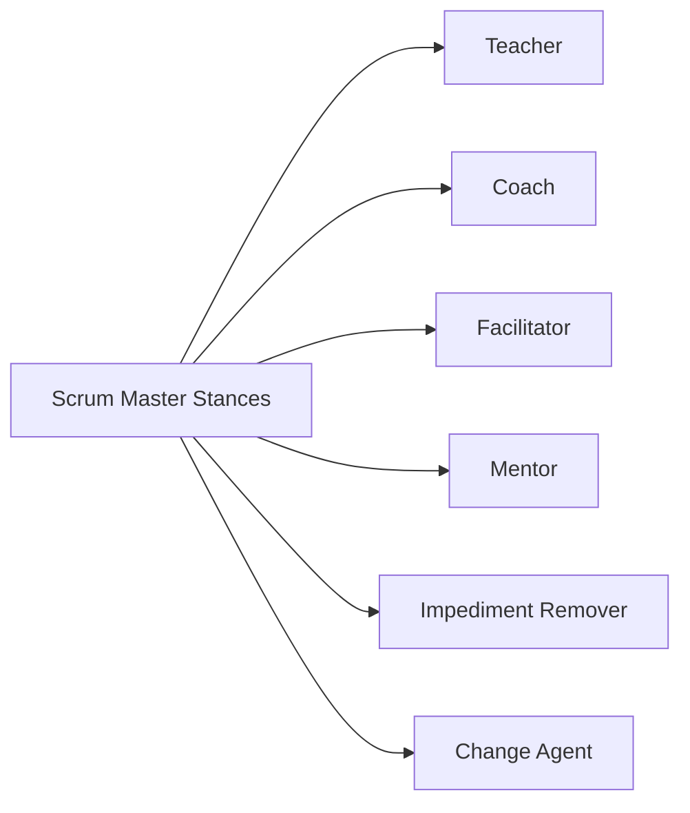
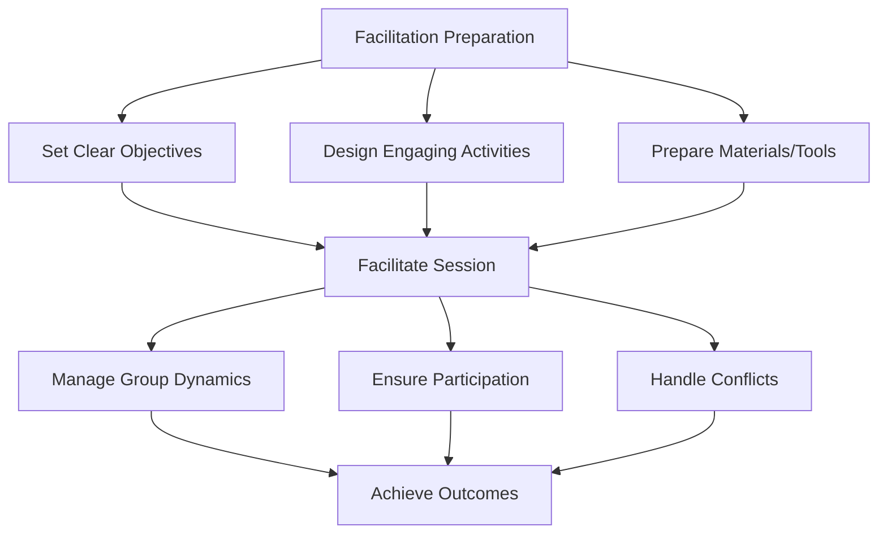
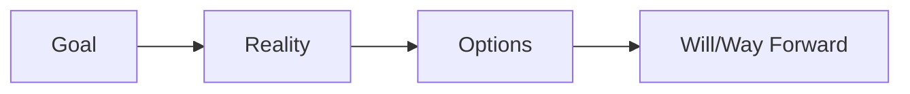
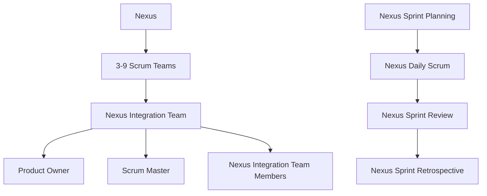
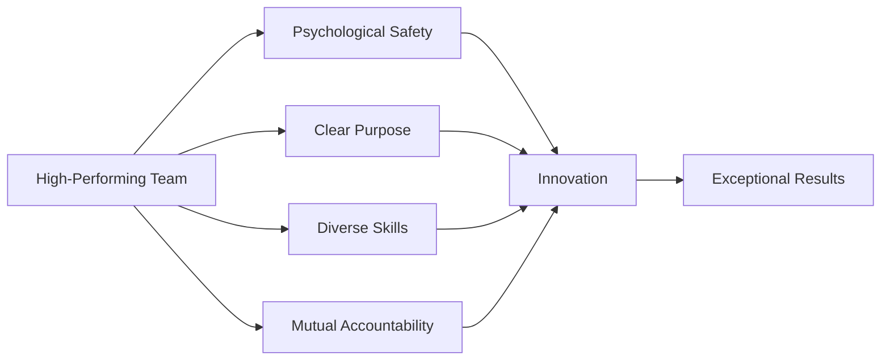
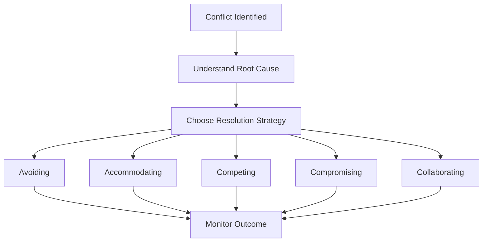
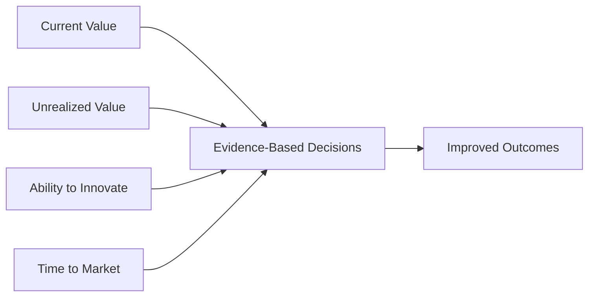
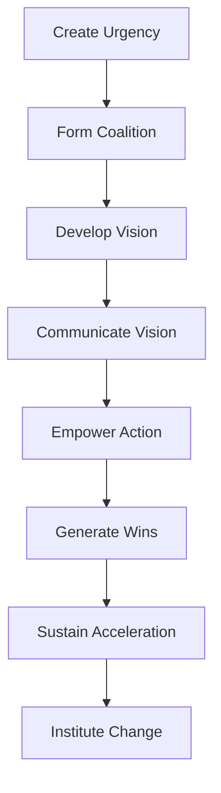
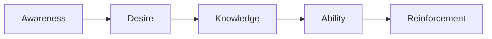

# Professional Scrum Master II (PSM II) Study Guide

## Table of Contents
1. [Introduction](#introduction)
2. [Advanced Scrum Master Practices](#advanced-scrum-master-practices)
3. [Facilitation and Coaching](#facilitation-and-coaching)
4. [Scaling Scrum](#scaling-scrum)
5. [Advanced Team Dynamics](#advanced-team-dynamics)
6. [Empirical Management](#empirical-management)
7. [Organizational Change](#organizational-change)
8. [Practice Questions](#practice-questions)
9. [Official Documentation](#official-documentation)

## Introduction

The Professional Scrum Master II (PSM II) certification is intended for Scrum Masters with at least one year of experience who are looking to grow their knowledge and abilities as a Scrum Master. This certification focuses on the application of Scrum principles and practices in complex, real-world scenarios.

**Exam Details:**
- 30 multiple-choice, multiple-answer, and true/false questions
- 90 minutes duration
- Passing score: 85%
- Online proctored exam
- Requires PSM I certification

## Advanced Scrum Master Practices

### Servant Leadership in Action

The Scrum Master serves as a servant leader, focusing on the growth and well-being of people and communities within the organization.

**Key Servant Leadership Characteristics:**
- **Listening**: Deeply understanding others' perspectives
- **Empathy**: Demonstrating genuine care for team members
- **Healing**: Creating an environment where people can grow
- **Awareness**: Understanding situations and their implications
- **Persuasion**: Convincing rather than coercing
- **Conceptualization**: Thinking beyond day-to-day operations
- **Foresight**: Anticipating likely outcomes
- **Stewardship**: Taking responsibility for the organization's mission
- **Commitment to Growth**: Believing in the intrinsic value of people
- **Building Community**: Creating a sense of connection among team members

### Professional Scrum Master Stances

1. **Teacher**: Sharing knowledge about Scrum, Agile practices, and organizational development
2. **Coach**: Helping individuals and teams develop their own capabilities
3. **Facilitator**: Enabling effective group interactions and decision-making
4. **Mentor**: Providing guidance based on experience and expertise
5. **Impediment Remover**: Identifying and helping resolve obstacles
6. **Change Agent**: Catalyzing organizational transformation

## Facilitation and Coaching

### Advanced Facilitation Techniques

**Key Facilitation Skills:**
- **Active Listening**: Demonstrating full attention to speakers
- **Powerful Questioning**: Asking questions that promote insight
- **Summarizing**: Capturing and reflecting key points
- **Consensus Building**: Helping groups reach agreement
- **Conflict Resolution**: Managing disagreements constructively
- **Time Management**: Keeping sessions on track
- **Energy Management**: Maintaining group engagement

### Coaching Models and Techniques

#### GROW Model

- **Goal**: What do you want to achieve?
- **Reality**: What is the current situation?
- **Options**: What could you do?
- **Will**: What will you do?

#### Clean Language
Using neutral questions that don't impose the coach's assumptions:
- "What kind of...?"
- "And when..., what happens next?"
- "And where could that come from?"

## Scaling Scrum

### Understanding Nexus Framework

**Nexus Artifacts:**
- **Nexus Sprint Backlog**: Composite of Product Backlog items and dependencies
- **Integrated Increment**: Combined work of all teams in the Nexus

**Key Challenges in Scaling:**
- **Dependencies**: Managing interdependencies between teams
- **Integration**: Ensuring the work of multiple teams creates a cohesive product
- **Communication**: Maintaining effective communication across teams
- **Technical Practices**: Implementing practices that support integration

### Multi-Team Coordination

**Coordination Techniques:**
1. **Scrum of Scrums**: Representatives from each team meet regularly
2. **Community of Practice**: Groups focused on specific skills or technologies
3. **Cross-Team Refinement**: Joint backlog refinement sessions
4. **Architectural Runway**: Shared technical foundation
5. **Integration Events**: Regular integration and testing cycles

## Advanced Team Dynamics

### High-Performing Team Characteristics

**Tuckman's Model of Team Development:**
1. **Forming**: Team comes together, members are polite and positive
2. **Storming**: Reality sets in, conflicts arise
3. **Norming**: Team starts to work more effectively together
4. **Performing**: Team operates at high efficiency
5. **Adjourning**: Team disbands after completing its work

### Conflict Resolution Strategies

**Thomas-Kilmann Conflict Modes:**
- **Avoiding**: Ignoring the conflict
- **Accommodating**: Giving in to others
- **Competing**: Asserting your position
- **Compromising**: Finding middle ground
- **Collaborating**: Working together to find win-win solutions

## Empirical Management

### Evidence-Based Management (EBM)

**Four Key Value Areas (KVAs):**
1. **Current Value (CV)**: Value delivered to customers today
2. **Unrealized Value (UV)**: Potential future value that could be realized
3. **Ability to Innovate (A2I)**: Capability to deliver new value
4. **Time to Market (T2M)**: Speed of delivering value

### Metrics and Measurement

**Product Metrics:**
- Customer satisfaction scores
- Revenue per user
- Feature usage analytics
- Net Promoter Score (NPS)

**Process Metrics:**
- Lead time
- Cycle time
- Throughput
- Defect rate

**Team Metrics:**
- Team happiness
- Velocity (for capacity planning only)
- Sprint Goal achievement
- Retrospective action completion

## Organizational Change

### Change Management Models

#### Kotter's 8-Step Process

#### ADKAR Model

### Organizational Impediments

**Common Organizational Impediments:**
- **Silos**: Departments working in isolation
- **Command and Control**: Top-down decision making
- **Risk Aversion**: Fear of failure preventing innovation
- **Process Over People**: Prioritizing processes over individuals
- **Short-term Thinking**: Focus on immediate results over long-term value

**Strategies for Addressing Impediments:**
1. **Make Visible**: Use visual management to highlight impediments
2. **Root Cause Analysis**: Use techniques like Five Whys or Fishbone diagrams
3. **Systemic Thinking**: Understand the system and its interconnections
4. **Stakeholder Engagement**: Involve the right people in solutions
5. **Continuous Improvement**: Implement small, incremental changes

## Practice Questions

### Question 1
**A Scrum Team is experiencing conflicts during Sprint Planning. As a Scrum Master, what is your best approach?**
A) Tell the team how to resolve the conflict
B) Facilitate a discussion to help the team understand different perspectives
C) Remove the conflicting team members from the meeting
D) Postpone Sprint Planning until the conflict is resolved

**Answer: B) Facilitate a discussion to help the team understand different perspectives**
*Explanation: As a servant leader and facilitator, the Scrum Master should help the team work through conflicts by facilitating understanding and communication, not by imposing solutions.*

### Question 2
**Your organization wants to measure team productivity using velocity. What should you advise?**
A) Velocity is an excellent productivity metric
B) Velocity should be used to compare teams
C) Velocity is useful for capacity planning but not for measuring productivity
D) Velocity should be tracked and reported to management weekly

**Answer: C) Velocity is useful for capacity planning but not for measuring productivity**
*Explanation: Velocity is a planning tool for the team to understand their capacity. It should not be used as a productivity metric or to compare teams, as this can lead to gaming and reduced quality.*

### Question 3
**A Product Owner is consistently unavailable for questions during the Sprint. What should the Scrum Master do?**
A) Answer the questions on behalf of the Product Owner
B) Have the team continue working without clarification
C) Help the Product Owner understand their accountability and the impact of their unavailability
D) Escalate to the Product Owner's manager

**Answer: C) Help the Product Owner understand their accountability and the impact of their unavailability**
*Explanation: The Scrum Master should coach and educate the Product Owner about their role and help them understand how their availability affects the team and product value.*

### Question 4
**Multiple Scrum Teams are working on the same product and experiencing integration issues. What is the best approach?**
A) Create a separate integration team
B) Implement the Nexus framework
C) Have teams work on completely independent features
D) Merge all teams into one large team

**Answer: B) Implement the Nexus framework**
*Explanation: Nexus is specifically designed to address integration challenges when multiple Scrum Teams work on the same product. It provides structure for managing dependencies and ensuring integration.*

### Question 5
**During a Sprint Retrospective, the team identifies an organizational impediment they cannot resolve themselves. What should the Scrum Master do?**
A) Tell the team to focus only on impediments they can control
B) Work to remove the impediment and keep the team informed of progress
C) Escalate the impediment to senior management immediately
D) Add the impediment to the Product Backlog

**Answer: B) Work to remove the impediment and keep the team informed of progress**
*Explanation: The Scrum Master is accountable for causing the removal of impediments. For organizational impediments, this means working outside the team while keeping them informed of progress.*

### Question 6
**A team member approaches you privately with concerns about another team member's behavior. How should you handle this?**
A) Address the issue with the problematic team member directly
B) Bring it up in the next Daily Scrum
C) Help the concerned team member find ways to address it themselves
D) Ignore it since it's a personal issue

**Answer: C) Help the concerned team member find ways to address it themselves**
*Explanation: As a coach, the Scrum Master should help individuals develop their own problem-solving capabilities. This empowers the team member and builds their skills for future situations.*

### Question 7
**Your organization is implementing Scrum but wants to keep their existing project management processes. What should you recommend?**
A) Adapt Scrum to fit the existing processes
B) Run both processes in parallel
C) Help the organization understand that Scrum requires empirical management
D) Focus only on the development teams and ignore organizational processes

**Answer: C) Help the organization understand that Scrum requires empirical management**
*Explanation: Scrum is based on empirical process control, which may conflict with traditional project management approaches. The Scrum Master should educate the organization about this fundamental difference.*

### Question 8
**A stakeholder complains that the development team is not delivering enough features. How should you respond?**
A) Tell the team to work faster
B) Help the stakeholder understand the importance of sustainable pace and quality
C) Suggest adding more team members
D) Recommend reducing the Definition of Done

**Answer: B) Help the stakeholder understand the importance of sustainable pace and quality**
*Explanation: The Scrum Master should educate stakeholders about Scrum principles, including the importance of maintaining a sustainable pace and focusing on value over volume.*

### Question 9
**Your team is consistently not meeting their Sprint commitments. What is the most likely cause?**
A) The team is not working hard enough
B) The estimates are too high
C) There are impediments affecting the team's ability to deliver
D) The Sprint Goal is not clear enough

**Answer: C) There are impediments affecting the team's ability to deliver**
*Explanation: Consistent failure to meet commitments usually indicates systemic impediments. The Scrum Master should investigate and help remove these impediments rather than assume the team isn't working hard enough.*

### Question 10
**How should a Scrum Master handle a situation where senior management is pressuring the team to commit to more work than they believe they can complete?**
A) Tell the team to commit to the additional work
B) Help protect the team from external pressure while educating management about the risks
C) Escalate the issue to HR
D) Tell management they cannot interfere with the team

**Answer: B) Help protect the team from external pressure while educating management about the risks**
*Explanation: The Scrum Master should shield the team from external pressure while also educating stakeholders about the risks of overcommitment, such as reduced quality and increased technical debt.*

## Official Documentation

### Primary Resources
1. **[The Scrum Guide](https://scrumguides.org/)** - Essential foundation knowledge
2. **[Professional Scrum Master II Learning Path](https://www.scrum.org/courses/professional-scrum-master-ii)** - Advanced PSM training
3. **[Evidence-Based Management Guide](https://www.scrum.org/resources/evidence-based-management-guide)** - Framework for measuring value

### Advanced Reading
1. **[Nexus Guide](https://www.scrum.org/resources/nexus-guide)** - Scaling Scrum framework
2. **[Professional Scrum Master Stances](https://www.scrum.org/resources/blog/8-stances-scrum-master)** - Different ways Scrum Masters can serve
3. **[Liberating Structures](https://www.liberatingstructures.com/)** - Facilitation techniques

### Recommended Books
1. "The Professional ScrumMaster's Handbook" by Stacia Viscardi
2. "Coaching Agile Teams" by Lyssa Adkins
3. "The Five Dysfunctions of a Team" by Patrick Lencioni
4. "Difficult Conversations" by Douglas Stone, Bruce Patton, and Sheila Heen
5. "The Art of Gathering" by Priya Parker

### Research Papers and Articles
1. **Google's Project Aristotle** - Research on team effectiveness
2. **Spotify Engineering Culture** - Insights into scaling agile practices
3. **State of Agile Reports** - Annual insights into agile adoption and practices

---

**Note**: PSM II certification requires practical application of Scrum principles in complex scenarios. Focus on understanding the 'why' behind Scrum practices and how to adapt them to different organizational contexts.
