# Professional Scrum Master III (PSM III) Study Guide

## Table of Contents
1. [Introduction](#introduction)
2. [Mastery of Scrum Theory](#mastery-of-scrum-theory)
3. [Advanced Organizational Design](#advanced-organizational-design)
4. [Leadership and Influence](#leadership-and-influence)
5. [Systems Thinking](#systems-thinking)
6. [Advanced Facilitation and Coaching](#advanced-facilitation-and-coaching)
7. [Change Leadership](#change-leadership)
8. [Measuring and Improving Organizational Agility](#measuring-and-improving-organizational-agility)
9. [Practice Scenarios](#practice-scenarios)
10. [Official Documentation](#official-documentation)

## Introduction

The Professional Scrum Master III (PSM III) certification is the most advanced level of Scrum Master certification. It validates a deep understanding of Scrum and the ability to apply it in complex, often dysfunctional organizational environments. This certification is for expert-level practitioners who can demonstrate mastery through practical application.

**Assessment Details:**
- Essay-based questions requiring detailed explanations
- Real-world scenarios requiring comprehensive solutions
- 120 minutes duration
- Passing score: 85%
- Online proctored exam
- Requires PSM II certification

## Mastery of Scrum Theory

### Deep Understanding of Empiricism

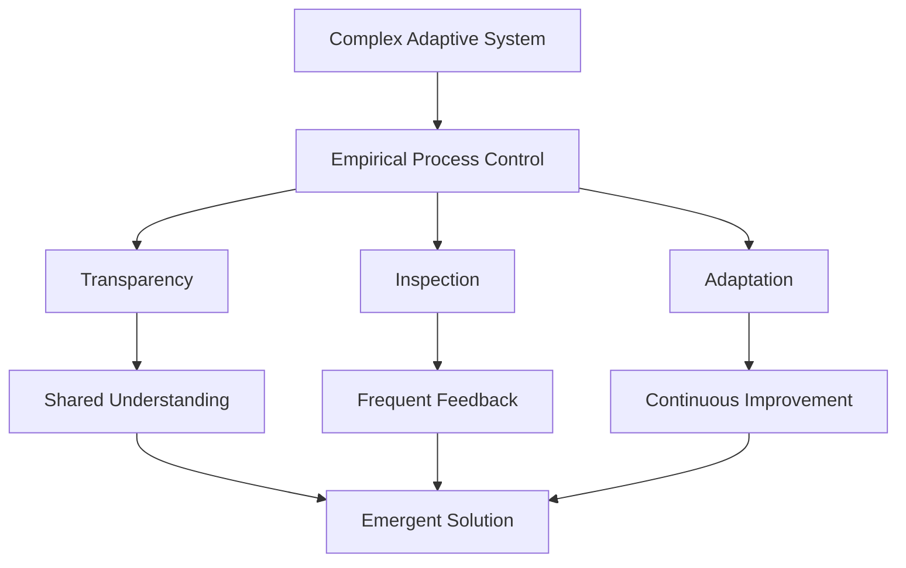

**Cynefin Framework Application:**
- **Simple/Obvious**: Best practices apply
- **Complicated**: Good practices with expertise
- **Complex**: Emergent practices through experimentation
- **Chaotic**: Novel practices, crisis management
- **Disorder**: Unclear which domain applies

### Professional Scrum Master as a Change Agent

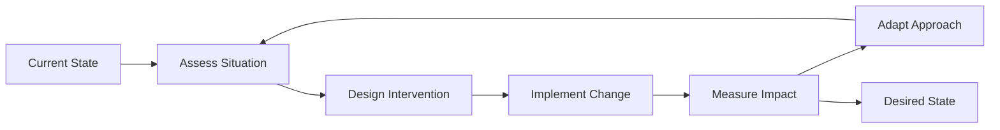

**Change Agent Competencies:**
- **Systems Perspective**: Understanding interconnections
- **Cultural Awareness**: Recognizing organizational culture patterns
- **Political Acumen**: Navigating organizational politics
- **Strategic Thinking**: Aligning changes with long-term goals
- **Resilience**: Persisting through resistance and setbacks

## Advanced Organizational Design

### Organizational Structures for Agility

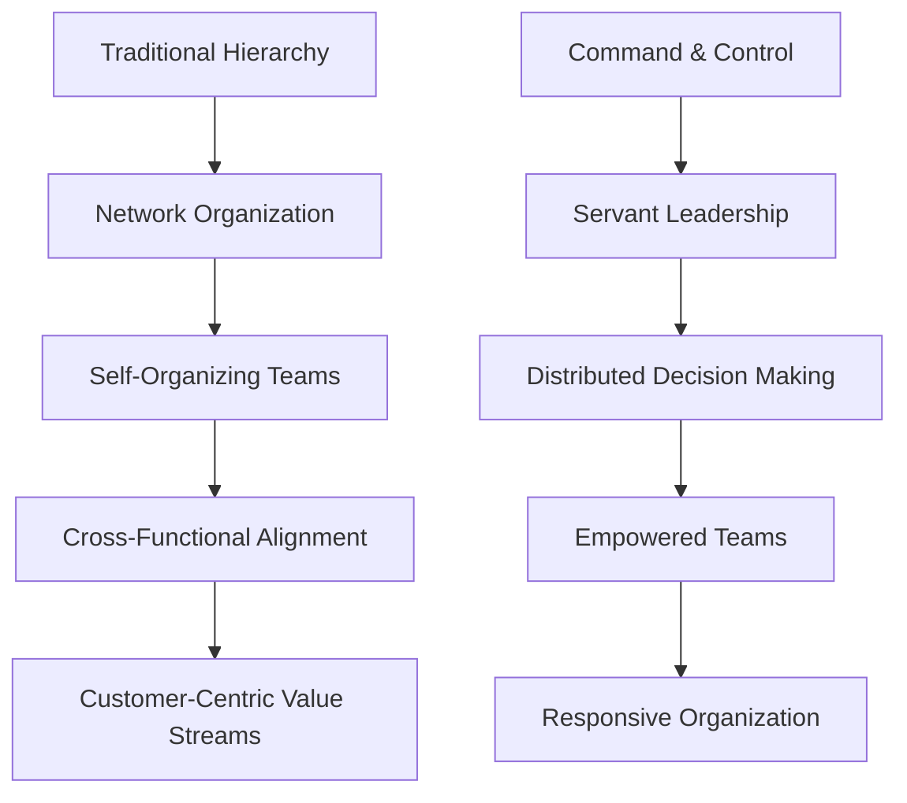

**Design Principles for Agile Organizations:**
1. **Purpose-Driven**: Clear mission and vision
2. **Customer-Centric**: Focus on customer value
3. **Network Structure**: Flexible, adaptive connections
4. **Transparency**: Open information sharing
5. **Continuous Learning**: Emphasis on growth and adaptation
6. **Psychological Safety**: Environment that encourages risk-taking

### Conway's Law and Team Topologies

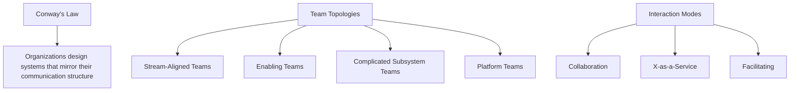

**Team Interaction Patterns:**
- **Collaboration**: Working together on shared goals
- **X-as-a-Service**: Consuming services from other teams
- **Facilitating**: Helping other teams learn and grow

## Leadership and Influence

### Transformational Leadership

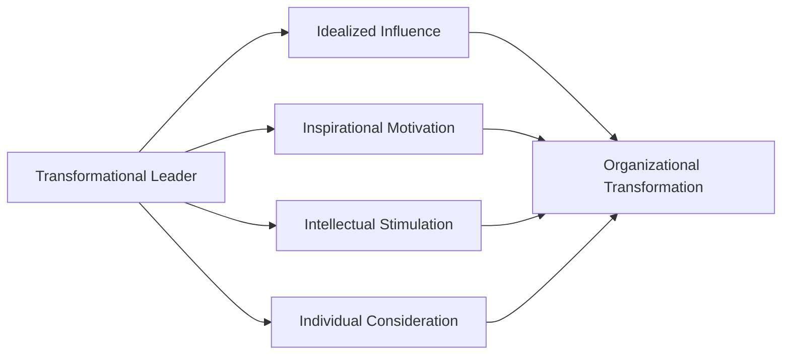

**Four Components:**
1. **Idealized Influence**: Being a role model
2. **Inspirational Motivation**: Creating compelling visions
3. **Intellectual Stimulation**: Challenging assumptions
4. **Individual Consideration**: Coaching and mentoring

### Influence Without Authority

**Cialdini's Principles of Influence:**
1. **Reciprocity**: People return favors
2. **Commitment/Consistency**: People align with their commitments
3. **Social Proof**: People follow others' lead
4. **Authority**: People defer to experts
5. **Liking**: People say yes to people they like
6. **Scarcity**: People value what's rare

### Stakeholder Management

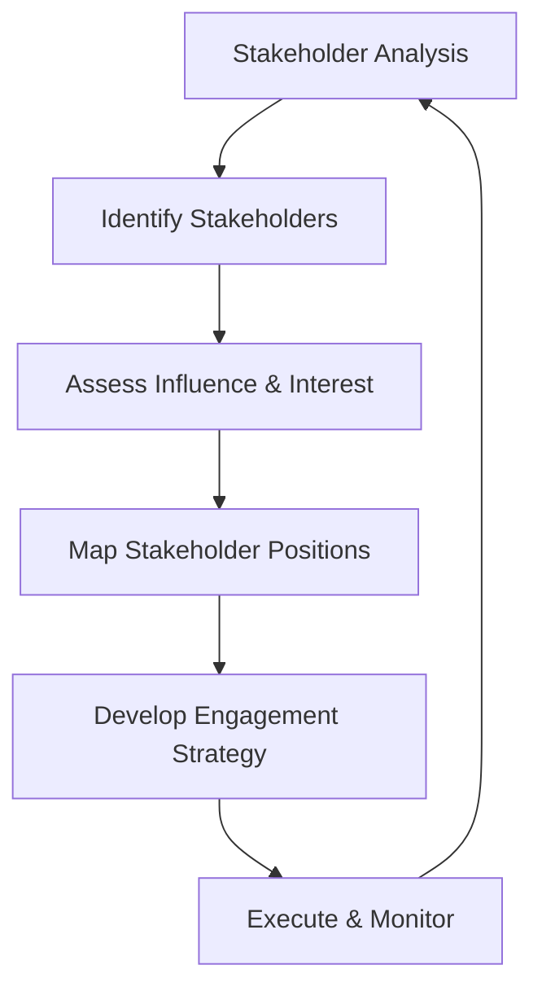

**Stakeholder Categories:**
- **Champions**: High influence, high support
- **Supporters**: Low influence, high support
- **Opponents**: High influence, low support
- **Blockers**: Low influence, low support

## Systems Thinking

### Understanding Complex Systems

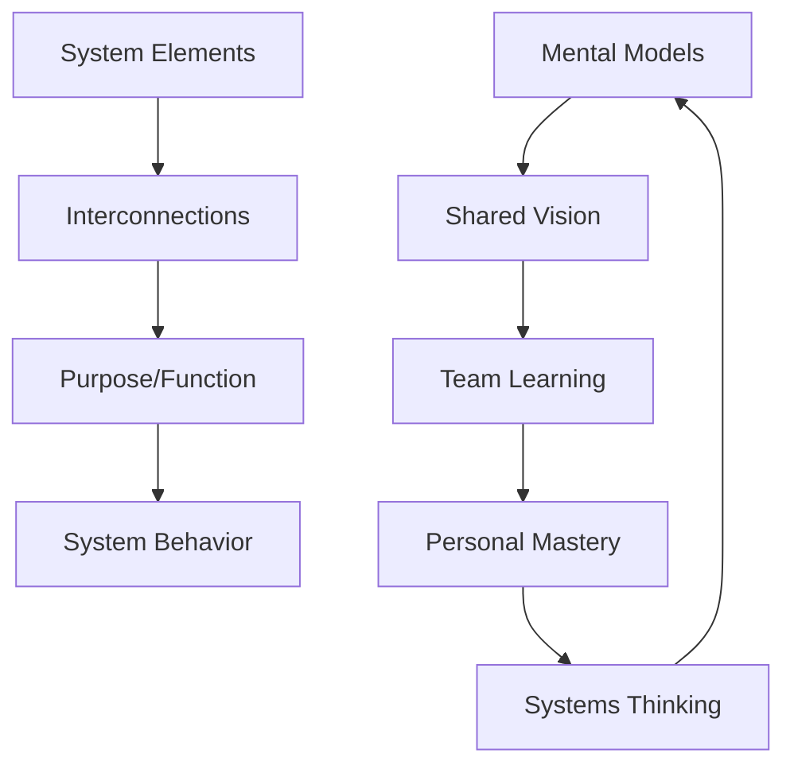

**Systems Thinking Tools:**
- **Causal Loop Diagrams**: Showing reinforcing and balancing loops
- **Rich Pictures**: Visual representations of complex situations
- **Systems Maps**: Mapping relationships and dependencies
- **Iceberg Model**: Events, patterns, structures, mental models

### Organizational Learning

**Learning Organization Characteristics:**
1. **Personal Mastery**: Individual commitment to learning
2. **Mental Models**: Examining and changing assumptions
3. **Shared Vision**: Common purpose and direction
4. **Team Learning**: Collective thinking and learning
5. **Systems Thinking**: Understanding interconnections

### Unintended Consequences

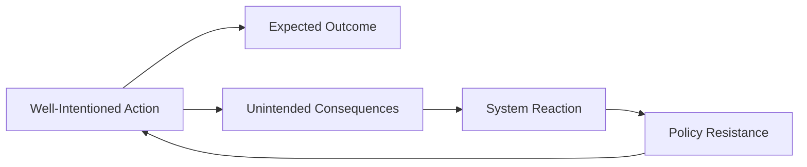

**Common System Archetypes:**
- **Limits to Growth**: Success creates resource constraints
- **Shifting the Burden**: Quick fixes undermine long-term solutions
- **Tragedy of the Commons**: Individual rational behavior leads to collective irrationality
- **Success to the Successful**: Winner takes all dynamics

## Advanced Facilitation and Coaching

### Developmental Coaching

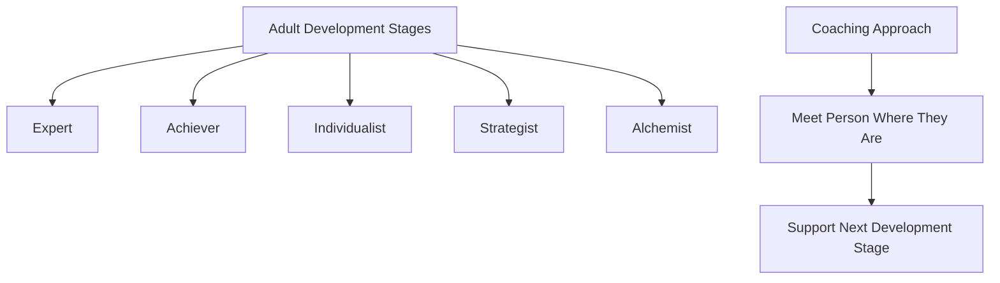

**Developmental Stages (Kegan & Lahey):**
- **Socialized Mind**: Following rules and expectations
- **Self-Authoring Mind**: Creating own values and standards
- **Self-Transforming Mind**: Holding multiple perspectives simultaneously

### Advanced Facilitation Patterns

**Open Space Technology:**
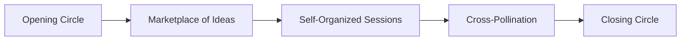

**World Café Method:**
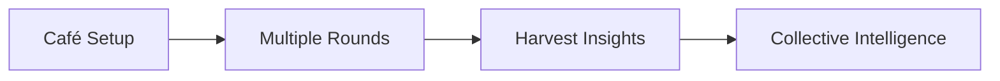

### Conflict Transformation

**Levels of Conflict:**
1. **Personal**: Individual differences and preferences
2. **Interpersonal**: Between individuals
3. **Structural**: Within systems and processes
4. **Cultural**: Between different value systems

**Conflict Transformation Process:**
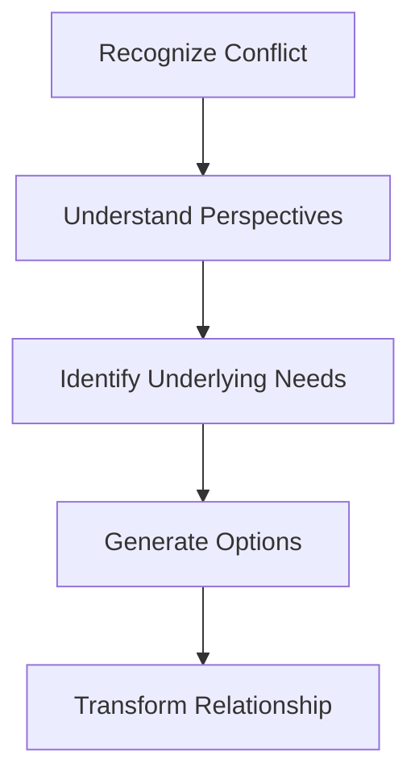

## Change Leadership

### Leading Transformational Change

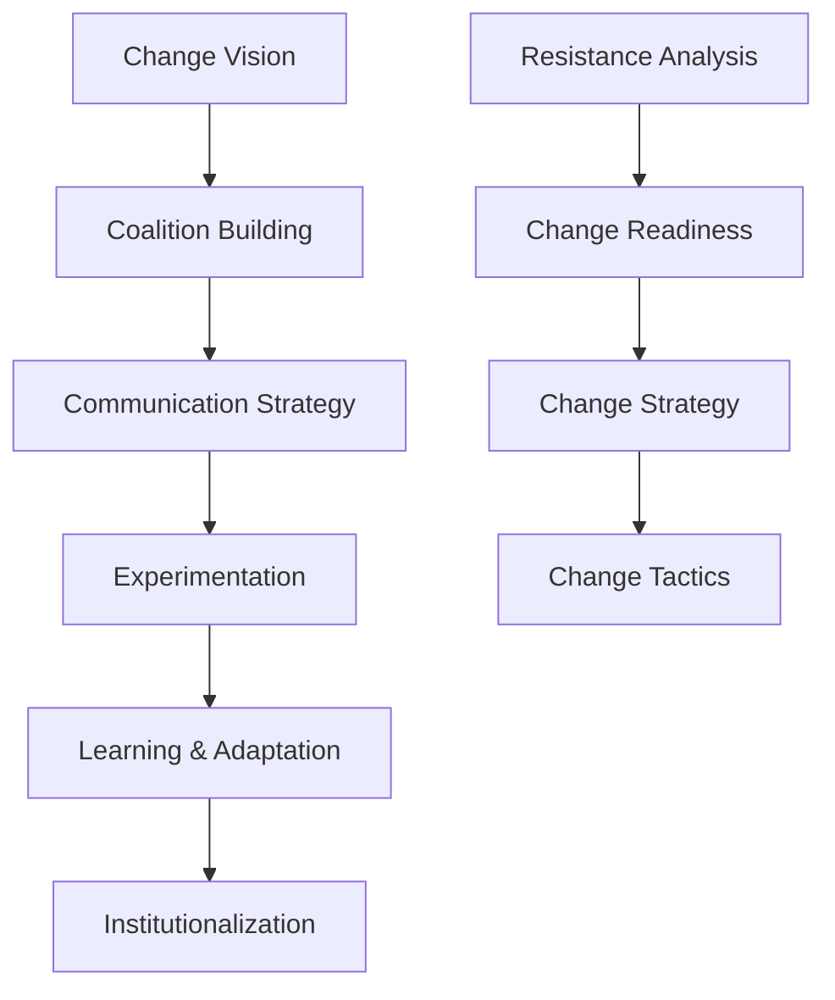

**Change Strategy Framework:**
- **Rational-Empirical**: Change through information and reasoning
- **Normative-Reeducative**: Change through relationships and culture
- **Power-Coercive**: Change through authority and compliance

### Cultural Change

**Organizational Culture Model (Schein):**
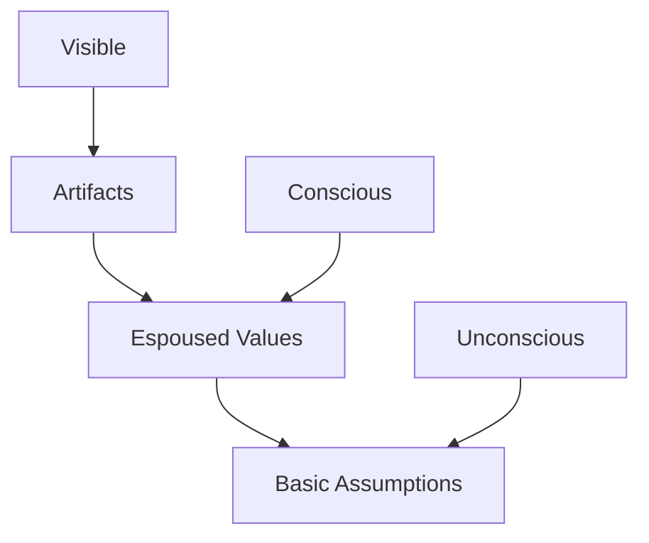

**Cultural Assessment Dimensions:**
- **Power Distance**: Hierarchy vs. equality
- **Individualism vs. Collectivism**: Individual vs. group focus
- **Uncertainty Avoidance**: Risk tolerance
- **Long-term vs. Short-term Orientation**: Time horizon

### Resistance Patterns

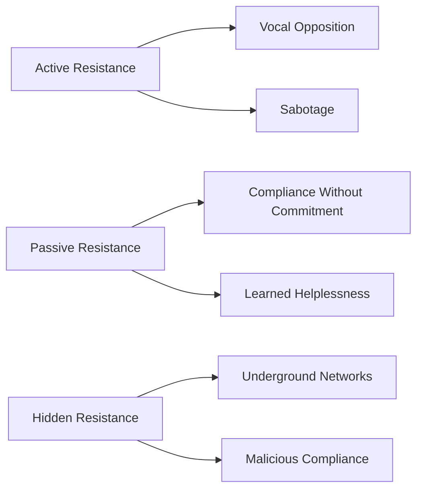

**Working with Resistance:**
1. **Understand the Source**: Fear, loss, past experience
2. **Acknowledge Concerns**: Validate emotions and perspectives
3. **Involve in Solution**: Make resisters part of the change process
4. **Provide Support**: Training, coaching, resources
5. **Celebrate Progress**: Recognize movement forward

## Measuring and Improving Organizational Agility

### Organizational Agility Assessment

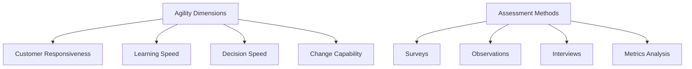

**Key Agility Indicators:**
- **Time to Market**: Speed of delivering value
- **Innovation Rate**: Frequency of new ideas implemented
- **Adaptation Speed**: How quickly organization responds to change
- **Learning Velocity**: Rate of acquiring new capabilities
- **Decision Quality**: Effectiveness of decision-making processes

### Value Stream Mapping

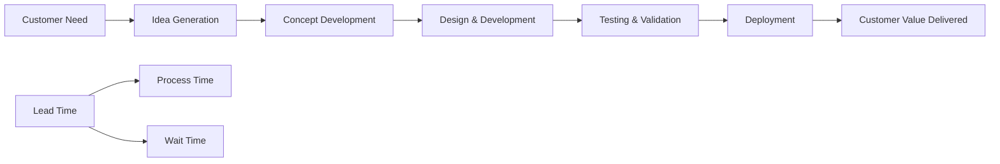

**Value Stream Analysis:**
- **Value-Added Time**: Time spent on activities that create customer value
- **Non-Value-Added Time**: Waste, delays, handoffs
- **Lead Time**: Total time from request to delivery
- **Process Time**: Time actively working on the item

### Evidence-Based Management Implementation

**EBM Implementation Process:**
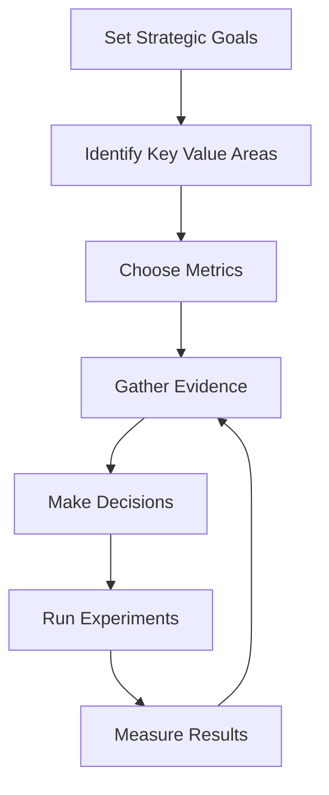

**Leading vs. Lagging Indicators:**
- **Leading**: Predictive metrics (team satisfaction, sprint goal achievement)
- **Lagging**: Historical metrics (revenue, customer satisfaction)

## Practice Scenarios

### Scenario 1: Multi-Team Coordination Issues

**Situation**: You're working with an organization that has 8 Scrum Teams working on the same product. Teams are experiencing significant integration issues, duplicated work, and conflicting priorities. The Product Owner is overwhelmed trying to coordinate with all teams.

**Key Challenges:**
- Lack of coordination between teams
- Integration problems
- Overwhelmed Product Owner
- Conflicting priorities

**Your Approach:**
1. **Assess Current State**: Map dependencies, identify coordination gaps
2. **Implement Nexus Framework**: Structure for multi-team coordination
3. **Establish Product Owner Support**: Area Product Owners or proxy roles
4. **Create Integration Practices**: Continuous integration, shared Definition of Done
5. **Facilitate Cross-Team Collaboration**: Communities of practice, cross-team events

### Scenario 2: Organizational Resistance to Change

**Situation**: Senior management has mandated an "Agile Transformation" but middle management is actively resisting. They continue to use traditional project management practices, create detailed upfront plans, and hold teams accountable to estimates. Team morale is low, and there's confusion about which practices to follow.

**Key Challenges:**
- Management resistance
- Conflicting practices
- Low team morale
- Confusion about expectations

**Your Approach:**
1. **Stakeholder Analysis**: Identify resistance sources and motivations
2. **Education Strategy**: Help managers understand agile benefits
3. **Pilot Approach**: Start with willing participants to demonstrate value
4. **Coaching Support**: Provide individual coaching to resistant managers
5. **Success Metrics**: Establish measures that matter to management

### Scenario 3: Technical Debt and Quality Issues

**Situation**: A Scrum Team is under pressure to deliver features quickly. Over time, they've accumulated significant technical debt, which is now slowing them down. Quality issues are increasing, and the team spends most of their time fixing bugs rather than delivering new value. Management is frustrated with the team's velocity decline.

**Key Challenges:**
- Technical debt accumulation
- Quality degradation
- Velocity decline
- Management pressure

**Your Approach:**
1. **Make Technical Debt Visible**: Create metrics and visualizations
2. **Educate Stakeholders**: Help them understand the cost of technical debt
3. **Definition of Done**: Strengthen quality standards
4. **Dedicated Time**: Allocate capacity for technical improvement
5. **Technical Practices**: Introduce or improve engineering practices

## Official Documentation

### Primary Resources
1. **[The Scrum Guide](https://scrumguides.org/)** - Foundation knowledge
2. **[Nexus Guide](https://www.scrum.org/resources/nexus-guide)** - Scaling framework
3. **[Evidence-Based Management Guide](https://www.scrum.org/resources/evidence-based-management-guide)** - Measuring value

### Advanced Leadership Resources
1. **[The Fifth Discipline](https://www.goodreads.com/book/show/255127.The_Fifth_Discipline)** by Peter Senge
2. **[Immunity to Change](https://www.goodreads.com/book/show/2900657-immunity-to-change)** by Robert Kegan
3. **[Team Topologies](https://teamtopologies.com/)** by Matthew Skelton and Manuel Pais

### Systems Thinking and Change
1. **[Thinking in Systems](https://www.goodreads.com/book/show/3828902-thinking-in-systems)** by Donella Meadows
2. **[Switch](https://www.goodreads.com/book/show/6570502-switch)** by Chip Heath and Dan Heath
3. **[Organizational Culture and Leadership](https://www.goodreads.com/book/show/319207.Organizational_Culture_and_Leadership)** by Edgar Schein

### Facilitation and Coaching
1. **[Coaching Agile Teams](https://www.goodreads.com/book/show/8337919-coaching-agile-teams)** by Lyssa Adkins
2. **[The Art of Gathering](https://www.goodreads.com/book/show/37424706-the-art-of-gathering)** by Priya Parker
3. **[Liberating Structures](https://www.liberatingstructures.com/)** - Facilitation methods

### Research and Case Studies
1. **Google's Project Aristotle** - Team effectiveness research
2. **Spotify Engineering Culture** - Scaling agile practices
3. **ING Bank Transformation** - Enterprise agile transformation case study
4. **Haier RenDanHeYi Model** - Self-managed enterprise example

### Assessment Preparation
1. **[PSM III Assessment Information](https://www.scrum.org/assessments/professional-scrum-master-iii-assessment)** - Official exam details
2. **Scrum.org Blog** - Latest thinking and case studies
3. **Professional Scrum Trainer Blog Posts** - Advanced topics and insights

---

**Note**: PSM III is a practical assessment requiring deep understanding and real-world application. Focus on developing systems thinking, change leadership capabilities, and the ability to work with complex organizational challenges. The assessment evaluates your ability to handle ambiguous, multi-faceted situations that require sophisticated interventions.
