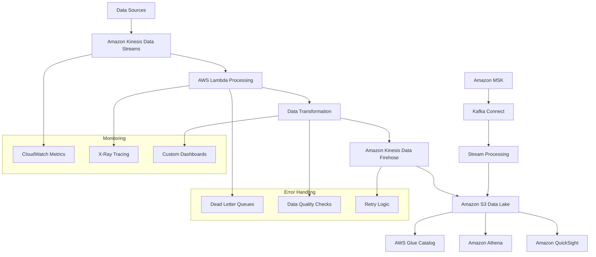
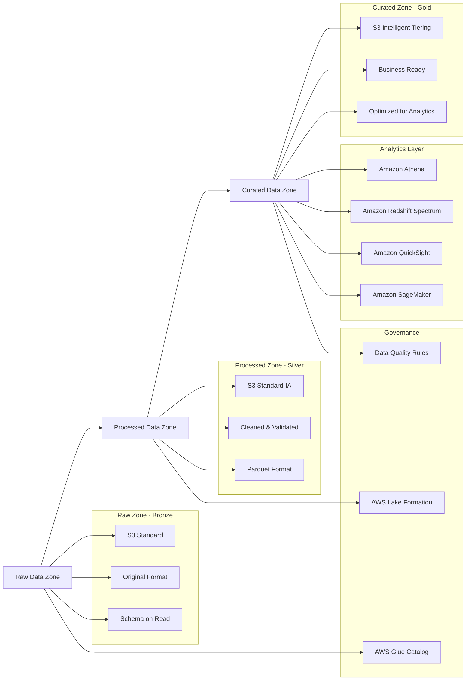
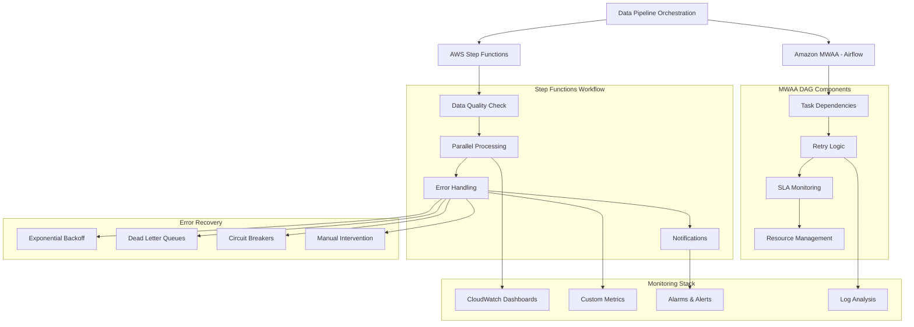

# AWS Certified Data Engineer - Associate (DEA-C01) - Complete Study Guide

## Exam Overview

The AWS Certified Data Engineer - Associate certification validates technical skills in implementing data pipelines and managing data platforms on AWS. This comprehensive guide covers all four domains with detailed explanations, Mermaid diagrams, practice questions, and official documentation links.

### Exam Details
- **Exam Code**: DEA-C01
- **Duration**: 130 minutes
- **Format**: Multiple choice and multiple response
- **Passing Score**: 720/1000
- **Number of Questions**: 65 questions
- **Validity**: 3 years

### Domain Breakdown
1. **Data Ingestion and Transformation** (34% of exam)
2. **Data Store Management** (26% of exam)
3. **Data Operations and Support** (22% of exam)
4. **Data Security and Governance** (18% of exam)

## Study Materials Structure

Each domain includes:
- Comprehensive technical content with AWS service deep-dives
- Visual Mermaid diagrams illustrating architectures and data flows
- Real-world implementation examples and code samples
- 10 practice questions with detailed explanations
- Links to official AWS documentation and best practices

## Domain 1: Data Ingestion and Transformation (34%)

### Key Topics Covered
- Data ingestion patterns (batch, streaming, near real-time)
- AWS Glue for ETL operations and data cataloging
- Amazon Kinesis ecosystem (Data Streams, Data Firehose, Analytics)
- Amazon MSK (Managed Streaming for Apache Kafka)
- AWS Lambda for event-driven data processing
- Data transformation patterns and schema evolution
- Error handling and data quality management

[📖 Complete Domain 1 Study Guide](./domain-1-data-ingestion-transformation.md)

### Sample Architecture: Real-time Data Processing Pipeline

## Domain 2: Data Store Management (26%)

### Key Topics Covered
- Data lake architecture and design patterns
- Amazon S3 storage classes and lifecycle management
- Data partitioning strategies for performance optimization
- File formats and compression techniques
- Amazon Redshift for data warehousing
- Amazon RDS and Aurora for transactional workloads
- Amazon DynamoDB for NoSQL requirements
- Data lifecycle management and cost optimization
- Security and encryption strategies

[📖 Complete Domain 2 Study Guide](./domain-2-data-store-management.md)

### Sample Architecture: Multi-Tier Data Lake

## Domain 3: Data Operations and Support (22%)

### Key Topics Covered
- Data pipeline orchestration with AWS Step Functions and Amazon MWAA
- Workflow automation and scheduling strategies
- Monitoring and logging best practices
- Error handling and recovery mechanisms
- Performance optimization techniques
- Cost management and optimization strategies
- Data pipeline testing methodologies
- Disaster recovery and business continuity planning

[📖 Complete Domain 3 Study Guide](./domain-3-data-operations-support.md)

### Sample Architecture: Orchestrated Data Pipeline

## Domain 4: Data Security and Governance (18%)

### Key Topics Covered
- Data security fundamentals and defense in depth
- Identity and Access Management (IAM) for data engineering
- Encryption and key management with AWS KMS
- Network security for data pipelines
- Data governance frameworks and implementation
- Data classification and tagging strategies
- Compliance and auditing requirements
- Data privacy and protection techniques
- Security monitoring and incident response

[📖 Complete Domain 4 Study Guide](./domain-4-data-security-governance.md)

### Sample Architecture: Secure Data Platform

```mermaid
graph TD
    A[Data Security Framework] --> B[Identity & Access]
    A --> C[Data Protection]
    A --> D[Network Security]
    A --> E[Governance & Compliance]
    
    subgraph "IAM Strategy"
        F[Role-based Access]
        G[Least Privilege]
        H[Cross-account Roles]
        I[Service Roles]
    end
    
    B --> F
    B --> G
    B --> H
    B --> I
    
    subgraph "Encryption Strategy"
        J[KMS Customer Keys]
        K[Encryption at Rest]
        L[Encryption in Transit]
        M[Key Rotation]
    end
    
    C --> J
    C --> K
    C --> L
    C --> M
    
    subgraph "Network Controls"
        N[VPC Isolation]
        O[Security Groups]
        P[VPC Endpoints]
        Q[PrivateLink]
    end
    
    D --> N
    D --> O
    D --> P
    D --> Q
    
    subgraph "Governance Tools"
        R[AWS Lake Formation]
        S[Amazon Macie]
        T[AWS Config]
        U[CloudTrail]
    end
    
    E --> R
    E --> S
    E --> T
    E --> U
```

## Comprehensive Practice Scenarios

### Multi-Domain Scenario 1: E-commerce Data Platform
A large e-commerce company needs to build a comprehensive data platform that ingests real-time clickstream data, processes customer orders, maintains product catalogs, and provides business intelligence capabilities while ensuring data security and compliance.

**Requirements:**
- Real-time clickstream processing with sub-second latency
- Batch processing of daily sales reports
- Customer data privacy (GDPR compliance)
- High availability across multiple regions
- Cost optimization for varying workloads

**Solution Architecture Components:**
- **Ingestion**: Kinesis Data Streams for clickstream, Kinesis Data Firehose for batch data
- **Processing**: Lambda for real-time, Glue for batch ETL
- **Storage**: S3 data lake with lifecycle policies, Redshift for analytics
- **Security**: KMS encryption, IAM roles, VPC isolation
- **Governance**: Lake Formation for access control, Macie for data discovery

### Multi-Domain Scenario 2: Healthcare Data Analytics
A healthcare organization needs to process patient data from multiple sources while maintaining HIPAA compliance, ensuring data quality, and providing analytics capabilities for clinical research.

**Requirements:**
- HIPAA-compliant data handling
- Integration with multiple EMR systems
- Real-time patient monitoring data
- Research analytics capabilities
- Audit trail for all data access

**Solution Architecture Components:**
- **Ingestion**: API Gateway + Lambda for EMR integration, Kinesis for monitoring data
- **Processing**: Glue with data quality rules, Step Functions for orchestration
- **Storage**: Encrypted S3 with fine-grained access control
- **Security**: Customer-managed KMS keys, CloudTrail logging
- **Governance**: Data classification, access auditing, retention policies

## Study Strategy and Timeline

### Preparation Phases (10-14 weeks)

#### Phase 1: Foundation (Weeks 1-3)
- **AWS Data Analytics Services Overview**: Understand the complete AWS data ecosystem
- **Data Engineering Fundamentals**: Learn core concepts of data engineering
- **Basic AWS Services**: EC2, S3, IAM, VPC fundamentals

#### Phase 2: Core Domains (Weeks 4-9)
- **Week 4-5**: Domain 1 - Data Ingestion and Transformation
- **Week 6-7**: Domain 2 - Data Store Management  
- **Week 8-9**: Domain 3 - Data Operations and Support

#### Phase 3: Security and Advanced Topics (Weeks 10-12)
- **Week 10**: Domain 4 - Data Security and Governance
- **Week 11**: Multi-domain integration scenarios
- **Week 12**: Performance optimization and cost management

#### Phase 4: Practice and Review (Weeks 13-14)
- **Week 13**: Practice exams and weak area reinforcement
- **Week 14**: Final review and exam preparation

### Hands-on Learning Approach

#### AWS Free Tier Projects
1. **Basic Data Pipeline**: S3 → Glue → Athena
2. **Streaming Analytics**: Kinesis → Lambda → DynamoDB
3. **Data Lake Implementation**: Multi-tier S3 with Glue Catalog
4. **Security Implementation**: IAM roles, KMS encryption, VPC setup

#### Advanced Projects
1. **End-to-end Data Platform**: Complete ingestion to analytics pipeline
2. **Multi-region Setup**: Cross-region replication and disaster recovery
3. **Cost Optimization**: Implement lifecycle policies and resource optimization
4. **Compliance Implementation**: GDPR/HIPAA-compliant data handling

### Practice Test Strategy

#### Question Types and Focus Areas
- **Scenario-based Questions**: Real-world implementation challenges
- **Best Practices**: AWS Well-Architected principles for data
- **Service Selection**: Choosing appropriate services for requirements
- **Security Implementation**: Proper security controls and compliance
- **Cost Optimization**: Balancing performance and cost
- **Troubleshooting**: Identifying and resolving common issues

#### Key Question Patterns
1. **Architecture Design**: "What is the BEST architecture for..."
2. **Service Comparison**: "Which service should you choose for..."
3. **Security Requirements**: "How do you ensure data security while..."
4. **Performance Optimization**: "How can you improve performance of..."
5. **Cost Management**: "What is the most cost-effective way to..."

## AWS Services Deep Dive

### Core Data Services
- **AWS Glue**: ETL service, data catalog, crawlers, jobs
- **Amazon Kinesis**: Data Streams, Data Firehose, Analytics
- **Amazon MSK**: Managed Apache Kafka
- **AWS Lambda**: Serverless compute for data processing
- **Amazon S3**: Object storage and data lake foundation

### Analytics Services
- **Amazon Athena**: Serverless query service
- **Amazon Redshift**: Cloud data warehouse
- **Amazon QuickSight**: Business intelligence service
- **Amazon EMR**: Big data processing
- **Amazon OpenSearch**: Search and analytics

### Database Services
- **Amazon RDS**: Relational database service
- **Amazon Aurora**: High-performance relational database
- **Amazon DynamoDB**: NoSQL database service
- **Amazon Neptune**: Graph database service

### Security and Governance
- **AWS IAM**: Identity and access management
- **AWS KMS**: Key management service
- **Amazon Macie**: Data security and privacy service
- **AWS Lake Formation**: Data lake governance
- **AWS CloudTrail**: Audit and compliance logging

### Monitoring and Operations
- **Amazon CloudWatch**: Monitoring and observability
- **AWS X-Ray**: Application tracing
- **AWS Step Functions**: Workflow orchestration
- **Amazon MWAA**: Managed Apache Airflow

## Exam Tips and Best Practices

### During the Exam
1. **Read Questions Carefully**: Pay attention to requirements and constraints
2. **Eliminate Wrong Answers**: Use process of elimination for difficult questions
3. **Consider AWS Best Practices**: Choose solutions that follow AWS recommendations
4. **Think About Real-world Scenarios**: Consider practical implementation challenges
5. **Time Management**: Don't spend too long on any single question
6. **Review Flagged Questions**: Use remaining time to review uncertain answers

### Common Pitfalls to Avoid
1. **Over-engineering Solutions**: Choose simple, AWS-native solutions when possible
2. **Ignoring Cost Considerations**: Always consider cost-effectiveness
3. **Missing Security Requirements**: Don't overlook security and compliance needs
4. **Confusing Similar Services**: Understand the differences between similar services
5. **Not Considering Scale**: Think about how solutions scale with data volume

## Additional Resources

### AWS Official Resources
- [AWS Certified Data Engineer - Associate Exam Guide](https://d1.awsstatic.com/training-and-certification/docs-data-engineer-associate/AWS-Certified-Data-Engineer-Associate_Exam-Guide.pdf)
- [AWS Architecture Center](https://aws.amazon.com/architecture/)
- [AWS Well-Architected Framework](https://aws.amazon.com/architecture/well-architected/)
- [AWS Big Data Blog](https://aws.amazon.com/blogs/big-data/)
- [AWS Analytics Blog](https://aws.amazon.com/blogs/analytics/)

### Training and Certification
- [AWS Digital Training](https://aws.amazon.com/training/digital/)
- [AWS Instructor-Led Training](https://aws.amazon.com/training/classroom/)
- [AWS Certification](https://aws.amazon.com/certification/)

### Practice and Community
- [AWS Hands-on Tutorials](https://aws.amazon.com/getting-started/hands-on/)
- [AWS Solutions Library](https://aws.amazon.com/solutions/)
- [AWS re:Invent Videos](https://www.youtube.com/user/AmazonWebServices)
- [AWS Community Forums](https://forums.aws.amazon.com/)

### Books and Additional Study Materials
- "Data Engineering on AWS" by Gareth Eagar
- "AWS Certified Data Analytics Study Guide" by Benchprep
- "Building Data Lakes on AWS" - AWS Whitepaper
- "Big Data Analytics Options on AWS" - AWS Whitepaper

## Final Architecture: Complete AWS Data Engineering Platform

```mermaid
graph TD
    A[Data Sources] --> B[Ingestion Layer]
    B --> C[Processing Layer] 
    C --> D[Storage Layer]
    D --> E[Analytics Layer]
    E --> F[Presentation Layer]
    
    subgraph "Data Sources"
        G[Operational Databases]
        H[SaaS Applications]
        I[IoT Devices]
        J[Log Files]
        K[APIs]
    end
    
    G --> A
    H --> A
    I --> A
    J --> A
    K --> A
    
    subgraph "Ingestion Layer"
        L[Amazon Kinesis Data Streams]
        M[Amazon Kinesis Data Firehose]
        N[AWS Database Migration Service]
        O[AWS DataSync]
        P[Amazon MSK]
    end
    
    B --> L
    B --> M
    B --> N
    B --> O
    B --> P
    
    subgraph "Processing Layer"
        Q[AWS Glue ETL]
        R[AWS Lambda]
        S[Amazon EMR]
        T[AWS Step Functions]
        U[Amazon MWAA]
    end
    
    C --> Q
    C --> R
    C --> S
    C --> T
    C --> U
    
    subgraph "Storage Layer"
        V[Amazon S3 Data Lake]
        W[Amazon Redshift]
        X[Amazon DynamoDB]
        Y[Amazon RDS/Aurora]
    end
    
    D --> V
    D --> W
    D --> X
    D --> Y
    
    subgraph "Analytics Layer"
        Z[Amazon Athena]
        AA[Amazon Redshift Spectrum]
        BB[Amazon SageMaker]
        CC[Amazon OpenSearch]
    end
    
    E --> Z
    E --> AA
    E --> BB
    E --> CC
    
    subgraph "Presentation Layer"
        DD[Amazon QuickSight]
        EE[Custom Applications]
        FF[APIs]
        GG[Data Exports]
    end
    
    F --> DD
    F --> EE
    F --> FF
    F --> GG
    
    subgraph "Cross-cutting Concerns"
        HH[AWS IAM - Security]
        II[AWS KMS - Encryption]
        JJ[Amazon CloudWatch - Monitoring]
        KK[AWS Lake Formation - Governance]
        LL[Amazon Macie - Data Discovery]
    end
    
    A --> HH
    B --> II
    C --> JJ
    D --> KK
    E --> LL
```

This comprehensive study guide provides everything needed to successfully pass the AWS Certified Data Engineer - Associate exam. Focus on understanding the concepts, practicing with real AWS services, and applying data engineering best practices to exam scenarios.

Good luck with your certification journey! 🚀

---

## Quick Reference Summary

### Key Service Mappings
- **Batch Processing**: AWS Glue, Amazon EMR
- **Stream Processing**: Amazon Kinesis, Amazon MSK, AWS Lambda
- **Data Storage**: Amazon S3, Amazon Redshift, Amazon DynamoDB
- **Analytics**: Amazon Athena, Amazon QuickSight, Amazon SageMaker
- **Orchestration**: AWS Step Functions, Amazon MWAA
- **Security**: AWS IAM, AWS KMS, Amazon Macie
- **Monitoring**: Amazon CloudWatch, AWS X-Ray, AWS CloudTrail

### Common Architecture Patterns
1. **Lambda Architecture**: Batch + Stream processing for different latency requirements
2. **Kappa Architecture**: Stream-only processing for simplified architecture
3. **Data Lake Pattern**: Raw → Processed → Curated data zones
4. **Modern Data Stack**: Cloud-native services with minimal operational overhead
5. **Hybrid Architecture**: On-premises integration with cloud services

### Performance Optimization Checklist
- ✅ Use appropriate file formats (Parquet for analytics)
- ✅ Implement proper partitioning strategies
- ✅ Configure auto-scaling for variable workloads
- ✅ Use columnar storage for analytical queries
- ✅ Implement caching where appropriate
- ✅ Optimize network connectivity with VPC endpoints
- ✅ Right-size compute resources for workload requirements

### Security Best Practices Checklist
- ✅ Implement least privilege access policies
- ✅ Enable encryption at rest and in transit
- ✅ Use customer-managed KMS keys for sensitive data
- ✅ Implement network isolation with VPCs
- ✅ Enable comprehensive audit logging
- ✅ Classify and tag data appropriately
- ✅ Monitor for anomalous activity
- ✅ Implement data lifecycle management
