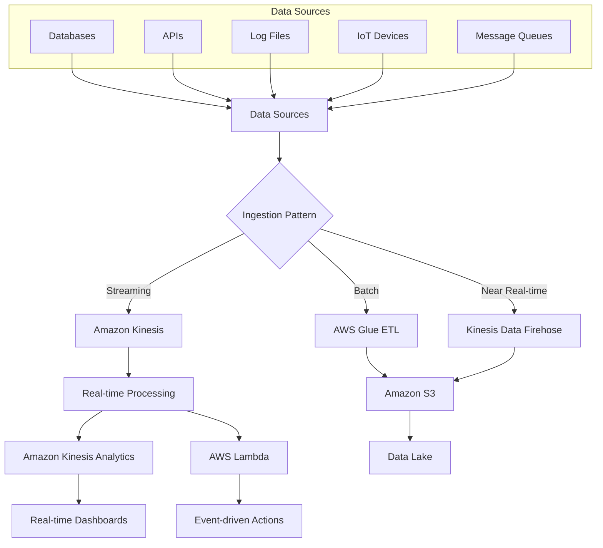
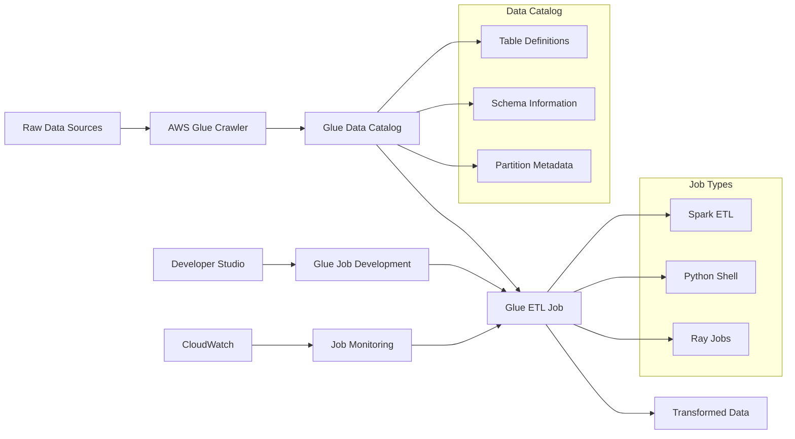
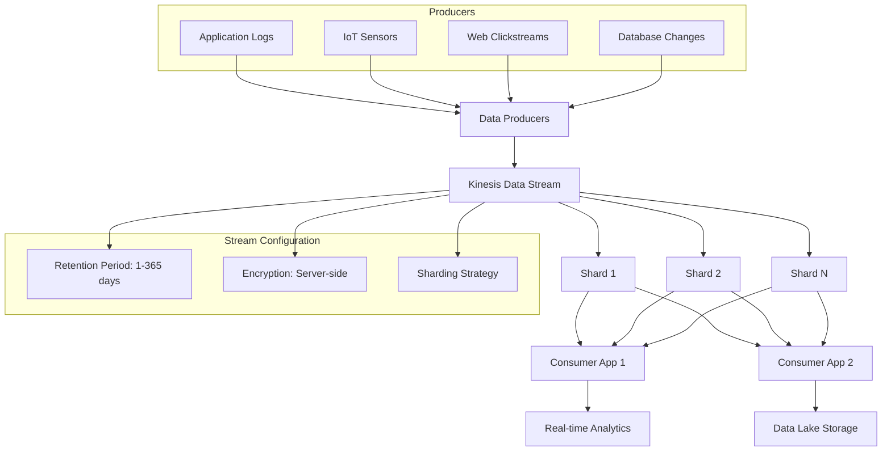
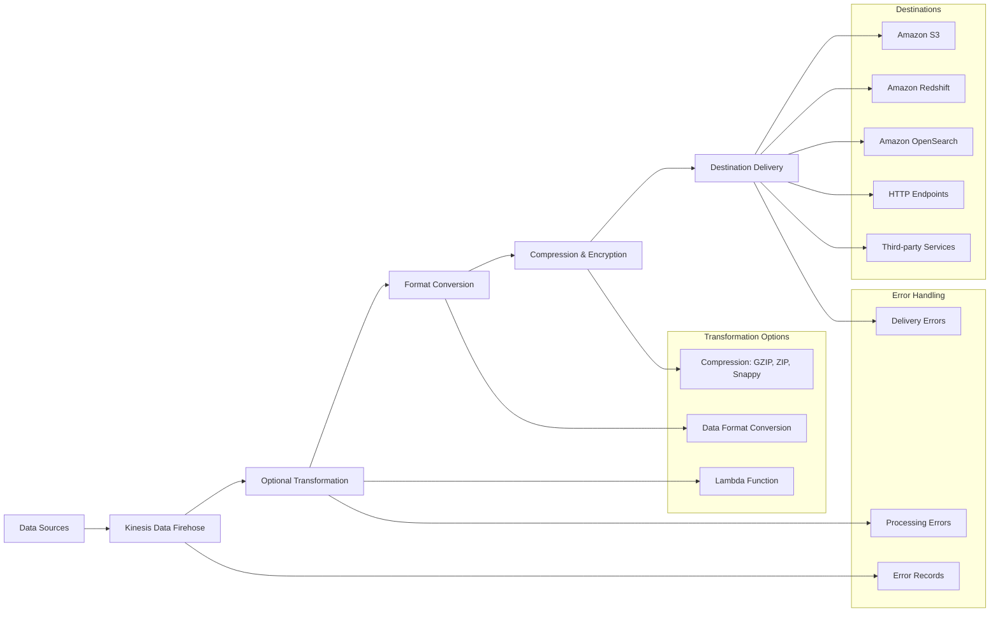
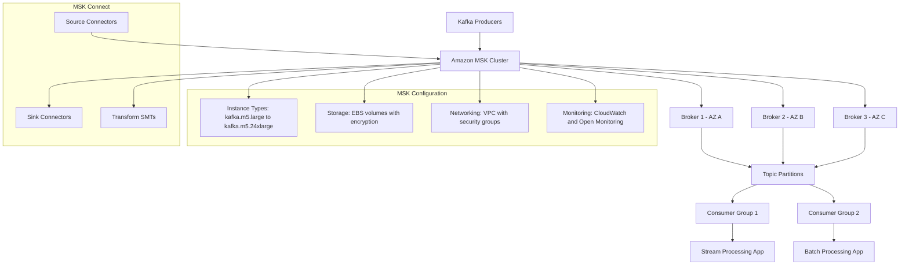
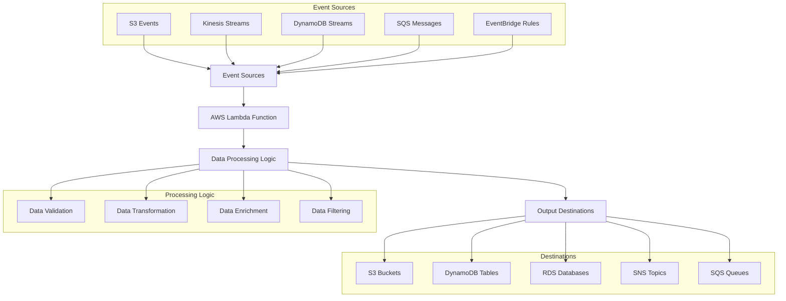
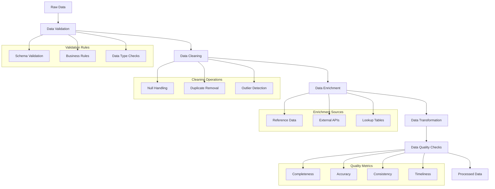
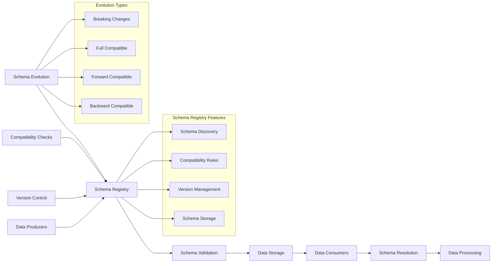
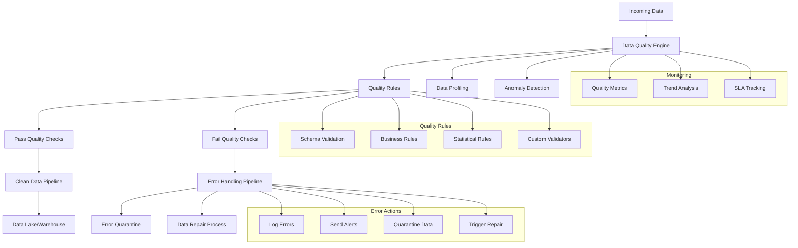

# Domain 1: Data Ingestion and Transformation (34%)

## Table of Contents
1. [Data Ingestion Fundamentals](#data-ingestion-fundamentals)
2. [AWS Glue for ETL](#aws-glue-for-etl)
3. [Amazon Kinesis Data Streams](#amazon-kinesis-data-streams)
4. [Amazon Kinesis Data Firehose](#amazon-kinesis-data-firehose)
5. [Amazon MSK (Managed Streaming for Kafka)](#amazon-msk)
6. [AWS Lambda for Data Processing](#aws-lambda-for-data-processing)
7. [Data Transformation Patterns](#data-transformation-patterns)
8. [Schema Evolution and Management](#schema-evolution-and-management)
9. [Error Handling and Data Quality](#error-handling-and-data-quality)
10. [Practice Questions](#practice-questions)

---

## Data Ingestion Fundamentals

### Overview
Data ingestion is the process of importing, transferring, loading, and processing data for immediate use or storage in a database. AWS provides multiple services for different ingestion patterns.

### Ingestion Patterns

#### Batch Ingestion
- **Use Case**: Large volumes of data processed at scheduled intervals
- **Services**: AWS Glue, AWS Batch, Amazon EMR
- **Characteristics**: High throughput, cost-effective, higher latency

#### Real-time Streaming
- **Use Case**: Continuous data processing with low latency requirements
- **Services**: Amazon Kinesis, Amazon MSK, AWS Lambda
- **Characteristics**: Low latency, higher cost, complex processing

#### Near Real-time (Micro-batch)
- **Use Case**: Balance between latency and cost
- **Services**: Amazon Kinesis Data Firehose, AWS Glue Streaming
- **Characteristics**: Medium latency, moderate cost

### Data Ingestion Architecture



---

## AWS Glue for ETL

### Core Components

#### AWS Glue Data Catalog
- Central metadata repository
- Schema discovery and evolution
- Integration with analytics services

#### AWS Glue Crawlers
- Automatic schema discovery
- Partition detection
- Schedule-based updates

#### AWS Glue Jobs
- Serverless ETL execution
- Python and Scala support
- Auto-scaling capabilities

### Glue ETL Architecture



### Glue Job Optimization

#### Performance Tuning
- **Worker Type Selection**: G.1X, G.2X, G.025X for different workloads
- **Dynamic Scaling**: Auto-scaling based on workload
- **Partitioning**: Optimize data layout for query performance

#### Cost Optimization
- **Spot Instances**: Use for non-critical workloads
- **Job Bookmarks**: Track processed data to avoid reprocessing
- **Resource Allocation**: Right-size workers and executors

### Example Glue ETL Script

```python
import sys
from awsglue.transforms import *
from awsglue.utils import getResolvedOptions
from pyspark.context import SparkContext
from awsglue.context import GlueContext
from awsglue.job import Job

args = getResolvedOptions(sys.argv, ['JOB_NAME'])
sc = SparkContext()
glueContext = GlueContext(sc)
spark = glueContext.spark_session
job = Job(glueContext)
job.init(args['JOB_NAME'], args)

# Read from Data Catalog
datasource = glueContext.create_dynamic_frame.from_catalog(
    database="sales_db",
    table_name="raw_sales",
    transformation_ctx="datasource"
)

# Transform data
applymapping = ApplyMapping.apply(
    frame=datasource,
    mappings=[
        ("customer_id", "string", "customer_id", "string"),
        ("order_date", "string", "order_date", "timestamp"),
        ("amount", "double", "amount", "decimal(10,2)")
    ],
    transformation_ctx="applymapping"
)

# Write to S3
glueContext.write_dynamic_frame.from_options(
    frame=applymapping,
    connection_type="s3",
    connection_options={"path": "s3://data-lake/processed/sales/"},
    format="parquet",
    transformation_ctx="datasink"
)

job.commit()
```

---

## Amazon Kinesis Data Streams

### Architecture Components

#### Shards
- Basic unit of capacity
- 1 MB/sec or 1,000 records/sec ingestion
- 2 MB/sec egress per consumer

#### Producers
- Applications that send data to streams
- SDK, Kinesis Producer Library (KPL), Kinesis Agent

#### Consumers
- Applications that process stream data
- Kinesis Client Library (KCL), Lambda, Kinesis Analytics

### Kinesis Streams Architecture



### Scaling Strategies

#### Shard Management
- **Shard Splitting**: Increase capacity by splitting hot shards
- **Shard Merging**: Reduce costs by merging underutilized shards
- **Auto-scaling**: Use Kinesis Scaling Utility or custom solutions

#### Partitioning Strategies
- **Uniform Distribution**: Random partition keys
- **Logical Grouping**: Related records in same shard
- **Hash-based**: Consistent hashing for even distribution

### Consumer Patterns

#### Shared Fan-out
- Multiple consumers share stream throughput
- 2 MB/sec total egress per shard
- Lower cost option

#### Enhanced Fan-out
- Dedicated throughput per consumer
- 2 MB/sec per consumer per shard
- Push-based delivery with lower latency

---

## Amazon Kinesis Data Firehose

### Core Features

#### Automatic Scaling
- No capacity management required
- Handles varying data volumes
- Pay-per-use pricing model

#### Data Transformation
- Built-in data format conversion
- Lambda-based transformation
- Compression and encryption

#### Delivery Destinations
- Amazon S3
- Amazon Redshift
- Amazon Elasticsearch
- Amazon OpenSearch
- HTTP endpoints
- Third-party services (Splunk, Datadog)

### Firehose Architecture



### Configuration Best Practices

#### Buffer Settings
- **Buffer Size**: 1 MB to 128 MB (optimize for downstream systems)
- **Buffer Interval**: 60 to 900 seconds (balance latency vs efficiency)
- **Compression**: Enable for cost savings (especially for S3)

#### Error Handling
- **Error Record Processing**: Configure error output bucket
- **Retry Duration**: Set appropriate retry periods
- **Dead Letter Queues**: Handle persistent failures

---

## Amazon MSK (Managed Streaming for Kafka)

### Core Components

#### Kafka Clusters
- Managed Apache Kafka service
- Multi-AZ deployment
- Automatic patching and updates

#### Topics and Partitions
- Logical data streams
- Horizontal scaling through partitions
- Replication for durability

#### Producers and Consumers
- Client applications
- Consumer groups for parallel processing
- Offset management

### MSK Architecture



### MSK Configuration

#### Cluster Sizing
- **Broker Instance Types**: Choose based on throughput and storage needs
- **Number of Brokers**: Minimum 3 for high availability
- **Storage per Broker**: EBS volumes with appropriate IOPS

#### Security Configuration
- **Encryption**: In-transit and at-rest encryption
- **Authentication**: IAM, TLS certificates, SASL/SCRAM
- **Authorization**: Kafka ACLs or IAM policies

### MSK Connect

#### Source Connectors
- **Database CDC**: Debezium connectors for change data capture
- **File Systems**: Connect to S3, HDFS
- **Message Queues**: SQS, RabbitMQ integration

#### Sink Connectors
- **Data Lakes**: S3 sink connector with partitioning
- **Databases**: JDBC sink for relational databases
- **Search Engines**: Elasticsearch/OpenSearch connectors

---

## AWS Lambda for Data Processing

### Event-Driven Processing

#### Trigger Sources
- **Amazon S3**: Object creation/deletion events
- **Amazon Kinesis**: Stream record processing
- **Amazon DynamoDB**: Table change streams
- **Amazon SQS**: Queue message processing
- **Amazon EventBridge**: Custom events and schedules

#### Processing Patterns
- **Synchronous**: Real-time processing with immediate response
- **Asynchronous**: Background processing with retry logic
- **Stream Processing**: Continuous processing of streaming data

### Lambda Data Processing Architecture



### Lambda Best Practices

#### Performance Optimization
- **Memory Allocation**: Right-size memory for CPU performance
- **Connection Pooling**: Reuse database connections
- **Cold Start Optimization**: Minimize initialization time

#### Error Handling
- **Dead Letter Queues**: Handle failed executions
- **Retry Logic**: Configure retry attempts and backoff
- **Circuit Breaker**: Prevent cascade failures

### Example Lambda Function for Data Processing

```python
import json
import boto3
import base64
from datetime import datetime

def lambda_handler(event, context):
    # Initialize AWS clients
    s3_client = boto3.client('s3')
    dynamodb = boto3.resource('dynamodb')
    table = dynamodb.Table('processed_data')
    
    # Process Kinesis records
    for record in event['Records']:
        # Decode data
        payload = base64.b64decode(record['kinesis']['data'])
        data = json.loads(payload)
        
        # Transform data
        processed_data = {
            'id': data['id'],
            'timestamp': datetime.utcnow().isoformat(),
            'processed_value': data['value'] * 1.1,  # Apply business logic
            'status': 'processed'
        }
        
        # Store in DynamoDB
        table.put_item(Item=processed_data)
        
        # Optional: Store in S3 for archival
        s3_key = f"processed/{datetime.now().strftime('%Y/%m/%d')}/{data['id']}.json"
        s3_client.put_object(
            Bucket='data-processing-bucket',
            Key=s3_key,
            Body=json.dumps(processed_data)
        )
    
    return {
        'statusCode': 200,
        'body': json.dumps(f'Processed {len(event["Records"])} records')
    }
```

---

## Data Transformation Patterns

### Common Transformation Types

#### Data Cleaning
- **Null Value Handling**: Remove or replace missing values
- **Data Type Conversion**: Ensure correct data types
- **Duplicate Removal**: Identify and remove duplicate records
- **Outlier Detection**: Identify and handle anomalous data

#### Data Enrichment
- **Lookup Operations**: Add reference data from external sources
- **Calculated Fields**: Derive new fields from existing data
- **Geospatial Enhancement**: Add location-based information
- **Time-based Calculations**: Add time-derived attributes

#### Data Aggregation
- **Grouping Operations**: Summarize data by categories
- **Window Functions**: Time-based aggregations
- **Statistical Calculations**: Mean, median, percentiles
- **Custom Aggregations**: Business-specific calculations

### Transformation Architecture Patterns



### ETL vs ELT Approaches

#### ETL (Extract, Transform, Load)
- **Traditional Approach**: Transform before loading
- **Use Cases**: When transformation logic is stable
- **Benefits**: Data validated before storage
- **Tools**: AWS Glue, traditional ETL tools

#### ELT (Extract, Load, Transform)
- **Modern Approach**: Load raw data, transform as needed
- **Use Cases**: When schema is evolving or unknown
- **Benefits**: Faster ingestion, flexible analysis
- **Tools**: Amazon Redshift, Snowflake, BigQuery

---

## Schema Evolution and Management

### Schema Evolution Strategies

#### Backward Compatibility
- **Additive Changes**: Add new optional fields
- **Default Values**: Provide defaults for new fields
- **Versioning**: Maintain multiple schema versions

#### Forward Compatibility
- **Ignore Unknown Fields**: Consumers ignore new fields
- **Graceful Degradation**: Handle missing fields gracefully

#### Breaking Changes
- **Schema Versioning**: Create new schema versions
- **Migration Strategies**: Gradual transition approaches
- **Dual Writing**: Write to both old and new schemas

### Schema Management Architecture



### AWS Glue Schema Registry

#### Features
- **Centralized Schema Storage**: Store and manage schemas
- **Schema Evolution**: Track schema changes over time
- **Compression**: Reduce payload size with schema references
- **Integration**: Works with Kinesis, MSK, Lambda

#### Implementation Example

```python
# Register schema
import boto3

glue_client = boto3.client('glue')

# Create schema registry
registry_response = glue_client.create_registry(
    RegistryName='customer-data-registry',
    Description='Schema registry for customer data'
)

# Create schema
schema_response = glue_client.create_schema(
    RegistryId={'RegistryName': 'customer-data-registry'},
    SchemaName='customer-schema',
    DataFormat='AVRO',
    SchemaDefinition='''
    {
        "type": "record",
        "name": "Customer",
        "fields": [
            {"name": "id", "type": "string"},
            {"name": "name", "type": "string"},
            {"name": "email", "type": "string"},
            {"name": "created_at", "type": "long"}
        ]
    }
    '''
)
```

---

## Error Handling and Data Quality

### Data Quality Dimensions

#### Completeness
- **Definition**: All required data is present
- **Metrics**: Percentage of non-null values
- **Rules**: Required field validation

#### Accuracy
- **Definition**: Data correctly represents reality
- **Metrics**: Error rates, validation failures
- **Rules**: Business rule validation

#### Consistency
- **Definition**: Data is uniform across systems
- **Metrics**: Cross-system comparison
- **Rules**: Format standardization

#### Timeliness
- **Definition**: Data is current and available when needed
- **Metrics**: Data freshness, processing latency
- **Rules**: SLA compliance

### Data Quality Architecture



### Error Handling Strategies

#### Immediate Response
- **Data Validation**: Real-time checks during ingestion
- **Circuit Breakers**: Stop processing on critical errors
- **Alerting**: Immediate notification of failures

#### Retry Mechanisms
- **Exponential Backoff**: Gradual increase in retry intervals
- **Dead Letter Queues**: Capture persistent failures
- **Manual Intervention**: Human review for complex errors

#### Data Repair
- **Automated Correction**: Fix common data issues
- **Rule-based Repair**: Apply business logic for corrections
- **Manual Review**: Human validation for edge cases

---

## Practice Questions

### Question 1: Stream Processing Architecture
A real-time analytics application needs to process millions of events per second with sub-second latency. The events need to be processed, enriched with reference data, and stored in a data lake. What architecture should you implement?

A) Kinesis Data Firehose → Lambda → S3
B) Kinesis Data Streams → Lambda → DynamoDB → S3
C) Kinesis Data Streams → Kinesis Analytics → Lambda → S3
D) MSK → Kafka Streams → S3

**Answer: C**
**Explanation**: For sub-second latency with millions of events, Kinesis Data Streams provides the throughput, Kinesis Analytics enables real-time processing and enrichment, and Lambda handles the final processing before storage in S3.

### Question 2: Data Quality Implementation
You need to implement data quality checks for incoming data that includes customer information. Invalid records should be quarantined, and data quality metrics should be tracked. What approach should you use?

A) Use AWS Glue Data Quality for validation and quarantine
B) Implement Lambda functions with custom validation logic
C) Use Amazon Kinesis Analytics for real-time validation
D) Configure S3 event notifications for validation

**Answer: A**
**Explanation**: AWS Glue Data Quality provides built-in data validation, quality metrics tracking, and the ability to quarantine invalid records, making it the most comprehensive solution.

### Question 3: Schema Evolution Strategy
A data pipeline processes customer events with a schema that needs to evolve frequently. New fields are added regularly, and consumers should handle missing fields gracefully. What strategy should you implement?

A) Use AWS Glue Schema Registry with backward compatibility
B) Create new tables for each schema version
C) Use AWS Glue Schema Registry with forward compatibility
D) Implement schema-less JSON processing

**Answer: A**
**Explanation**: AWS Glue Schema Registry with backward compatibility allows adding new fields while ensuring existing consumers continue to work with older schema versions.

### Question 4: Error Handling in Streaming
A Kinesis Data Streams application occasionally receives malformed JSON records that cause processing failures. You need to ensure that valid records continue processing while handling errors appropriately. What should you implement?

A) Configure dead letter queues for failed records
B) Use try-catch blocks to skip malformed records
C) Implement data validation before processing and use error handling
D) Increase Kinesis retry attempts

**Answer: C**
**Explanation**: Data validation before processing allows you to identify malformed records early and handle them appropriately while ensuring valid records continue processing.

### Question 5: Cost Optimization for ETL
A batch ETL process runs daily and processes large datasets. The processing time varies significantly based on data volume. How can you optimize costs while maintaining performance?

A) Use fixed-size Glue jobs with maximum capacity
B) Use Glue auto-scaling with spot instances when possible
C) Run ETL processes during off-peak hours only
D) Use Lambda functions for all processing

**Answer: B**
**Explanation**: Glue auto-scaling adjusts resources based on workload, and spot instances provide significant cost savings for batch processing that can tolerate interruptions.

### Question 6: Real-time Data Transformation
You need to transform incoming streaming data by applying business rules and enriching with reference data stored in DynamoDB. The solution should scale automatically and provide low latency. What approach should you use?

A) Kinesis Data Streams → Glue Streaming → DynamoDB
B) Kinesis Data Streams → Lambda → DynamoDB lookup → output
C) Kinesis Data Firehose → Lambda transformation → DynamoDB
D) MSK → Kafka Streams → DynamoDB

**Answer: B**
**Explanation**: Lambda provides automatic scaling and low latency for real-time transformation, and can efficiently perform DynamoDB lookups for data enrichment.

### Question 7: Data Catalog Management
Your organization has multiple data sources and ETL processes creating tables in the data lake. You need to ensure metadata is automatically updated and available for analytics tools. What should you implement?

A) Manual metadata updates after each ETL job
B) AWS Glue Crawlers to automatically discover and catalog data
C) Custom scripts to update table definitions
D) Use external metadata management tools

**Answer: B**
**Explanation**: AWS Glue Crawlers automatically discover schema changes and update the Data Catalog, ensuring metadata remains current for analytics tools.

### Question 8: Stream Partitioning Strategy
A Kinesis Data Stream receives user activity events that need to be processed to maintain user session state. Events for the same user must be processed in order. What partitioning strategy should you use?

A) Random partition key for even distribution
B) User ID as partition key to ensure ordering
C) Timestamp-based partition key
D) Round-robin partitioning

**Answer: B**
**Explanation**: Using user ID as the partition key ensures all events for the same user go to the same shard, maintaining order for session state processing.

### Question 9: Data Pipeline Monitoring
You need to monitor a complex data pipeline that includes Glue jobs, Lambda functions, and Kinesis streams. You want to track data quality, processing latency, and error rates. What monitoring strategy should you implement?

A) Use CloudWatch metrics for each service separately
B) Implement custom logging in each component
C) Use CloudWatch with custom metrics and X-Ray for tracing
D) Use third-party monitoring tools only

**Answer: C**
**Explanation**: CloudWatch provides comprehensive metrics for AWS services, custom metrics for business-specific monitoring, and X-Ray enables end-to-end tracing across the entire pipeline.

### Question 10: CDC Implementation
You need to capture changes from an RDS PostgreSQL database and stream them to a data lake for analytics. The solution should capture all changes in near real-time with minimal impact on the source database. What approach should you use?

A) Scheduled exports from RDS to S3
B) DMS with CDC to Kinesis Data Streams
C) Lambda functions querying change tables
D) Direct database triggers to SQS

**Answer: B**
**Explanation**: AWS Database Migration Service (DMS) with Change Data Capture (CDC) provides efficient real-time capture of database changes with minimal source database impact.

---

## Official Documentation Links

### AWS Glue
- [AWS Glue Developer Guide](https://docs.aws.amazon.com/glue/latest/dg/)
- [AWS Glue Data Catalog](https://docs.aws.amazon.com/glue/latest/dg/catalog-and-crawler.html)
- [AWS Glue ETL Jobs](https://docs.aws.amazon.com/glue/latest/dg/author-job.html)

### Amazon Kinesis
- [Kinesis Data Streams Guide](https://docs.aws.amazon.com/kinesis/latest/dev/)
- [Kinesis Data Firehose Guide](https://docs.aws.amazon.com/firehose/latest/dev/)
- [Kinesis Analytics Guide](https://docs.aws.amazon.com/kinesisanalytics/latest/dev/)

### Amazon MSK
- [Amazon MSK Developer Guide](https://docs.aws.amazon.com/msk/latest/developerguide/)
- [MSK Connect Guide](https://docs.aws.amazon.com/msk/latest/developerguide/msk-connect.html)

### AWS Lambda
- [Lambda Developer Guide](https://docs.aws.amazon.com/lambda/latest/dg/)
- [Lambda Event Sources](https://docs.aws.amazon.com/lambda/latest/dg/invocation-eventsourcemapping.html)

This comprehensive guide covers all aspects of data ingestion and transformation for the AWS Data Engineer Associate certification, providing both theoretical knowledge and practical implementation guidance.
