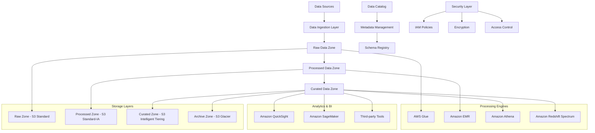
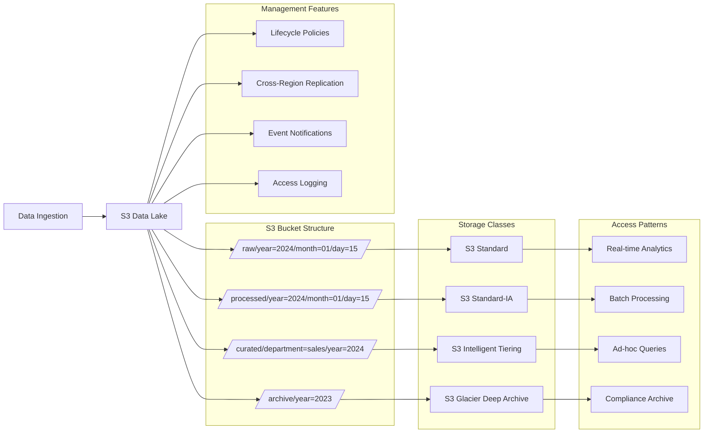
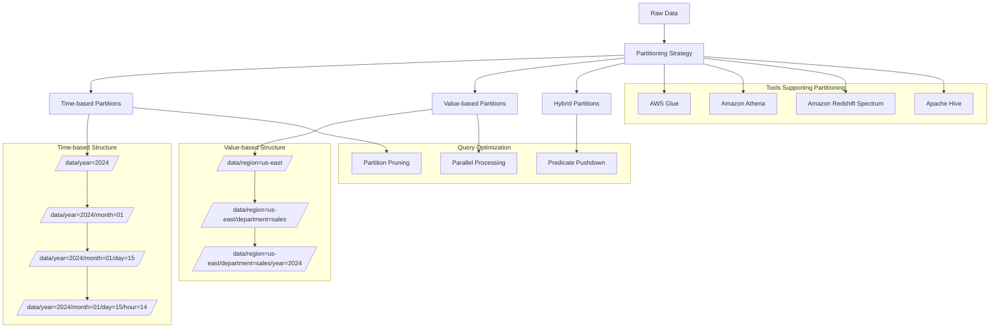
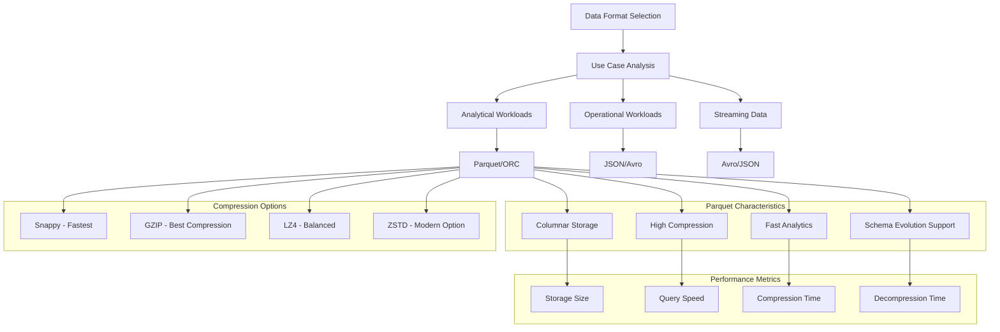
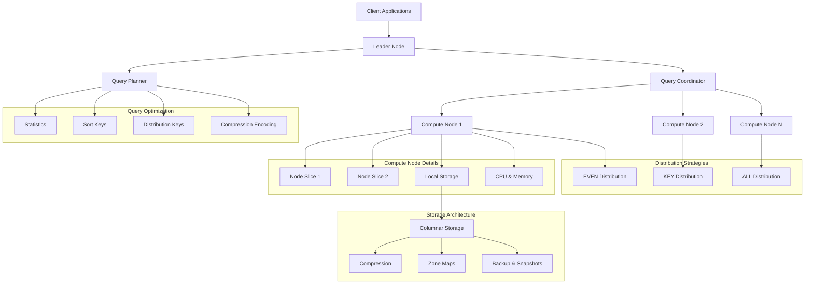
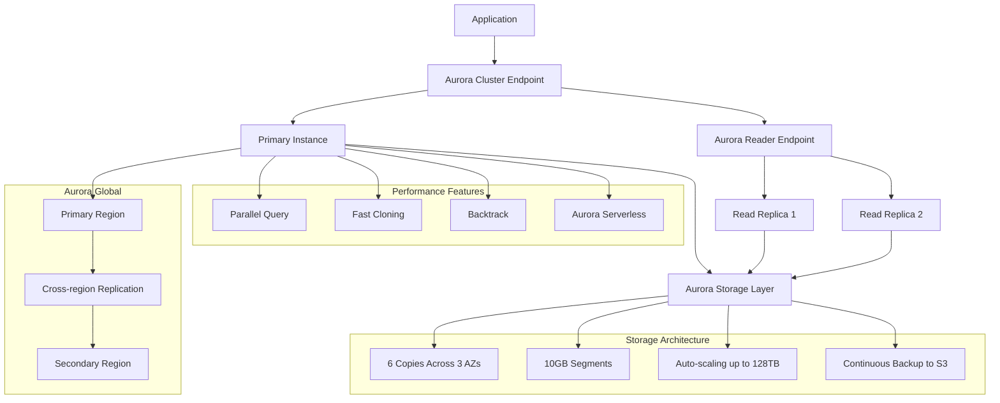
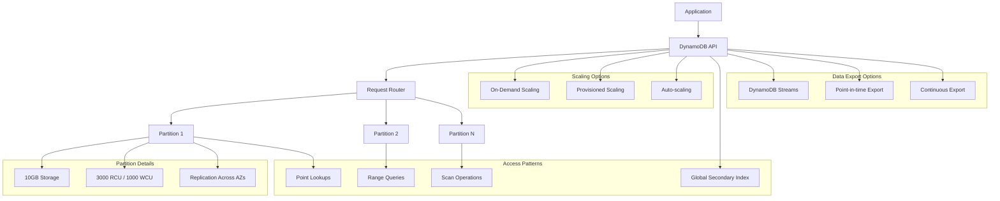
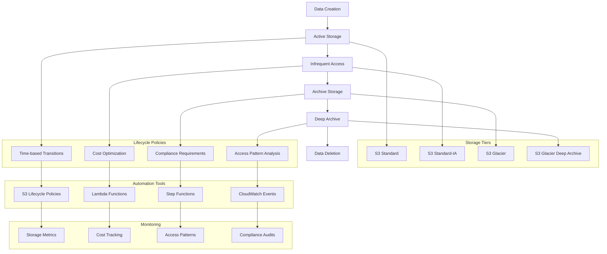
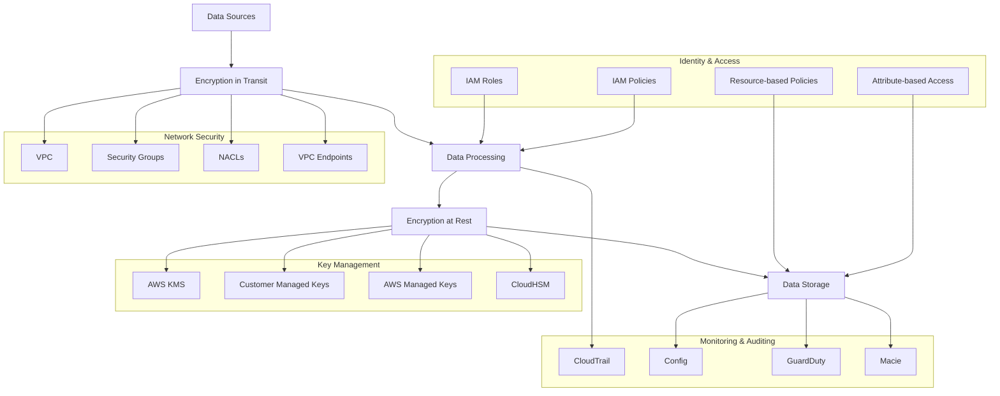

# Domain 2: Data Store Management (26%)

## Table of Contents
1. [Data Lake Architecture](#data-lake-architecture)
2. [Amazon S3 for Data Lakes](#amazon-s3-for-data-lakes)
3. [Data Partitioning Strategies](#data-partitioning-strategies)
4. [Data Formats and Compression](#data-formats-and-compression)
5. [Amazon Redshift](#amazon-redshift)
6. [Amazon RDS and Aurora](#amazon-rds-and-aurora)
7. [Amazon DynamoDB](#amazon-dynamodb)
8. [Data Lifecycle Management](#data-lifecycle-management)
9. [Data Security and Encryption](#data-security-and-encryption)
10. [Practice Questions](#practice-questions)

---

## Data Lake Architecture

### Core Principles

#### Scalability
- **Horizontal Scaling**: Add storage capacity as needed
- **Elastic Compute**: Scale processing resources independently
- **Multi-tenant**: Support multiple workloads and users

#### Flexibility
- **Schema-on-Read**: Define schema when accessing data
- **Multiple Formats**: Support structured, semi-structured, and unstructured data
- **Data Evolution**: Handle changing data requirements

#### Cost-effectiveness
- **Storage Tiers**: Use appropriate storage classes for different access patterns
- **Compute Separation**: Decouple storage and compute costs
- **Lifecycle Policies**: Automatically transition data to cheaper storage

### Data Lake Architecture Patterns



### Data Lake Zones

#### Raw Zone (Bronze)
- **Purpose**: Store data in original format
- **Characteristics**: Immutable, schema-less, high volume
- **Storage**: S3 Standard with versioning
- **Retention**: Long-term (years)

#### Processed Zone (Silver)
- **Purpose**: Cleaned and validated data
- **Characteristics**: Quality checked, standardized format
- **Storage**: S3 Standard-IA or Intelligent Tiering
- **Retention**: Medium-term (months to years)

#### Curated Zone (Gold)
- **Purpose**: Business-ready analytical datasets
- **Characteristics**: Aggregated, enriched, optimized for queries
- **Storage**: S3 Intelligent Tiering
- **Retention**: Based on business requirements

---

## Amazon S3 for Data Lakes

### Storage Classes

#### S3 Standard
- **Use Case**: Frequently accessed data
- **Availability**: 99.99%
- **Durability**: 99.999999999% (11 9's)
- **Cost**: Higher storage, lower retrieval costs

#### S3 Standard-IA (Infrequent Access)
- **Use Case**: Less frequently accessed data
- **Minimum Storage Duration**: 30 days
- **Retrieval Fee**: Per GB retrieved
- **Cost**: Lower storage, higher retrieval costs

#### S3 Intelligent Tiering
- **Use Case**: Data with unknown or changing access patterns
- **Automatic Tiering**: Moves data between tiers based on access patterns
- **Monitoring Fee**: Small monthly fee per object
- **Cost**: Optimizes costs automatically

#### S3 Glacier
- **Use Case**: Long-term archival
- **Retrieval Time**: Minutes to hours
- **Minimum Storage Duration**: 90 days
- **Cost**: Very low storage cost

### S3 Data Lake Architecture



### S3 Performance Optimization

#### Request Patterns
- **Hot Spotting**: Avoid sequential naming patterns
- **Request Distribution**: Use random prefixes for high request rates
- **Multipart Upload**: For objects larger than 100MB

#### Transfer Acceleration
- **CloudFront**: Use edge locations for faster uploads
- **Transfer Acceleration**: Direct uploads to edge locations
- **VPC Endpoints**: Avoid internet gateway for VPC-based access

### Example S3 Lifecycle Policy

```json
{
    "Rules": [
        {
            "ID": "DataLakeLifecycle",
            "Status": "Enabled",
            "Filter": {
                "Prefix": "raw/"
            },
            "Transitions": [
                {
                    "Days": 30,
                    "StorageClass": "STANDARD_IA"
                },
                {
                    "Days": 90,
                    "StorageClass": "GLACIER"
                },
                {
                    "Days": 365,
                    "StorageClass": "DEEP_ARCHIVE"
                }
            ]
        },
        {
            "ID": "ProcessedDataLifecycle",
            "Status": "Enabled",
            "Filter": {
                "Prefix": "processed/"
            },
            "Transitions": [
                {
                    "Days": 60,
                    "StorageClass": "STANDARD_IA"
                },
                {
                    "Days": 180,
                    "StorageClass": "GLACIER"
                }
            ]
        }
    ]
}
```

---

## Data Partitioning Strategies

### Partitioning Benefits

#### Query Performance
- **Partition Pruning**: Skip irrelevant data during queries
- **Parallel Processing**: Process partitions in parallel
- **Reduced I/O**: Read only necessary data

#### Cost Optimization
- **Data Skipping**: Avoid scanning unnecessary data
- **Storage Optimization**: Better compression within partitions
- **Compute Efficiency**: Reduce processing time and costs

### Partitioning Patterns

#### Time-based Partitioning
- **Hierarchical**: year/month/day/hour
- **Use Cases**: Time-series data, log files, IoT data
- **Benefits**: Natural query patterns, easy lifecycle management

#### Value-based Partitioning
- **Categorical**: department, region, product_category
- **Use Cases**: Business entity data, multi-tenant systems
- **Benefits**: Business-aligned queries, security boundaries

### Partitioning Architecture



### Best Practices

#### Partition Size
- **Optimal Size**: 128MB to 1GB per partition
- **Avoid Small Files**: Combine small files to reduce metadata overhead
- **Avoid Large Files**: Split large files for better parallelism

#### Partition Keys
- **Query Patterns**: Choose keys based on common query filters
- **Cardinality**: Balance between too few and too many partitions
- **Data Distribution**: Ensure even distribution across partitions

---

## Data Formats and Compression

### File Formats

#### Parquet
- **Type**: Columnar storage format
- **Benefits**: Excellent compression, fast analytical queries
- **Use Cases**: OLAP workloads, data warehousing
- **Compression**: Snappy, GZIP, LZO

#### ORC (Optimized Row Columnar)
- **Type**: Columnar storage format optimized for Hive
- **Benefits**: High compression, predicate pushdown
- **Use Cases**: Hadoop ecosystems, Hive tables
- **Features**: Built-in indexing, type-aware encoding

#### Avro
- **Type**: Row-oriented format with schema evolution
- **Benefits**: Schema evolution, compact binary format
- **Use Cases**: Streaming data, schema evolution scenarios
- **Features**: Schema registry integration

#### JSON
- **Type**: Text-based format
- **Benefits**: Human-readable, flexible schema
- **Use Cases**: Semi-structured data, APIs
- **Drawbacks**: Larger file sizes, slower queries

### Format Comparison Architecture



### Compression Strategies

#### Compression Algorithms
- **Snappy**: Fast compression/decompression, moderate compression ratio
- **GZIP**: Good compression ratio, slower than Snappy
- **LZ4**: Very fast, good for real-time processing
- **ZSTD**: Modern algorithm with excellent compression and speed

#### Compression Selection
- **Storage-bound**: Use GZIP for maximum compression
- **CPU-bound**: Use Snappy for faster processing
- **Balanced**: Use LZ4 or ZSTD for good compression and speed

### Example: Converting Data Formats with Glue

```python
import sys
from awsglue.transforms import *
from awsglue.utils import getResolvedOptions
from pyspark.context import SparkContext
from awsglue.context import GlueContext
from awsglue.job import Job

args = getResolvedOptions(sys.argv, ['JOB_NAME'])
sc = SparkContext()
glueContext = GlueContext(sc)
spark = glueContext.spark_session
job = Job(glueContext)
job.init(args['JOB_NAME'], args)

# Read JSON data
json_dynamic_frame = glueContext.create_dynamic_frame.from_options(
    connection_type="s3",
    connection_options={"paths": ["s3://data-lake/raw/json/"]},
    format="json"
)

# Convert to Parquet with partitioning
glueContext.write_dynamic_frame.from_options(
    frame=json_dynamic_frame,
    connection_type="s3",
    connection_options={
        "path": "s3://data-lake/processed/parquet/",
        "partitionKeys": ["year", "month", "day"]
    },
    format="parquet",
    format_options={
        "compression": "snappy"
    }
)

job.commit()
```

---

## Amazon Redshift

### Architecture Overview

#### Cluster Components
- **Leader Node**: Query planning and coordination
- **Compute Nodes**: Data storage and query execution
- **Node Slices**: Parallel processing units

#### Distribution Styles
- **EVEN**: Round-robin distribution
- **KEY**: Distribute based on column values
- **ALL**: Replicate table to all nodes

### Redshift Architecture



### Performance Optimization

#### Table Design
- **Distribution Keys**: Choose keys that minimize data movement
- **Sort Keys**: Optimize for common query patterns
- **Compression**: Use appropriate encoding for each column

#### Query Optimization
- **VACUUM**: Reclaim space and re-sort data
- **ANALYZE**: Update table statistics
- **Query Plans**: Review and optimize query execution plans

### Redshift Spectrum

#### Architecture
- **Compute in Redshift**: Process data stored in S3
- **Metadata in Glue**: Use Glue Data Catalog for external tables
- **Cost Efficiency**: Pay only for queries run

#### Use Cases
- **Data Lake Queries**: Query S3 data directly
- **Historical Data**: Access archived data without loading
- **Data Exploration**: Analyze data before loading

### Example Redshift Table Optimization

```sql
-- Create optimized table
CREATE TABLE sales_fact (
    sale_id BIGINT NOT NULL,
    customer_id INTEGER NOT NULL,
    product_id INTEGER NOT NULL,
    sale_date DATE NOT NULL,
    quantity INTEGER NOT NULL,
    amount DECIMAL(10,2) NOT NULL
)
DISTKEY(customer_id)    -- Distribute by customer for joins
SORTKEY(sale_date)      -- Sort by date for time-based queries
;

-- Create external table for Spectrum
CREATE EXTERNAL TABLE external_sales (
    sale_id BIGINT,
    customer_id INTEGER,
    product_id INTEGER,
    sale_date DATE,
    quantity INTEGER,
    amount DECIMAL(10,2)
)
STORED AS PARQUET
LOCATION 's3://data-lake/sales/'
TABLE PROPERTIES ('has_encrypted_data'='false');
```

---

## Amazon RDS and Aurora

### RDS for Transactional Workloads

#### Engine Options
- **MySQL/MariaDB**: Open source, web applications
- **PostgreSQL**: Advanced features, JSON support
- **Oracle**: Enterprise applications
- **SQL Server**: Microsoft ecosystem

#### High Availability
- **Multi-AZ**: Synchronous replication for failover
- **Read Replicas**: Asynchronous replication for read scaling
- **Automated Backups**: Point-in-time recovery

### Aurora Architecture



### Aurora Serverless

#### Use Cases
- **Variable Workloads**: Applications with unpredictable traffic
- **Development/Testing**: Cost-effective for non-production environments
- **Intermittent Applications**: Applications used infrequently

#### Features
- **Auto-scaling**: Automatically adjusts capacity
- **Pay-per-use**: No cost when not in use
- **Instant Scaling**: Sub-second scaling response

### Data API for Aurora Serverless

```python
import boto3
import json

# Initialize RDS Data API client
rds_client = boto3.client('rds-data')

# Execute SQL query
response = rds_client.execute_statement(
    resourceArn='arn:aws:rds:region:account:cluster:cluster-name',
    secretArn='arn:aws:secretsmanager:region:account:secret:secret-name',
    database='mydatabase',
    sql='SELECT customer_id, COUNT(*) as order_count FROM orders GROUP BY customer_id'
)

# Process results
for record in response['records']:
    customer_id = record[0]['longValue']
    order_count = record[1]['longValue']
    print(f"Customer {customer_id}: {order_count} orders")
```

---

## Amazon DynamoDB

### Core Concepts

#### Tables and Items
- **Tables**: Collections of items
- **Items**: Records with attributes
- **Attributes**: Name-value pairs

#### Primary Keys
- **Partition Key**: Single attribute for data distribution
- **Composite Key**: Partition key + sort key for sorting

### DynamoDB Architecture



### Access Patterns

#### Primary Key Access
- **Get Item**: Single item retrieval
- **Query**: Items with same partition key
- **Batch Operations**: Multiple items in single request

#### Secondary Indexes
- **Global Secondary Index**: Different partition/sort key
- **Local Secondary Index**: Same partition key, different sort key

### DynamoDB for Analytics

#### DynamoDB Streams
- **Change Data Capture**: Track all changes to items
- **Real-time Processing**: Trigger Lambda functions
- **Analytics Integration**: Stream changes to data lake

#### Point-in-time Export
- **S3 Export**: Export table data to S3
- **No Performance Impact**: Doesn't affect table performance
- **Analytics Ready**: Exported in DynamoDB JSON or Ion format

### Example: DynamoDB to Data Lake Pipeline

```python
import boto3
import json
from datetime import datetime

def lambda_handler(event, context):
    s3_client = boto3.client('s3')
    
    for record in event['Records']:
        # Parse DynamoDB stream record
        event_name = record['eventName']
        dynamodb_record = record['dynamodb']
        
        # Extract key information
        keys = dynamodb_record.get('Keys', {})
        new_image = dynamodb_record.get('NewImage', {})
        
        # Transform to analytics format
        analytics_record = {
            'event_type': event_name,
            'timestamp': datetime.utcnow().isoformat(),
            'partition_key': keys.get('pk', {}).get('S'),
            'sort_key': keys.get('sk', {}).get('S'),
            'data': simplify_dynamodb_json(new_image)
        }
        
        # Store in S3 data lake
        s3_key = f"dynamodb-changes/{datetime.now().strftime('%Y/%m/%d')}/{context.aws_request_id}.json"
        s3_client.put_object(
            Bucket='data-lake-bucket',
            Key=s3_key,
            Body=json.dumps(analytics_record)
        )
    
    return {'statusCode': 200}

def simplify_dynamodb_json(dynamodb_json):
    """Convert DynamoDB JSON to simple JSON"""
    simplified = {}
    for key, value in dynamodb_json.items():
        if 'S' in value:
            simplified[key] = value['S']
        elif 'N' in value:
            simplified[key] = float(value['N'])
        elif 'B' in value:
            simplified[key] = value['B']
        # Add other type conversions as needed
    return simplified
```

---

## Data Lifecycle Management

### Lifecycle Stages

#### Data Creation
- **Ingestion**: Initial data capture
- **Validation**: Quality checks and schema validation
- **Cataloging**: Metadata registration

#### Data Usage
- **Active Access**: Frequent queries and processing
- **Analytics**: Business intelligence and reporting
- **Machine Learning**: Model training and inference

#### Data Aging
- **Archival**: Move to cheaper storage
- **Compression**: Reduce storage costs
- **Deletion**: Remove data at end of life

### Lifecycle Management Architecture



### Compliance and Governance

#### Data Retention Policies
- **Legal Requirements**: Industry-specific retention periods
- **Business Needs**: Operational data requirements
- **Cost Optimization**: Balance retention with storage costs

#### Data Governance
- **Data Classification**: Sensitivity levels and handling requirements
- **Access Controls**: Who can access what data
- **Audit Trails**: Track data access and modifications

### Example Comprehensive Lifecycle Policy

```json
{
    "Rules": [
        {
            "ID": "ComprehensiveLifecycle",
            "Status": "Enabled",
            "Filter": {
                "And": {
                    "Prefix": "data/",
                    "Tags": [
                        {
                            "Key": "DataClass",
                            "Value": "Operational"
                        }
                    ]
                }
            },
            "Transitions": [
                {
                    "Days": 30,
                    "StorageClass": "STANDARD_IA"
                },
                {
                    "Days": 90,
                    "StorageClass": "GLACIER"
                },
                {
                    "Days": 365,
                    "StorageClass": "DEEP_ARCHIVE"
                }
            ],
            "Expiration": {
                "Days": 2555  // 7 years for compliance
            },
            "NoncurrentVersionTransitions": [
                {
                    "NoncurrentDays": 30,
                    "StorageClass": "STANDARD_IA"
                }
            ],
            "NoncurrentVersionExpiration": {
                "NoncurrentDays": 365
            }
        }
    ]
}
```

---

## Data Security and Encryption

### Encryption Strategies

#### Encryption at Rest
- **S3 Server-side Encryption**: SSE-S3, SSE-KMS, SSE-C
- **Database Encryption**: RDS/Aurora, DynamoDB, Redshift
- **EBS Encryption**: For EC2-based data processing

#### Encryption in Transit
- **HTTPS/TLS**: All data transfer encrypted
- **VPC Endpoints**: Private connectivity without internet
- **Database Connections**: SSL/TLS for database communications

### Security Architecture



### Access Control Patterns

#### Role-based Access
- **IAM Roles**: Service-to-service access
- **Cross-account Access**: Resource sharing between accounts
- **Temporary Credentials**: STS for short-term access

#### Attribute-based Access
- **Tags**: Resource-level access control
- **Conditions**: Context-aware access decisions
- **Dynamic Policies**: Policies that adapt to conditions

### Example KMS Key Policy for Data Lake

```json
{
    "Version": "2012-10-17",
    "Statement": [
        {
            "Sid": "EnableDataEngineersAccess",
            "Effect": "Allow",
            "Principal": {
                "AWS": "arn:aws:iam::123456789012:role/DataEngineerRole"
            },
            "Action": [
                "kms:Encrypt",
                "kms:Decrypt",
                "kms:ReEncrypt*",
                "kms:GenerateDataKey*",
                "kms:DescribeKey"
            ],
            "Resource": "*",
            "Condition": {
                "StringEquals": {
                    "kms:ViaService": [
                        "s3.us-east-1.amazonaws.com",
                        "glue.us-east-1.amazonaws.com"
                    ]
                }
            }
        },
        {
            "Sid": "EnableAnalystReadAccess",
            "Effect": "Allow",
            "Principal": {
                "AWS": "arn:aws:iam::123456789012:role/DataAnalystRole"
            },
            "Action": [
                "kms:Decrypt",
                "kms:DescribeKey"
            ],
            "Resource": "*",
            "Condition": {
                "StringEquals": {
                    "kms:ViaService": "s3.us-east-1.amazonaws.com"
                },
                "StringLike": {
                    "kms:EncryptionContext:aws:s3:arn": [
                        "arn:aws:s3:::data-lake/curated/*"
                    ]
                }
            }
        }
    ]
}
```

---

## Practice Questions

### Question 1: Data Lake Storage Strategy
A company needs to store 10TB of log data daily for a data lake. The data is actively queried for 30 days, occasionally accessed for 6 months, and rarely accessed afterwards but must be retained for 7 years for compliance. What storage strategy should you implement?

A) Store all data in S3 Standard for consistent performance
B) Use S3 Intelligent Tiering for automatic cost optimization
C) Implement lifecycle policies with Standard → Standard-IA → Glacier → Deep Archive
D) Use S3 Standard-IA for all data to reduce costs

**Answer: C**
**Explanation**: Lifecycle policies automate transitions: S3 Standard for 30 days (active access), Standard-IA for 6 months (occasional access), Glacier for archival, and Deep Archive for long-term compliance retention.

### Question 2: Redshift Performance Optimization
A Redshift cluster frequently runs queries that join customer and order tables on customer_id. The cluster experiences performance issues during peak hours. What optimization should you implement?

A) Increase the number of compute nodes
B) Use customer_id as distribution key for both tables and sort key for orders
C) Create additional indexes on both tables
D) Enable auto-scaling for the cluster

**Answer: B**
**Explanation**: Using customer_id as the distribution key for both tables minimizes data movement during joins. Adding it as a sort key for the frequently filtered orders table improves query performance.

### Question 3: DynamoDB Analytics Integration
You need to analyze DynamoDB data in near real-time for fraud detection while maintaining high performance for the operational application. What approach should you use?

A) Scan the DynamoDB table periodically for analysis
B) Use DynamoDB Streams to capture changes and process with Lambda
C) Export DynamoDB data to S3 daily for analysis
D) Create read replicas for analytical queries

**Answer: B**
**Explanation**: DynamoDB Streams provide real-time change data capture without affecting operational performance, enabling near real-time fraud detection through Lambda processing.

### Question 4: Data Format Selection
A data engineering team needs to store customer transaction data that will be primarily used for analytical queries aggregating sales by region and time period. The data schema may evolve over time. What file format should they choose?

A) JSON for flexibility and schema evolution
B) CSV for simplicity and broad compatibility
C) Parquet for analytical performance and schema evolution
D) Avro for schema evolution and streaming compatibility

**Answer: C**
**Explanation**: Parquet's columnar format is optimized for analytical queries (aggregations), provides excellent compression, and supports schema evolution, making it ideal for this use case.

### Question 5: S3 Lifecycle Management
A data lake stores raw sensor data that is processed into aggregated daily reports. Raw data is accessed frequently for 7 days, occasionally for 30 days, and only for compliance audits after that. Daily reports are accessed regularly for 90 days. What lifecycle strategy should you implement?

A) Apply the same lifecycle policy to both raw and processed data
B) Use different lifecycle policies optimized for each data type's access pattern
C) Store all data in S3 Intelligent Tiering
D) Use S3 Standard-IA for all data to minimize costs

**Answer: B**
**Explanation**: Raw data and processed reports have different access patterns and should have separate lifecycle policies optimized for their specific usage patterns to minimize costs while maintaining performance.

### Question 6: Aurora Serverless Use Case
A development team needs a database for testing new features. The database is used intensively for 2-3 hours daily during testing but idle otherwise. The data size varies from 100MB to 10GB depending on the test scenario. What database solution should you recommend?

A) RDS PostgreSQL with auto-scaling
B) Aurora Serverless v2 with scaling configuration
C) DynamoDB On-Demand for variable workloads
D) Aurora Provisioned with smallest instance

**Answer: B**
**Explanation**: Aurora Serverless v2 automatically scales compute capacity based on demand and can scale to zero when idle, making it cost-effective for variable development workloads.

### Question 7: Data Partitioning Strategy
A data lake stores e-commerce transaction data with queries typically filtering by transaction_date (80% of queries), customer_region (60% of queries), and product_category (40% of queries). What partitioning strategy should you implement?

A) Partition by transaction_date only
B) Partition by customer_region only
C) Partition by transaction_date and customer_region
D) Partition by transaction_date, customer_region, and product_category

**Answer: C**
**Explanation**: Partitioning by the two most commonly filtered columns (transaction_date and customer_region) provides maximum query optimization benefit without creating too many small partitions.

### Question 8: Encryption Strategy
A financial services company needs to store customer transaction data with strict encryption requirements. They need separate encryption keys for different data classifications and want to maintain full control over key rotation. What encryption strategy should they implement?

A) Use S3 server-side encryption with Amazon S3-managed keys (SSE-S3)
B) Use S3 server-side encryption with KMS customer-managed keys (SSE-KMS)
C) Use client-side encryption with customer-managed keys
D) Use S3 server-side encryption with customer-provided keys (SSE-C)

**Answer: B**
**Explanation**: KMS customer-managed keys provide full control over key policies, rotation, and audit trails while supporting different keys for different data classifications, meeting financial services requirements.

### Question 9: Multi-Region Data Strategy
A global company needs to store and process customer data in multiple regions for performance and compliance. They need cross-region analytics capabilities while maintaining data sovereignty. What architecture should they implement?

A) Single data lake with cross-region replication
B) Regional data lakes with federated query capabilities
C) Global data lake in a single region with regional caching
D) Separate data lakes per region with manual data aggregation

**Answer: B**
**Explanation**: Regional data lakes maintain data sovereignty while federated query capabilities (using services like Athena or Redshift Spectrum) enable cross-region analytics when permitted.

### Question 10: Data Quality Monitoring
You need to implement automated data quality monitoring for a data pipeline that processes customer orders. The pipeline should detect anomalies in order volumes, identify incomplete records, and alert on data freshness issues. What approach should you implement?

A) Custom CloudWatch metrics with manual threshold setting
B) AWS Glue Data Quality with automated anomaly detection
C) Lambda functions for custom quality checks
D) Amazon Macie for data discovery and classification

**Answer: B**
**Explanation**: AWS Glue Data Quality provides comprehensive data quality monitoring including automated anomaly detection, completeness checks, and freshness monitoring with built-in alerting capabilities.

---

## Official Documentation Links

### Amazon S3
- [S3 Developer Guide](https://docs.aws.amazon.com/s3/latest/dev/)
- [S3 Storage Classes](https://docs.aws.amazon.com/s3/latest/dev/storage-class-intro.html)
- [S3 Lifecycle Management](https://docs.aws.amazon.com/s3/latest/dev/object-lifecycle-mgmt.html)

### Amazon Redshift
- [Redshift Database Developer Guide](https://docs.aws.amazon.com/redshift/latest/dg/)
- [Redshift Spectrum](https://docs.aws.amazon.com/redshift/latest/dg/c-using-spectrum.html)
- [Redshift Performance Tuning](https://docs.aws.amazon.com/redshift/latest/dg/c-optimizing-query-performance.html)

### Amazon Aurora
- [Aurora User Guide](https://docs.aws.amazon.com/AmazonRDS/latest/AuroraUserGuide/)
- [Aurora Serverless](https://docs.aws.amazon.com/AmazonRDS/latest/AuroraUserGuide/aurora-serverless.html)

### Amazon DynamoDB
- [DynamoDB Developer Guide](https://docs.aws.amazon.com/amazondynamodb/latest/developerguide/)
- [DynamoDB Streams](https://docs.aws.amazon.com/amazondynamodb/latest/developerguide/Streams.html)

This comprehensive guide covers all aspects of data store management for the AWS Data Engineer Associate certification, providing practical implementation guidance and best practices for each storage service.
