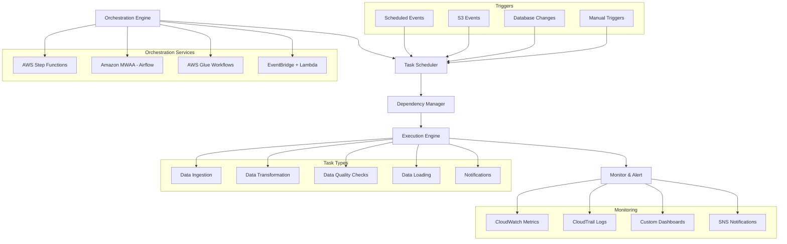
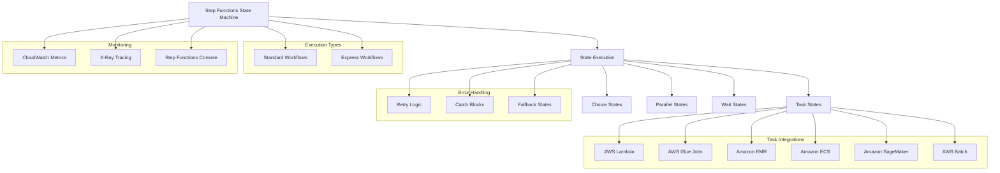
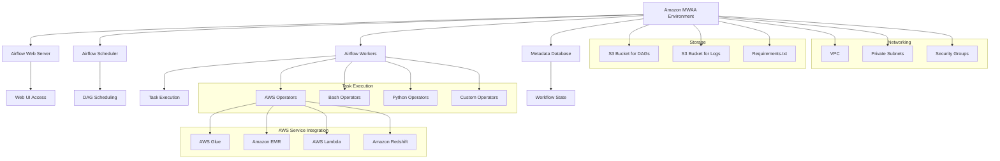
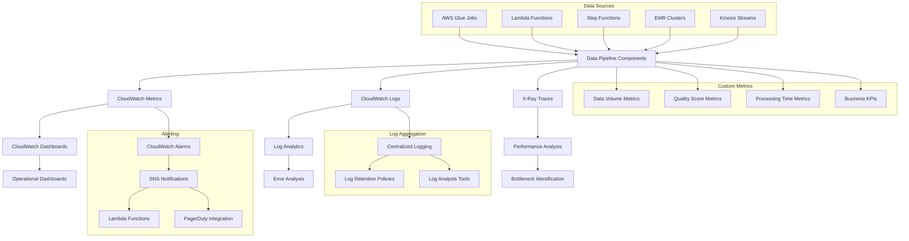
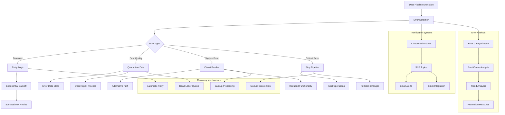
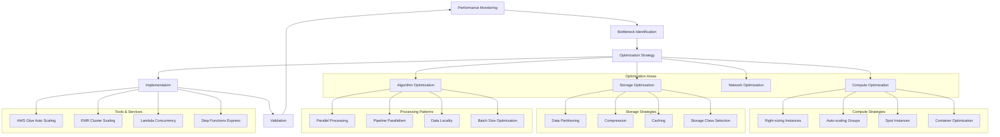
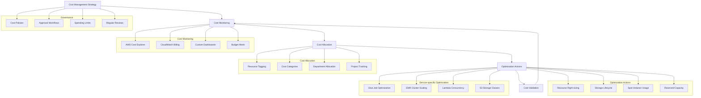
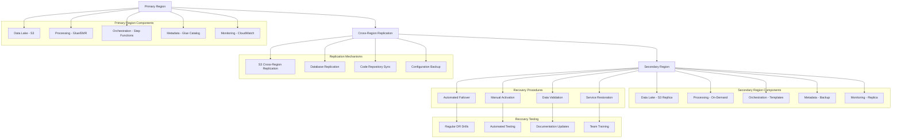

# Domain 3: Data Operations and Support (22%)

## Table of Contents
1. [Data Pipeline Orchestration](#data-pipeline-orchestration)
2. [AWS Step Functions](#aws-step-functions)
3. [Amazon MWAA (Managed Apache Airflow)](#amazon-mwaa)
4. [Monitoring and Logging](#monitoring-and-logging)
5. [Error Handling and Recovery](#error-handling-and-recovery)
6. [Performance Optimization](#performance-optimization)
7. [Cost Management](#cost-management)
8. [Data Pipeline Testing](#data-pipeline-testing)
9. [Disaster Recovery](#disaster-recovery)
10. [Practice Questions](#practice-questions)

---

## Data Pipeline Orchestration

### Orchestration Fundamentals

#### Workflow Management
- **Task Dependencies**: Define execution order and prerequisites
- **Parallel Execution**: Run independent tasks concurrently
- **Conditional Logic**: Execute tasks based on conditions
- **Error Handling**: Manage failures and retries

#### Scheduling Patterns
- **Time-based Triggers**: Cron expressions, fixed schedules
- **Event-driven Triggers**: File arrivals, API calls, queue messages
- **Data-driven Triggers**: Based on data availability or quality thresholds

### Orchestration Architecture



### Orchestration Patterns

#### Sequential Processing
- **Use Case**: Tasks must run in specific order
- **Example**: Extract → Transform → Load (ETL)
- **Benefits**: Simple logic, guaranteed ordering

#### Parallel Processing
- **Use Case**: Independent tasks can run concurrently
- **Example**: Multiple data source ingestion
- **Benefits**: Reduced total execution time

#### Conditional Branching
- **Use Case**: Different paths based on conditions
- **Example**: Different processing for file types
- **Benefits**: Flexible workflow logic

#### Scatter-Gather
- **Use Case**: Process multiple items, then aggregate results
- **Example**: Process multiple partitions, then combine
- **Benefits**: Parallel processing with aggregation

---

## AWS Step Functions

### Core Components

#### States
- **Task States**: Execute work (Lambda, ECS, Glue, EMR)
- **Choice States**: Conditional branching
- **Parallel States**: Concurrent execution
- **Wait States**: Delay execution

#### State Language
- **Amazon States Language (ASL)**: JSON-based workflow definition
- **Visual Workflow Designer**: Drag-and-drop interface
- **CloudFormation Integration**: Infrastructure as code

### Step Functions Architecture



### Data Pipeline with Step Functions

#### Standard vs Express Workflows
- **Standard**: Long-running, exactly-once execution, full history
- **Express**: High-volume, at-least-once execution, limited history
- **Use Cases**: Standard for ETL, Express for real-time processing

### Example Step Functions State Machine for Data Pipeline

```json
{
  "Comment": "Data Pipeline Orchestration",
  "StartAt": "DataQualityCheck",
  "States": {
    "DataQualityCheck": {
      "Type": "Task",
      "Resource": "arn:aws:states:::lambda:invoke",
      "Parameters": {
        "FunctionName": "data-quality-check",
        "Payload": {
          "bucket.$": "$.bucket",
          "key.$": "$.key"
        }
      },
      "Retry": [
        {
          "ErrorEquals": ["States.TaskFailed"],
          "IntervalSeconds": 30,
          "MaxAttempts": 3,
          "BackoffRate": 2.0
        }
      ],
      "Catch": [
        {
          "ErrorEquals": ["States.ALL"],
          "Next": "NotifyFailure"
        }
      ],
      "Next": "CheckQualityResult"
    },
    "CheckQualityResult": {
      "Type": "Choice",
      "Choices": [
        {
          "Variable": "$.qualityScore",
          "NumericGreaterThan": 0.8,
          "Next": "ParallelProcessing"
        }
      ],
      "Default": "QuarantineData"
    },
    "ParallelProcessing": {
      "Type": "Parallel",
      "Branches": [
        {
          "StartAt": "GlueETLJob",
          "States": {
            "GlueETLJob": {
              "Type": "Task",
              "Resource": "arn:aws:states:::glue:startJobRun.sync",
              "Parameters": {
                "JobName": "customer-data-etl",
                "Arguments": {
                  "--input-path.$": "$.inputPath",
                  "--output-path.$": "$.outputPath"
                }
              },
              "End": true
            }
          }
        },
        {
          "StartAt": "UpdateCatalog",
          "States": {
            "UpdateCatalog": {
              "Type": "Task",
              "Resource": "arn:aws:states:::lambda:invoke",
              "Parameters": {
                "FunctionName": "update-glue-catalog"
              },
              "End": true
            }
          }
        }
      ],
      "Next": "NotifySuccess"
    },
    "QuarantineData": {
      "Type": "Task",
      "Resource": "arn:aws:states:::lambda:invoke",
      "Parameters": {
        "FunctionName": "quarantine-data"
      },
      "Next": "NotifyQuarantine"
    },
    "NotifySuccess": {
      "Type": "Task",
      "Resource": "arn:aws:states:::sns:publish",
      "Parameters": {
        "TopicArn": "arn:aws:sns:region:account:pipeline-success",
        "Message": "Data pipeline completed successfully"
      },
      "End": true
    },
    "NotifyFailure": {
      "Type": "Task",
      "Resource": "arn:aws:states:::sns:publish",
      "Parameters": {
        "TopicArn": "arn:aws:sns:region:account:pipeline-failure",
        "Message": "Data pipeline failed"
      },
      "End": true
    },
    "NotifyQuarantine": {
      "Type": "Task",
      "Resource": "arn:aws:states:::sns:publish",
      "Parameters": {
        "TopicArn": "arn:aws:sns:region:account:data-quality-alert",
        "Message": "Data quality below threshold - data quarantined"
      },
      "End": true
    }
  }
}
```

---

## Amazon MWAA (Managed Apache Airflow)

### Apache Airflow Concepts

#### DAGs (Directed Acyclic Graphs)
- **Definition**: Workflow definitions in Python
- **Tasks**: Individual units of work
- **Dependencies**: Task execution order
- **Operators**: Task implementations

#### Key Components
- **Scheduler**: Triggers DAG runs
- **Executor**: Runs tasks
- **Web Server**: UI for monitoring
- **Metadata Database**: Stores workflow state

### MWAA Architecture



### MWAA Benefits

#### Managed Service
- **Infrastructure Management**: AWS handles infrastructure
- **Auto-scaling**: Workers scale based on demand
- **High Availability**: Multi-AZ deployment
- **Security**: VPC isolation and IAM integration

#### Native AWS Integration
- **AWS Operators**: Pre-built operators for AWS services
- **IAM Roles**: Secure service-to-service communication
- **CloudWatch**: Integrated logging and monitoring

### Example Airflow DAG for Data Pipeline

```python
from datetime import datetime, timedelta
from airflow import DAG
from airflow.providers.amazon.aws.operators.glue import GlueJobOperator
from airflow.providers.amazon.aws.operators.s3 import S3CheckOperator
from airflow.providers.amazon.aws.sensors.s3 import S3KeySensor
from airflow.providers.amazon.aws.operators.lambda_function import LambdaInvokeFunctionOperator
from airflow.operators.python import PythonOperator

default_args = {
    'owner': 'data-engineering',
    'depends_on_past': False,
    'start_date': datetime(2024, 1, 1),
    'email_on_failure': True,
    'email_on_retry': False,
    'retries': 2,
    'retry_delay': timedelta(minutes=5)
}

dag = DAG(
    'customer_data_pipeline',
    default_args=default_args,
    description='Process customer data daily',
    schedule_interval='0 6 * * *',  # Daily at 6 AM
    catchup=False,
    max_active_runs=1
)

# Check if input file exists
check_input_file = S3KeySensor(
    task_id='check_input_file',
    bucket_name='data-lake-raw',
    bucket_key='customers/{{ ds }}/customers.csv',
    timeout=3600,
    poke_interval=300,
    dag=dag
)

# Data quality validation
validate_data_quality = LambdaInvokeFunctionOperator(
    task_id='validate_data_quality',
    function_name='data-quality-validator',
    payload={
        'bucket': 'data-lake-raw',
        'key': 'customers/{{ ds }}/customers.csv'
    },
    dag=dag
)

# ETL processing
process_customer_data = GlueJobOperator(
    task_id='process_customer_data',
    job_name='customer-etl-job',
    script_args={
        '--input_path': 's3://data-lake-raw/customers/{{ ds }}/',
        '--output_path': 's3://data-lake-processed/customers/{{ ds }}/',
        '--enable-glue-datacatalog': ''
    },
    dag=dag
)

# Update data catalog
def update_catalog_partitions(**context):
    """Update Glue catalog with new partitions"""
    import boto3
    
    glue_client = boto3.client('glue')
    
    # Add partition for processed data
    response = glue_client.create_partition(
        DatabaseName='customer_db',
        TableName='processed_customers',
        PartitionInput={
            'Values': [context['ds']],
            'StorageDescriptor': {
                'Location': f"s3://data-lake-processed/customers/{context['ds']}/",
                'InputFormat': 'org.apache.hadoop.mapred.TextInputFormat',
                'OutputFormat': 'org.apache.hadoop.hive.ql.io.HiveIgnoreKeyTextOutputFormat',
                'SerdeInfo': {
                    'SerializationLibrary': 'org.apache.hadoop.hive.serde2.lazy.LazySimpleSerDe'
                }
            }
        }
    )
    
    return f"Added partition for date {context['ds']}"

update_catalog = PythonOperator(
    task_id='update_catalog',
    python_callable=update_catalog_partitions,
    dag=dag
)

# Set dependencies
check_input_file >> validate_data_quality >> process_customer_data >> update_catalog
```

### MWAA Best Practices

#### Performance Optimization
- **Worker Scaling**: Configure min/max workers appropriately
- **DAG Optimization**: Minimize DAG parsing time
- **Task Concurrency**: Use appropriate parallelism settings

#### Cost Management
- **Environment Sizing**: Right-size for workload
- **Auto-scaling**: Enable worker auto-scaling
- **Development vs Production**: Use smaller environments for development

---

## Monitoring and Logging

### Monitoring Strategy

#### Infrastructure Monitoring
- **Resource Utilization**: CPU, memory, storage, network
- **Service Health**: Availability and response times
- **Capacity Planning**: Scaling triggers and thresholds

#### Application Monitoring
- **Pipeline Execution**: Success/failure rates, duration
- **Data Quality**: Completeness, accuracy, freshness
- **Business Metrics**: Data volumes, processing latency

### Comprehensive Monitoring Architecture



### CloudWatch Integration

#### Custom Metrics
- **Business Metrics**: Data volumes, quality scores
- **Performance Metrics**: Processing times, error rates
- **Resource Metrics**: Custom resource utilization

#### Log Groups and Streams
- **Structured Logging**: JSON format for easy parsing
- **Log Retention**: Cost-effective retention policies
- **Log Insights**: Query and analyze logs

### Example CloudWatch Custom Metrics

```python
import boto3
from datetime import datetime

def publish_pipeline_metrics(pipeline_name, status, duration, record_count):
    """Publish custom metrics to CloudWatch"""
    
    cloudwatch = boto3.client('cloudwatch')
    
    # Pipeline execution status
    cloudwatch.put_metric_data(
        Namespace='DataPipeline',
        MetricData=[
            {
                'MetricName': 'PipelineExecution',
                'Dimensions': [
                    {
                        'Name': 'PipelineName',
                        'Value': pipeline_name
                    },
                    {
                        'Name': 'Status',
                        'Value': status
                    }
                ],
                'Value': 1,
                'Unit': 'Count',
                'Timestamp': datetime.utcnow()
            }
        ]
    )
    
    # Pipeline duration
    cloudwatch.put_metric_data(
        Namespace='DataPipeline',
        MetricData=[
            {
                'MetricName': 'PipelineDuration',
                'Dimensions': [
                    {
                        'Name': 'PipelineName',
                        'Value': pipeline_name
                    }
                ],
                'Value': duration,
                'Unit': 'Seconds',
                'Timestamp': datetime.utcnow()
            }
        ]
    )
    
    # Records processed
    cloudwatch.put_metric_data(
        Namespace='DataPipeline',
        MetricData=[
            {
                'MetricName': 'RecordsProcessed',
                'Dimensions': [
                    {
                        'Name': 'PipelineName',
                        'Value': pipeline_name
                    }
                ],
                'Value': record_count,
                'Unit': 'Count',
                'Timestamp': datetime.utcnow()
            }
        ]
    )

# Example usage in Lambda function
def lambda_handler(event, context):
    start_time = datetime.utcnow()
    
    try:
        # Process data
        record_count = process_data()
        
        # Calculate duration
        duration = (datetime.utcnow() - start_time).total_seconds()
        
        # Publish success metrics
        publish_pipeline_metrics(
            pipeline_name='customer-etl',
            status='SUCCESS',
            duration=duration,
            record_count=record_count
        )
        
        return {'statusCode': 200, 'body': 'Success'}
        
    except Exception as e:
        # Calculate duration
        duration = (datetime.utcnow() - start_time).total_seconds()
        
        # Publish failure metrics
        publish_pipeline_metrics(
            pipeline_name='customer-etl',
            status='FAILURE',
            duration=duration,
            record_count=0
        )
        
        raise e
```

---

## Error Handling and Recovery

### Error Handling Strategies

#### Prevention
- **Data Validation**: Input validation before processing
- **Schema Enforcement**: Ensure data conforms to expected schema
- **Resource Checks**: Verify resource availability before execution

#### Detection
- **Health Checks**: Regular service health monitoring
- **Anomaly Detection**: Automated detection of unusual patterns
- **Real-time Monitoring**: Immediate notification of failures

#### Response
- **Automated Recovery**: Self-healing mechanisms
- **Graceful Degradation**: Reduced functionality during issues
- **Human Intervention**: Escalation for complex issues

### Error Handling Architecture



### Retry Strategies

#### Exponential Backoff
- **Pattern**: Increase delay between retries exponentially
- **Use Case**: Temporary resource unavailability
- **Implementation**: Base delay * (2^attempt_number)

#### Circuit Breaker
- **Pattern**: Stop attempting after consecutive failures
- **Use Case**: Persistent downstream service failures
- **States**: Closed (normal), Open (failing), Half-open (testing)

#### Dead Letter Queues
- **Pattern**: Store failed messages for later processing
- **Use Case**: Messages that can't be processed after retries
- **Benefits**: Prevent message loss, enable manual intervention

### Example Error Handling in Step Functions

```json
{
  "Comment": "Error handling example",
  "StartAt": "ProcessData",
  "States": {
    "ProcessData": {
      "Type": "Task",
      "Resource": "arn:aws:states:::glue:startJobRun.sync",
      "Parameters": {
        "JobName": "data-processing-job"
      },
      "Retry": [
        {
          "ErrorEquals": ["Glue.ExecutionException"],
          "IntervalSeconds": 30,
          "MaxAttempts": 3,
          "BackoffRate": 2.0
        },
        {
          "ErrorEquals": ["States.TaskFailed"],
          "IntervalSeconds": 60,
          "MaxAttempts": 2,
          "BackoffRate": 1.5
        }
      ],
      "Catch": [
        {
          "ErrorEquals": ["Glue.ResourceException"],
          "Next": "HandleResourceError",
          "ResultPath": "$.error"
        },
        {
          "ErrorEquals": ["States.ALL"],
          "Next": "HandleGenericError",
          "ResultPath": "$.error"
        }
      ],
      "Next": "Success"
    },
    "HandleResourceError": {
      "Type": "Task",
      "Resource": "arn:aws:states:::lambda:invoke",
      "Parameters": {
        "FunctionName": "handle-resource-error",
        "Payload": {
          "error.$": "$.error",
          "originalInput.$": "$"
        }
      },
      "Next": "NotifyResourceError"
    },
    "HandleGenericError": {
      "Type": "Task",
      "Resource": "arn:aws:states:::lambda:invoke",
      "Parameters": {
        "FunctionName": "handle-generic-error",
        "Payload": {
          "error.$": "$.error",
          "originalInput.$": "$"
        }
      },
      "Next": "NotifyGenericError"
    },
    "NotifyResourceError": {
      "Type": "Task",
      "Resource": "arn:aws:states:::sns:publish",
      "Parameters": {
        "TopicArn": "arn:aws:sns:region:account:resource-errors",
        "Message": "Resource error in data pipeline",
        "Subject": "Data Pipeline Resource Error"
      },
      "End": true
    },
    "NotifyGenericError": {
      "Type": "Task",
      "Resource": "arn:aws:states:::sns:publish",
      "Parameters": {
        "TopicArn": "arn:aws:sns:region:account:pipeline-errors",
        "Message": "Generic error in data pipeline",
        "Subject": "Data Pipeline Error"
      },
      "End": true
    },
    "Success": {
      "Type": "Succeed"
    }
  }
}
```

---

## Performance Optimization

### Performance Metrics

#### Throughput
- **Data Volume**: Records per second, GB per hour
- **Processing Rate**: Tasks completed per unit time
- **Parallel Efficiency**: Speedup from parallelization

#### Latency
- **End-to-end Latency**: Total pipeline execution time
- **Stage Latency**: Individual component processing time
- **Queue Time**: Time waiting for resources

#### Resource Utilization
- **CPU Utilization**: Processor usage efficiency
- **Memory Usage**: RAM consumption patterns
- **I/O Performance**: Disk and network throughput

### Performance Optimization Architecture



### Glue Performance Optimization

#### Resource Configuration
- **Worker Type**: G.1X, G.2X, G.025X based on workload
- **Number of Workers**: Scale based on data volume
- **Max Capacity**: Set appropriate limits for cost control

#### Job Optimization
- **Partition Pruning**: Filter partitions early
- **Predicate Pushdown**: Push filters to data source
- **Columnar Formats**: Use Parquet for analytics workloads

### Example Glue Job Optimization

```python
import sys
from awsglue.transforms import *
from awsglue.utils import getResolvedOptions
from pyspark.context import SparkContext
from awsglue.context import GlueContext
from awsglue.job import Job
from pyspark.sql.functions import *

args = getResolvedOptions(sys.argv, ['JOB_NAME', 'input_path', 'output_path'])
sc = SparkContext()
glueContext = GlueContext(sc)
spark = glueContext.spark_session
job = Job(glueContext)
job.init(args['JOB_NAME'], args)

# Optimize Spark configuration
spark.conf.set("spark.sql.adaptive.enabled", "true")
spark.conf.set("spark.sql.adaptive.coalescePartitions.enabled", "true")
spark.conf.set("spark.sql.adaptive.skewJoin.enabled", "true")

# Read data with partition pruning
df = spark.read.parquet(args['input_path']) \
    .filter(col("year") == "2024") \
    .filter(col("month") == "01")

# Optimize join operations
# Cache frequently accessed small datasets
small_df = spark.read.parquet("s3://reference-data/categories/") \
    .cache()

# Broadcast join for small lookup tables
result_df = df.join(broadcast(small_df), "category_id", "left")

# Repartition before expensive operations
result_df = result_df.repartition(200, "customer_id")

# Use column pruning
final_df = result_df.select(
    "customer_id",
    "order_date",
    "category_name",
    "total_amount"
)

# Write with optimal partitioning
final_df.write \
    .mode("overwrite") \
    .partitionBy("year", "month") \
    .parquet(args['output_path'])

job.commit()
```

---

## Cost Management

### Cost Optimization Strategies

#### Right-sizing Resources
- **Instance Types**: Choose appropriate compute resources
- **Storage Classes**: Use cost-effective storage for access patterns
- **Reserved Capacity**: Commit to long-term usage for discounts

#### Usage-based Optimization
- **Auto-scaling**: Scale resources based on demand
- **Spot Instances**: Use for fault-tolerant workloads
- **Lifecycle Management**: Archive or delete unused data

### Cost Management Architecture



### Cost Tracking and Tagging

#### Tagging Strategy
- **Environment**: Development, staging, production
- **Project**: Business project or initiative
- **Owner**: Team or individual responsible
- **Cost Center**: Billing allocation

#### Cost Allocation Tags

```python
# Example CloudFormation template with cost allocation tags
{
    "AWSTemplateFormatVersion": "2010-09-09",
    "Description": "Data pipeline resources with cost tracking",
    "Resources": {
        "DataProcessingJob": {
            "Type": "AWS::Glue::Job",
            "Properties": {
                "Name": "customer-data-etl",
                "Role": {"Ref": "GlueJobRole"},
                "Command": {
                    "Name": "glueetl",
                    "ScriptLocation": "s3://scripts/customer-etl.py"
                },
                "Tags": {
                    "Environment": "production",
                    "Project": "customer-analytics",
                    "Owner": "data-engineering",
                    "CostCenter": "analytics-department",
                    "Schedule": "daily"
                }
            }
        },
        "DataLakeBucket": {
            "Type": "AWS::S3::Bucket",
            "Properties": {
                "BucketName": "customer-data-lake",
                "LifecycleConfiguration": {
                    "Rules": [
                        {
                            "Id": "CostOptimizedLifecycle",
                            "Status": "Enabled",
                            "Transitions": [
                                {
                                    "Days": 30,
                                    "StorageClass": "STANDARD_IA"
                                },
                                {
                                    "Days": 90,
                                    "StorageClass": "GLACIER"
                                }
                            ]
                        }
                    ]
                },
                "Tags": [
                    {
                        "Key": "Environment",
                        "Value": "production"
                    },
                    {
                        "Key": "Project",
                        "Value": "customer-analytics"
                    },
                    {
                        "Key": "Owner",
                        "Value": "data-engineering"
                    },
                    {
                        "Key": "CostCenter",
                        "Value": "analytics-department"
                    }
                ]
            }
        }
    }
}
```

---

## Data Pipeline Testing

### Testing Strategies

#### Unit Testing
- **Component Testing**: Test individual pipeline components
- **Data Validation**: Test data transformation logic
- **Mock Dependencies**: Isolate components for testing

#### Integration Testing
- **End-to-end Testing**: Test complete pipeline workflows
- **Service Integration**: Test AWS service interactions
- **Data Flow Testing**: Validate data movement between stages

#### Performance Testing
- **Load Testing**: Test with expected data volumes
- **Stress Testing**: Test beyond normal capacity
- **Scalability Testing**: Test auto-scaling behavior

### Testing Architecture

```mermaid
graph TD
    A[Testing Strategy] --> B[Unit Tests]
    A --> C[Integration Tests]
    A --> D[Performance Tests]
    A --> E[Data Quality Tests]
    
    subgraph "Unit Testing"
        F[Transform Logic Tests]
        G[Validation Rule Tests]
        H[Error Handling Tests]
        I[Mock Service Tests]
    end
    
    B --> F
    B --> G
    B --> H
    B --> I
    
    subgraph "Integration Testing"
        J[End-to-end Pipeline]
        K[Service Dependencies]
        L[Data Flow Validation]
        M[Configuration Tests]
    end
    
    C --> J
    C --> K
    C --> L
    C --> M
    
    subgraph "Performance Testing"
        N[Load Testing]
        O[Stress Testing]
        P[Scalability Testing]
        Q[Latency Testing]
    end
    
    D --> N
    D --> O
    D --> P
    D --> Q
    
    subgraph "Data Quality Testing"
        R[Schema Validation]
        S[Data Completeness]
        T[Business Rule Validation]
        U[Statistical Validation]
    end
    
    E --> R
    E --> S
    E --> T
    E --> U
    
    subgraph "Testing Tools"
        V[pytest for Python]
        W[AWS Testing Frameworks]
        X[Data Quality Tools]
        Y[Performance Monitoring]
    end
    
    B --> V
    C --> W
    E --> X
    D --> Y
```



### Example Unit Tests for Data Transformation

```python
import pytest
import pandas as pd
from pyspark.sql import SparkSession
from your_pipeline.transforms import clean_customer_data, validate_email

@pytest.fixture
def spark_session():
    """Create Spark session for testing"""
    spark = SparkSession.builder \
        .appName("test") \
        .master("local[*]") \
        .getOrCreate()
    yield spark
    spark.stop()

def test_clean_customer_data(spark_session):
    """Test customer data cleaning function"""
    # Create test data
    test_data = [
        ("1", "John Doe", "john@example.com", "2024-01-01"),
        ("2", "Jane Smith", "jane@invalid", "2024-01-02"),
        ("3", "", "bob@example.com", "2024-01-03"),
        ("4", "Alice Johnson", "alice@example.com", "invalid-date")
    ]
    
    df = spark_session.createDataFrame(
        test_data, 
        ["customer_id", "name", "email", "registration_date"]
    )
    
    # Apply transformation
    cleaned_df = clean_customer_data(df)
    result = cleaned_df.collect()
    
    # Assertions
    assert len(result) == 2  # Only valid records should remain
    assert result[0]["customer_id"] == "1"
    assert result[1]["customer_id"] == "4" if "Alice" in result[1]["name"] else "1"

def test_validate_email():
    """Test email validation function"""
    assert validate_email("test@example.com") == True
    assert validate_email("invalid-email") == False
    assert validate_email("") == False
    assert validate_email(None) == False

def test_data_quality_metrics():
    """Test data quality metric calculation"""
    # Test data with known quality issues
    test_data = pd.DataFrame({
        'customer_id': [1, 2, 3, 4, 5],
        'name': ['John', '', 'Jane', 'Bob', 'Alice'],
        'email': ['john@ex.com', 'invalid', '', 'bob@ex.com', 'alice@ex.com'],
        'age': [25, 30, -5, 150, 35]
    })
    
    quality_metrics = calculate_data_quality_metrics(test_data)
    
    assert quality_metrics['completeness']['name'] == 0.8  # 4/5 records complete
    assert quality_metrics['validity']['email'] == 0.6     # 3/5 valid emails
    assert quality_metrics['validity']['age'] == 0.6       # 3/5 valid ages

@pytest.mark.integration
def test_full_pipeline_integration():
    """Integration test for complete pipeline"""
    # This would test the entire pipeline with test data
    input_path = "s3://test-bucket/input/"
    output_path = "s3://test-bucket/output/"
    
    # Run pipeline
    result = run_pipeline(input_path, output_path)
    
    # Validate results
    assert result['status'] == 'success'
    assert result['records_processed'] > 0
    assert result['data_quality_score'] > 0.8
```

---

## Disaster Recovery

### DR Planning

#### Recovery Objectives
- **Recovery Time Objective (RTO)**: Maximum acceptable downtime
- **Recovery Point Objective (RPO)**: Maximum acceptable data loss
- **Business Impact**: Critical vs non-critical systems

#### DR Strategies
- **Backup and Restore**: Cost-effective for non-critical systems
- **Pilot Light**: Minimal infrastructure always running
- **Warm Standby**: Scaled-down replica environment
- **Hot Standby**: Full duplicate environment

### Disaster Recovery Architecture



### Multi-Region Data Strategy

#### Data Replication
- **S3 Cross-Region Replication**: Automatic data replication
- **Database Replication**: RDS/Aurora cross-region replicas
- **Incremental Backups**: Regular backup to secondary region

#### Metadata Backup
- **Glue Catalog Export**: Regular metadata backups
- **Configuration Snapshots**: Infrastructure as code backups
- **Documentation Sync**: Keep DR procedures updated

### Example DR Automation Script

```python
import boto3
import json
from datetime import datetime

class DisasterRecoveryManager:
    def __init__(self, primary_region, secondary_region):
        self.primary_region = primary_region
        self.secondary_region = secondary_region
        self.primary_session = boto3.Session(region_name=primary_region)
        self.secondary_session = boto3.Session(region_name=secondary_region)
    
    def initiate_failover(self):
        """Initiate disaster recovery failover"""
        print(f"Starting DR failover from {self.primary_region} to {self.secondary_region}")
        
        # Step 1: Validate secondary region readiness
        if not self.validate_secondary_region():
            raise Exception("Secondary region not ready for failover")
        
        # Step 2: Stop primary region processing
        self.stop_primary_processing()
        
        # Step 3: Activate secondary region services
        self.activate_secondary_services()
        
        # Step 4: Update DNS routing
        self.update_dns_routing()
        
        # Step 5: Validate failover success
        if self.validate_failover():
            print("DR failover completed successfully")
            return True
        else:
            print("DR failover validation failed")
            return False
    
    def validate_secondary_region(self):
        """Validate that secondary region is ready"""
        s3_secondary = self.secondary_session.client('s3')
        glue_secondary = self.secondary_session.client('glue')
        
        # Check S3 data replication status
        try:
            response = s3_secondary.head_object(
                Bucket='data-lake-replica',
                Key='health-check/latest.json'
            )
            last_modified = response['LastModified']
            
            # Check if data is recent (within last hour)
            time_diff = datetime.now(last_modified.tzinfo) - last_modified
            if time_diff.total_seconds() > 3600:  # 1 hour
                print("Warning: Secondary data may be stale")
                return False
                
        except Exception as e:
            print(f"Error checking secondary S3 data: {e}")
            return False
        
        # Check Glue catalog replication
        try:
            databases = glue_secondary.get_databases()
            if len(databases['DatabaseList']) == 0:
                print("Error: No databases found in secondary Glue catalog")
                return False
        except Exception as e:
            print(f"Error checking secondary Glue catalog: {e}")
            return False
        
        return True
    
    def stop_primary_processing(self):
        """Stop processing in primary region"""
        # Stop Step Functions executions
        sfn_primary = self.primary_session.client('stepfunctions')
        
        # List and stop running executions
        state_machines = sfn_primary.list_state_machines()
        for sm in state_machines['stateMachines']:
            executions = sfn_primary.list_executions(
                stateMachineArn=sm['stateMachineArn'],
                statusFilter='RUNNING'
            )
            for execution in executions['executions']:
                sfn_primary.stop_execution(
                    executionArn=execution['executionArn']
                )
        
        # Stop Glue jobs
        glue_primary = self.primary_session.client('glue')
        running_jobs = glue_primary.get_job_runs(
            JobName='customer-data-etl'
        )
        for job_run in running_jobs['JobRuns']:
            if job_run['JobRunState'] == 'RUNNING':
                glue_primary.batch_stop_job_run(
                    JobName='customer-data-etl',
                    JobRunIds=[job_run['Id']]
                )
    
    def activate_secondary_services(self):
        """Activate services in secondary region"""
        # Deploy infrastructure from templates
        cf_secondary = self.secondary_session.client('cloudformation')
        
        with open('dr-infrastructure.yaml', 'r') as template_file:
            template_body = template_file.read()
        
        cf_secondary.create_stack(
            StackName='data-pipeline-dr',
            TemplateBody=template_body,
            Parameters=[
                {
                    'ParameterKey': 'Environment',
                    'ParameterValue': 'disaster-recovery'
                }
            ]
        )
        
        # Wait for stack creation
        waiter = cf_secondary.get_waiter('stack_create_complete')
        waiter.wait(StackName='data-pipeline-dr')
    
    def update_dns_routing(self):
        """Update DNS to route traffic to secondary region"""
        route53 = boto3.client('route53')
        
        # Update Route 53 health checks and weighted routing
        response = route53.change_resource_record_sets(
            HostedZoneId='Z123456789',
            ChangeBatch={
                'Changes': [
                    {
                        'Action': 'UPSERT',
                        'ResourceRecordSet': {
                            'Name': 'data-api.company.com',
                            'Type': 'CNAME',
                            'SetIdentifier': 'DR-Secondary',
                            'Weight': 100,
                            'TTL': 60,
                            'ResourceRecords': [
                                {
                                    'Value': f'data-api-{self.secondary_region}.company.com'
                                }
                            ]
                        }
                    }
                ]
            }
        )
    
    def validate_failover(self):
        """Validate that failover was successful"""
        # Test data pipeline functionality
        # Test API endpoints
        # Validate data consistency
        return True

# Usage example
if __name__ == "__main__":
    dr_manager = DisasterRecoveryManager('us-east-1', 'us-west-2')
    success = dr_manager.initiate_failover()
    
    if success:
        print("Disaster recovery failover completed successfully")
    else:
        print("Disaster recovery failover failed")
```

---

## Practice Questions

### Question 1: Step Functions vs Airflow
A data engineering team needs to orchestrate a complex data pipeline with conditional logic, parallel processing, and integration with multiple AWS services. They want minimal infrastructure management. What orchestration solution should they choose?

A) Amazon MWAA (Managed Airflow) for complex workflow logic
B) AWS Step Functions with visual workflow designer
C) AWS Glue Workflows for native AWS integration
D) Custom Lambda functions with EventBridge

**Answer: B**
**Explanation**: Step Functions provides serverless orchestration with visual workflow design, built-in AWS service integration, and supports complex conditional logic and parallel processing without infrastructure management.

### Question 2: Error Handling Strategy
A streaming data pipeline occasionally receives malformed JSON records that cause processing failures. The pipeline should continue processing valid records while handling errors appropriately. What error handling strategy should you implement?

A) Stop the entire pipeline when errors occur
B) Use dead letter queues and continue processing valid records
C) Ignore all error records and continue processing
D) Retry all records indefinitely until they succeed

**Answer: B**
**Explanation**: Dead letter queues capture failed records for later analysis and repair while allowing the pipeline to continue processing valid records, ensuring system availability.

### Question 3: Performance Optimization
A Glue ETL job processes large datasets but takes too long to complete. The job reads from S3, performs joins and aggregations, then writes back to S3. What optimization strategies should you implement?

A) Increase the number of workers only
B) Use partition pruning, predicate pushdown, and optimize file formats
C) Split the job into smaller sequential jobs
D) Use Lambda functions instead of Glue

**Answer: B**
**Explanation**: Performance optimization requires multiple strategies: partition pruning reduces data read, predicate pushdown filters at source, and optimized formats like Parquet improve processing speed.

### Question 4: Monitoring Strategy
You need to monitor a data pipeline that includes Glue jobs, Step Functions, and Lambda functions. You want to track data quality metrics, processing times, and error rates. What monitoring approach should you implement?

A) Use only CloudWatch default metrics
B) Implement custom CloudWatch metrics with dashboards and alarms
C) Use third-party monitoring tools exclusively
D) Monitor manually through AWS console

**Answer: B**
**Explanation**: Custom CloudWatch metrics allow tracking business-specific metrics like data quality scores, while dashboards provide unified views and alarms enable proactive issue detection.

### Question 5: Disaster Recovery Planning
A critical data pipeline must have an RTO of 4 hours and RPO of 1 hour. The pipeline processes data in us-east-1 and stores results in S3 and Redshift. What DR strategy should you implement?

A) Backup and restore strategy with daily backups
B) Warm standby with cross-region replication and ready infrastructure
C) Hot standby with fully duplicated environment
D) Pilot light with minimal infrastructure

**Answer: B**
**Explanation**: Warm standby meets the 4-hour RTO requirement with scaled-down replica infrastructure that can be quickly scaled up, while cross-region replication ensures 1-hour RPO.

### Question 6: Cost Optimization
A development team runs multiple data processing jobs daily for testing. The jobs vary in size and duration, and the team wants to minimize costs while maintaining reasonable performance. What strategy should they implement?

A) Use reserved instances for predictable costs
B) Use spot instances with fault-tolerant job design
C) Use on-demand instances for guaranteed availability
D) Use the largest instances for faster processing

**Answer: B**
**Explanation**: Spot instances provide significant cost savings (up to 90%) for development workloads that can tolerate interruptions and be designed to handle instance termination gracefully.

### Question 7: Pipeline Testing
You need to implement testing for a data transformation pipeline that processes customer data. The testing should validate data quality, transformation logic, and error handling. What testing approach should you implement?

A) Production testing only
B) Unit tests for transformations, integration tests for end-to-end flow
C) Manual testing for all scenarios
D) Load testing only

**Answer: B**
**Explanation**: Unit tests validate individual transformation functions while integration tests ensure the complete pipeline works correctly, providing comprehensive coverage for data pipelines.

### Question 8: Orchestration Error Recovery
A Step Functions workflow includes a Glue job that occasionally fails due to temporary resource constraints. The workflow should retry with exponential backoff and send notifications for persistent failures. How should you configure error handling?

A) Use default Step Functions error handling
B) Configure retry logic with exponential backoff and catch blocks for notifications
C) Implement error handling in the Glue job only
D) Use Lambda functions for all error handling

**Answer: B**
**Explanation**: Step Functions retry configurations with exponential backoff handle temporary failures, while catch blocks enable custom error handling and notifications for persistent issues.

### Question 9: Multi-Environment Pipeline Management
A data engineering team manages pipelines across development, staging, and production environments. They need consistent deployment and configuration management. What approach should they implement?

A) Manual deployment to each environment
B) Infrastructure as Code with parameterized templates
C) Copy-paste configurations between environments
D) Use different architectures for each environment

**Answer: B**
**Explanation**: Infrastructure as Code (CloudFormation/CDK) with parameters enables consistent, repeatable deployments across environments while maintaining environment-specific configurations.

### Question 10: Real-time Pipeline Monitoring
A real-time data processing pipeline using Kinesis and Lambda needs monitoring for data throughput, processing latency, and error rates with immediate alerting. What monitoring solution should you implement?

A) Daily reports from CloudWatch logs
B) Real-time CloudWatch dashboards with metric alarms
C) Weekly manual reviews of system performance
D) External monitoring service only

**Answer: B**
**Explanation**: Real-time CloudWatch dashboards provide immediate visibility into pipeline performance, while metric alarms enable automatic alerting for threshold breaches.

---

## Official Documentation Links

### AWS Step Functions
- [Step Functions Developer Guide](https://docs.aws.amazon.com/step-functions/latest/dg/)
- [Amazon States Language](https://docs.aws.amazon.com/step-functions/latest/dg/concepts-amazon-states-language.html)
- [Error Handling](https://docs.aws.amazon.com/step-functions/latest/dg/concepts-error-handling.html)

### Amazon MWAA
- [MWAA User Guide](https://docs.aws.amazon.com/mwaa/latest/userguide/)
- [Apache Airflow Documentation](https://airflow.apache.org/docs/)

### Monitoring & Observability
- [CloudWatch User Guide](https://docs.aws.amazon.com/cloudwatch/latest/monitoring/)
- [X-Ray Developer Guide](https://docs.aws.amazon.com/xray/latest/devguide/)
- [CloudTrail User Guide](https://docs.aws.amazon.com/cloudtrail/latest/userguide/)

### Performance Optimization
- [AWS Glue Performance Tuning](https://docs.aws.amazon.com/glue/latest/dg/monitor-profile-glue-job-cloudwatch-metrics.html)
- [EMR Best Practices](https://docs.aws.amazon.com/emr/latest/ManagementGuide/emr-plan-instances-guidelines.html)

This comprehensive guide covers all aspects of data operations and support for the AWS Data Engineer Associate certification, providing practical implementation guidance for building robust, monitored, and cost-effective data pipelines.
