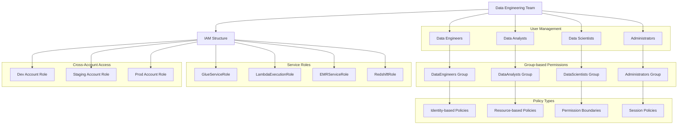
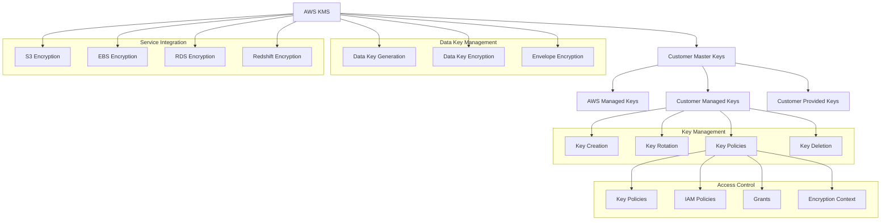
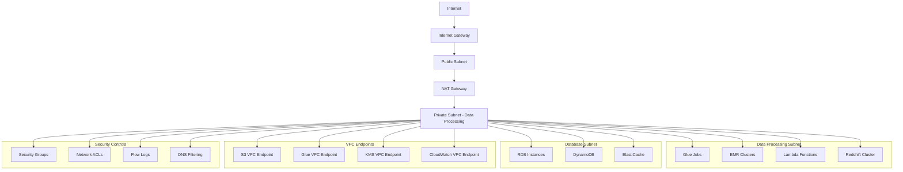
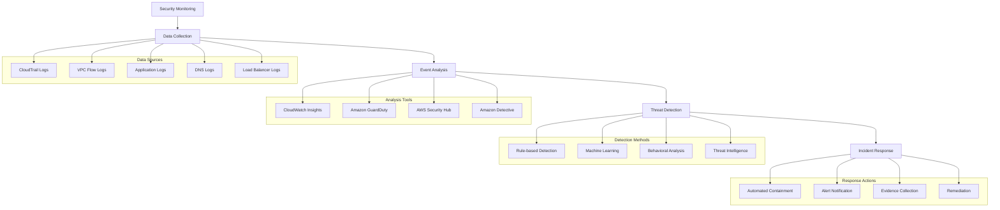

# Domain 4: Data Security and Governance (18%)

## Table of Contents
1. [Data Security Fundamentals](#data-security-fundamentals)
2. [Identity and Access Management (IAM)](#identity-and-access-management-iam)
3. [Encryption and Key Management](#encryption-and-key-management)
4. [Network Security](#network-security)
5. [Data Governance Framework](#data-governance-framework)
6. [Data Classification and Tagging](#data-classification-and-tagging)
7. [Compliance and Auditing](#compliance-and-auditing)
8. [Data Privacy and Protection](#data-privacy-and-protection)
9. [Security Monitoring and Incident Response](#security-monitoring-and-incident-response)
10. [Practice Questions](#practice-questions)

---

## Data Security Fundamentals

### Security Principles

#### Defense in Depth
- **Multiple Security Layers**: Network, application, data, and physical security
- **Redundant Controls**: Backup security measures if primary controls fail
- **Comprehensive Coverage**: Security at every level of the architecture

#### Principle of Least Privilege
- **Minimal Access**: Grant only necessary permissions
- **Role-based Access**: Permissions based on job functions
- **Regular Reviews**: Periodic access audits and updates

#### Zero Trust Architecture
- **Never Trust, Always Verify**: Authenticate and authorize every request
- **Continuous Monitoring**: Real-time security assessment
- **Microsegmentation**: Limit lateral movement within networks

### Data Security Architecture

```mermaid
graph TD
    A[Data Security Strategy] --> B[Identity & Access Management]
    A --> C[Data Protection]
    A --> D[Network Security]
    A --> E[Monitoring & Compliance]
    
    subgraph "Identity & Access"
        F[IAM Policies]
        G[Role-based Access]
        H[Multi-factor Authentication]
        I[Federated Identity]
    end
    
    B --> F
    B --> G
    B --> H
    B --> I
    
    subgraph "Data Protection"
        J[Encryption at Rest]
        K[Encryption in Transit]
        L[Key Management]
        M[Data Masking]
    end
    
    C --> J
    C --> K
    C --> L
    C --> M
    
    subgraph "Network Security"
        N[VPC Isolation]
        O[Security Groups]
        P[Network ACLs]
        Q[VPC Endpoints]
    end
    
    D --> N
    D --> O
    D --> P
    D --> Q
    
    subgraph "Monitoring & Compliance"
        R[CloudTrail Logging]
        S[Config Rules]
        T[GuardDuty Threat Detection]
        U[Compliance Frameworks]
    end
    
    E --> R
    E --> S
    E --> T
    E --> U
```



### Security Frameworks

#### AWS Well-Architected Security Pillar
- **Identity and Access Management**: Strong identity foundation
- **Detective Controls**: Comprehensive logging and monitoring
- **Infrastructure Protection**: Defense in depth
- **Data Protection**: Classification and encryption
- **Incident Response**: Preparation and automation

#### Compliance Standards
- **SOC 2**: Security, availability, processing integrity
- **GDPR**: General Data Protection Regulation
- **HIPAA**: Health Insurance Portability and Accountability Act
- **PCI DSS**: Payment Card Industry Data Security Standard

---

## Identity and Access Management (IAM)

### IAM Components

#### Users, Groups, and Roles
- **IAM Users**: Individual identity for people or applications
- **IAM Groups**: Collections of users with similar permissions
- **IAM Roles**: Temporary credentials for services and cross-account access

#### Policies
- **Managed Policies**: AWS-managed or customer-managed reusable policies
- **Inline Policies**: Policies directly attached to users, groups, or roles
- **Resource-based Policies**: Attached to resources (S3 buckets, KMS keys)

### IAM Architecture for Data Engineering



### IAM Best Practices

#### Policy Design
- **Least Privilege Principle**: Grant minimal necessary permissions
- **Condition-based Access**: Use conditions for fine-grained control
- **Resource-specific Permissions**: Limit access to specific resources
- **Time-based Access**: Implement time-limited permissions

#### Role-based Access Control
- **Service Roles**: Dedicated roles for AWS services
- **Cross-account Roles**: Secure cross-account access
- **Temporary Credentials**: Use STS for short-term access
- **Session Policies**: Additional restrictions for assumed roles

### Example IAM Policy for Data Engineer

```json
{
    "Version": "2012-10-17",
    "Statement": [
        {
            "Sid": "GlueJobManagement",
            "Effect": "Allow",
            "Action": [
                "glue:CreateJob",
                "glue:UpdateJob",
                "glue:DeleteJob",
                "glue:StartJobRun",
                "glue:StopJobRun",
                "glue:GetJob",
                "glue:GetJobRun",
                "glue:GetJobRuns"
            ],
            "Resource": [
                "arn:aws:glue:*:*:job/data-engineering-*"
            ]
        },
        {
            "Sid": "S3DataLakeAccess",
            "Effect": "Allow",
            "Action": [
                "s3:GetObject",
                "s3:PutObject",
                "s3:DeleteObject",
                "s3:ListBucket"
            ],
            "Resource": [
                "arn:aws:s3:::data-lake-bucket",
                "arn:aws:s3:::data-lake-bucket/*"
            ],
            "Condition": {
                "StringEquals": {
                    "s3:x-amz-server-side-encryption": "aws:kms"
                }
            }
        },
        {
            "Sid": "KMSKeyAccess",
            "Effect": "Allow",
            "Action": [
                "kms:Encrypt",
                "kms:Decrypt",
                "kms:ReEncrypt*",
                "kms:GenerateDataKey*",
                "kms:DescribeKey"
            ],
            "Resource": [
                "arn:aws:kms:*:*:key/12345678-1234-1234-1234-123456789012"
            ],
            "Condition": {
                "StringEquals": {
                    "kms:ViaService": [
                        "s3.us-east-1.amazonaws.com",
                        "glue.us-east-1.amazonaws.com"
                    ]
                }
            }
        },
        {
            "Sid": "CloudWatchLogsAccess",
            "Effect": "Allow",
            "Action": [
                "logs:CreateLogGroup",
                "logs:CreateLogStream",
                "logs:PutLogEvents",
                "logs:DescribeLogGroups",
                "logs:DescribeLogStreams"
            ],
            "Resource": [
                "arn:aws:logs:*:*:log-group:/aws/glue/data-engineering-*"
            ]
        }
    ]
}
```

### Cross-Account Access Patterns

#### Assume Role Pattern
- **Trust Relationships**: Define which accounts/users can assume roles
- **External ID**: Additional security for third-party access
- **Session Names**: Track who is using assumed roles
- **MFA Requirements**: Require multi-factor authentication

#### Resource Sharing
- **Cross-account S3 Access**: Bucket policies for shared data
- **Glue Catalog Sharing**: Share metadata across accounts
- **KMS Key Sharing**: Cross-account encryption key access

---

## Encryption and Key Management

### Encryption Strategies

#### Encryption at Rest
- **Server-side Encryption**: AWS handles encryption/decryption
- **Client-side Encryption**: Encrypt data before sending to AWS
- **Key Management**: Control who can access encryption keys

#### Encryption in Transit
- **TLS/SSL**: Secure communication channels
- **VPN Connections**: Encrypted network connections
- **API Encryption**: HTTPS for all API communications

### AWS Key Management Service (KMS)



### Encryption Implementation

#### S3 Encryption Options
- **SSE-S3**: Server-side encryption with S3-managed keys
- **SSE-KMS**: Server-side encryption with KMS keys
- **SSE-C**: Server-side encryption with customer-provided keys
- **CSE**: Client-side encryption

#### Database Encryption
- **RDS/Aurora**: Transparent data encryption
- **DynamoDB**: Server-side encryption at rest
- **Redshift**: Cluster encryption with KMS

### Example KMS Key Policy for Data Lake

```json
{
    "Version": "2012-10-17",
    "Statement": [
        {
            "Sid": "EnableRootAccess",
            "Effect": "Allow",
            "Principal": {
                "AWS": "arn:aws:iam::123456789012:root"
            },
            "Action": "kms:*",
            "Resource": "*"
        },
        {
            "Sid": "EnableDataTeamAccess",
            "Effect": "Allow",
            "Principal": {
                "AWS": [
                    "arn:aws:iam::123456789012:role/DataEngineerRole",
                    "arn:aws:iam::123456789012:role/DataAnalystRole"
                ]
            },
            "Action": [
                "kms:Encrypt",
                "kms:Decrypt",
                "kms:ReEncrypt*",
                "kms:GenerateDataKey*",
                "kms:DescribeKey"
            ],
            "Resource": "*",
            "Condition": {
                "StringEquals": {
                    "kms:ViaService": [
                        "s3.us-east-1.amazonaws.com",
                        "glue.us-east-1.amazonaws.com",
                        "redshift.us-east-1.amazonaws.com"
                    ]
                },
                "StringLike": {
                    "kms:EncryptionContext:aws:s3:arn": [
                        "arn:aws:s3:::data-lake-bucket/raw/*",
                        "arn:aws:s3:::data-lake-bucket/processed/*"
                    ]
                }
            }
        },
        {
            "Sid": "EnableServiceAccess",
            "Effect": "Allow",
            "Principal": {
                "AWS": [
                    "arn:aws:iam::123456789012:role/GlueServiceRole",
                    "arn:aws:iam::123456789012:role/LambdaExecutionRole"
                ]
            },
            "Action": [
                "kms:Encrypt",
                "kms:Decrypt",
                "kms:ReEncrypt*",
                "kms:GenerateDataKey*",
                "kms:DescribeKey"
            ],
            "Resource": "*"
        }
    ]
}
```

### Envelope Encryption

#### How It Works
1. **Data Key Generation**: KMS generates a data encryption key
2. **Data Encryption**: Use data key to encrypt actual data
3. **Key Encryption**: KMS encrypts the data key with master key
4. **Storage**: Store encrypted data and encrypted data key together

#### Benefits
- **Performance**: Avoid network calls for large data encryption
- **Scalability**: Encrypt large amounts of data efficiently
- **Security**: Master key never leaves KMS

---

## Network Security

### VPC Security Architecture

#### Network Isolation
- **VPC Boundaries**: Isolate resources in virtual networks
- **Subnet Segmentation**: Separate public and private resources
- **Route Tables**: Control traffic routing
- **Internet Gateways**: Controlled internet access

#### Security Groups and NACLs
- **Security Groups**: Stateful firewall at instance level
- **Network ACLs**: Stateless firewall at subnet level
- **Defense in Depth**: Multiple layers of network protection

### Network Security for Data Pipelines



### VPC Endpoints

#### Gateway Endpoints
- **S3 and DynamoDB**: Direct access without internet routing
- **Cost Effective**: No data transfer charges
- **Route Table**: Configure routing through endpoint

#### Interface Endpoints
- **Most AWS Services**: Private connectivity to AWS services
- **ENI-based**: Elastic Network Interface in your VPC
- **DNS Resolution**: Private DNS names for services

### Network Security Best Practices

#### Traffic Control
- **Least Privilege**: Allow only necessary network traffic
- **Port Restrictions**: Limit open ports to minimum required
- **Protocol Restrictions**: Use secure protocols (HTTPS, SSH)
- **Source/Destination Filtering**: Restrict traffic sources and destinations

#### Monitoring and Logging
- **VPC Flow Logs**: Network traffic monitoring
- **DNS Query Logs**: Track DNS requests
- **Load Balancer Logs**: Monitor application traffic
- **WAF Logs**: Web application firewall activity

### Example Security Group Configuration

```python
import boto3

ec2 = boto3.client('ec2')

# Create security group for data processing
security_group = ec2.create_security_group(
    GroupName='data-processing-sg',
    Description='Security group for data processing instances',
    VpcId='vpc-12345678'
)

sg_id = security_group['GroupId']

# Allow HTTPS outbound for AWS API calls
ec2.authorize_security_group_egress(
    GroupId=sg_id,
    IpPermissions=[
        {
            'IpProtocol': 'tcp',
            'FromPort': 443,
            'ToPort': 443,
            'IpRanges': [{'CidrIp': '0.0.0.0/0'}]
        }
    ]
)

# Allow database access within VPC
ec2.authorize_security_group_ingress(
    GroupId=sg_id,
    IpPermissions=[
        {
            'IpProtocol': 'tcp',
            'FromPort': 5432,
            'ToPort': 5432,
            'UserIdGroupPairs': [
                {
                    'GroupId': 'sg-database-access',
                    'Description': 'Database access from processing instances'
                }
            ]
        }
    ]
)

# Add tags for compliance tracking
ec2.create_tags(
    Resources=[sg_id],
    Tags=[
        {'Key': 'Name', 'Value': 'data-processing-sg'},
        {'Key': 'Environment', 'Value': 'production'},
        {'Key': 'DataClassification', 'Value': 'confidential'},
        {'Key': 'Owner', 'Value': 'data-engineering-team'}
    ]
)
```

---

## Data Governance Framework

### Governance Components

#### Data Stewardship
- **Data Owners**: Business stakeholders responsible for data
- **Data Stewards**: Technical custodians managing data quality
- **Data Users**: Consumers of data for analysis and operations

#### Governance Processes
- **Data Classification**: Categorize data by sensitivity and importance
- **Access Management**: Control who can access what data
- **Quality Management**: Ensure data accuracy and completeness
- **Lifecycle Management**: Manage data from creation to deletion

### Data Governance Architecture

```mermaid
graph TD
    A[Data Governance Framework] --> B[Data Discovery]
    A --> C[Data Classification]
    A --> D[Access Control]
    A --> E[Quality Management]
    A --> F[Compliance Monitoring]
    
    subgraph "Discovery Tools"
        G[AWS Glue Data Catalog]
        H[Amazon Macie]
        I[Data Lineage Tracking]
        J[Metadata Management]
    end
    
    B --> G
    B --> H
    B --> I
    B --> J
    
    subgraph "Classification Schemes"
        K[Public Data]
        L[Internal Data]
        M[Confidential Data]
        N[Restricted Data]
    end
    
    C --> K
    C --> L
    C --> M
    C --> N
    
    subgraph "Access Controls"
        O[Role-based Access]
        P[Attribute-based Access]
        Q[Data Masking]
        R[Tokenization]
    end
    
    D --> O
    D --> P
    D --> Q
    D --> R
    
    subgraph "Quality Dimensions"
        S[Completeness]
        T[Accuracy]
        U[Consistency]
        V[Timeliness]
    end
    
    E --> S
    E --> T
    E --> U
    E --> V
    
    subgraph "Compliance Requirements"
        W[GDPR]
        X[HIPAA]
        Y[SOX]
        Z[PCI DSS]
    end
    
    F --> W
    F --> X
    F --> Y
    F --> Z
```



### Data Catalog and Discovery

#### AWS Glue Data Catalog
- **Centralized Metadata**: Single source of truth for data assets
- **Schema Discovery**: Automatic detection of data structures
- **Table Partitioning**: Organize data for efficient querying
- **Integration**: Works with analytics and ETL services

#### Amazon Macie
- **Data Discovery**: Automatically discover sensitive data
- **Classification**: Classify data based on content and context
- **Risk Assessment**: Identify data security and privacy risks
- **Monitoring**: Continuous monitoring for sensitive data exposure

### Data Lineage and Impact Analysis

#### Lineage Tracking
- **Source to Target**: Track data movement through systems
- **Transformation History**: Document data transformations
- **Dependency Mapping**: Understand data dependencies
- **Impact Analysis**: Assess impact of changes

#### Implementation Approaches
- **Metadata-driven**: Extract lineage from processing metadata
- **Code Analysis**: Parse ETL code for lineage information
- **Runtime Tracking**: Monitor actual data movement
- **Manual Documentation**: Business process documentation

---

## Data Classification and Tagging

### Classification Schemes

#### Sensitivity Levels
- **Public**: Data that can be shared publicly
- **Internal**: Data for internal use only
- **Confidential**: Data requiring protection
- **Restricted**: Highly sensitive data with strict access controls

#### Business Context
- **Operational**: Data for day-to-day operations
- **Analytical**: Data for business intelligence and reporting
- **Regulatory**: Data required for compliance
- **Personal**: Data identifying individuals

### Tagging Strategy

```mermaid
graph TD
    A[Data Tagging Strategy] --> B[Mandatory Tags]
    A --> C[Optional Tags]
    A --> D[Automated Tagging]
    A --> E[Tag Governance]
    
    subgraph "Mandatory Tags"
        F[DataClassification]
        G[Owner]
        H[Environment]
        I[CostCenter]
    end
    
    B --> F
    B --> G
    B --> H
    B --> I
    
    subgraph "Optional Tags"
        J[Project]
        K[Department]
        L[Application]
        M[RetentionPeriod]
    end
    
    C --> J
    C --> K
    C --> L
    C --> M
    
    subgraph "Automated Tagging"
        N[Resource Creation Tags]
        O[Content-based Tags]
        P[Compliance Tags]
        Q[Lifecycle Tags]
    end
    
    D --> N
    D --> O
    D --> P
    D --> Q
    
    subgraph "Tag Governance"
        R[Tag Policies]
        S[Tag Validation]
        T[Tag Reporting]
        U[Tag Cleanup]
    end
    
    E --> R
    E --> S
    E --> T
    E --> U
```



### Automated Classification

#### Content-based Classification
- **Pattern Matching**: Identify sensitive data patterns (SSN, credit cards)
- **Statistical Analysis**: Analyze data distribution and characteristics
- **Machine Learning**: Train models to identify data types
- **Business Rules**: Apply custom classification rules

#### Amazon Macie Implementation

```python
import boto3

macie = boto3.client('macie2')

# Create custom data identifier for employee IDs
custom_data_identifier = macie.create_custom_data_identifier(
    name='EmployeeID',
    description='Custom identifier for employee ID patterns',
    regex=r'EMP-\d{6}',
    keywords=['employee', 'emp_id', 'employee_number'],
    maximumMatchDistance=50
)

# Create classification job
classification_job = macie.create_classification_job(
    name='data-lake-classification',
    description='Classify sensitive data in data lake',
    jobType='ONE_TIME',
    s3JobDefinition={
        'bucketDefinitions': [
            {
                'accountId': '123456789012',
                'buckets': ['data-lake-bucket']
            }
        ],
        'scoping': {
            'includes': {
                'and': [
                    {
                        'simpleScopeTerm': {
                            'comparator': 'EQ',
                            'key': 'OBJECT_EXTENSION',
                            'values': ['csv', 'json', 'parquet']
                        }
                    }
                ]
            }
        }
    },
    customDataIdentifierIds=[custom_data_identifier['customDataIdentifierId']],
    tags={
        'Environment': 'production',
        'Purpose': 'data-classification',
        'Owner': 'data-governance-team'
    }
)
```

### Tag-based Access Control

#### Policy Example

```json
{
    "Version": "2012-10-17",
    "Statement": [
        {
            "Effect": "Allow",
            "Action": [
                "s3:GetObject",
                "s3:ListBucket"
            ],
            "Resource": [
                "arn:aws:s3:::data-lake-bucket",
                "arn:aws:s3:::data-lake-bucket/*"
            ],
            "Condition": {
                "StringEquals": {
                    "s3:ExistingObjectTag/DataClassification": [
                        "public",
                        "internal"
                    ]
                }
            }
        },
        {
            "Effect": "Deny",
            "Action": [
                "s3:GetObject"
            ],
            "Resource": [
                "arn:aws:s3:::data-lake-bucket/*"
            ],
            "Condition": {
                "StringEquals": {
                    "s3:ExistingObjectTag/DataClassification": [
                        "confidential",
                        "restricted"
                    ]
                },
                "Bool": {
                    "aws:MultiFactorAuthPresent": "false"
                }
            }
        }
    ]
}
```

---

## Compliance and Auditing

### Compliance Frameworks

#### GDPR (General Data Protection Regulation)
- **Data Subject Rights**: Right to access, rectify, erase personal data
- **Consent Management**: Explicit consent for data processing
- **Data Protection by Design**: Privacy considerations in system design
- **Breach Notification**: Report breaches within 72 hours

#### HIPAA (Health Insurance Portability and Accountability Act)
- **Protected Health Information (PHI)**: Safeguard health information
- **Access Controls**: Limit access to authorized personnel
- **Audit Logs**: Track all PHI access and modifications
- **Business Associate Agreements**: Third-party compliance

#### SOC 2 (Service Organization Control 2)
- **Security**: Protect against unauthorized access
- **Availability**: System operational and accessible
- **Processing Integrity**: Complete and accurate processing
- **Confidentiality**: Protect confidential information
- **Privacy**: Collect and use personal information properly

### Audit and Compliance Architecture

```mermaid
graph TD
    A[Compliance Management] --> B[Data Discovery]
    A --> C[Access Monitoring]
    A --> D[Change Tracking]
    A --> E[Report Generation]
    
    subgraph "Discovery Services"
        F[AWS Config]
        G[Amazon Macie]
        H[CloudTrail]
        I[GuardDuty]
    end
    
    B --> F
    B --> G
    B --> H
    B --> I
    
    subgraph "Monitoring Controls"
        J[CloudWatch Alarms]
        K[EventBridge Rules]
        L[Lambda Functions]
        M[SNS Notifications]
    end
    
    C --> J
    C --> K
    C --> L
    C --> M
    
    subgraph "Audit Trail"
        N[API Call Logs]
        O[Data Access Logs]
        P[Configuration Changes]
        Q[Security Events]
    end
    
    D --> N
    D --> O
    D --> P
    D --> Q
    
    subgraph "Compliance Reports"
        R[Access Reports]
        S[Data Inventory]
        T[Risk Assessments]
        U[Breach Reports]
    end
    
    E --> R
    E --> S
    E --> T
    E --> U
```



### CloudTrail for Compliance

#### Comprehensive Logging
- **API Calls**: Log all AWS API activity
- **Data Events**: Track S3 object-level operations
- **Insight Events**: Identify unusual activity patterns
- **Cross-region Delivery**: Centralized log collection

#### Log Analysis and Alerting

```python
import boto3
import json

def analyze_cloudtrail_logs(event, context):
    """
    Analyze CloudTrail logs for compliance violations
    """
    
    # Parse CloudTrail log from S3 event
    s3_bucket = event['Records'][0]['s3']['bucket']['name']
    s3_key = event['Records'][0]['s3']['object']['key']
    
    s3_client = boto3.client('s3')
    cloudwatch = boto3.client('cloudwatch')
    
    # Download and parse CloudTrail log
    obj = s3_client.get_object(Bucket=s3_bucket, Key=s3_key)
    log_data = json.loads(obj['Body'].read())
    
    violations = []
    
    for record in log_data['Records']:
        # Check for unauthorized data access
        if (record['eventName'] in ['GetObject', 'PutObject'] and 
            'data-lake-restricted' in record.get('requestParameters', {}).get('bucketName', '')):
            
            # Verify user has appropriate permissions
            user_arn = record.get('userIdentity', {}).get('arn', '')
            if not is_authorized_user(user_arn):
                violations.append({
                    'type': 'unauthorized_data_access',
                    'user': user_arn,
                    'resource': record.get('requestParameters', {}).get('key', ''),
                    'timestamp': record['eventTime']
                })
        
        # Check for configuration changes
        if (record['eventName'] in ['PutBucketPolicy', 'DeleteBucketPolicy'] and
            record.get('responseElements', {}).get('policy')):
            
            violations.append({
                'type': 'policy_change',
                'user': record.get('userIdentity', {}).get('arn', ''),
                'resource': record.get('requestParameters', {}).get('bucketName', ''),
                'timestamp': record['eventTime']
            })
    
    # Send alerts for violations
    if violations:
        send_compliance_alert(violations)
        
        # Update CloudWatch metrics
        cloudwatch.put_metric_data(
            Namespace='Compliance',
            MetricData=[
                {
                    'MetricName': 'ComplianceViolations',
                    'Value': len(violations),
                    'Unit': 'Count'
                }
            ]
        )
    
    return {
        'statusCode': 200,
        'body': json.dumps(f'Processed {len(log_data["Records"])} events, found {len(violations)} violations')
    }

def is_authorized_user(user_arn):
    """Check if user is authorized for restricted data access"""
    authorized_roles = [
        'arn:aws:iam::123456789012:role/DataGovernanceRole',
        'arn:aws:iam::123456789012:role/ComplianceAuditorRole'
    ]
    return any(role in user_arn for role in authorized_roles)

def send_compliance_alert(violations):
    """Send compliance violation alerts"""
    sns = boto3.client('sns')
    
    message = {
        'alert_type': 'compliance_violation',
        'violation_count': len(violations),
        'violations': violations
    }
    
    sns.publish(
        TopicArn='arn:aws:sns:us-east-1:123456789012:compliance-alerts',
        Message=json.dumps(message),
        Subject='Compliance Violation Detected'
    )
```

---

## Data Privacy and Protection

### Privacy Principles

#### Data Minimization
- **Purpose Limitation**: Collect only necessary data
- **Retention Limits**: Delete data when no longer needed
- **Access Restrictions**: Limit access to authorized personnel
- **Processing Transparency**: Clear documentation of data use

#### Consent Management
- **Explicit Consent**: Clear agreement for data processing
- **Granular Control**: Specific consent for different uses
- **Withdrawal Rights**: Ability to revoke consent
- **Audit Trail**: Track consent decisions

### Privacy-Preserving Techniques

#### Data Masking and Anonymization
- **Static Masking**: Permanently alter sensitive data
- **Dynamic Masking**: Real-time data obfuscation
- **Tokenization**: Replace sensitive data with tokens
- **Differential Privacy**: Add statistical noise to protect privacy

### Privacy Protection Architecture

```mermaid
graph TD
    A[Data Privacy Framework] --> B[Data Collection]
    A --> C[Data Processing]
    A --> D[Data Storage]
    A --> E[Data Access]
    
    subgraph "Collection Controls"
        F[Consent Management]
        G[Purpose Limitation]
        H[Data Minimization]
        I[Quality Assurance]
    end
    
    B --> F
    B --> G
    B --> H
    B --> I
    
    subgraph "Processing Controls"
        J[Privacy by Design]
        K[Data Transformation]
        L[Anonymization]
        M[Pseudonymization]
    end
    
    C --> J
    C --> K
    C --> L
    C --> M
    
    subgraph "Storage Controls"
        N[Encryption at Rest]
        O[Access Controls]
        P[Data Lifecycle]
        Q[Geographic Restrictions]
    end
    
    D --> N
    D --> O
    D --> P
    D --> Q
    
    subgraph "Access Controls"
        R[Authentication]
        S[Authorization]
        T[Audit Logging]
        U[Data Masking]
    end
    
    E --> R
    E --> S
    E --> T
    E --> U
```



### Data Subject Rights Implementation

#### Right to Access
- **Data Portability**: Provide data in machine-readable format
- **Search Capabilities**: Find all data for a specific individual
- **Response Time**: Respond within regulatory timeframes
- **Verification**: Verify identity before providing data

#### Right to Erasure (Right to be Forgotten)
- **Data Discovery**: Find all instances of personal data
- **Cascading Deletion**: Remove data from all systems
- **Backup Considerations**: Handle data in backups
- **Documentation**: Record deletion activities

### Example Data Masking Implementation

```python
import boto3
import hashlib
import random
import string

class DataMaskingService:
    def __init__(self):
        self.kms_client = boto3.client('kms')
        self.key_id = 'arn:aws:kms:us-east-1:123456789012:key/12345678-1234-1234-1234-123456789012'
    
    def mask_email(self, email):
        """Mask email address while preserving format"""
        if not email or '@' not in email:
            return email
        
        username, domain = email.split('@', 1)
        masked_username = username[0] + '*' * (len(username) - 2) + username[-1] if len(username) > 2 else '*' * len(username)
        return f"{masked_username}@{domain}"
    
    def mask_phone(self, phone):
        """Mask phone number"""
        if not phone:
            return phone
        
        # Keep last 4 digits
        return '*' * (len(phone) - 4) + phone[-4:] if len(phone) > 4 else '*' * len(phone)
    
    def tokenize_ssn(self, ssn):
        """Tokenize SSN using deterministic encryption"""
        if not ssn:
            return ssn
        
        # Encrypt SSN to create consistent token
        response = self.kms_client.encrypt(
            KeyId=self.key_id,
            Plaintext=ssn.encode(),
            EncryptionContext={
                'purpose': 'ssn_tokenization',
                'data_type': 'pii'
            }
        )
        
        # Create token from encrypted data
        token_base = response['CiphertextBlob'][:8]  # First 8 bytes
        token = 'TOK_' + token_base.hex().upper()
        return token
    
    def anonymize_dataset(self, records):
        """Anonymize a dataset while preserving analytical value"""
        anonymized_records = []
        
        for record in records:
            anonymized_record = record.copy()
            
            # Remove direct identifiers
            anonymized_record.pop('ssn', None)
            anonymized_record.pop('email', None)
            anonymized_record.pop('phone', None)
            anonymized_record.pop('name', None)
            
            # Generalize quasi-identifiers
            if 'age' in anonymized_record:
                age = anonymized_record['age']
                # Group ages into ranges
                if age < 30:
                    anonymized_record['age_group'] = '18-29'
                elif age < 50:
                    anonymized_record['age_group'] = '30-49'
                elif age < 65:
                    anonymized_record['age_group'] = '50-64'
                else:
                    anonymized_record['age_group'] = '65+'
                del anonymized_record['age']
            
            if 'zipcode' in anonymized_record:
                # Use only first 3 digits of zip code
                zipcode = str(anonymized_record['zipcode'])
                anonymized_record['zip_prefix'] = zipcode[:3] + 'XX'
                del anonymized_record['zipcode']
            
            anonymized_records.append(anonymized_record)
        
        return anonymized_records
    
    def apply_differential_privacy(self, dataset, epsilon=1.0):
        """Apply differential privacy to numerical fields"""
        for record in dataset:
            for field, value in record.items():
                if isinstance(value, (int, float)) and field not in ['id', 'customer_id']:
                    # Add Laplace noise
                    sensitivity = 1.0  # Assume sensitivity of 1
                    scale = sensitivity / epsilon
                    noise = random.laplace(0, scale)
                    record[field] = max(0, value + noise)  # Ensure non-negative
        
        return dataset

# Usage example
masking_service = DataMaskingService()

# Example customer record
customer_record = {
    'customer_id': '12345',
    'name': 'John Doe',
    'email': 'john.doe@example.com',
    'phone': '555-123-4567',
    'ssn': '123-45-6789',
    'age': 35,
    'zipcode': '12345',
    'purchase_amount': 250.00
}

# Apply different masking techniques
masked_record = customer_record.copy()
masked_record['email'] = masking_service.mask_email(customer_record['email'])
masked_record['phone'] = masking_service.mask_phone(customer_record['phone'])
masked_record['ssn_token'] = masking_service.tokenize_ssn(customer_record['ssn'])
del masked_record['ssn']

print("Original:", customer_record)
print("Masked:", masked_record)

# Anonymize for analytics
anonymized_records = masking_service.anonymize_dataset([customer_record])
print("Anonymized:", anonymized_records[0])
```

---

## Security Monitoring and Incident Response

### Security Monitoring Strategy

#### Continuous Monitoring
- **Real-time Alerts**: Immediate notification of security events
- **Behavioral Analysis**: Detect anomalous activity patterns
- **Threat Intelligence**: Integrate external threat feeds
- **Automated Response**: Immediate containment actions

#### Key Metrics
- **Failed Authentication Attempts**: Monitor login failures
- **Unusual Data Access**: Detect abnormal data access patterns
- **Configuration Changes**: Track security-relevant changes
- **Network Anomalies**: Identify suspicious network activity

### Security Monitoring Architecture



### Amazon GuardDuty Integration

#### Threat Detection
- **Malicious IP Communication**: Detect communication with known bad IPs
- **Compromised Instances**: Identify potentially compromised EC2 instances
- **Cryptocurrency Mining**: Detect unauthorized mining activity
- **Data Exfiltration**: Identify unusual data transfer patterns

#### Custom Threat Intelligence

```python
import boto3
import json

def setup_guardduty_custom_threats():
    """Setup custom threat intelligence in GuardDuty"""
    
    guardduty = boto3.client('guardduty')
    s3 = boto3.client('s3')
    
    # Get detector ID
    detectors = guardduty.list_detectors()
    detector_id = detectors['DetectorIds'][0]
    
    # Create threat intelligence set
    threat_intel_response = guardduty.create_threat_intel_set(
        DetectorId=detector_id,
        Name='CustomThreatIntel',
        Format='TXT',
        Location='s3://security-bucket/threat-intel/malicious-ips.txt',
        Activate=True,
        Tags={
            'Purpose': 'ThreatDetection',
            'Source': 'InternalThreatIntel'
        }
    )
    
    # Create IP set for trusted sources
    ipset_response = guardduty.create_ip_set(
        DetectorId=detector_id,
        Name='TrustedSources',
        Format='TXT',
        Location='s3://security-bucket/ip-sets/trusted-ips.txt',
        Activate=True,
        Tags={
            'Purpose': 'WhitelistIPs',
            'Source': 'InternalSources'
        }
    )
    
    return {
        'threat_intel_set_id': threat_intel_response['ThreatIntelSetId'],
        'ip_set_id': ipset_response['IpSetId']
    }

def process_guardduty_findings(event, context):
    """Process GuardDuty findings and trigger responses"""
    
    # Parse GuardDuty finding from EventBridge
    finding = event['detail']
    
    severity = finding['severity']
    finding_type = finding['type']
    
    # High severity findings require immediate action
    if severity >= 7.0:
        handle_high_severity_finding(finding)
    elif severity >= 4.0:
        handle_medium_severity_finding(finding)
    else:
        handle_low_severity_finding(finding)
    
    return {'statusCode': 200}

def handle_high_severity_finding(finding):
    """Handle high severity security findings"""
    
    ec2 = boto3.client('ec2')
    sns = boto3.client('sns')
    
    # Extract instance information
    service = finding.get('service', {})
    instance_id = None
    
    if 'ec2' in service.get('resourceRole', '').lower():
        instance_details = service.get('remoteIpDetails', {})
        instance_id = service.get('instanceDetails', {}).get('instanceId')
    
    # Isolate compromised instance
    if instance_id:
        isolate_instance(instance_id)
    
    # Send immediate alert
    alert_message = {
        'severity': 'HIGH',
        'finding_type': finding['type'],
        'description': finding['description'],
        'instance_id': instance_id,
        'remediation_status': 'ISOLATED' if instance_id else 'N/A'
    }
    
    sns.publish(
        TopicArn='arn:aws:sns:us-east-1:123456789012:security-alerts-high',
        Message=json.dumps(alert_message),
        Subject=f'HIGH SEVERITY: {finding["type"]}'
    )

def isolate_instance(instance_id):
    """Isolate EC2 instance by modifying security groups"""
    
    ec2 = boto3.client('ec2')
    
    # Get instance details
    response = ec2.describe_instances(InstanceIds=[instance_id])
    instance = response['Reservations'][0]['Instances'][0]
    
    # Create isolation security group
    vpc_id = instance['VpcId']
    
    isolation_sg = ec2.create_security_group(
        GroupName=f'isolation-{instance_id}',
        Description='Isolation security group for compromised instance',
        VpcId=vpc_id
    )
    
    isolation_sg_id = isolation_sg['GroupId']
    
    # Remove all inbound/outbound rules (default deny all)
    # Modify instance to use isolation security group
    ec2.modify_instance_attribute(
        InstanceId=instance_id,
        Groups=[isolation_sg_id]
    )
    
    # Log isolation action
    print(f"Instance {instance_id} isolated with security group {isolation_sg_id}")

def handle_medium_severity_finding(finding):
    """Handle medium severity findings with monitoring"""
    
    cloudwatch = boto3.client('cloudwatch')
    
    # Increase monitoring for affected resources
    cloudwatch.put_metric_data(
        Namespace='Security',
        MetricData=[
            {
                'MetricName': 'MediumSeverityFindings',
                'Value': 1,
                'Unit': 'Count',
                'Dimensions': [
                    {
                        'Name': 'FindingType',
                        'Value': finding['type']
                    }
                ]
            }
        ]
    )

def handle_low_severity_finding(finding):
    """Handle low severity findings with logging"""
    
    # Log for trend analysis
    print(f"Low severity finding: {finding['type']} - {finding['description']}")
```

### Incident Response Automation

#### Automated Remediation
- **Security Group Isolation**: Automatically isolate compromised instances
- **Access Revocation**: Disable compromised user accounts
- **Snapshot Creation**: Preserve evidence for forensic analysis
- **Alert Escalation**: Notify security teams based on severity

#### Incident Response Playbooks
- **Data Breach Response**: Steps for handling data exposure
- **Malware Detection**: Actions for malware incidents
- **Insider Threat**: Procedures for insider threat scenarios
- **DDoS Attack**: Response to distributed denial of service attacks

---

## Practice Questions

### Question 1: Encryption Strategy
A financial services company needs to store customer transaction data in S3 with strict encryption requirements. They want full control over encryption keys and the ability to audit key usage. What encryption approach should they implement?

A) S3 Server-Side Encryption with Amazon S3-Managed Keys (SSE-S3)
B) S3 Server-Side Encryption with AWS KMS Customer-Managed Keys (SSE-KMS)
C) S3 Server-Side Encryption with Customer-Provided Keys (SSE-C)
D) Client-side encryption with customer-managed keys

**Answer: B**
**Explanation**: SSE-KMS with customer-managed keys provides full control over encryption keys, detailed audit logs through CloudTrail, and the ability to set key policies for fine-grained access control, meeting financial services requirements.

### Question 2: Data Classification Implementation
You need to implement automated data classification for a data lake containing mixed content types. The solution should identify personally identifiable information (PII) and apply appropriate tags. What approach should you use?

A) Manual review and tagging by data stewards
B) Amazon Macie for automated sensitive data discovery and classification
C) Custom Lambda functions with regex patterns
D) AWS Config rules for resource tagging

**Answer: B**
**Explanation**: Amazon Macie uses machine learning and pattern matching to automatically discover, classify, and protect sensitive data like PII, providing comprehensive data classification capabilities.

### Question 3: Network Security for Data Processing
A data processing pipeline uses Glue jobs, Lambda functions, and Redshift. All components need secure communication without internet access. What network architecture should you implement?

A) Deploy all components in public subnets with security groups
B) Use private subnets with NAT Gateway for internet access
C) Implement private subnets with VPC endpoints for AWS services
D) Use AWS Direct Connect for all communications

**Answer: C**
**Explanation**: Private subnets with VPC endpoints provide secure, private connectivity to AWS services without requiring internet access, meeting the security requirement for sensitive data processing.

### Question 4: Compliance Monitoring
A healthcare organization needs to monitor access to protected health information (PHI) stored in S3 and generate compliance reports. What monitoring solution should they implement?

A) S3 access logs only
B) CloudTrail data events with automated analysis and alerting
C) VPC Flow Logs for network monitoring
D) AWS Config for resource compliance

**Answer: B**
**Explanation**: CloudTrail data events provide detailed logging of S3 object-level operations, enabling comprehensive PHI access monitoring and automated compliance reporting required for HIPAA compliance.

### Question 5: IAM Policy Design
A data engineering team needs access to specific S3 buckets and Glue jobs but should not access production databases. The policy should follow least privilege principles. What policy approach should you implement?

A) Grant full S3 and Glue access with explicit deny for production resources
B) Create resource-specific permissions with conditions for approved resources only
C) Use AWS managed policies for broad service access
D) Grant admin access with manual oversight

**Answer: B**
**Explanation**: Resource-specific permissions with conditions implement least privilege by granting access only to necessary resources while preventing access to production databases.

### Question 6: Data Masking Strategy
A data analytics team needs access to customer data for model training but cannot see actual personal information. The masked data should preserve statistical properties for analysis. What approach should you implement?

A) Remove all personal data fields completely
B) Replace personal data with random values
C) Use format-preserving encryption for sensitive fields
D) Apply differential privacy techniques with statistical noise

**Answer: D**
**Explanation**: Differential privacy adds calibrated statistical noise that preserves data utility for analytics while protecting individual privacy, making it ideal for machine learning use cases.

### Question 7: Cross-Account Data Sharing
Your organization needs to share processed data with a partner organization while maintaining security controls. The partner should access only specific datasets. What sharing mechanism should you implement?

A) Copy data to partner's S3 bucket manually
B) Cross-account IAM role with resource-specific S3 bucket policies
C) Generate pre-signed URLs for data access
D) Create IAM users in your account for partner access

**Answer: B**
**Explanation**: Cross-account IAM roles with resource-specific bucket policies provide secure, auditable data sharing while maintaining granular access control over specific datasets.

### Question 8: Security Incident Response
Your data pipeline triggered a GuardDuty alert indicating potential data exfiltration from an EC2 instance. What immediate response actions should you take?

A) Ignore the alert and continue monitoring
B) Isolate the instance and preserve evidence while investigating
C) Immediately terminate the instance to stop the threat
D) Reset all user passwords as a precaution

**Answer: B**
**Explanation**: Isolating the instance prevents further damage while preserving evidence for investigation, following proper incident response procedures without destroying forensic evidence.

### Question 9: Data Governance Implementation
A large organization with multiple business units needs centralized data governance with automated policy enforcement. What solution architecture should they implement?

A) Manual data governance processes with spreadsheet tracking
B) AWS Glue Data Catalog with Lake Formation for centralized governance
C) Separate governance processes for each business unit
D) Third-party governance tools only

**Answer: B**
**Explanation**: AWS Lake Formation with Glue Data Catalog provides centralized data governance, automated policy enforcement, and fine-grained access control across the organization.

### Question 10: Encryption Key Management
A multi-account AWS environment needs centralized key management with different access levels for different accounts. What key management strategy should you implement?

A) Separate KMS keys in each account with no sharing
B) Single KMS key shared across all accounts
C) KMS keys with cross-account key policies and resource-based access
D) Client-side encryption keys managed outside AWS

**Answer: C**
**Explanation**: KMS keys with cross-account policies enable centralized key management while providing granular access control for different accounts and use cases.

---

## Official Documentation Links

### Security and Compliance
- [AWS Security Best Practices](https://docs.aws.amazon.com/security/)
- [AWS Well-Architected Security Pillar](https://docs.aws.amazon.com/wellarchitected/latest/security-pillar/)
- [AWS Compliance Center](https://aws.amazon.com/compliance/)

### Identity and Access Management
- [IAM User Guide](https://docs.aws.amazon.com/iam/latest/userguide/)
- [IAM Best Practices](https://docs.aws.amazon.com/iam/latest/userguide/best-practices.html)
- [AWS STS User Guide](https://docs.aws.amazon.com/STS/latest/APIReference/)

### Encryption and Key Management
- [AWS KMS Developer Guide](https://docs.aws.amazon.com/kms/latest/developerguide/)
- [AWS Encryption SDK](https://docs.aws.amazon.com/encryption-sdk/latest/developer-guide/)

### Data Governance and Privacy
- [Amazon Macie User Guide](https://docs.aws.amazon.com/macie/latest/user/)
- [AWS Lake Formation Developer Guide](https://docs.aws.amazon.com/lake-formation/latest/dg/)
- [AWS Glue Data Catalog](https://docs.aws.amazon.com/glue/latest/dg/catalog-and-crawler.html)

### Monitoring and Incident Response
- [Amazon GuardDuty User Guide](https://docs.aws.amazon.com/guardduty/latest/ug/)
- [AWS CloudTrail User Guide](https://docs.aws.amazon.com/cloudtrail/latest/userguide/)
- [AWS Security Hub User Guide](https://docs.aws.amazon.com/securityhub/latest/userguide/)

This comprehensive guide covers all aspects of data security and governance for the AWS Data Engineer Associate certification, providing practical implementation guidance for building secure, compliant data engineering solutions.
