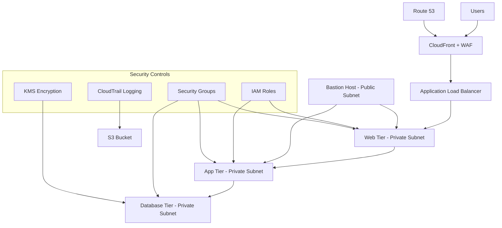
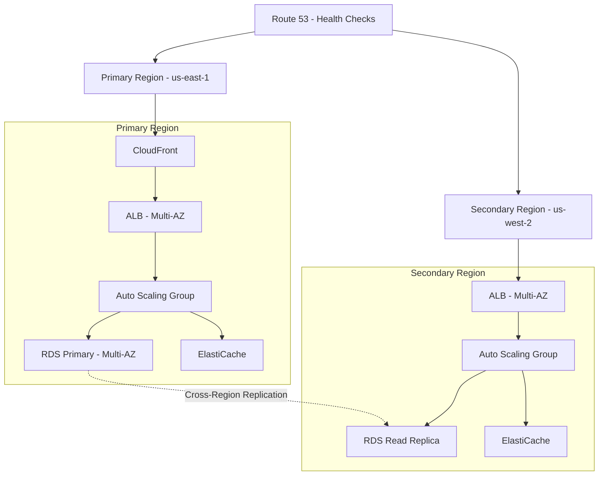
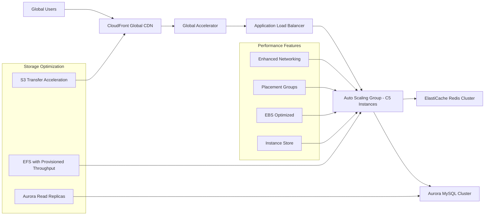
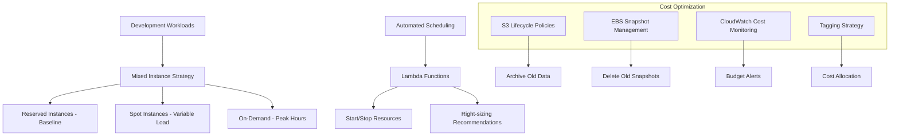
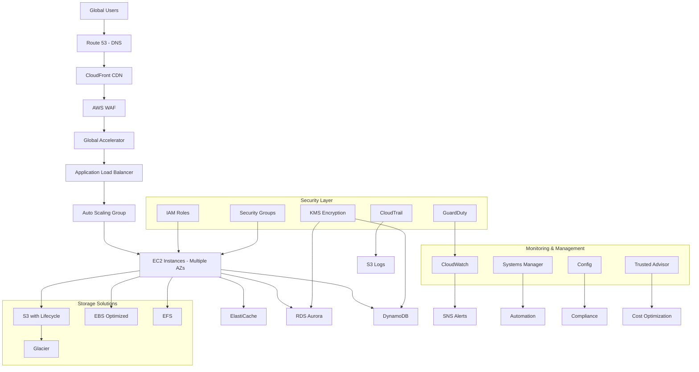

# AWS Solutions Architect Associate (SAA-C03) - Complete Study Guide

## Exam Overview

The AWS Certified Solutions Architect - Associate (SAA-C03) certification validates technical skills in designing distributed systems on AWS. This comprehensive guide covers all four domains of the exam with detailed explanations, Mermaid diagrams, practice questions, and official documentation links.

### Exam Details
- **Exam Code**: SAA-C03
- **Duration**: 130 minutes
- **Format**: Multiple choice and multiple response
- **Passing Score**: 720/1000
- **Number of Questions**: 65 questions
- **Validity**: 3 years

### Domain Breakdown
1. **Design Secure Architectures** (30% of exam)
2. **Design Resilient Architectures** (26% of exam)
3. **Design High-Performing Architectures** (24% of exam)
4. **Design Cost-Optimized Architectures** (20% of exam)

## Study Materials Structure

Each domain includes:
- Comprehensive technical content
- Visual Mermaid diagrams illustrating key concepts
- Real-world architecture patterns
- 10 practice questions with detailed explanations
- Links to official AWS documentation

## Domain 1: Design Secure Architectures (30%)

### Key Topics Covered
- AWS Identity and Access Management (IAM)
- Security Groups and NACLs
- Encryption at rest and in transit
- VPC security architecture
- Multi-tier security design
- Data protection strategies

[📖 Complete Domain 1 Study Guide](./domain-1-secure-architectures.md)

### Sample Architecture: Secure Three-Tier Web Application

## Domain 2: Design Resilient Architectures (26%)

### Key Topics Covered
- Multi-AZ and multi-region deployments
- Auto Scaling and load balancing
- Disaster recovery strategies
- Decoupling with SQS, SNS, and Lambda
- High availability design patterns

[📖 Complete Domain 2 Study Guide](./domain-2-resilient-architectures.md)

### Sample Architecture: Highly Available Multi-Region Application

## Domain 3: Design High-Performing Architectures (24%)

### Key Topics Covered
- EC2 instance types and optimization
- Storage performance (EBS, S3, EFS)
- Database performance tuning
- Network optimization
- Caching strategies (ElastiCache, CloudFront)
- Content delivery networks

[📖 Complete Domain 3 Study Guide](./domain-3-high-performing-architectures.md)

### Sample Architecture: High-Performance Web Application

## Domain 4: Design Cost-Optimized Architectures (20%)

### Key Topics Covered
- EC2 pricing models (On-Demand, Reserved, Spot)
- Storage cost optimization
- Database cost strategies
- Network cost optimization
- Savings Plans and Reserved Instances
- Cost monitoring and management

[📖 Complete Domain 4 Study Guide](./domain-4-cost-optimized-architectures.md)

### Sample Architecture: Cost-Optimized Development Environment

## Comprehensive Practice Test

### Multi-Domain Scenario Questions

#### Question 1: Secure, Resilient, High-Performance Architecture
A financial services company needs a web application that handles sensitive customer data. The application must be secure, highly available across multiple regions, and provide low latency to global users. What architecture best meets these requirements?

A) Single-region deployment with strong security controls
B) Multi-region active-passive with CloudFront, WAF, and encrypted storage
C) Multi-region active-active with comprehensive security and performance optimization
D) Serverless architecture with basic security controls

**Answer: C**
**Explanation**: Financial services require the highest levels of security, availability, and performance. An active-active multi-region deployment with comprehensive security (WAF, encryption, IAM), high availability (multi-AZ, auto scaling), and performance optimization (CloudFront, Global Accelerator) meets all requirements.

#### Question 2: Cost-Optimized Resilient Architecture
A startup needs a cost-effective architecture for their web application that can handle traffic spikes but minimize costs during low usage periods. The application can tolerate some interruptions. What strategy should they implement?

A) All Reserved Instances for predictable costs
B) Mix of On-Demand and Spot instances with Auto Scaling
C) Serverless architecture with on-demand scaling
D) Single large instance to handle all traffic

**Answer: C**
**Explanation**: For a startup with variable traffic patterns, serverless architecture (Lambda, API Gateway, DynamoDB) provides automatic scaling, pay-per-use pricing, and built-in availability without managing infrastructure.

## Study Strategy and Tips

### Preparation Timeline (8-12 weeks)
1. **Weeks 1-2**: AWS fundamentals and core services
2. **Weeks 3-4**: Domain 1 - Security architectures
3. **Weeks 5-6**: Domain 2 - Resilient architectures
4. **Weeks 7-8**: Domain 3 - High-performing architectures
5. **Weeks 9-10**: Domain 4 - Cost-optimized architectures
6. **Weeks 11-12**: Practice tests and review

### Key Study Resources
- **Hands-on Experience**: Create AWS Free Tier account and practice
- **AWS Training**: Digital and classroom training courses
- **Documentation**: Official AWS service documentation
- **Practice Tests**: Use this guide's practice questions
- **AWS Well-Architected Framework**: Study the five pillars

### Exam Day Tips
1. **Read questions carefully** - Look for key requirements and constraints
2. **Eliminate wrong answers** - Use process of elimination
3. **Consider AWS best practices** - Choose solutions that follow AWS recommendations
4. **Time management** - Don't spend too long on any single question
5. **Review flagged questions** - Use remaining time to review uncertain answers

## Additional Resources

### AWS Official Resources
- [AWS Certified Solutions Architect - Associate Exam Guide](https://d1.awsstatic.com/training-and-certification/docs-sa-assoc/AWS-Certified-Solutions-Architect-Associate_Exam-Guide.pdf)
- [AWS Well-Architected Framework](https://aws.amazon.com/architecture/well-architected/)
- [AWS Architecture Center](https://aws.amazon.com/architecture/)
- [AWS Training and Certification](https://aws.amazon.com/training/)

### Practice Environments
- [AWS Free Tier](https://aws.amazon.com/free/)
- [AWS Hands-on Tutorials](https://aws.amazon.com/getting-started/hands-on/)
- [AWS Solutions Library](https://aws.amazon.com/solutions/)

### Community Resources
- [AWS re:Invent Videos](https://www.youtube.com/user/AmazonWebServices)
- [AWS Documentation](https://docs.aws.amazon.com/)
- [AWS Whitepapers](https://aws.amazon.com/whitepapers/)

## Final Architecture: Complete AWS Solutions

This comprehensive study guide provides everything needed to successfully pass the AWS Solutions Architect Associate exam. Focus on understanding the concepts, practicing with real AWS services, and applying architectural best practices to exam scenarios.

Good luck with your certification journey! 🚀
