# Domain 1: Design Secure Architectures (30% of exam)

## Table of Contents
1. [Introduction](#introduction)
2. [Secure Access to AWS Resources](#secure-access-to-aws-resources)
3. [Secure Application Tiers](#secure-application-tiers)
4. [Data Security and Encryption](#data-security-and-encryption)
5. [Secure Network Architectures](#secure-network-architectures)
6. [Secure Multi-Tier Architectures](#secure-multi-tier-architectures)
7. [Practice Questions](#practice-questions)
8. [Official Documentation](#official-documentation)

## Introduction

This domain focuses on designing secure architectures on AWS, covering access control, application security, data protection, and network security. You'll learn to implement security best practices across all layers of your AWS infrastructure.

## Secure Access to AWS Resources

### AWS Identity and Access Management (IAM)

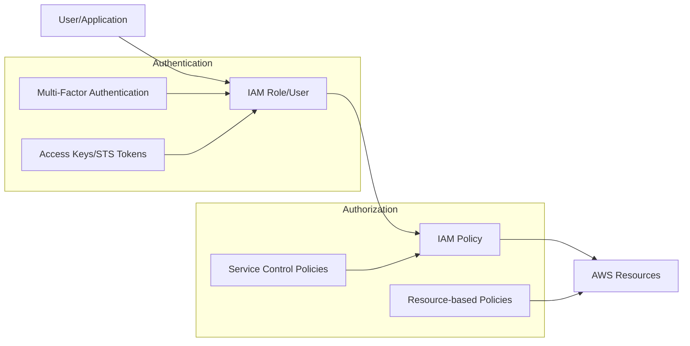

#### Key Components:
- **Users**: Individual AWS account credentials
- **Groups**: Collections of users with shared permissions
- **Roles**: Temporary credentials for services and cross-account access
- **Policies**: JSON documents defining permissions
- **MFA**: Additional security layer requiring second factor

#### Best Practices:
- Use roles instead of users for applications
- Implement least privilege principle
- Enable MFA for privileged accounts
- Use temporary credentials (STS tokens)
- Regular access reviews and rotation

### AWS Single Sign-On (SSO) and Directory Services

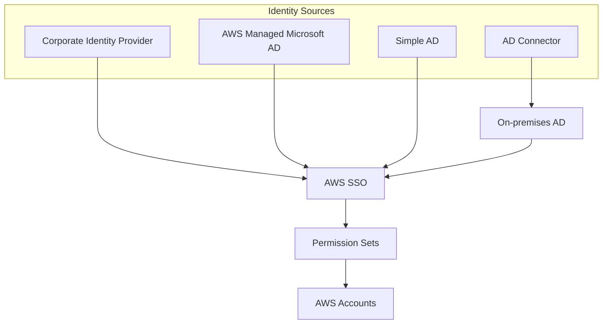

### Federated Access

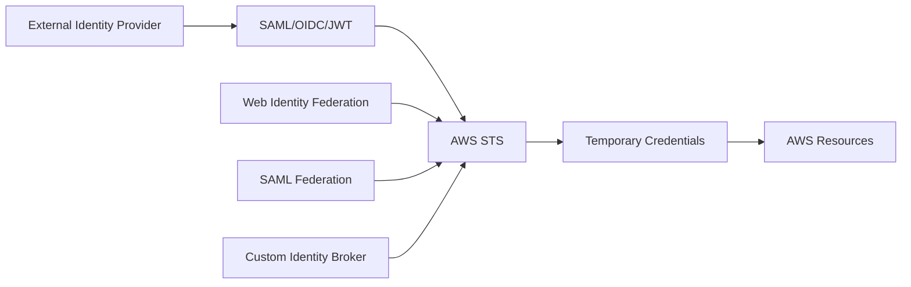

## Secure Application Tiers

### Application Layer Security

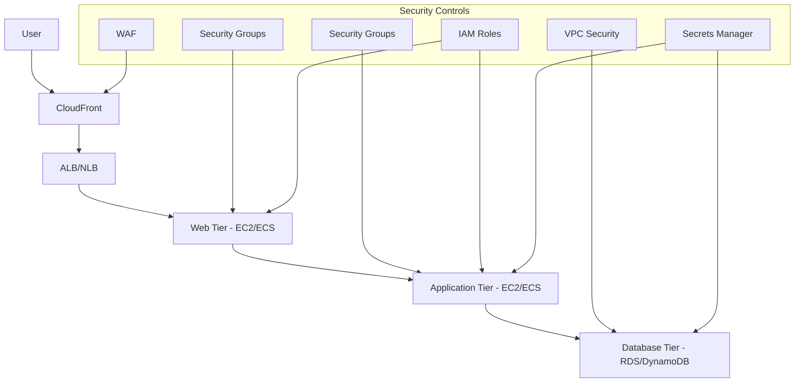

#### Security Components:
- **AWS WAF**: Web application firewall
- **Security Groups**: Virtual firewalls for instances
- **NACLs**: Subnet-level access control
- **IAM Roles**: Service-to-service authentication
- **Secrets Manager**: Credential management

### Container Security

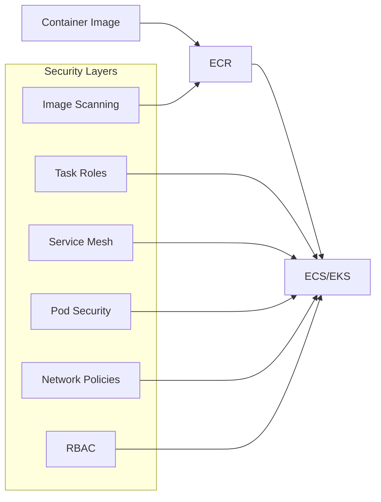

## Data Security and Encryption

### Encryption at Rest and in Transit

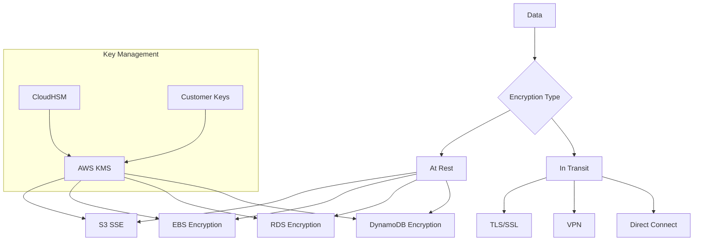

#### Encryption Services:
- **AWS KMS**: Managed key service
- **CloudHSM**: Hardware security modules
- **Certificate Manager**: SSL/TLS certificates
- **Secrets Manager**: Encrypted credential storage

### Data Classification and Access Control

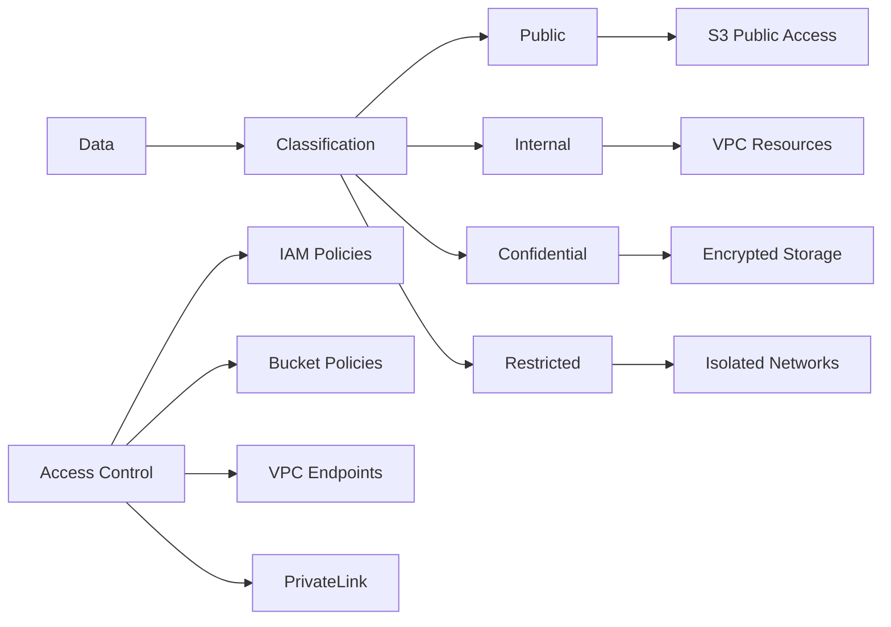

## Secure Network Architectures

### VPC Security Architecture

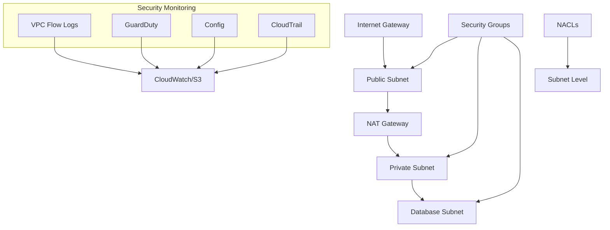

### Network Segmentation

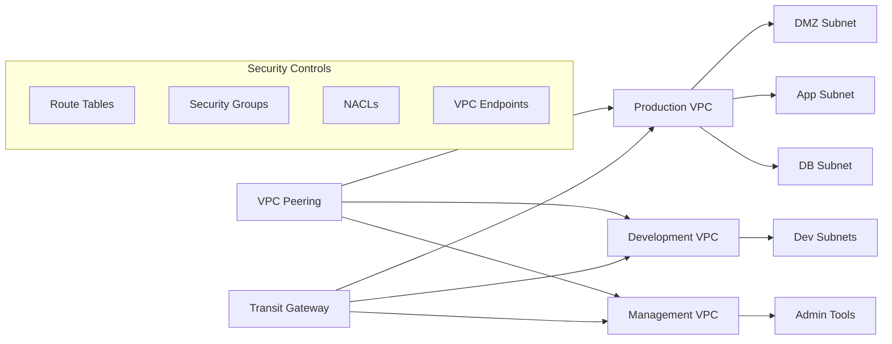

### Hybrid Connectivity Security

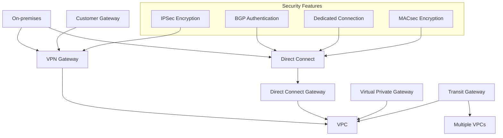

## Secure Multi-Tier Architectures

### Three-Tier Architecture Security

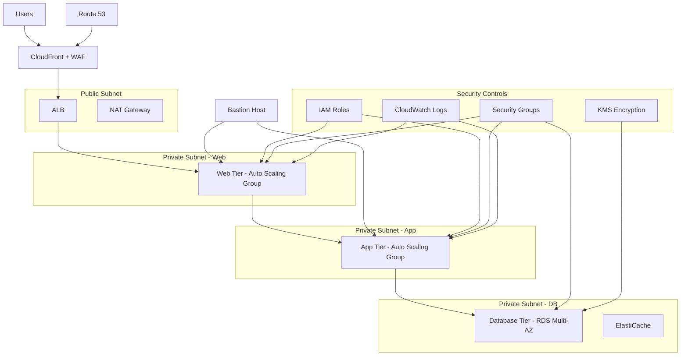

### Microservices Security

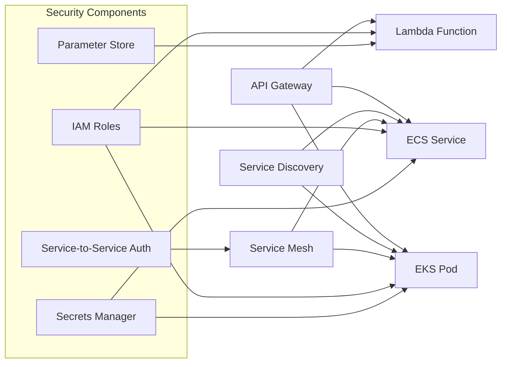

## Practice Questions

### Question 1
A company needs to provide secure access to AWS resources for their mobile application. The application should authenticate users through their existing LDAP directory. What is the most appropriate solution?

A) Create IAM users for each mobile app user
B) Use Amazon Cognito with LDAP as an identity provider
C) Implement AWS SSO with the mobile application
D) Use STS with a custom identity broker

**Answer: B**
**Explanation**: Amazon Cognito User Pools can integrate with LDAP through SAML or custom authentication flows, providing secure token-based access for mobile applications. This is more scalable than creating individual IAM users and more appropriate for mobile apps than SSO or custom brokers.

### Question 2
You need to encrypt data at rest in an S3 bucket while maintaining full control over the encryption keys. The keys must be stored in a FIPS 140-2 Level 3 validated hardware security module. What solution should you implement?

A) S3 SSE-S3 with AWS managed keys
B) S3 SSE-KMS with customer managed keys
C) S3 SSE-C with customer provided keys
D) S3 SSE-KMS with CloudHSM-backed custom key store

**Answer: D**
**Explanation**: CloudHSM provides FIPS 140-2 Level 3 validated HSMs. Using S3 SSE-KMS with a CloudHSM-backed custom key store allows full control over encryption keys while meeting the compliance requirement.

### Question 3
A web application is experiencing DDoS attacks. The application runs on EC2 instances behind an Application Load Balancer. What combination of services provides the best protection?

A) AWS Shield Standard + Security Groups
B) AWS Shield Advanced + WAF + CloudFront
C) Network ACLs + AWS Config
D) GuardDuty + CloudWatch

**Answer: B**
**Explanation**: AWS Shield Advanced provides enhanced DDoS protection, WAF protects against application layer attacks, and CloudFront acts as a global edge cache that can absorb attacks. This combination provides comprehensive protection against various attack types.

### Question 4
You need to provide temporary access to an S3 bucket for external partners without creating IAM users. The access should be limited to specific objects and expire after 24 hours. What approach should you use?

A) Create temporary IAM users with 24-hour access keys
B) Use S3 bucket policies with time-based conditions
C) Generate pre-signed URLs with 24-hour expiration
D) Implement STS assume role with external ID

**Answer: C**
**Explanation**: Pre-signed URLs provide temporary access to specific S3 objects without requiring AWS credentials. They can be configured with expiration times and are ideal for providing time-limited access to external parties.

### Question 5
A company wants to implement a security architecture where database servers can only be accessed from application servers, and application servers can only be accessed from web servers. What is the most effective way to implement this?

A) Use separate VPCs for each tier with VPC peering
B) Implement security groups with port-specific rules and source/destination restrictions
C) Use Network ACLs with subnet-level restrictions
D) Deploy all tiers in the same subnet with host-based firewalls

**Answer: B**
**Explanation**: Security groups act as virtual firewalls at the instance level and can reference other security groups as sources/destinations. This creates a layered security model where each tier can only communicate with appropriate tiers.

### Question 6
You need to audit all API calls made to your AWS account and store the logs for compliance. The logs must be encrypted and tamper-proof. What solution should you implement?

A) VPC Flow Logs with CloudWatch Logs
B) CloudTrail with S3 and log file validation
C) Config Rules with SNS notifications
D) GuardDuty with CloudWatch Events

**Answer: B**
**Explanation**: CloudTrail logs all API calls to your AWS account. When configured with S3 for storage, KMS for encryption, and log file validation enabled, it provides tamper-proof audit logs for compliance requirements.

### Question 7
A financial services company needs to implement network segmentation for PCI DSS compliance. They have web servers, application servers, and database servers that process credit card data. What architecture should they implement?

A) Single VPC with multiple availability zones
B) Separate VPCs for each application tier
C) Single VPC with multiple subnets and security groups
D) Multiple AWS accounts for each tier

**Answer: C**
**Explanation**: A single VPC with multiple subnets (public for web, private for app, isolated for DB) combined with properly configured security groups and NACLs provides effective network segmentation while maintaining operational efficiency. This approach meets PCI DSS segmentation requirements.

### Question 8
You need to provide secure access to Amazon RDS from Lambda functions. The database credentials should be automatically rotated and never stored in code. What is the best approach?

A) Store credentials in Lambda environment variables
B) Use IAM database authentication
C) Store credentials in AWS Secrets Manager with automatic rotation
D) Hardcode credentials in the Lambda function

**Answer: C**
**Explanation**: AWS Secrets Manager provides secure storage of database credentials with automatic rotation capabilities. Lambda can retrieve credentials at runtime using IAM roles, ensuring credentials are never stored in code or environment variables.

### Question 9
A company wants to implement defense in depth for their web application. The application uses CloudFront, ALB, EC2 instances, and RDS. What security controls should be implemented at each layer?

A) Only implement security groups on EC2 instances
B) WAF on CloudFront, security groups on ALB and EC2, and VPC security for RDS
C) Only use IAM policies for access control
D) Implement the same security controls at all layers

**Answer: B**
**Explanation**: Defense in depth requires implementing appropriate security controls at each layer: WAF at the edge (CloudFront), security groups for compute resources (ALB, EC2), and network isolation for data tier (RDS in private subnets).

### Question 10
You need to encrypt data in transit between your application servers and database servers within a VPC. The database doesn't support native encryption. What solution should you implement?

A) Enable VPC Flow Logs
B) Use TLS/SSL encryption between application and database
C) Implement IPSec VPN between subnets
D) Enable GuardDuty for network monitoring

**Answer: B**
**Explanation**: TLS/SSL encryption provides end-to-end encryption for data in transit between application components. Most databases and applications support TLS/SSL connections, providing encryption even when the database itself doesn't have native encryption features.

## Official Documentation

### AWS Security Documentation
- [AWS Security Best Practices](https://aws.amazon.com/architecture/security-identity-compliance/)
- [AWS Well-Architected Security Pillar](https://docs.aws.amazon.com/wellarchitected/latest/security-pillar/welcome.html)
- [AWS Security Center](https://aws.amazon.com/security/)

### Identity and Access Management
- [IAM User Guide](https://docs.aws.amazon.com/IAM/latest/UserGuide/)
- [AWS SSO User Guide](https://docs.aws.amazon.com/singlesignon/latest/userguide/)
- [STS API Reference](https://docs.aws.amazon.com/STS/latest/APIReference/)

### Encryption and Key Management
- [AWS KMS Developer Guide](https://docs.aws.amazon.com/kms/latest/developerguide/)
- [AWS CloudHSM User Guide](https://docs.aws.amazon.com/cloudhsm/latest/userguide/)
- [AWS Certificate Manager User Guide](https://docs.aws.amazon.com/acm/latest/userguide/)

### Network Security
- [VPC User Guide](https://docs.aws.amazon.com/vpc/latest/userguide/)
- [AWS WAF Developer Guide](https://docs.aws.amazon.com/waf/latest/developerguide/)
- [AWS Shield User Guide](https://docs.aws.amazon.com/waf/latest/developerguide/shield-chapter.html)

### Monitoring and Compliance
- [CloudTrail User Guide](https://docs.aws.amazon.com/cloudtrail/latest/userguide/)
- [AWS Config Developer Guide](https://docs.aws.amazon.com/config/latest/developerguide/)
- [Amazon GuardDuty User Guide](https://docs.aws.amazon.com/guardduty/latest/ug/)

### Security Services
- [AWS Security Hub User Guide](https://docs.aws.amazon.com/securityhub/latest/userguide/)
- [AWS Inspector User Guide](https://docs.aws.amazon.com/inspector/latest/userguide/)
- [AWS Secrets Manager User Guide](https://docs.aws.amazon.com/secretsmanager/latest/userguide/)
