# Domain 2: Design Resilient Architectures (26% of exam)

## Table of Contents
1. [Introduction](#introduction)
2. [Fault-Tolerant and Resilient Architectures](#fault-tolerant-and-resilient-architectures)
3. [High Availability and Disaster Recovery](#high-availability-and-disaster-recovery)
4. [Auto Scaling and Load Balancing](#auto-scaling-and-load-balancing)
5. [Decoupling Components](#decoupling-components)
6. [Reliable Storage Solutions](#reliable-storage-solutions)
7. [Practice Questions](#practice-questions)
8. [Official Documentation](#official-documentation)

## Introduction

This domain focuses on designing resilient architectures that can withstand failures and continue operating. You'll learn about high availability, disaster recovery, auto scaling, decoupling, and reliable storage solutions.

## Fault-Tolerant and Resilient Architectures

### Multi-AZ Deployments

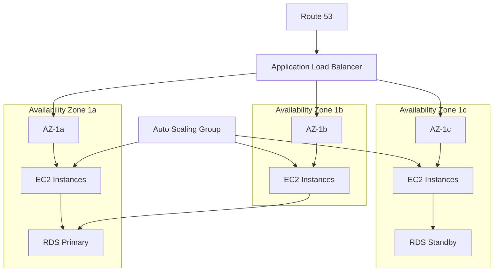

#### Key Principles:
- **Distribute across AZs**: Spread resources across multiple availability zones
- **Eliminate single points of failure**: Design redundancy at every layer
- **Automatic failover**: Implement automated recovery mechanisms
- **Health checks**: Monitor component health for rapid failure detection

### Circuit Breaker Pattern

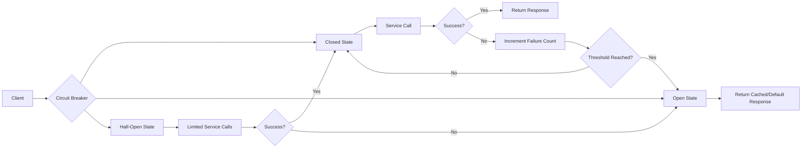

### Bulkhead Pattern

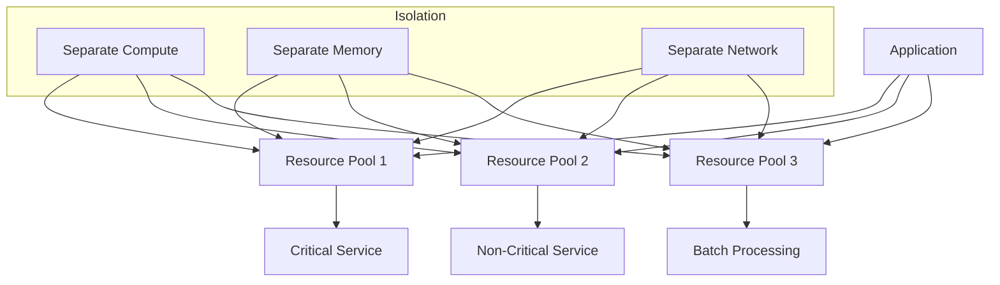

## High Availability and Disaster Recovery

### RTO and RPO Requirements

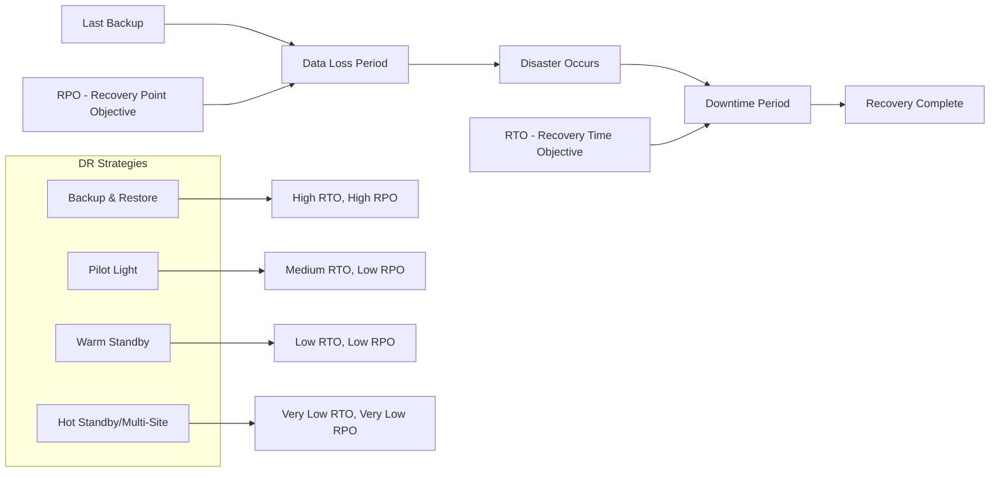

### Disaster Recovery Strategies

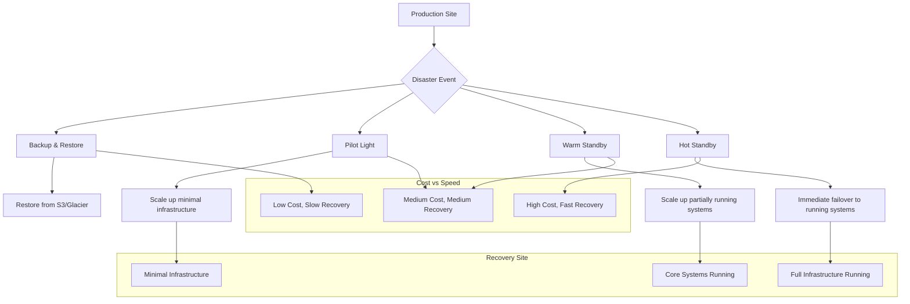

### Cross-Region Replication

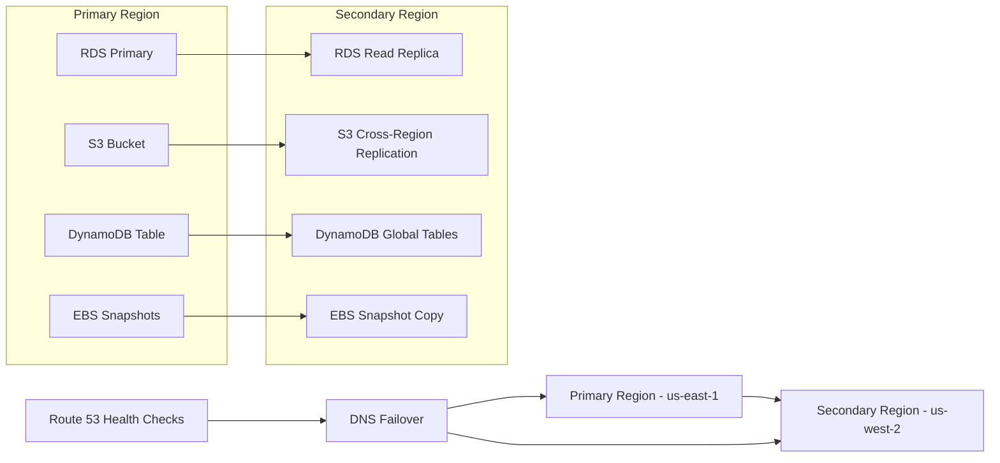

## Auto Scaling and Load Balancing

### Auto Scaling Architecture

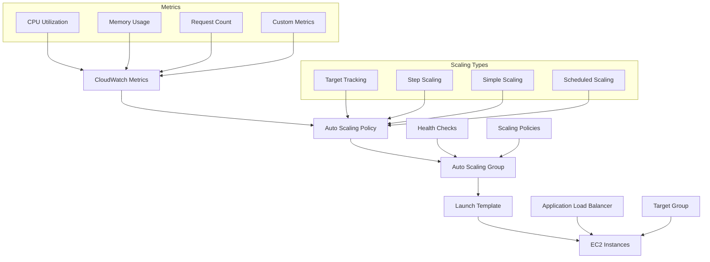

### Load Balancer Types

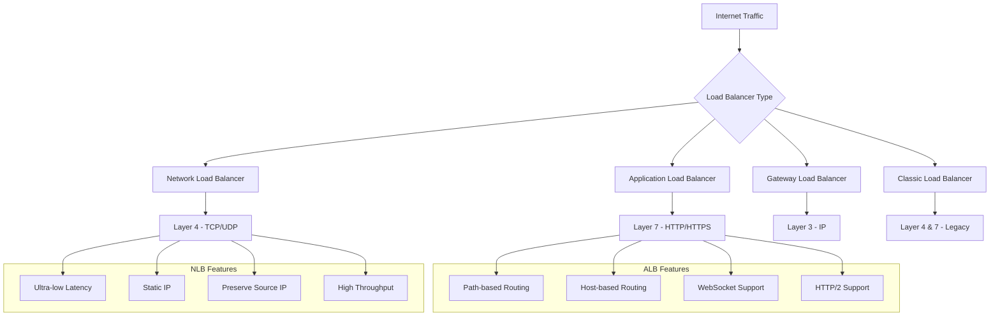

### Multi-Region Load Balancing

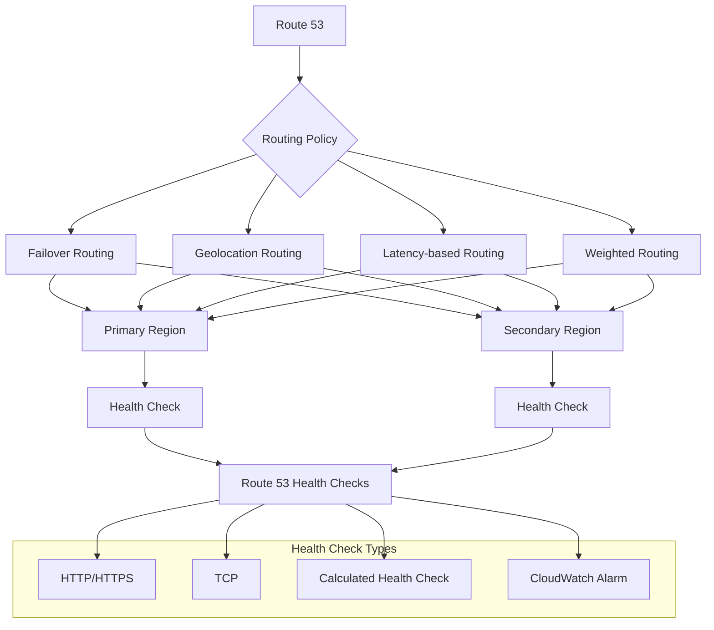

## Decoupling Components

### Message Queuing with SQS

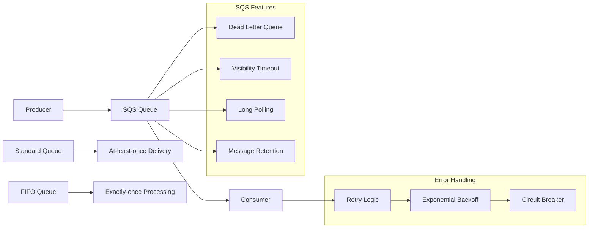

### Event-Driven Architecture with SNS

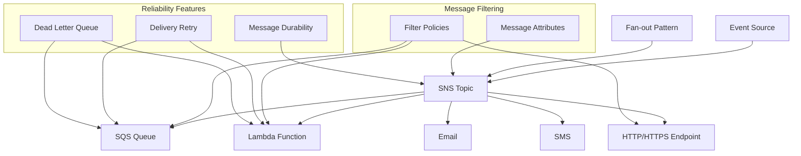

### Serverless Event Processing

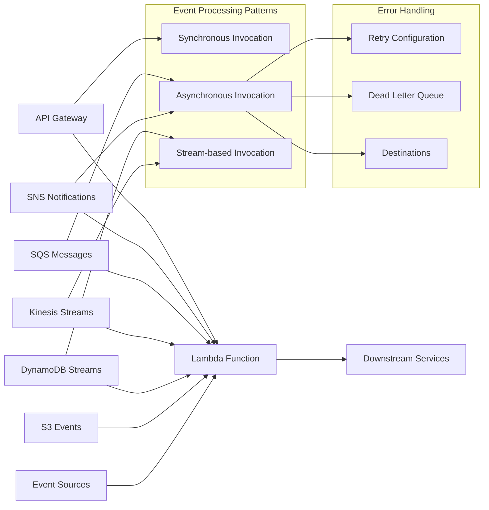

### Microservices Communication

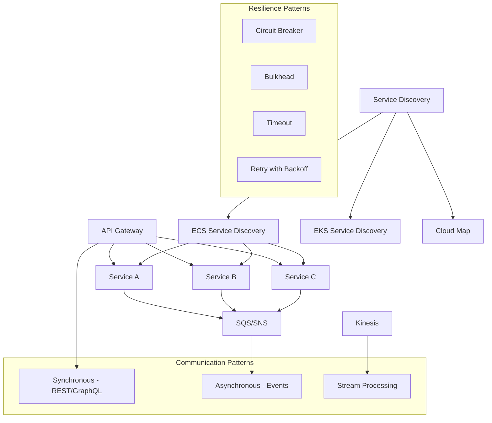

## Reliable Storage Solutions

### S3 Storage Classes and Lifecycle

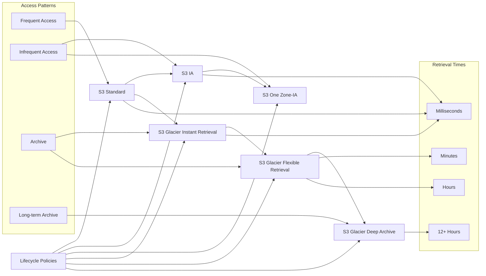

### Multi-Region Storage Replication

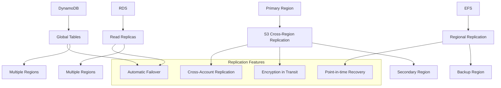

### Database High Availability

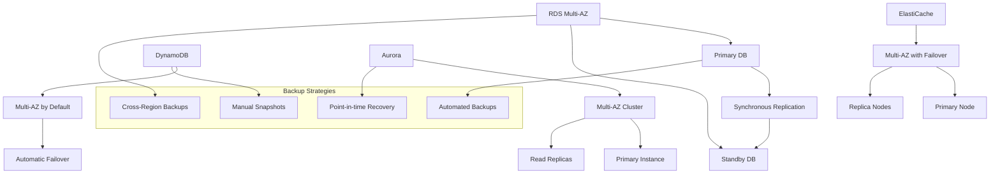

## Practice Questions

### Question 1
A company needs to ensure their web application can handle sudden traffic spikes without manual intervention. The application runs on EC2 instances behind an Application Load Balancer. What is the most appropriate solution?

A) Increase the instance size to handle peak load
B) Implement Auto Scaling with target tracking scaling policy
C) Use reserved instances for predictable capacity
D) Deploy instances across multiple regions

**Answer: B**
**Explanation**: Auto Scaling with target tracking scaling policy automatically adjusts the number of instances based on metrics like CPU utilization or request count. This provides automatic scaling without manual intervention and is cost-effective as it only scales when needed.

### Question 2
You need to design a disaster recovery strategy for a critical application with an RTO of 1 hour and RPO of 15 minutes. The application uses EC2 instances, RDS, and S3. What DR strategy should you implement?

A) Backup and restore from S3 and RDS snapshots
B) Pilot light with automated scaling scripts
C) Warm standby with minimal resources running
D) Hot standby with full duplicate environment

**Answer: C**
**Explanation**: Warm standby strategy runs minimal resources in the DR region and can be scaled up within 1 hour (RTO). With RDS read replicas and frequent backups, the RPO of 15 minutes can be achieved. This balances cost and recovery time requirements.

### Question 3
A microservices application experiences cascading failures when one service becomes unavailable. How can you improve the resilience of the architecture?

A) Increase the size of all EC2 instances
B) Implement circuit breaker pattern and bulkhead isolation
C) Deploy all services in a single availability zone
D) Use synchronous communication between all services

**Answer: B**
**Explanation**: Circuit breaker pattern prevents calls to failing services, and bulkhead isolation separates resources to prevent failures from spreading. This combination prevents cascading failures and improves overall system resilience.

### Question 4
Your application needs to process messages asynchronously with guaranteed order processing. Duplicate processing must be avoided. What AWS service configuration should you use?

A) SQS Standard Queue with Lambda
B) SQS FIFO Queue with Lambda
C) SNS Topic with multiple subscribers
D) Kinesis Data Streams with Lambda

**Answer: B**
**Explanation**: SQS FIFO Queue provides exactly-once processing and maintains message order. When combined with Lambda, it ensures messages are processed in order without duplicates, meeting the requirements.

### Question 5
A company wants to implement a fan-out messaging pattern where a single message triggers multiple processing workflows. What is the most suitable AWS service combination?

A) SQS with multiple consumers polling the same queue
B) SNS topic with multiple SQS queue subscriptions
C) Lambda function with multiple invocations
D) Kinesis Data Streams with multiple consumers

**Answer: B**
**Explanation**: SNS fan-out pattern allows a single message to be delivered to multiple SQS queues, each feeding different processing workflows. This decouples the message producer from multiple consumers and provides reliable delivery.

### Question 6
Your web application serves global users and needs to minimize latency while providing automatic failover capability. What combination of services should you implement?

A) Single region deployment with larger instances
B) CloudFront with Route 53 latency-based routing to multi-region deployments
C) Multi-AZ deployment in a single region
D) ELB with instances across multiple AZs

**Answer: B**
**Explanation**: CloudFront provides global edge locations for content delivery, while Route 53 latency-based routing directs users to the nearest healthy region. This combination minimizes latency globally and provides automatic failover.

### Question 7
An application uses RDS MySQL and experiences performance issues during read-heavy workloads. The application can tolerate eventual consistency for read operations. What is the most cost-effective solution?

A) Upgrade to a larger RDS instance type
B) Implement RDS read replicas and modify application to use them for reads
C) Switch to DynamoDB for all operations
D) Enable RDS Multi-AZ deployment

**Answer: B**
**Explanation**: RDS read replicas provide additional read capacity at lower cost than scaling up the primary instance. Since the application can tolerate eventual consistency, read replicas are ideal for offloading read traffic from the primary database.

### Question 8
You need to store application logs that are frequently accessed for the first 30 days, occasionally accessed for 90 days, and then archived for 7 years for compliance. What S3 storage strategy should you implement?

A) Store everything in S3 Standard for 7 years
B) Use S3 Intelligent-Tiering for automatic optimization
C) Implement lifecycle policy: Standard → IA → Glacier → Deep Archive
D) Store all logs in S3 Glacier Deep Archive

**Answer: C**
**Explanation**: A lifecycle policy transitioning from S3 Standard (frequent access) to IA (occasional access) to Glacier (archive) to Deep Archive (long-term compliance) optimizes costs based on access patterns while meeting retention requirements.

### Question 9
A batch processing application needs to process large files uploaded to S3. The processing should be triggered automatically and handle failures gracefully. What architecture should you implement?

A) CloudWatch Events → Lambda → Process files directly
B) S3 Event → SQS → Lambda → Process with retry logic and DLQ
C) Manual polling with EC2 instances
D) S3 Event → SNS → Email notification for manual processing

**Answer: B**
**Explanation**: S3 events trigger SQS messages, which are processed by Lambda with built-in retry logic and dead letter queue (DLQ) for failed messages. This provides automatic triggering, retry capabilities, and failure handling.

### Question 10
Your application requires a database that can automatically scale read capacity based on demand and provide single-digit millisecond latency. What AWS service should you use?

A) RDS with read replicas
B) DynamoDB with Auto Scaling
C) ElastiCache for Redis
D) Aurora Serverless

**Answer: B**
**Explanation**: DynamoDB provides single-digit millisecond latency and can automatically scale read capacity using Auto Scaling based on utilization metrics. This meets both the performance and scaling requirements without manual intervention.

## Official Documentation

### High Availability and Disaster Recovery
- [AWS Architecture Center - Disaster Recovery](https://aws.amazon.com/architecture/disaster-recovery/)
- [AWS Well-Architected Reliability Pillar](https://docs.aws.amazon.com/wellarchitected/latest/reliability-pillar/welcome.html)
- [Building Fault-Tolerant Applications on AWS](https://docs.aws.amazon.com/whitepapers/latest/fault-tolerant-components/welcome.html)

### Auto Scaling and Load Balancing
- [Amazon EC2 Auto Scaling User Guide](https://docs.aws.amazon.com/autoscaling/ec2/userguide/)
- [Elastic Load Balancing User Guide](https://docs.aws.amazon.com/elasticloadbalancing/latest/userguide/)
- [Application Load Balancer User Guide](https://docs.aws.amazon.com/elasticloadbalancing/latest/application/)

### Messaging and Decoupling
- [Amazon SQS Developer Guide](https://docs.aws.amazon.com/AWSSimpleQueueService/latest/SQSDeveloperGuide/)
- [Amazon SNS Developer Guide](https://docs.aws.amazon.com/sns/latest/dg/)
- [AWS Lambda Developer Guide](https://docs.aws.amazon.com/lambda/latest/dg/)

### Storage Solutions
- [Amazon S3 User Guide](https://docs.aws.amazon.com/AmazonS3/latest/userguide/)
- [Amazon RDS User Guide](https://docs.aws.amazon.com/AmazonRDS/latest/UserGuide/)
- [Amazon DynamoDB Developer Guide](https://docs.aws.amazon.com/amazondynamodb/latest/developerguide/)

### DNS and Global Infrastructure
- [Amazon Route 53 Developer Guide](https://docs.aws.amazon.com/Route53/latest/DeveloperGuide/)
- [Amazon CloudFront Developer Guide](https://docs.aws.amazon.com/AmazonCloudFront/latest/DeveloperGuide/)
- [AWS Global Infrastructure](https://aws.amazon.com/about-aws/global-infrastructure/)

### Monitoring and Health Checks
- [Amazon CloudWatch User Guide](https://docs.aws.amazon.com/AmazonCloudWatch/latest/monitoring/)
- [AWS Systems Manager User Guide](https://docs.aws.amazon.com/systems-manager/latest/userguide/)
- [AWS X-Ray Developer Guide](https://docs.aws.amazon.com/xray/latest/devguide/)
