# Domain 3: Design High-Performing Architectures (24% of exam)

## Table of Contents
1. [Introduction](#introduction)
2. [High-Performance Computing Solutions](#high-performance-computing-solutions)
3. [Storage Performance Optimization](#storage-performance-optimization)
4. [Database Performance](#database-performance)
5. [Network Performance](#network-performance)
6. [Caching Strategies](#caching-strategies)
7. [Content Delivery and Edge Services](#content-delivery-and-edge-services)
8. [Practice Questions](#practice-questions)
9. [Official Documentation](#official-documentation)

## Introduction

This domain focuses on designing high-performing architectures that meet performance requirements efficiently. You'll learn about compute optimization, storage performance, database tuning, network optimization, and caching strategies.

## High-Performance Computing Solutions

### EC2 Instance Types and Optimization

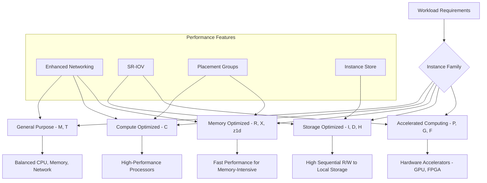

### Placement Groups

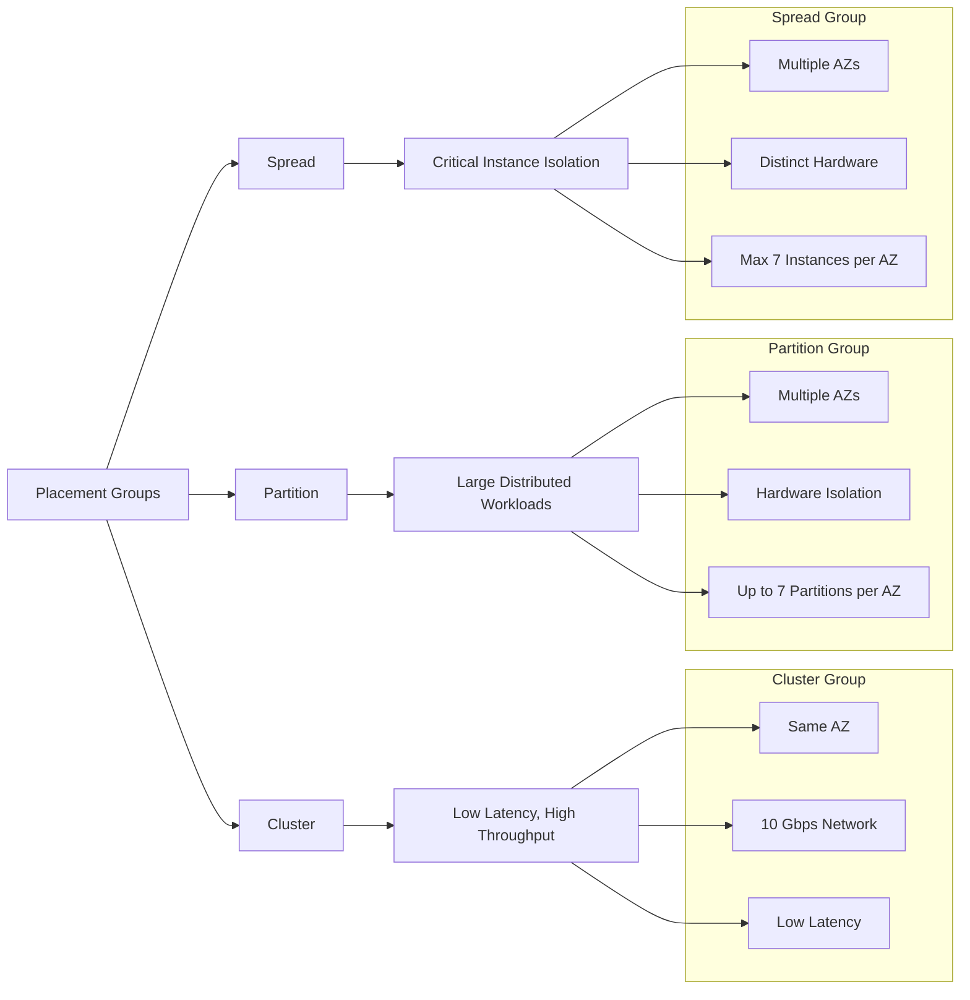

### Container Performance Optimization

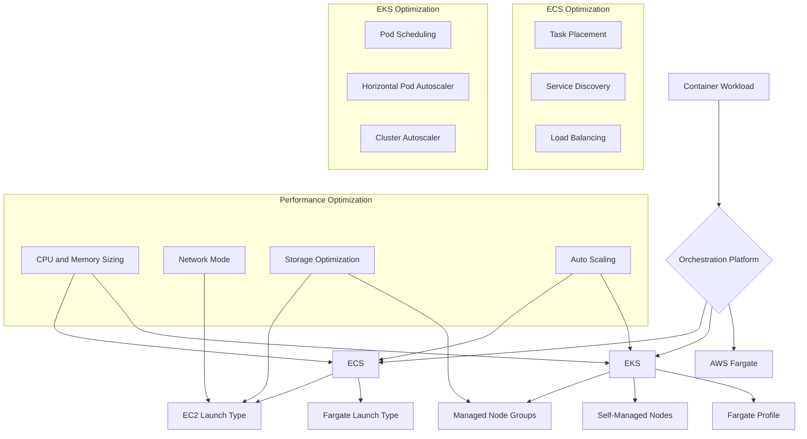

### Serverless Performance

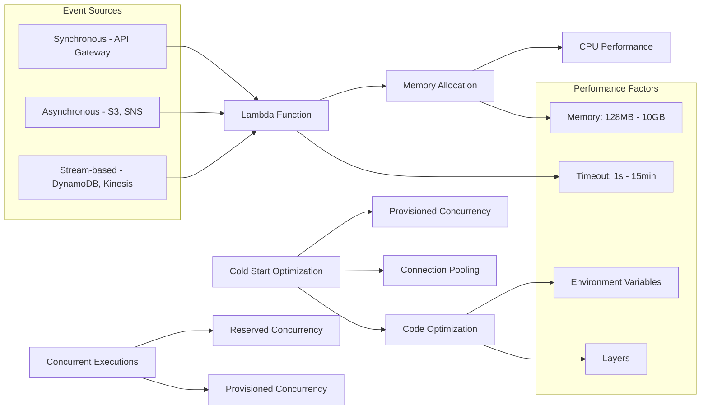

## Storage Performance Optimization

### EBS Volume Types and Performance

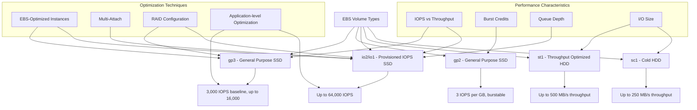

### Instance Store Performance

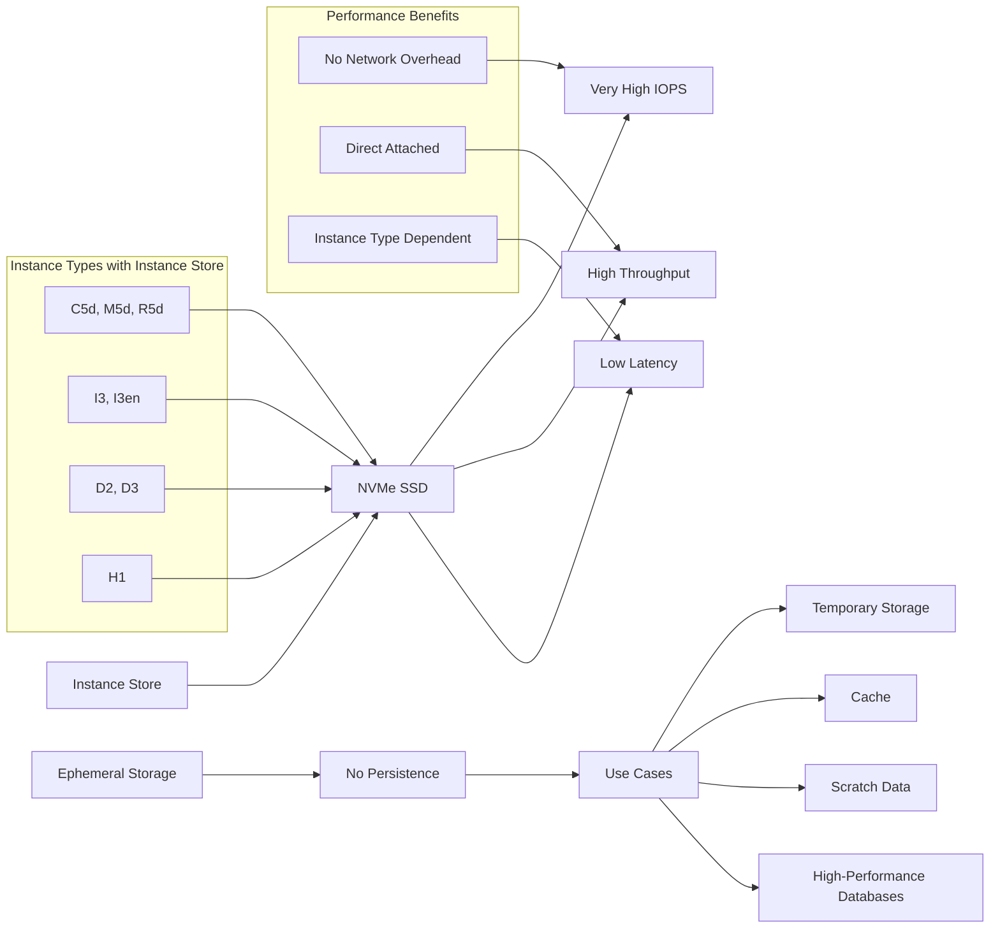

### S3 Performance Optimization

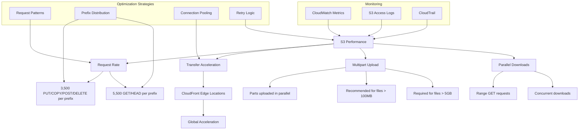

### EFS Performance

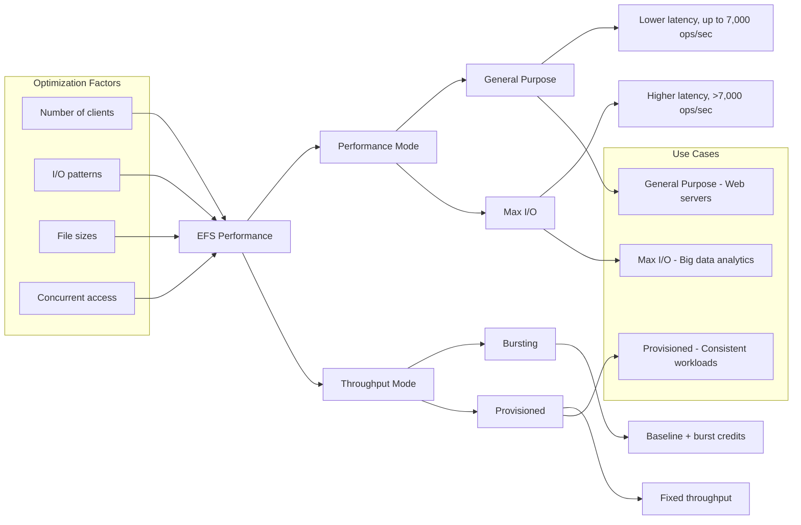

## Database Performance

### RDS Performance Optimization

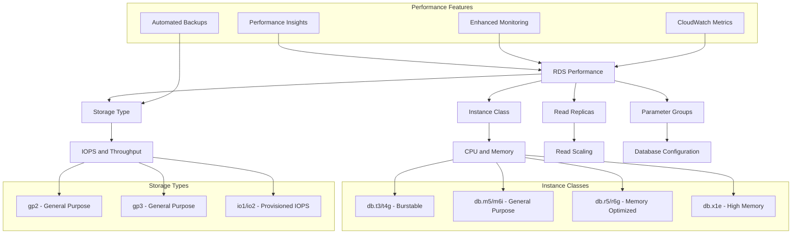

### DynamoDB Performance

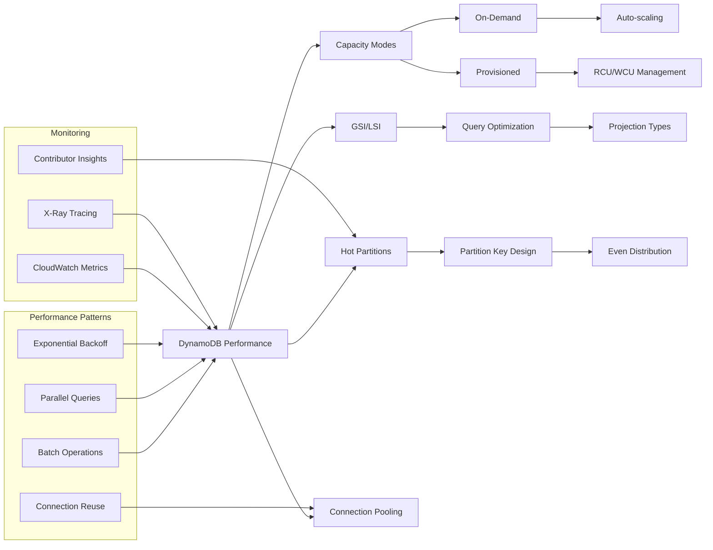

### Aurora Performance

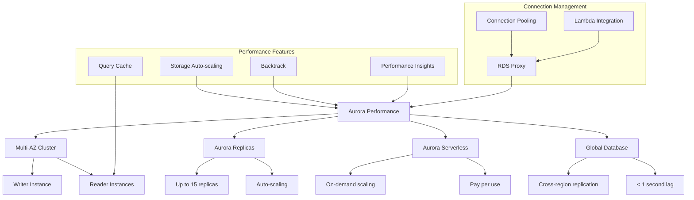

## Network Performance

### Enhanced Networking

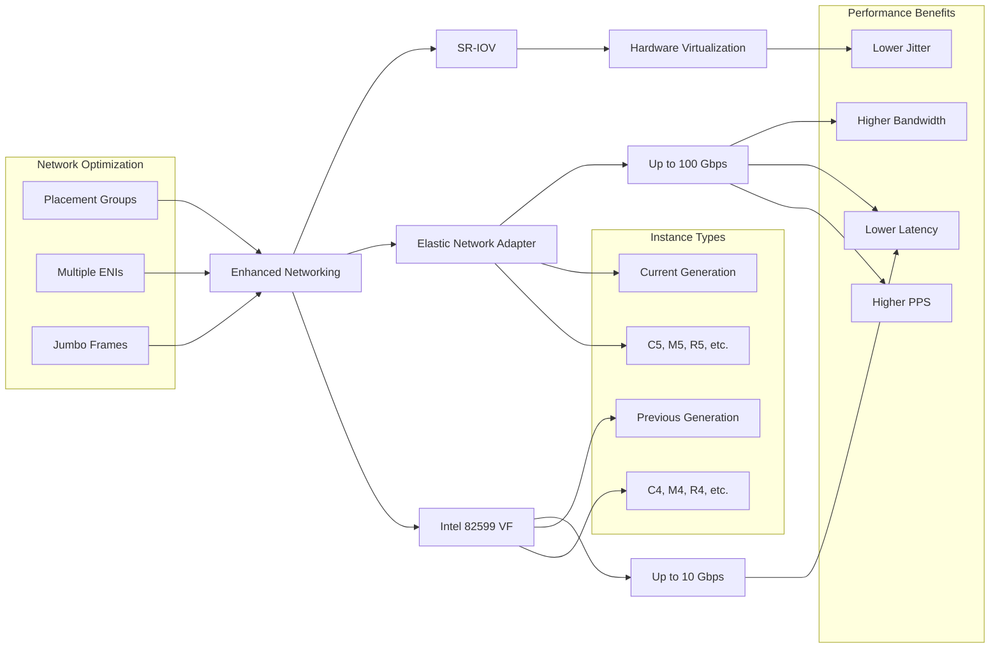

### Load Balancer Performance

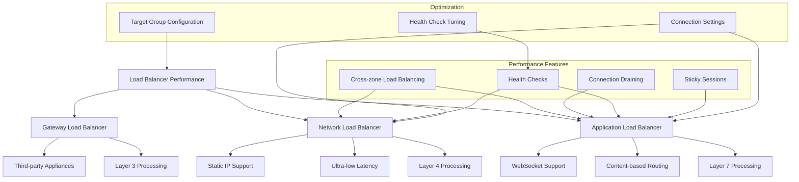

### VPC Performance

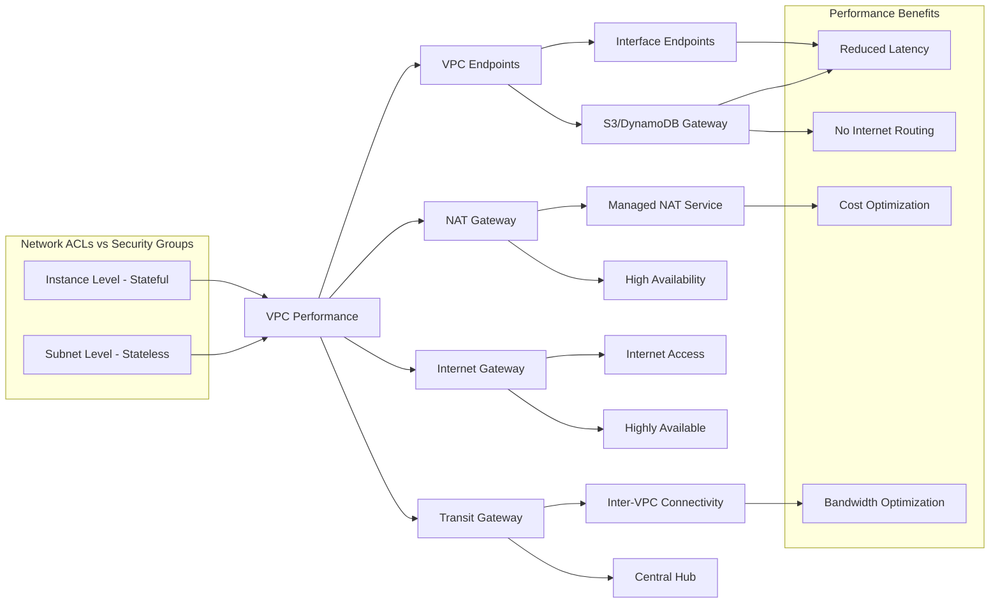

## Caching Strategies

### ElastiCache Performance

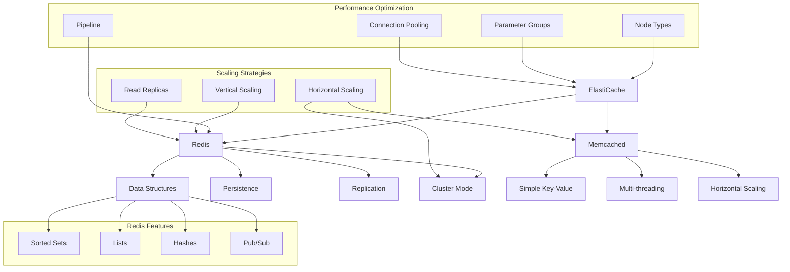

### Application-Level Caching

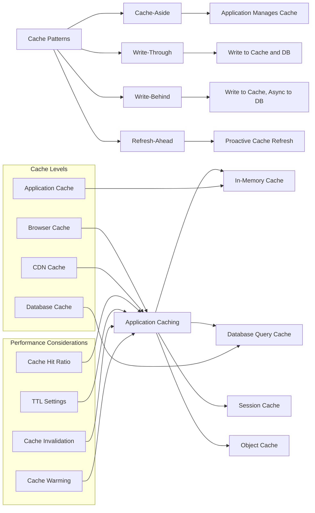

### CDN and Edge Caching

```mermaid
graph TD
    A[CloudFront CDN] --> B[Edge Locations]
    A --> C[Regional Edge Caches]
    A --> D[Origin Servers]
    
    B --> E[Global Distribution]
    C --> F[Larger Cache]
    D --> G[S3, ALB, Custom]
    
    subgraph "Caching Behaviors"
        H[TTL Settings]
        I[Cache Key]
        J[Query String Parameters]
        K[Headers]
    end
    
    H --> A
    I --> A
    J --> A
    K --> A
    
    subgraph "Performance Features"
        L[HTTP/2 Support]
        M[Gzip Compression]
        N[Origin Shield]
        O[Lambda@Edge]
    end
    
    L --> A
    M --> A
    N --> C
    O --> B
    
    subgraph "Optimization"
        P[Cache Hit Ratio]
        Q[Origin Offload]
        R[Transfer Acceleration]
    end
    
    P --> A
    Q --> A
    R --> A
```

## Content Delivery and Edge Services

### CloudFront Performance Optimization

```mermaid
graph LR
    A[CloudFront Optimization] --> B[Distribution Settings]
    A --> C[Cache Behaviors]
    A --> D[Origin Configuration]
    A --> E[Edge Functions]
    
    B --> F[Price Class]
    B --> G[Compression]
    B --> H[HTTP Versions]
    
    C --> I[Path Patterns]
    C --> J[TTL Values]
    C --> K[Query Strings]
    
    D --> L[Origin Timeout]
    D --> M[Keep-alive Timeout]
    D --> N[Origin Shield]
    
    E --> O[Lambda@Edge]
    E --> P[CloudFront Functions]
    
    subgraph "Performance Features"
        Q[Real-time Logs]
        R[Monitoring]
        S[Cache Statistics]
    end
    
    Q --> A
    R --> A
    S --> A
    
    subgraph "Use Cases"
        T[Static Content]
        U[Dynamic Content]
        V[API Acceleration]
        W[Live Streaming]
    end
    
    T --> A
    U --> A
    V --> A
    W --> A
```

### Global Accelerator

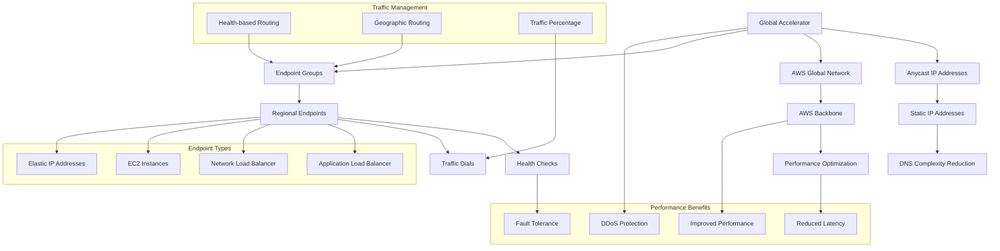

## Practice Questions

### Question 1
A web application experiences high CPU utilization during peak hours. The application is CPU-intensive and requires consistent high performance. What instance type should you choose?

A) T3.large with unlimited mode
B) M5.large for balanced performance
C) C5.large for compute optimization
D) R5.large for memory optimization

**Answer: C**
**Explanation**: C5 instances are compute-optimized with high-performance processors, ideal for CPU-intensive applications requiring consistent high performance. T3 instances are burstable and not suitable for sustained high CPU usage.

### Question 2
Your application needs to achieve 20,000 IOPS consistently. What EBS volume type should you choose?

A) gp3 with baseline IOPS
B) gp2 with burst credits
C) io2 with provisioned IOPS
D) st1 for throughput optimization

**Answer: C**
**Explanation**: io2 volumes provide consistent provisioned IOPS up to 64,000 IOPS, making them ideal for applications requiring specific IOPS performance. gp3 baseline is 3,000 IOPS, and gp2 depends on volume size and burst credits.

### Question 3
A database application requires the lowest possible latency for storage access. What storage solution should you implement?

A) EBS gp3 volumes
B) EBS io2 volumes
C) Instance store (NVMe SSD)
D) EFS with Max I/O mode

**Answer: C**
**Explanation**: Instance store provides the lowest latency as it's directly attached to the instance without network overhead. However, data is ephemeral and lost when the instance stops.

### Question 4
Your application serves global users and needs to minimize latency for API calls. What combination provides the best performance?

A) Single region deployment with larger instances
B) CloudFront with API Gateway caching
C) Global Accelerator with ALB endpoints in multiple regions
D) Route 53 latency-based routing only

**Answer: C**
**Explanation**: Global Accelerator routes traffic over AWS's global network to the nearest healthy endpoint, providing optimal performance for dynamic content and API calls. CloudFront is better for static content caching.

### Question 5
A DynamoDB table experiences hot partition issues. What is the most effective solution?

A) Increase the table's provisioned capacity
B) Use a composite partition key with better distribution
C) Switch to on-demand billing mode
D) Add more global secondary indexes

**Answer: B**
**Explanation**: Hot partitions occur when the partition key doesn't distribute data evenly. Using a composite partition key or adding a random suffix helps distribute data across multiple partitions, resolving hot partition issues.

### Question 6
Your Lambda function experiences cold starts affecting performance. What optimization strategy should you implement?

A) Increase memory allocation
B) Use provisioned concurrency
C) Implement connection pooling
D) All of the above

**Answer: D**
**Explanation**: All options help optimize Lambda performance: higher memory allocation provides more CPU, provisioned concurrency eliminates cold starts, and connection pooling reduces initialization overhead.

### Question 7
An application needs to cache session data with high availability and data structure support. What caching solution should you use?

A) ElastiCache for Memcached
B) ElastiCache for Redis with replication
C) DynamoDB as a cache
D) S3 with short TTL

**Answer: B**
**Explanation**: ElastiCache for Redis supports complex data structures, provides high availability through replication, and is ideal for session storage. Memcached doesn't support replication or data structures.

### Question 8
A read-heavy database workload needs to scale read capacity without impacting write performance. What solution should you implement?

A) Upgrade to a larger RDS instance
B) Implement RDS read replicas
C) Use DynamoDB Auto Scaling
D) Enable RDS Multi-AZ

**Answer: B**
**Explanation**: RDS read replicas provide additional read capacity by offloading read traffic from the primary database. They can be created in multiple AZs or regions for better distribution.

### Question 9
Your application uploads large files (>5GB) to S3 and needs optimal upload performance. What upload strategy should you use?

A) Single-part upload with S3 Transfer Acceleration
B) Multipart upload with parallel parts
C) Multiple single-part uploads
D) S3 Batch Operations

**Answer: B**
**Explanation**: Multipart upload is required for files >5GB and allows parallel upload of parts, significantly improving performance. Transfer Acceleration can be combined with multipart uploads for further optimization.

### Question 10
A web application behind CloudFront has a low cache hit ratio. What optimization should you implement?

A) Increase TTL values for all content
B) Configure cache behaviors based on content type
C) Use origin shield
D) Enable compression

**Answer: B**
**Explanation**: Configuring different cache behaviors for different content types (static vs dynamic) with appropriate TTL values improves cache hit ratio. Static content can have longer TTLs while dynamic content has shorter TTLs.

## Official Documentation

### Compute Performance
- [Amazon EC2 Instance Types](https://aws.amazon.com/ec2/instance-types/)
- [Amazon EC2 User Guide for Linux Instances](https://docs.aws.amazon.com/AWSEC2/latest/UserGuide/)
- [AWS Lambda Developer Guide](https://docs.aws.amazon.com/lambda/latest/dg/)
- [Amazon ECS Developer Guide](https://docs.aws.amazon.com/AmazonECS/latest/developerguide/)

### Storage Performance
- [Amazon EBS User Guide](https://docs.aws.amazon.com/AWSEC2/latest/UserGuide/AmazonEBS.html)
- [Amazon S3 Performance Guidelines](https://docs.aws.amazon.com/AmazonS3/latest/userguide/optimizing-performance.html)
- [Amazon EFS User Guide](https://docs.aws.amazon.com/efs/latest/ug/)

### Database Performance
- [Amazon RDS User Guide](https://docs.aws.amazon.com/AmazonRDS/latest/UserGuide/)
- [Amazon DynamoDB Developer Guide](https://docs.aws.amazon.com/amazondynamodb/latest/developerguide/)
- [Amazon Aurora User Guide](https://docs.aws.amazon.com/AmazonRDS/latest/AuroraUserGuide/)

### Network Performance
- [Amazon VPC User Guide](https://docs.aws.amazon.com/vpc/latest/userguide/)
- [Elastic Load Balancing User Guide](https://docs.aws.amazon.com/elasticloadbalancing/)
- [AWS Global Accelerator Developer Guide](https://docs.aws.amazon.com/global-accelerator/latest/dg/)

### Caching and Content Delivery
- [Amazon ElastiCache User Guide](https://docs.aws.amazon.com/AmazonElastiCache/latest/mem-ug/)
- [Amazon CloudFront Developer Guide](https://docs.aws.amazon.com/AmazonCloudFront/latest/DeveloperGuide/)
- [AWS Caching Best Practices](https://aws.amazon.com/caching/)

### Performance Monitoring
- [Amazon CloudWatch User Guide](https://docs.aws.amazon.com/AmazonCloudWatch/latest/monitoring/)
- [AWS X-Ray Developer Guide](https://docs.aws.amazon.com/xray/latest/devguide/)
- [Amazon RDS Performance Insights](https://docs.aws.amazon.com/AmazonRDS/latest/UserGuide/USER_PerfInsights.html)
