# Domain 4: Design Cost-Optimized Architectures (20% of exam)

## Table of Contents
1. [Introduction](#introduction)
2. [Cost-Effective Compute Solutions](#cost-effective-compute-solutions)
3. [Storage Cost Optimization](#storage-cost-optimization)
4. [Database Cost Optimization](#database-cost-optimization)
5. [Network Cost Optimization](#network-cost-optimization)
6. [Cost Monitoring and Management](#cost-monitoring-and-management)
7. [Resource Lifecycle Management](#resource-lifecycle-management)
8. [Practice Questions](#practice-questions)
9. [Official Documentation](#official-documentation)

## Introduction

This domain focuses on designing cost-optimized architectures that meet business requirements while minimizing costs. You'll learn about choosing the right pricing models, optimizing resource utilization, and implementing cost controls.

## Cost-Effective Compute Solutions

### EC2 Pricing Models

```mermaid
graph TD
    A[EC2 Pricing Models] --> B[On-Demand]
    A --> C[Reserved Instances]
    A --> D[Spot Instances]
    A --> E[Dedicated Hosts]
    A --> F[Dedicated Instances]
    A --> G[Savings Plans]
    
    B --> H[Pay per hour/second]
    B --> I[No commitment]
    B --> J[Highest cost]
    
    C --> K[1 or 3 year commitment]
    C --> L[Up to 75% savings]
    C --> M[Standard/Convertible/Scheduled]
    
    D --> N[Unused EC2 capacity]
    D --> O[Up to 90% savings]
    D --> P[Can be interrupted]
    
    G --> Q[Compute Savings Plans]
    G --> R[EC2 Instance Savings Plans]
    G --> S[1 or 3 year commitment]
    
    subgraph "Use Cases"
        T[On-Demand: Unpredictable workloads]
        U[Reserved: Steady state workloads]
        V[Spot: Fault-tolerant workloads]
        W[Savings Plans: Flexible commitment]
    end
    
    B --> T
    C --> U
    D --> V
    G --> W
```

### Spot Instance Strategies

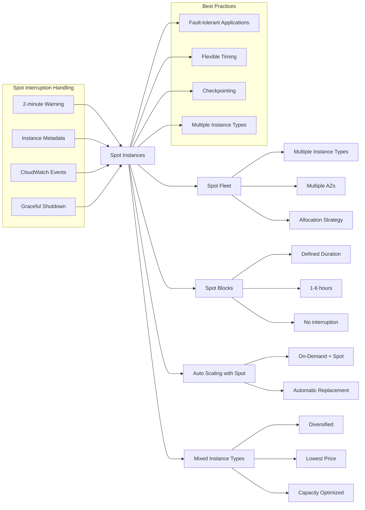

### Auto Scaling Cost Optimization

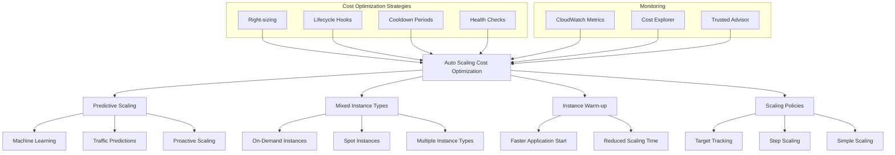

### Serverless Cost Optimization

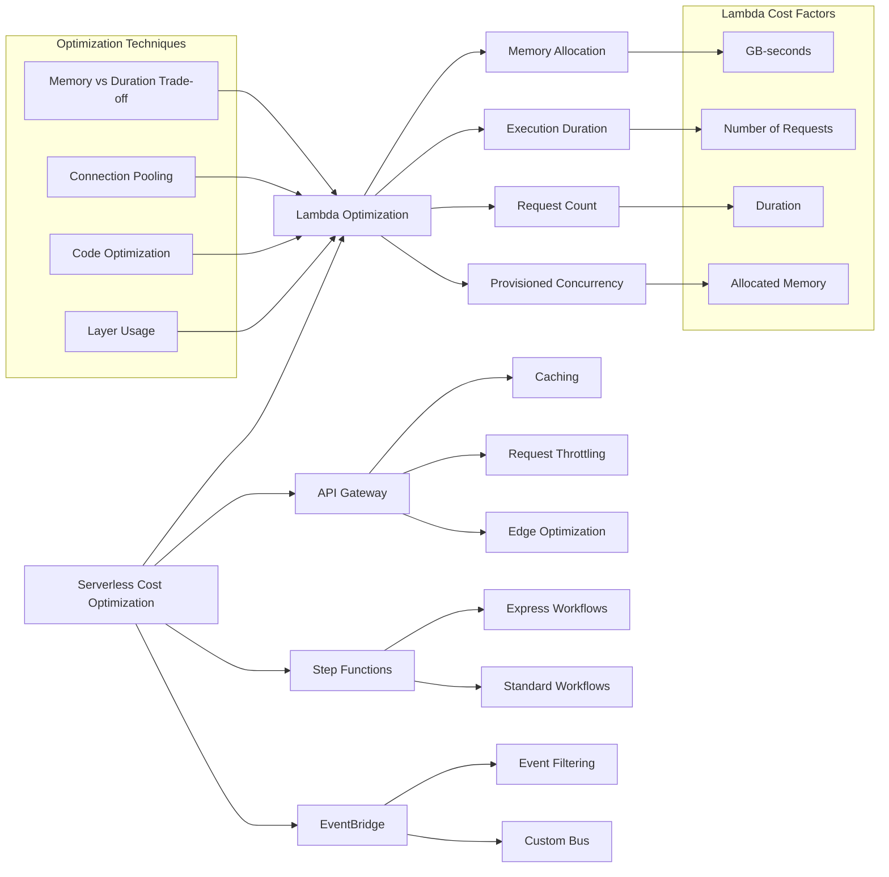

## Storage Cost Optimization

### S3 Storage Classes and Lifecycle

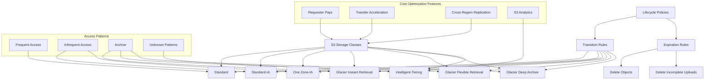

### EBS Cost Optimization

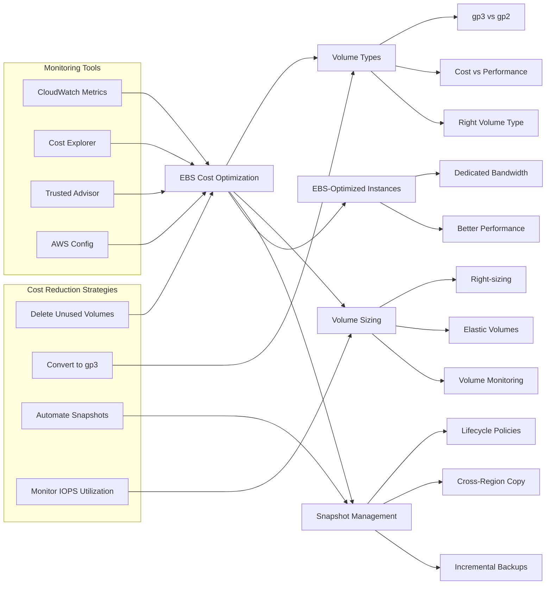

### Data Transfer Cost Optimization

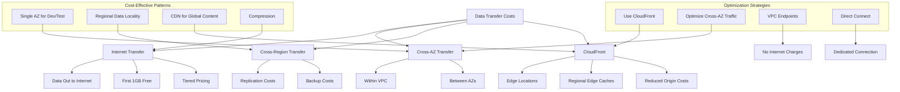

## Database Cost Optimization

### RDS Cost Optimization

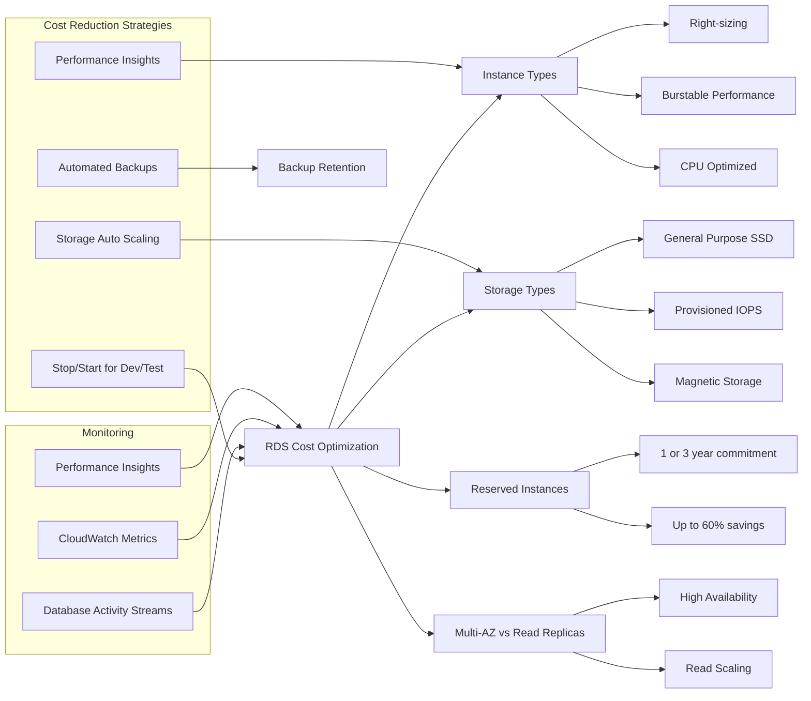

### DynamoDB Cost Optimization

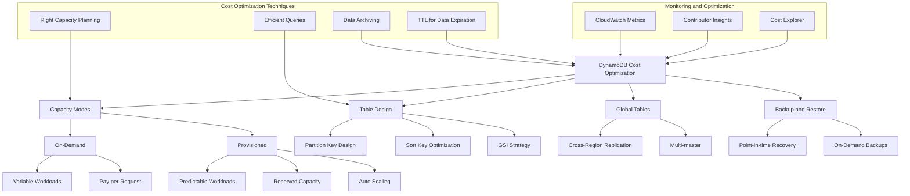

### Aurora Cost Optimization

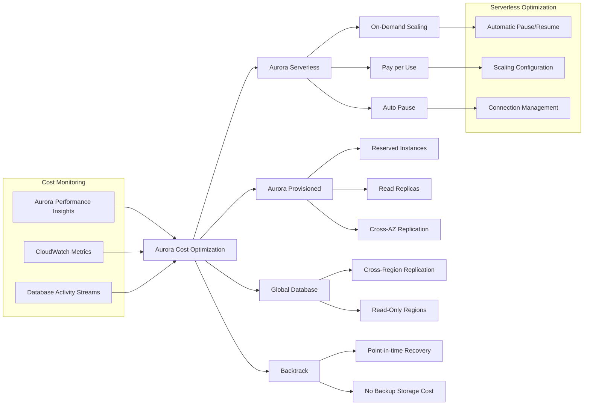

## Network Cost Optimization

### VPC Cost Optimization

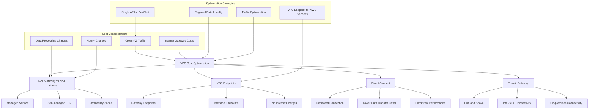

### Load Balancer Cost Optimization

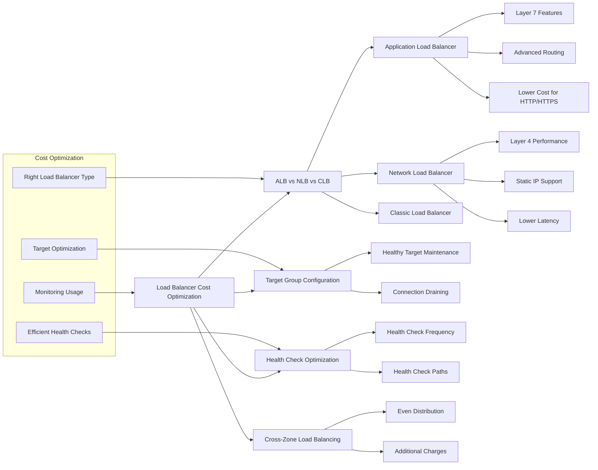

### CDN Cost Optimization

```mermaid
graph TD
    A[CloudFront Cost Optimization] --> B[Price Classes]
    A --> C[Cache Optimization]
    A --> D[Origin Shield]
    A --> E[Compression]
    
    B --> F[All Edge Locations]
    B --> G[North America + Europe]
    B --> H[North America + Europe + Asia]
    
    C --> I[TTL Optimization]
    C --> J[Cache Behaviors]
    C --> K[Query String Handling]
    
    D --> L[Additional Caching Layer]
    D --> M[Reduced Origin Costs]
    
    E --> N[Automatic Compression]
    E --> O[Reduced Transfer Costs]
    
    subgraph "Cost Factors"
        P[Data Transfer Out]
        Q[HTTP/HTTPS Requests]
        R[Field-Level Encryption]
        S[Lambda@Edge]
    end
    
    P --> A
    Q --> A
    R --> A
    S --> A
    
    subgraph "Optimization Strategies"
        T[Optimal Price Class]
        U[Cache Hit Ratio]
        V[Origin Optimization]
        W[Real-time Monitoring]
    end
    
    T --> B
    U --> C
    V --> D
    W --> A
```

## Cost Monitoring and Management

### AWS Cost Management Tools

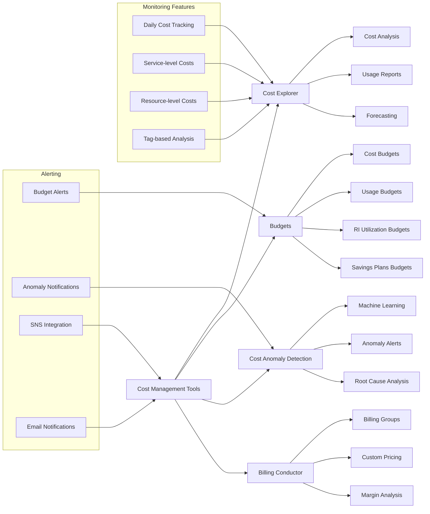

### Tagging Strategy for Cost Allocation

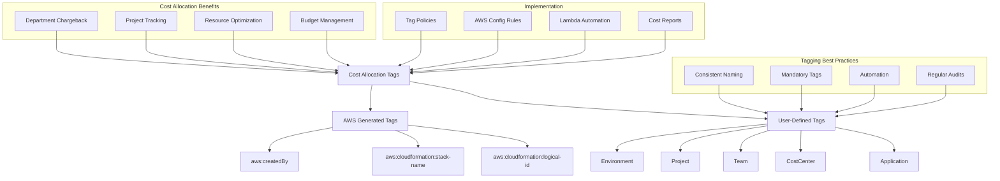

### Reserved Instances and Savings Plans

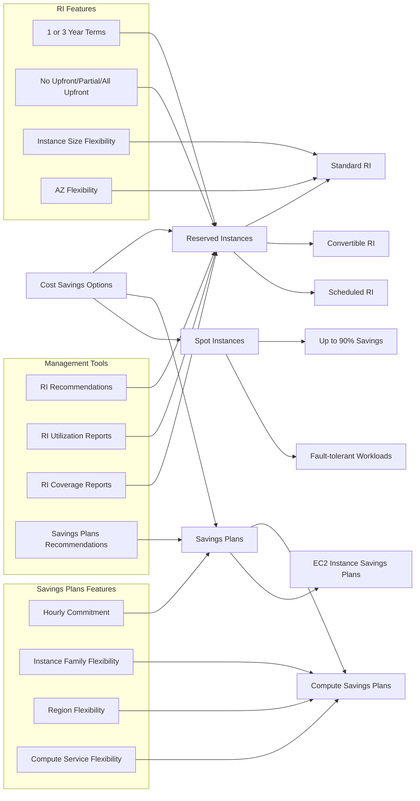

## Resource Lifecycle Management

### Automated Resource Management

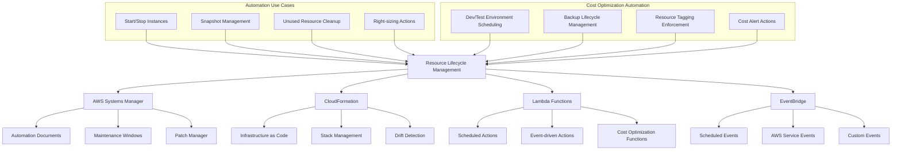

### Resource Optimization Strategies

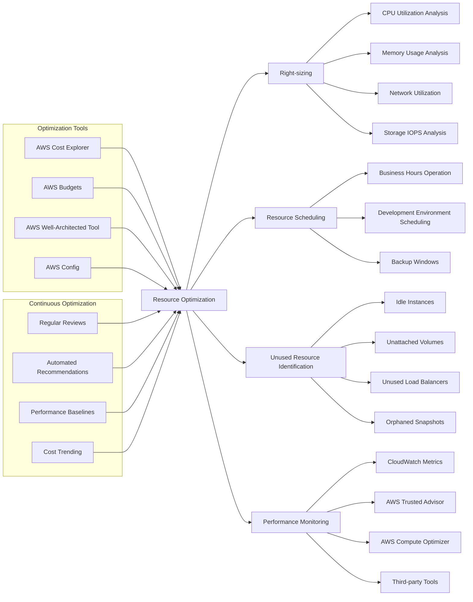

## Practice Questions

### Question 1
A company runs a web application that experiences predictable traffic patterns with occasional spikes. The application runs 24/7 and needs to be cost-optimized. What pricing model should they use?

A) 100% On-Demand instances
B) 100% Spot instances
C) Mix of Reserved Instances for baseline and Auto Scaling with Spot instances for spikes
D) 100% Reserved Instances

**Answer: C**
**Explanation**: A mixed approach using Reserved Instances for predictable baseline capacity (cost savings) and Auto Scaling with Spot instances for handling spikes (additional cost savings) provides the most cost-effective solution while maintaining availability.

### Question 2
Your application stores log files that are frequently accessed for 30 days, occasionally accessed for 90 days, and then archived for compliance. What S3 storage strategy minimizes costs?

A) S3 Standard for all data
B) S3 Intelligent-Tiering for automatic optimization
C) Lifecycle policy: Standard → IA (30 days) → Glacier (90 days) → Deep Archive (compliance)
D) S3 One Zone-IA for all data

**Answer: C**
**Explanation**: A lifecycle policy that transitions data based on access patterns (Standard for frequent access, IA for occasional access, Glacier for archive, Deep Archive for long-term compliance) optimizes costs by using the appropriate storage class for each access pattern.

### Question 3
A development team needs RDS databases that are only used during business hours (8 AM - 6 PM, Monday-Friday). What is the most cost-effective approach?

A) Use RDS Reserved Instances
B) Implement automated start/stop using Lambda and EventBridge
C) Use Aurora Serverless with auto-pause
D) Use larger instances to handle all workloads

**Answer: C**
**Explanation**: Aurora Serverless automatically pauses when there's no activity and resumes when needed, making it ideal for intermittent workloads. This provides significant cost savings compared to running instances continuously.

### Question 4
Your application uses DynamoDB with unpredictable read/write patterns that vary significantly throughout the day. What capacity mode should you choose?

A) Provisioned capacity with auto scaling
B) On-demand capacity
C) Provisioned capacity with manual scaling
D) Reserved capacity

**Answer: B**
**Explanation**: On-demand capacity is ideal for unpredictable workloads as you pay only for the requests you make, without needing to provision capacity. It automatically scales and is cost-effective for variable traffic patterns.

### Question 5
A company wants to optimize data transfer costs for their global application. Users worldwide access both static and dynamic content. What architecture minimizes costs?

A) Single region deployment with Transfer Acceleration
B) Multi-region deployment without CDN
C) CloudFront CDN with regional origins and optimal price class
D) Global Load Balancer with multiple regions

**Answer: C**
**Explanation**: CloudFront CDN reduces data transfer costs by caching content at edge locations closer to users. Using regional origins and selecting the appropriate price class based on user distribution further optimizes costs.

### Question 6
Your organization wants to track costs by department and project. What is the most effective approach?

A) Use separate AWS accounts for each department
B) Implement a comprehensive tagging strategy with cost allocation tags
C) Monitor costs manually through billing statements
D) Use CloudFormation stack-based tracking only

**Answer: B**
**Explanation**: A comprehensive tagging strategy with cost allocation tags enables detailed cost tracking and chargeback by department, project, environment, etc. This provides granular visibility without the complexity of multiple accounts.

### Question 7
A batch processing workload runs for 4 hours every night and can tolerate interruptions. What compute option provides the lowest cost?

A) On-Demand instances
B) Reserved Instances
C) Spot instances with automatic retries
D) Dedicated Hosts

**Answer: C**
**Explanation**: Spot instances can provide up to 90% cost savings for fault-tolerant, flexible workloads. Since the batch job can tolerate interruptions and runs for a short duration, Spot instances are ideal.

### Question 8
A company has a steady-state production workload that will run for 3 years with consistent resource requirements. What provides the maximum cost savings?

A) On-Demand instances
B) 3-year Standard Reserved Instances with All Upfront payment
C) Savings Plans with 1-year commitment
D) Spot instances

**Answer: B**
**Explanation**: For steady-state workloads with consistent requirements over 3 years, Standard Reserved Instances with All Upfront payment provide the maximum discount (up to 75% savings).

### Question 9
Your application requires high IOPS storage but only during specific processing windows. What EBS strategy optimizes costs?

A) Use io2 volumes continuously
B) Use gp3 volumes with increased IOPS during processing windows
C) Use instance store only
D) Use st1 volumes for all workloads

**Answer: B**
**Explanation**: gp3 volumes allow you to provision IOPS independently from storage size and can be modified dynamically. You can increase IOPS during processing windows and reduce them afterward, optimizing costs.

### Question 10
A web application serves users primarily in North America and Europe. What CloudFront price class optimizes costs while maintaining performance?

A) Price Class All (all edge locations)
B) Price Class 200 (North America, Europe, Asia, Middle East, Africa)
C) Price Class 100 (North America and Europe only)
D) No CloudFront - use regional deployments only

**Answer: C**
**Explanation**: Price Class 100 includes edge locations in North America and Europe, which aligns with the user base. This provides optimal performance for the target users while minimizing costs by excluding unnecessary regions.

## Official Documentation

### Cost Management and Billing
- [AWS Billing and Cost Management User Guide](https://docs.aws.amazon.com/awsaccountbilling/latest/aboutv2/)
- [AWS Cost Explorer User Guide](https://docs.aws.amazon.com/awsaccountbilling/latest/aboutv2/ce-what-is.html)
- [AWS Budgets User Guide](https://docs.aws.amazon.com/awsaccountbilling/latest/aboutv2/budgets-managing-costs.html)

### Pricing Models
- [Amazon EC2 Pricing](https://aws.amazon.com/ec2/pricing/)
- [Reserved Instances](https://docs.aws.amazon.com/AWSEC2/latest/UserGuide/ec2-reserved-instances.html)
- [Savings Plans User Guide](https://docs.aws.amazon.com/savingsplans/latest/userguide/)
- [Spot Instances User Guide](https://docs.aws.amazon.com/AWSEC2/latest/UserGuide/using-spot-instances.html)

### Storage Cost Optimization
- [Amazon S3 Storage Classes](https://aws.amazon.com/s3/storage-classes/)
- [S3 Lifecycle Management](https://docs.aws.amazon.com/AmazonS3/latest/userguide/object-lifecycle-mgmt.html)
- [Amazon EBS Pricing](https://aws.amazon.com/ebs/pricing/)

### Database Cost Optimization
- [Amazon RDS Pricing](https://aws.amazon.com/rds/pricing/)
- [Amazon DynamoDB Pricing](https://aws.amazon.com/dynamodb/pricing/)
- [Amazon Aurora Pricing](https://aws.amazon.com/rds/aurora/pricing/)

### Cost Optimization Best Practices
- [AWS Well-Architected Cost Optimization Pillar](https://docs.aws.amazon.com/wellarchitected/latest/cost-optimization-pillar/welcome.html)
- [AWS Cost Optimization Hub](https://aws.amazon.com/aws-cost-management/cost-optimization/)
- [AWS Trusted Advisor](https://aws.amazon.com/premiumsupport/technology/trusted-advisor/)

### Monitoring and Automation
- [AWS CloudWatch Pricing](https://aws.amazon.com/cloudwatch/pricing/)
- [AWS Systems Manager](https://docs.aws.amazon.com/systems-manager/)
- [AWS Config](https://docs.aws.amazon.com/config/)
- [AWS CloudFormation](https://docs.aws.amazon.com/cloudformation/)
