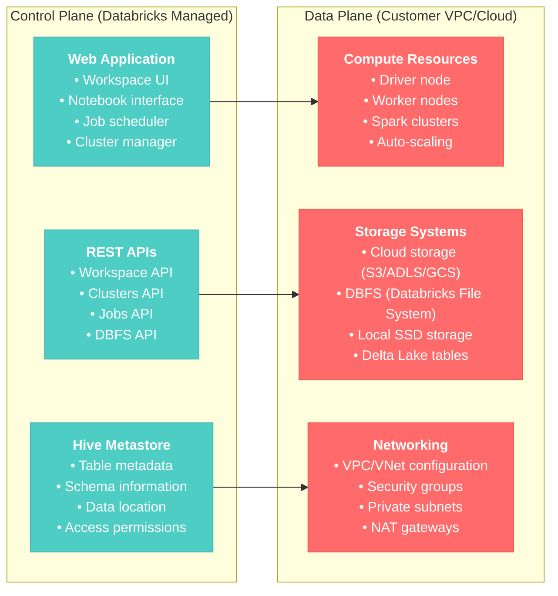
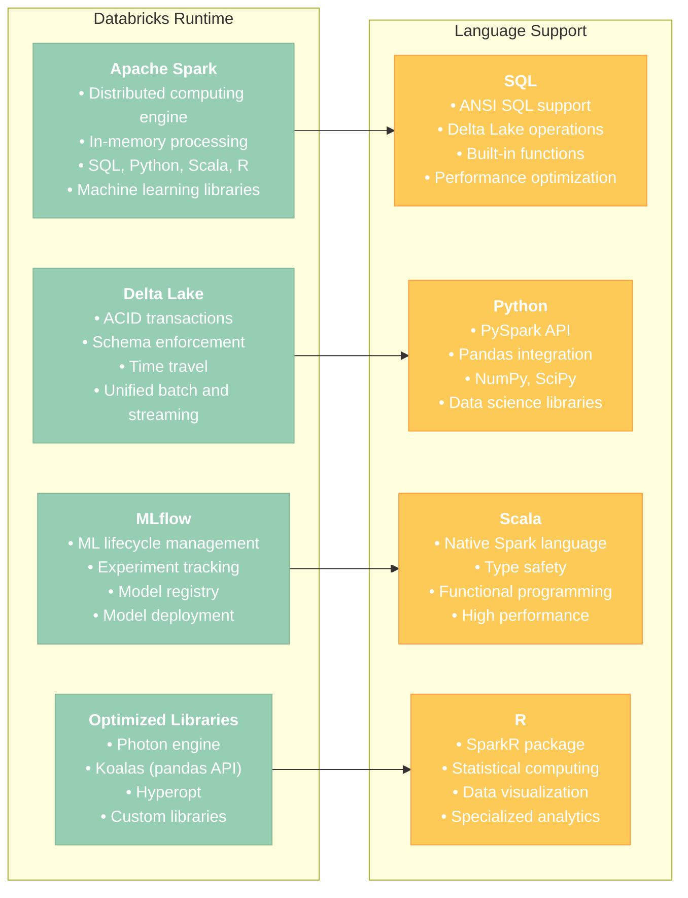
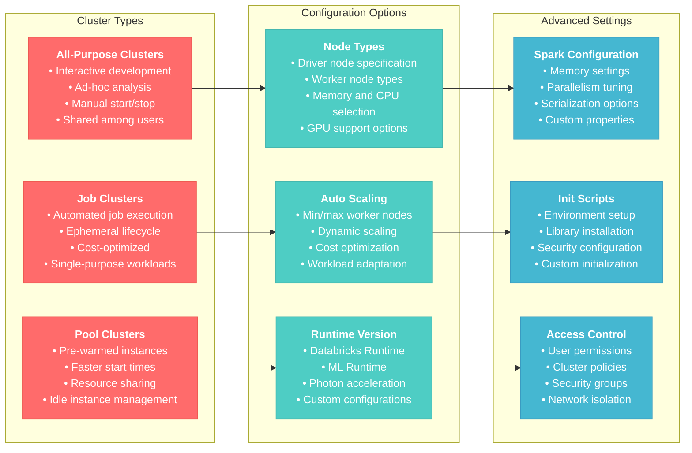
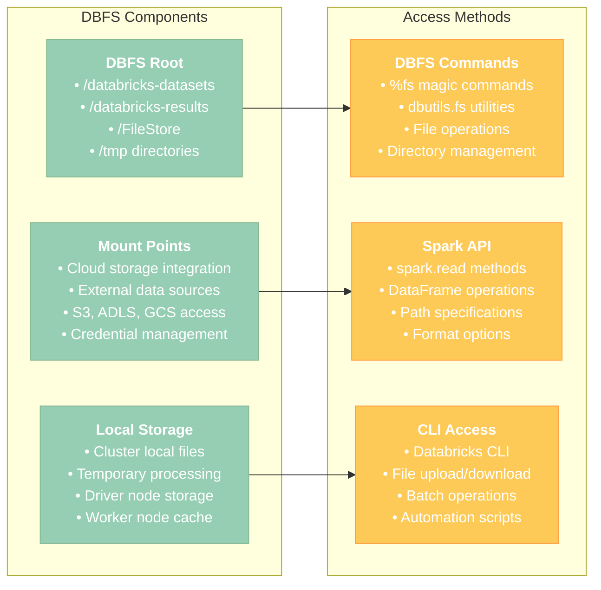
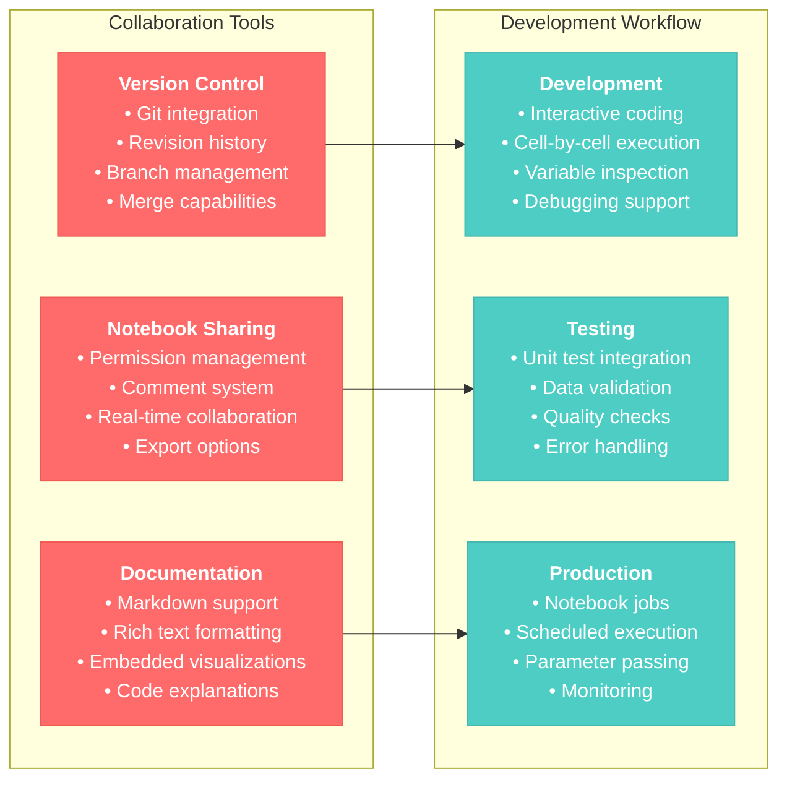
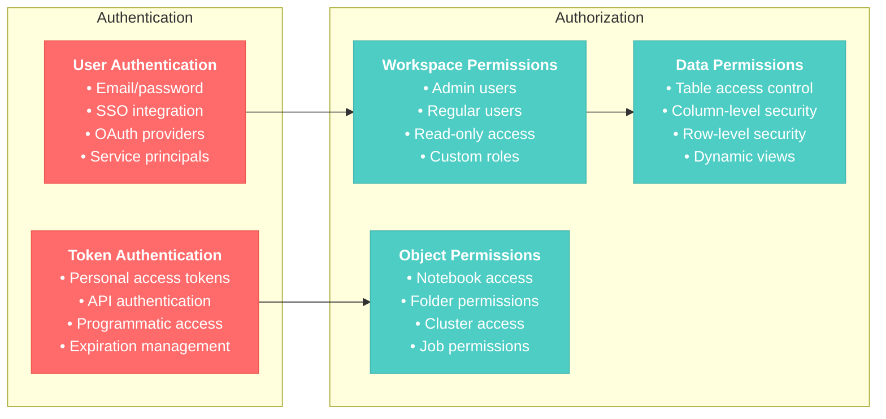
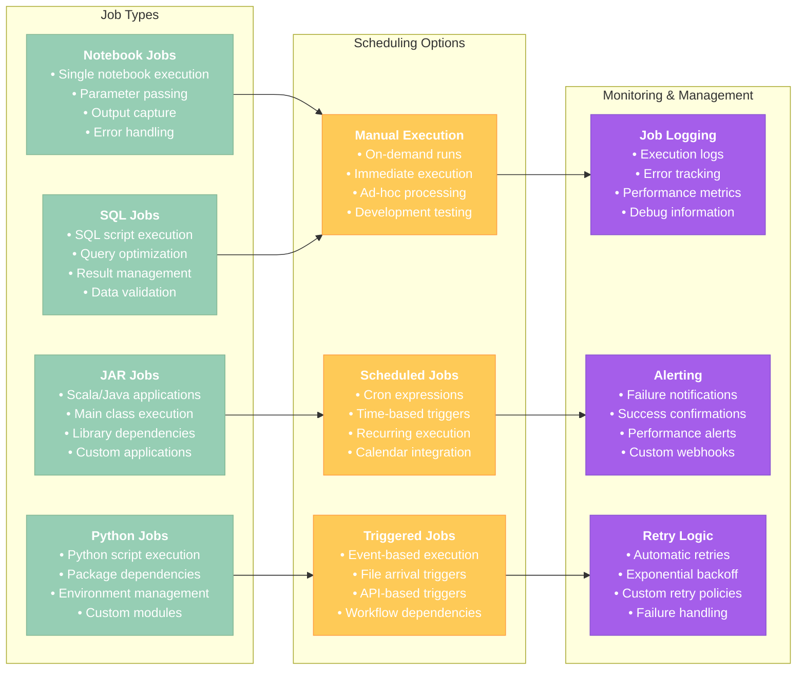

# Databricks Fundamentals for Data Engineer Associate

## Overview
This section covers the foundational concepts of the Databricks platform, including workspace navigation, cluster management, and core architecture components essential for data engineering tasks.

## 1. Databricks Platform Architecture

### 1.1 Control Plane vs Data Plane



### 1.2 Databricks Runtime Components



**Reference**: [Databricks Platform Architecture](https://docs.databricks.com/getting-started/overview.html)

## 2. Workspace and Cluster Management

### 2.1 Workspace Organization

#### Workspace Structure
- **Workspace**: Top-level container for all Databricks assets
- **Folders**: Organize notebooks, libraries, and other objects
- **Notebooks**: Interactive development environment
- **Repos**: Git integration for version control

#### Best Practices for Workspace Organization
```python
# Example workspace structure
"""
/Workspace
├── /Shared
│   ├── /data-engineering
│   │   ├── /bronze-layer
│   │   ├── /silver-layer
│   │   └── /gold-layer
│   ├── /data-science
│   └── /shared-libraries
├── /Users
│   └── /user@company.com
│       ├── /development
│       ├── /testing
│       └── /experiments
└── /Repos
    └── /user@company.com
        └── /data-pipeline-project
"""
```

### 2.2 Cluster Configuration and Management



#### Cluster Creation Example
```python
# Create cluster via REST API
import requests
import json

cluster_config = {
    "cluster_name": "data-engineering-cluster",
    "spark_version": "13.3.x-scala2.12",
    "node_type_id": "i3.xlarge",
    "driver_node_type_id": "i3.xlarge",
    "num_workers": 2,
    "autoscale": {
        "min_workers": 1,
        "max_workers": 8
    },
    "auto_termination_minutes": 60,
    "spark_conf": {
        "spark.sql.adaptive.enabled": "true",
        "spark.sql.adaptive.coalescePartitions.enabled": "true"
    },
    "custom_tags": {
        "team": "data-engineering",
        "project": "etl-pipeline"
    }
}
```

**Reference**: [Cluster Configuration](https://docs.databricks.com/clusters/configure.html)

## 3. Databricks File System (DBFS)

### 3.1 DBFS Architecture and Usage



#### Common DBFS Operations
```python
# File system operations using dbutils
# List files in directory
dbutils.fs.ls("/databricks-datasets")

# Copy files
dbutils.fs.cp("/tmp/source.csv", "/FileStore/destination.csv")

# Remove files
dbutils.fs.rm("/tmp/temp_file.txt")

# Create directory
dbutils.fs.mkdirs("/tmp/new_directory")

# Mount external storage
dbutils.fs.mount(
    source="s3a://bucket-name/path",
    mount_point="/mnt/s3-data",
    extra_configs={"fs.s3a.access.key": access_key,
                   "fs.s3a.secret.key": secret_key}
)
```

#### Working with Files in Spark
```python
# Read files from DBFS
df = spark.read.option("header", "true").csv("/databricks-datasets/retail-org/customers/customers.csv")

# Write files to DBFS
df.write.mode("overwrite").parquet("/tmp/processed_data")

# Read from mounted storage
df_external = spark.read.json("/mnt/s3-data/json-files/")
```

**Reference**: [Databricks File System](https://docs.databricks.com/dbfs/index.html)

## 4. Notebooks and Development Environment

### 4.1 Notebook Features and Best Practices

#### Notebook Cell Types
- **Code Cells**: Execute code in supported languages
- **Markdown Cells**: Documentation and explanations
- **SQL Cells**: Direct SQL execution
- **Shell Cells**: System commands and file operations

#### Magic Commands
```python
# Language magic commands
%python    # Switch to Python
%sql       # Execute SQL
%scala     # Switch to Scala
%r         # Switch to R
%sh        # Execute shell commands

# File system magic commands
%fs ls /databricks-datasets
%fs head /path/to/file.txt

# Other useful magic commands
%run ./helper_notebook    # Run another notebook
%pip install package     # Install Python packages
%conda install package   # Install via conda
```

### 4.2 Collaborative Features



#### Notebook Parameter Usage
```python
# Define parameters using widgets
dbutils.widgets.text("input_path", "/databricks-datasets/retail-org/customers/")
dbutils.widgets.dropdown("output_format", "parquet", ["parquet", "delta", "csv"])

# Get parameter values
input_path = dbutils.widgets.get("input_path")
output_format = dbutils.widgets.get("output_format")

# Use parameters in processing
df = spark.read.csv(input_path, header=True)
df.write.format(output_format).save("/tmp/processed_output")
```

**Reference**: [Databricks Notebooks](https://docs.databricks.com/notebooks/index.html)

## 5. Basic Security and Access Control

### 5.1 Workspace Security Model



### 5.2 Basic Access Control Implementation

#### Workspace-Level Access Control
```sql
-- Grant workspace admin privileges
GRANT CREATE, USAGE ON SCHEMA default TO `admin-group@company.com`;

-- Grant read-only access to specific tables
GRANT SELECT ON TABLE customer_data TO `analysts@company.com`;

-- Create custom roles
CREATE ROLE data_engineer;
GRANT CREATE TABLE, CREATE VIEW ON SCHEMA analytics TO ROLE data_engineer;
GRANT ROLE data_engineer TO `de-team@company.com`;
```

#### Cluster Access Control
```python
# Cluster policy example (JSON format)
cluster_policy = {
    "spark_version": {
        "type": "fixed",
        "value": "13.3.x-scala2.12"
    },
    "node_type_id": {
        "type": "allowlist",
        "values": ["i3.xlarge", "i3.2xlarge"]
    },
    "autotermination_minutes": {
        "type": "range",
        "min": 10,
        "max": 180
    },
    "custom_tags.team": {
        "type": "fixed",
        "value": "data-engineering"
    }
}
```

**Reference**: [Databricks Security](https://docs.databricks.com/security/index.html)

## 6. Jobs and Workflow Management

### 6.1 Job Types and Configuration



#### Job Creation Example
```python
# Create a notebook job using Jobs API
job_config = {
    "name": "Daily ETL Pipeline",
    "job_clusters": [{
        "job_cluster_key": "etl_cluster",
        "new_cluster": {
            "spark_version": "13.3.x-scala2.12",
            "node_type_id": "i3.xlarge",
            "num_workers": 2,
            "spark_conf": {
                "spark.sql.adaptive.enabled": "true"
            }
        }
    }],
    "tasks": [{
        "task_key": "etl_task",
        "job_cluster_key": "etl_cluster",
        "notebook_task": {
            "notebook_path": "/Shared/etl/daily_pipeline",
            "base_parameters": {
                "date": "{{start_date}}",
                "environment": "production"
            }
        }
    }],
    "schedule": {
        "quartz_cron_expression": "0 0 2 * * ?",  # Daily at 2 AM
        "timezone_id": "UTC"
    },
    "email_notifications": {
        "on_failure": ["de-team@company.com"],
        "on_success": ["manager@company.com"]
    }
}
```

**Reference**: [Databricks Jobs](https://docs.databricks.com/jobs/index.html)

## 7. Best Practices Summary

### 7.1 Development Best Practices
1. **Workspace Organization**: Use clear folder structure and naming conventions
2. **Version Control**: Integrate with Git for code versioning
3. **Documentation**: Include markdown cells for code explanation
4. **Testing**: Implement data validation and unit tests
5. **Parameters**: Use widgets for notebook parameterization

### 7.2 Cluster Management Best Practices
1. **Right-sizing**: Choose appropriate node types for workload
2. **Auto-termination**: Set automatic termination to control costs
3. **Auto-scaling**: Configure appropriate min/max workers
4. **Cluster Policies**: Implement governance and cost control
5. **Monitoring**: Track cluster usage and performance

### 7.3 Security Best Practices
1. **Access Control**: Implement least privilege access
2. **Authentication**: Use SSO and service principals
3. **Data Security**: Encrypt data at rest and in transit
4. **Audit Logging**: Enable comprehensive audit trails
5. **Network Security**: Configure proper VPC/firewall settings

## Conclusion

Understanding Databricks fundamentals is crucial for data engineering success. This foundation covers the platform architecture, workspace management, cluster configuration, and security basics that form the building blocks for more advanced data engineering tasks.

Focus on hands-on practice with workspace navigation, cluster creation, and basic notebook development to build proficiency with the platform before moving to more complex data engineering concepts.
