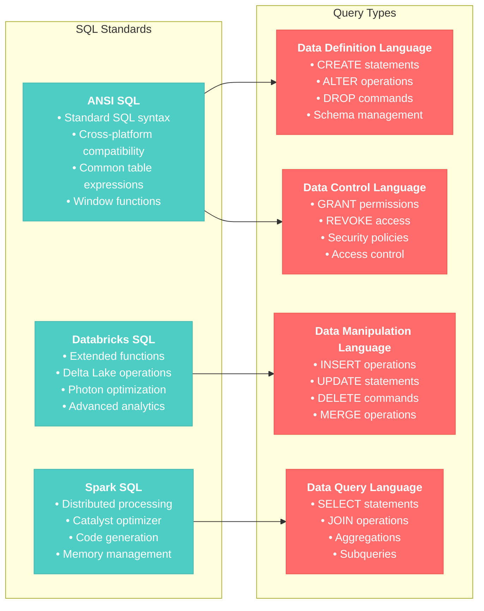
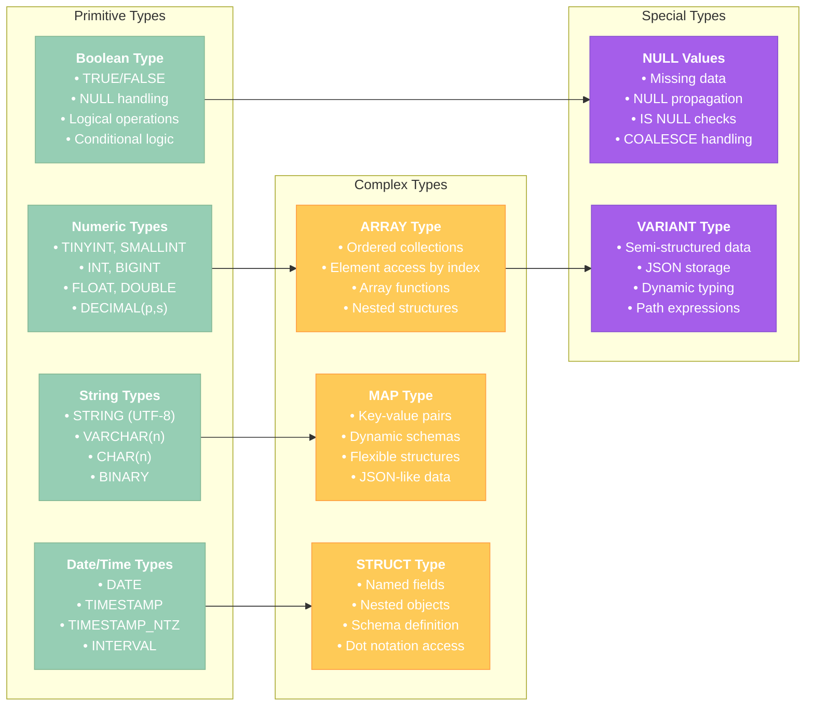
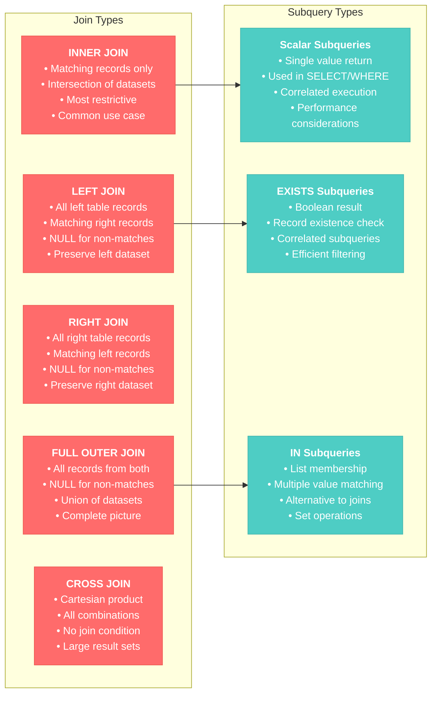
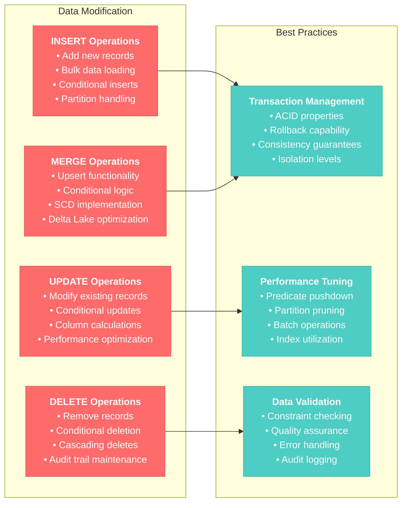
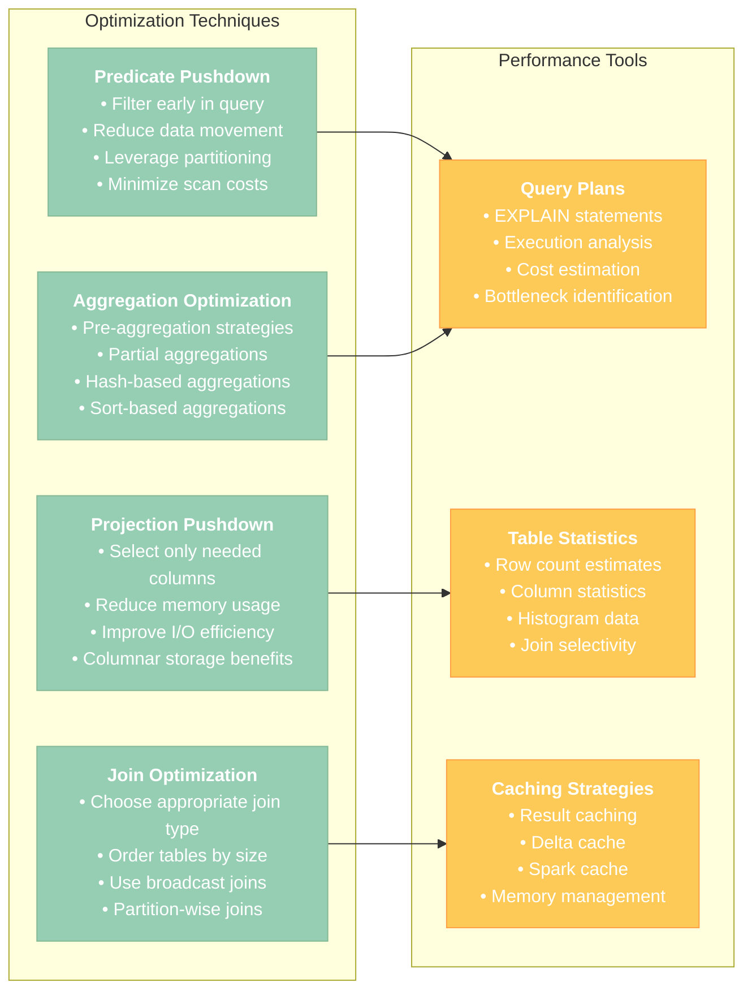

# SQL and Data Manipulation for Data Engineer Associate

## Overview
This section covers essential SQL skills and data manipulation techniques required for the Databricks Data Engineer Associate certification, including SQL fundamentals, data types, functions, and query optimization.

## 1. SQL Fundamentals in Databricks

### 1.1 SQL Language Support



### 1.2 Basic SQL Operations

#### Data Definition Language (DDL)
```sql
-- Create database
CREATE DATABASE IF NOT EXISTS retail_analytics
COMMENT 'Retail analytics database'
LOCATION '/mnt/data/retail_analytics';

-- Use database
USE retail_analytics;

-- Create table
CREATE TABLE customers (
    customer_id INT NOT NULL,
    first_name STRING,
    last_name STRING,
    email STRING,
    phone STRING,
    address STRING,
    city STRING,
    state STRING,
    zip_code STRING,
    registration_date DATE,
    last_purchase_date TIMESTAMP,
    total_purchases DECIMAL(10,2),
    customer_status STRING
) USING DELTA
PARTITIONED BY (state)
TBLPROPERTIES (
    'delta.autoOptimize.optimizeWrite' = 'true',
    'delta.autoOptimize.autoCompact' = 'true'
);

-- Add column
ALTER TABLE customers ADD COLUMN loyalty_tier STRING;

-- Modify column
ALTER TABLE customers ALTER COLUMN total_purchases TYPE DECIMAL(12,2);

-- Add constraint
ALTER TABLE customers ADD CONSTRAINT valid_email 
CHECK (email LIKE '%@%.%');
```

#### Data Query Language (DQL)
```sql
-- Basic SELECT with filtering
SELECT customer_id, first_name, last_name, total_purchases
FROM customers
WHERE customer_status = 'ACTIVE'
  AND total_purchases > 1000
  AND registration_date >= '2023-01-01'
ORDER BY total_purchases DESC
LIMIT 100;

-- GROUP BY with aggregations
SELECT 
    state,
    customer_status,
    COUNT(*) as customer_count,
    AVG(total_purchases) as avg_purchases,
    SUM(total_purchases) as total_revenue,
    MIN(registration_date) as first_registration,
    MAX(last_purchase_date) as latest_purchase
FROM customers
GROUP BY state, customer_status
HAVING COUNT(*) > 50
ORDER BY total_revenue DESC;

-- Window functions
SELECT 
    customer_id,
    first_name,
    last_name,
    total_purchases,
    ROW_NUMBER() OVER (ORDER BY total_purchases DESC) as purchase_rank,
    RANK() OVER (PARTITION BY state ORDER BY total_purchases DESC) as state_rank,
    LAG(total_purchases) OVER (ORDER BY registration_date) as prev_customer_purchases,
    total_purchases - AVG(total_purchases) OVER () as purchases_vs_avg
FROM customers
WHERE customer_status = 'ACTIVE';
```

**Reference**: [Databricks SQL Reference](https://docs.databricks.com/sql/language-manual/index.html)

## 2. Data Types and Functions

### 2.1 Data Types in Databricks



### 2.2 Built-in Functions

#### String Functions
```sql
-- String manipulation functions
SELECT 
    customer_id,
    UPPER(first_name) as first_name_upper,
    LOWER(last_name) as last_name_lower,
    CONCAT(first_name, ' ', last_name) as full_name,
    LENGTH(email) as email_length,
    SUBSTRING(phone, 1, 3) as area_code,
    REGEXP_REPLACE(phone, '[^0-9]', '') as clean_phone,
    SPLIT(email, '@')[1] as email_domain,
    TRIM(address) as clean_address,
    LEFT(zip_code, 5) as zip_5digit
FROM customers;

-- Pattern matching
SELECT *
FROM customers
WHERE email RLIKE '^[a-zA-Z0-9._%+-]+@[a-zA-Z0-9.-]+\.[a-zA-Z]{2,}$'
  AND phone RLIKE '^[\+]?[1-9]?[0-9]{7,15}$';
```

#### Date and Time Functions
```sql
-- Date/time manipulation
SELECT 
    customer_id,
    registration_date,
    YEAR(registration_date) as registration_year,
    MONTH(registration_date) as registration_month,
    DAYOFWEEK(registration_date) as registration_day_of_week,
    DATEDIFF(CURRENT_DATE(), registration_date) as days_since_registration,
    DATE_ADD(registration_date, 365) as anniversary_date,
    DATE_FORMAT(registration_date, 'yyyy-MM') as registration_month_year,
    UNIX_TIMESTAMP(last_purchase_date) as last_purchase_epoch,
    FROM_UNIXTIME(UNIX_TIMESTAMP(), 'yyyy-MM-dd HH:mm:ss') as current_timestamp_formatted
FROM customers;

-- Date filtering and grouping
SELECT 
    DATE_TRUNC('month', registration_date) as registration_month,
    COUNT(*) as new_customers,
    AVG(total_purchases) as avg_first_purchase
FROM customers
WHERE registration_date BETWEEN '2023-01-01' AND '2023-12-31'
GROUP BY DATE_TRUNC('month', registration_date)
ORDER BY registration_month;
```

#### Numeric and Aggregation Functions
```sql
-- Mathematical functions
SELECT 
    customer_id,
    total_purchases,
    ROUND(total_purchases, 2) as rounded_purchases,
    CEIL(total_purchases) as ceiling_purchases,
    FLOOR(total_purchases) as floor_purchases,
    ABS(total_purchases - 1000) as difference_from_1000,
    POWER(total_purchases, 0.5) as sqrt_purchases,
    LOG(total_purchases + 1) as log_purchases
FROM customers
WHERE total_purchases > 0;

-- Advanced aggregations
SELECT 
    state,
    COUNT(*) as customer_count,
    SUM(total_purchases) as total_revenue,
    AVG(total_purchases) as mean_purchases,
    PERCENTILE_APPROX(total_purchases, 0.5) as median_purchases,
    STDDEV(total_purchases) as stddev_purchases,
    MIN(total_purchases) as min_purchases,
    MAX(total_purchases) as max_purchases,
    COLLECT_LIST(customer_id) as customer_ids,
    COLLECT_SET(customer_status) as unique_statuses
FROM customers
GROUP BY state;
```

**Reference**: [Databricks SQL Functions](https://docs.databricks.com/sql/language-manual/sql-ref-functions.html)

## 3. Advanced SQL Concepts

### 3.1 Joins and Subqueries



#### Join Examples
```sql
-- Create orders table for join examples
CREATE TABLE orders (
    order_id INT,
    customer_id INT,
    order_date DATE,
    order_amount DECIMAL(10,2),
    order_status STRING
) USING DELTA;

-- INNER JOIN - customers with orders
SELECT 
    c.customer_id,
    c.first_name,
    c.last_name,
    o.order_id,
    o.order_date,
    o.order_amount
FROM customers c
INNER JOIN orders o ON c.customer_id = o.customer_id
WHERE c.customer_status = 'ACTIVE'
  AND o.order_date >= '2023-01-01';

-- LEFT JOIN - all customers, with or without orders
SELECT 
    c.customer_id,
    c.first_name,
    c.last_name,
    COUNT(o.order_id) as order_count,
    COALESCE(SUM(o.order_amount), 0) as total_order_amount
FROM customers c
LEFT JOIN orders o ON c.customer_id = o.customer_id
GROUP BY c.customer_id, c.first_name, c.last_name
ORDER BY total_order_amount DESC;

-- Multiple table joins
SELECT 
    c.customer_id,
    c.first_name,
    c.last_name,
    c.state,
    o.order_id,
    o.order_date,
    oi.product_id,
    oi.quantity,
    oi.unit_price
FROM customers c
INNER JOIN orders o ON c.customer_id = o.customer_id
INNER JOIN order_items oi ON o.order_id = oi.order_id
WHERE c.registration_date >= '2023-01-01'
  AND o.order_status = 'COMPLETED';
```

#### Subquery Examples
```sql
-- Scalar subquery - customers above average
SELECT 
    customer_id,
    first_name,
    last_name,
    total_purchases,
    (SELECT AVG(total_purchases) FROM customers) as avg_purchases
FROM customers
WHERE total_purchases > (SELECT AVG(total_purchases) FROM customers);

-- EXISTS subquery - customers with recent orders
SELECT 
    customer_id,
    first_name,
    last_name
FROM customers c
WHERE EXISTS (
    SELECT 1 
    FROM orders o 
    WHERE o.customer_id = c.customer_id 
      AND o.order_date >= '2023-01-01'
);

-- IN subquery - customers from top states
SELECT 
    customer_id,
    first_name,
    last_name,
    state
FROM customers
WHERE state IN (
    SELECT state
    FROM customers
    GROUP BY state
    ORDER BY COUNT(*) DESC
    LIMIT 5
);

-- Correlated subquery - customers with above-average purchases in their state
SELECT 
    customer_id,
    first_name,
    last_name,
    state,
    total_purchases
FROM customers c1
WHERE total_purchases > (
    SELECT AVG(total_purchases)
    FROM customers c2
    WHERE c2.state = c1.state
);
```

### 3.2 Common Table Expressions (CTEs)

```sql
-- Single CTE
WITH high_value_customers AS (
    SELECT 
        customer_id,
        first_name,
        last_name,
        total_purchases,
        RANK() OVER (ORDER BY total_purchases DESC) as purchase_rank
    FROM customers
    WHERE total_purchases > 5000
)
SELECT 
    customer_id,
    first_name,
    last_name,
    total_purchases,
    purchase_rank
FROM high_value_customers
WHERE purchase_rank <= 10;

-- Multiple CTEs
WITH monthly_orders AS (
    SELECT 
        DATE_TRUNC('month', order_date) as order_month,
        COUNT(*) as order_count,
        SUM(order_amount) as monthly_revenue
    FROM orders
    WHERE order_date >= '2023-01-01'
    GROUP BY DATE_TRUNC('month', order_date)
),
customer_metrics AS (
    SELECT 
        state,
        COUNT(*) as customer_count,
        AVG(total_purchases) as avg_customer_value
    FROM customers
    WHERE customer_status = 'ACTIVE'
    GROUP BY state
)
SELECT 
    mo.order_month,
    mo.order_count,
    mo.monthly_revenue,
    cm.customer_count,
    cm.avg_customer_value
FROM monthly_orders mo
CROSS JOIN customer_metrics cm
WHERE cm.state = 'CA'
ORDER BY mo.order_month;

-- Recursive CTE (for hierarchical data)
WITH RECURSIVE org_hierarchy AS (
    -- Base case: top-level managers
    SELECT 
        employee_id,
        manager_id,
        employee_name,
        1 as level
    FROM employees
    WHERE manager_id IS NULL
    
    UNION ALL
    
    -- Recursive case: employees reporting to managers
    SELECT 
        e.employee_id,
        e.manager_id,
        e.employee_name,
        oh.level + 1
    FROM employees e
    INNER JOIN org_hierarchy oh ON e.manager_id = oh.employee_id
)
SELECT * FROM org_hierarchy
ORDER BY level, employee_name;
```

**Reference**: [SQL CTEs in Databricks](https://docs.databricks.com/sql/language-manual/sql-ref-syntax-qry-select-cte.html)

## 4. Data Manipulation Operations

### 4.1 INSERT, UPDATE, DELETE Operations



#### INSERT Operations
```sql
-- Basic INSERT
INSERT INTO customers 
VALUES (
    1001, 'John', 'Doe', 'john.doe@email.com', '555-1234',
    '123 Main St', 'Springfield', 'IL', '62701',
    '2024-01-15', '2024-01-20', 250.00, 'ACTIVE'
);

-- INSERT with column specification
INSERT INTO customers (
    customer_id, first_name, last_name, email, 
    registration_date, customer_status
)
VALUES (
    1002, 'Jane', 'Smith', 'jane.smith@email.com',
    CURRENT_DATE(), 'ACTIVE'
);

-- INSERT from SELECT
INSERT INTO customers_archive
SELECT * 
FROM customers
WHERE customer_status = 'INACTIVE'
  AND last_purchase_date < '2022-01-01';

-- INSERT OVERWRITE (replace all data)
INSERT OVERWRITE customers_summary
SELECT 
    state,
    customer_status,
    COUNT(*) as customer_count,
    SUM(total_purchases) as total_revenue
FROM customers
GROUP BY state, customer_status;
```

#### UPDATE Operations
```sql
-- Basic UPDATE
UPDATE customers
SET customer_status = 'VIP',
    loyalty_tier = 'GOLD'
WHERE total_purchases > 10000;

-- UPDATE with calculations
UPDATE customers
SET total_purchases = total_purchases + 100,
    last_purchase_date = CURRENT_TIMESTAMP()
WHERE customer_id = 1001;

-- UPDATE with subquery
UPDATE customers
SET loyalty_tier = CASE 
    WHEN total_purchases >= 10000 THEN 'PLATINUM'
    WHEN total_purchases >= 5000 THEN 'GOLD'
    WHEN total_purchases >= 1000 THEN 'SILVER'
    ELSE 'BRONZE'
END
WHERE loyalty_tier IS NULL;

-- UPDATE with JOIN (using MERGE for Delta tables)
MERGE INTO customers AS target
USING (
    SELECT customer_id, SUM(order_amount) as new_total
    FROM orders
    WHERE order_date >= '2024-01-01'
    GROUP BY customer_id
) AS source
ON target.customer_id = source.customer_id
WHEN MATCHED THEN
    UPDATE SET total_purchases = target.total_purchases + source.new_total;
```

#### DELETE Operations
```sql
-- Basic DELETE
DELETE FROM customers
WHERE customer_status = 'DELETED'
  AND last_purchase_date < '2020-01-01';

-- DELETE with subquery
DELETE FROM customers
WHERE customer_id IN (
    SELECT customer_id
    FROM customers
    WHERE registration_date < '2020-01-01'
      AND total_purchases = 0
);

-- DELETE with EXISTS
DELETE FROM customers
WHERE NOT EXISTS (
    SELECT 1
    FROM orders
    WHERE orders.customer_id = customers.customer_id
);
```

### 4.2 MERGE (UPSERT) Operations

```sql
-- Basic MERGE operation
MERGE INTO customers AS target
USING customer_updates AS source
ON target.customer_id = source.customer_id
WHEN MATCHED AND source.update_flag = 'UPDATE' THEN
    UPDATE SET 
        first_name = source.first_name,
        last_name = source.last_name,
        email = source.email,
        phone = source.phone,
        address = source.address,
        total_purchases = source.total_purchases,
        customer_status = source.customer_status
WHEN MATCHED AND source.update_flag = 'DELETE' THEN
    DELETE
WHEN NOT MATCHED AND source.update_flag = 'INSERT' THEN
    INSERT (
        customer_id, first_name, last_name, email, phone,
        address, city, state, zip_code, registration_date,
        total_purchases, customer_status
    )
    VALUES (
        source.customer_id, source.first_name, source.last_name,
        source.email, source.phone, source.address, source.city,
        source.state, source.zip_code, source.registration_date,
        source.total_purchases, source.customer_status
    );

-- MERGE with complex conditions
MERGE INTO customer_summary AS target
USING (
    SELECT 
        state,
        customer_status,
        COUNT(*) as customer_count,
        SUM(total_purchases) as total_revenue,
        AVG(total_purchases) as avg_revenue,
        CURRENT_DATE() as update_date
    FROM customers
    GROUP BY state, customer_status
) AS source
ON target.state = source.state 
   AND target.customer_status = source.customer_status
WHEN MATCHED THEN
    UPDATE SET 
        customer_count = source.customer_count,
        total_revenue = source.total_revenue,
        avg_revenue = source.avg_revenue,
        update_date = source.update_date,
        change_percent = ROUND(
            ((source.total_revenue - target.total_revenue) / target.total_revenue) * 100, 2
        )
WHEN NOT MATCHED THEN
    INSERT (
        state, customer_status, customer_count, total_revenue,
        avg_revenue, update_date, change_percent
    )
    VALUES (
        source.state, source.customer_status, source.customer_count,
        source.total_revenue, source.avg_revenue, source.update_date, 0
    );
```

**Reference**: [Databricks MERGE Operations](https://docs.databricks.com/sql/language-manual/delta-merge-into.html)

## 5. Query Optimization and Performance

### 5.1 Query Performance Best Practices



#### Query Analysis and Optimization
```sql
-- Use EXPLAIN to analyze query plans
EXPLAIN FORMATTED
SELECT 
    c.state,
    COUNT(*) as customer_count,
    SUM(o.order_amount) as total_revenue
FROM customers c
INNER JOIN orders o ON c.customer_id = o.customer_id
WHERE c.customer_status = 'ACTIVE'
  AND o.order_date >= '2023-01-01'
GROUP BY c.state
ORDER BY total_revenue DESC;

-- Optimize with proper column selection
-- Bad: SELECT *
SELECT *
FROM customers c
INNER JOIN orders o ON c.customer_id = o.customer_id;

-- Good: SELECT specific columns
SELECT 
    c.customer_id,
    c.first_name,
    c.last_name,
    o.order_id,
    o.order_amount
FROM customers c
INNER JOIN orders o ON c.customer_id = o.customer_id;

-- Use proper filtering
-- Bad: Filter after join
SELECT *
FROM customers c
INNER JOIN orders o ON c.customer_id = o.customer_id
WHERE c.customer_status = 'ACTIVE';

-- Good: Filter before join
SELECT *
FROM (
    SELECT * FROM customers WHERE customer_status = 'ACTIVE'
) c
INNER JOIN orders o ON c.customer_id = o.customer_id;
```

#### Table Statistics and Analysis
```sql
-- Analyze table statistics
ANALYZE TABLE customers COMPUTE STATISTICS;
ANALYZE TABLE customers COMPUTE STATISTICS FOR COLUMNS customer_id, state, total_purchases;

-- View table statistics
DESCRIBE EXTENDED customers;
DESCRIBE TABLE customers customer_id;

-- Manual statistics for optimization
CREATE TABLE customers_optimized
USING DELTA
TBLPROPERTIES (
    'delta.autoOptimize.optimizeWrite' = 'true',
    'delta.autoOptimize.autoCompact' = 'true'
)
AS SELECT * FROM customers;

-- Optimize table for better performance
OPTIMIZE customers_optimized;
OPTIMIZE customers_optimized ZORDER BY (state, customer_status);
```

### 5.2 Performance Monitoring

```sql
-- Query history analysis
SELECT 
    query_id,
    query_text,
    user_name,
    start_time,
    end_time,
    execution_time_ms,
    read_bytes,
    rows_read,
    result_from_cache
FROM system.query.history
WHERE start_time >= CURRENT_DATE() - INTERVAL 7 DAYS
  AND execution_time_ms > 30000  -- Queries longer than 30 seconds
ORDER BY execution_time_ms DESC;

-- Identify expensive operations
SELECT 
    operation_type,
    COUNT(*) as operation_count,
    AVG(execution_time_ms) as avg_execution_time,
    SUM(read_bytes) as total_bytes_read
FROM system.query.history
WHERE start_time >= CURRENT_DATE() - INTERVAL 1 DAY
GROUP BY operation_type
ORDER BY avg_execution_time DESC;
```

**Reference**: [Databricks SQL Performance Tuning](https://docs.databricks.com/sql/admin/query-history.html)

## 6. Best Practices Summary

### 6.1 SQL Development Best Practices
1. **Query Structure**: Use proper indentation and formatting
2. **Column Selection**: Select only necessary columns
3. **Filtering**: Apply filters as early as possible
4. **Joins**: Choose appropriate join types and order
5. **Aggregations**: Use efficient grouping strategies

### 6.2 Performance Best Practices
1. **Predicate Pushdown**: Filter data at source
2. **Projection Pushdown**: Select minimal columns
3. **Table Statistics**: Keep statistics up to date
4. **Query Plans**: Analyze and optimize execution plans
5. **Caching**: Use appropriate caching strategies

### 6.3 Data Quality Best Practices
1. **Constraints**: Implement data validation rules
2. **NULL Handling**: Explicit NULL value management
3. **Data Types**: Use appropriate data types
4. **Transactions**: Ensure data consistency
5. **Validation**: Implement comprehensive data checks

## Conclusion

Mastering SQL and data manipulation in Databricks is fundamental for data engineering success. Focus on understanding query optimization, proper use of joins and subqueries, and leveraging Delta Lake's MERGE capabilities for efficient data operations.

Practice with real datasets and always analyze query performance to build efficient, scalable data processing solutions.
