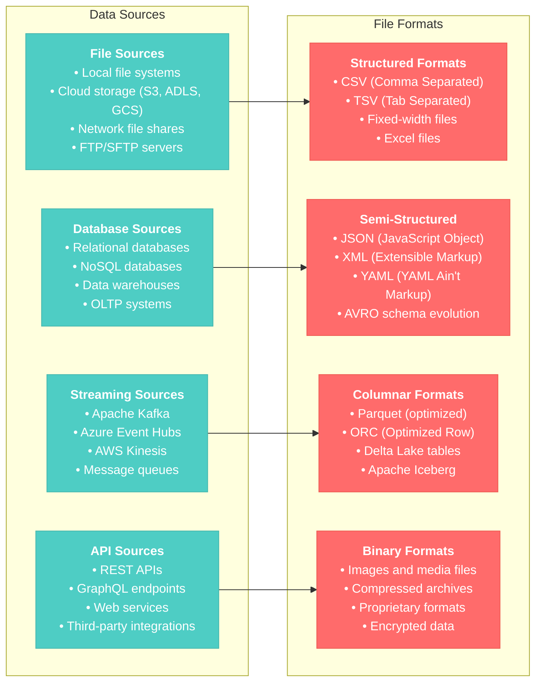
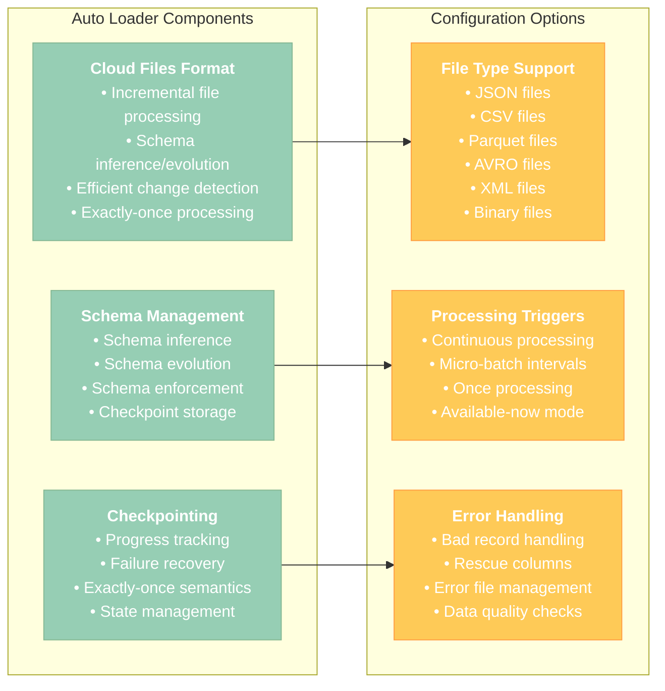
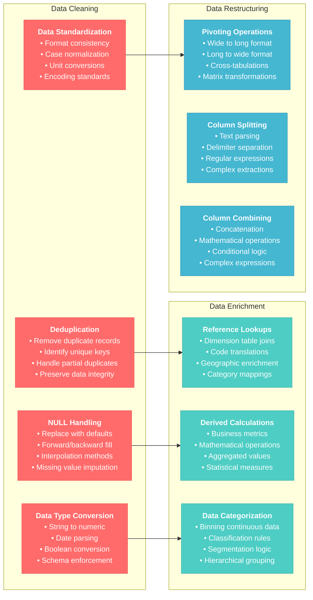
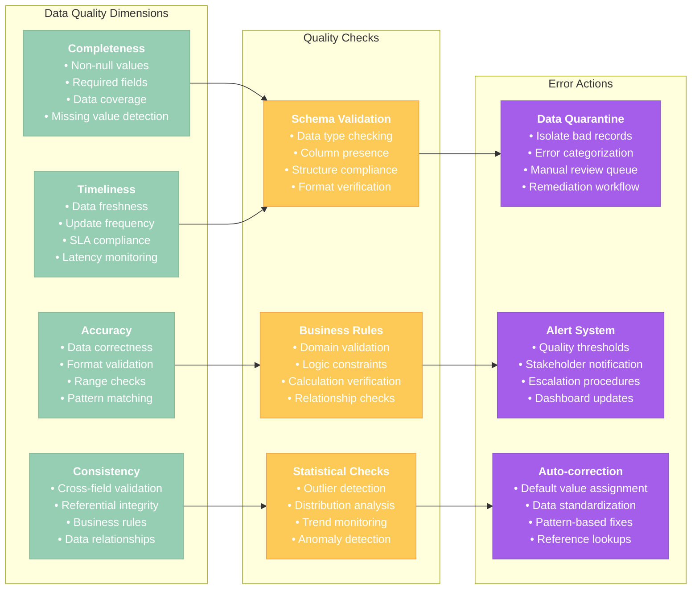

# Data Ingestion and ETL Basics for Data Engineer Associate

## Overview
This section covers fundamental data ingestion techniques, basic ETL (Extract, Transform, Load) processes, and data pipeline development using Databricks. It focuses on practical skills for loading, transforming, and managing data in a lakehouse architecture.

## 1. Data Ingestion Fundamentals

### 1.1 Data Source Types and Formats



### 1.2 Basic File Ingestion Patterns

#### Reading CSV Files
```python
# Basic CSV reading
df_csv = spark.read \
    .option("header", "true") \
    .option("inferSchema", "true") \
    .csv("/databricks-datasets/retail-org/customers/customers.csv")

# CSV with custom options
df_csv_custom = spark.read \
    .option("header", "true") \
    .option("inferSchema", "false") \
    .option("delimiter", "|") \
    .option("quote", '"') \
    .option("escape", "\\") \
    .option("nullValue", "NULL") \
    .option("dateFormat", "yyyy-MM-dd") \
    .option("timestampFormat", "yyyy-MM-dd HH:mm:ss") \
    .csv("/path/to/custom.csv")

# Explicit schema definition for better performance
from pyspark.sql.types import StructType, StructField, StringType, IntegerType, DoubleType, DateType

customers_schema = StructType([
    StructField("customer_id", IntegerType(), True),
    StructField("first_name", StringType(), True),
    StructField("last_name", StringType(), True),
    StructField("email", StringType(), True),
    StructField("phone", StringType(), True),
    StructField("address", StringType(), True),
    StructField("city", StringType(), True),
    StructField("state", StringType(), True),
    StructField("zip_code", StringType(), True),
    StructField("registration_date", DateType(), True),
    StructField("total_purchases", DoubleType(), True)
])

df_csv_schema = spark.read \
    .option("header", "true") \
    .schema(customers_schema) \
    .csv("/path/to/customers.csv")

display(df_csv_schema)
```

#### Reading JSON Files
```python
# Basic JSON reading
df_json = spark.read.json("/databricks-datasets/retail-org/products/products.json")

# JSON with multiple lines per record
df_json_multiline = spark.read \
    .option("multiline", "true") \
    .json("/path/to/multiline.json")

# JSON with nested structures
df_json_nested = spark.read.json("/path/to/nested.json")

# Flatten nested JSON
from pyspark.sql.functions import col, explode

df_flattened = df_json_nested \
    .select(
        col("id"),
        col("name"),
        col("address.street").alias("street"),
        col("address.city").alias("city"),
        col("address.zipcode").alias("zipcode"),
        explode(col("orders")).alias("order")
    ) \
    .select(
        col("id"),
        col("name"),
        col("street"),
        col("city"),
        col("zipcode"),
        col("order.order_id").alias("order_id"),
        col("order.amount").alias("order_amount"),
        col("order.date").alias("order_date")
    )

display(df_flattened)
```

#### Reading Parquet Files
```python
# Basic Parquet reading (most efficient)
df_parquet = spark.read.parquet("/databricks-datasets/retail-org/sales_orders/")

# Parquet with column selection (projection pushdown)
df_parquet_select = spark.read.parquet("/path/to/sales.parquet") \
    .select("order_id", "customer_id", "order_date", "total_amount")

# Parquet with filtering (predicate pushdown)
df_parquet_filtered = spark.read.parquet("/path/to/sales.parquet") \
    .filter(col("order_date") >= "2024-01-01") \
    .filter(col("total_amount") > 100)

display(df_parquet_filtered)
```

**Reference**: [Databricks Data Sources](https://docs.databricks.com/external-data/index.html)

## 2. Auto Loader for Incremental Ingestion

### 2.1 Auto Loader Configuration



#### Basic Auto Loader Setup
```python
# Auto Loader for JSON files
df_autoloader = spark.readStream \
    .format("cloudFiles") \
    .option("cloudFiles.format", "json") \
    .option("cloudFiles.schemaLocation", "/tmp/schema-location") \
    .option("cloudFiles.inferColumnTypes", "true") \
    .load("/mnt/source-data/json-files/")

# Write to Delta table
query = df_autoloader.writeStream \
    .format("delta") \
    .option("checkpointLocation", "/tmp/checkpoint-location") \
    .option("mergeSchema", "true") \
    .trigger(processingTime="10 seconds") \
    .table("bronze.raw_events")

# Auto Loader for CSV files with schema evolution
df_csv_autoloader = spark.readStream \
    .format("cloudFiles") \
    .option("cloudFiles.format", "csv") \
    .option("cloudFiles.schemaLocation", "/tmp/csv-schema") \
    .option("cloudFiles.inferColumnTypes", "true") \
    .option("cloudFiles.schemaEvolutionMode", "addNewColumns") \
    .option("header", "true") \
    .option("delimiter", ",") \
    .load("/mnt/source-data/csv-files/")

# Process and write to bronze layer
bronze_query = df_csv_autoloader \
    .select("*", 
            current_timestamp().alias("ingestion_timestamp"),
            input_file_name().alias("source_file")) \
    .writeStream \
    .format("delta") \
    .option("checkpointLocation", "/tmp/bronze-checkpoint") \
    .outputMode("append") \
    .table("bronze.customer_data")
```

#### Advanced Auto Loader Configuration
```python
# Auto Loader with rescue columns for error handling
df_with_rescue = spark.readStream \
    .format("cloudFiles") \
    .option("cloudFiles.format", "json") \
    .option("cloudFiles.schemaLocation", "/tmp/schema-rescue") \
    .option("cloudFiles.inferColumnTypes", "true") \
    .option("cloudFiles.schemaEvolutionMode", "rescue") \
    .option("rescuedDataColumn", "_rescued_data") \
    .load("/mnt/source-data/json-with-errors/")

# Transform and handle bad records
from pyspark.sql.functions import when, col, isnan, isnull

df_cleaned = df_with_rescue \
    .withColumn("data_quality_flag", 
                when(col("_rescued_data").isNull(), "GOOD")
                .otherwise("BAD")) \
    .withColumn("processed_timestamp", current_timestamp())

# Split good and bad records
good_records = df_cleaned.filter(col("data_quality_flag") == "GOOD").drop("_rescued_data")
bad_records = df_cleaned.filter(col("data_quality_flag") == "BAD")

# Write good records to main table
good_query = good_records.writeStream \
    .format("delta") \
    .option("checkpointLocation", "/tmp/good-checkpoint") \
    .table("bronze.clean_data")

# Write bad records to quarantine table
bad_query = bad_records.writeStream \
    .format("delta") \
    .option("checkpointLocation", "/tmp/bad-checkpoint") \
    .table("bronze.quarantine_data")
```

**Reference**: [Auto Loader Documentation](https://docs.databricks.com/ingestion/auto-loader/index.html)

## 3. Basic ETL Patterns

### 3.1 Extract, Transform, Load Workflow

```mermaid
flowchart LR
    subgraph "Extract Phase"
        SourceSystems["`**Source Systems**
        • Operational databases
        • File systems
        • APIs and web services
        • Streaming platforms`"]
        
        DataExtraction["`**Data Extraction**
        • Full load extraction
        • Incremental extraction
        • Change data capture
        • Real-time ingestion`"]
        
        LandingZone["`**Landing Zone**
        • Raw data storage
        • Temporary staging
        • Data validation
        • Audit logging`"]
    end
    
    subgraph "Transform Phase"
        DataCleaning["`**Data Cleaning**
        • Remove duplicates
        • Handle missing values
        • Fix data types
        • Standardize formats`"]
        
        DataTransformation["`**Data Transformation**
        • Business logic application
        • Calculations and derivations
        • Data enrichment
        • Aggregations`"]
        
        DataValidation["`**Data Validation**
        • Quality checks
        • Business rule validation
        • Constraint enforcement
        • Error handling`"]
    end
    
    subgraph "Load Phase"
        DataLoading["`**Data Loading**
        • Target table updates
        • Incremental loading
        • Upsert operations
        • Partition management`"]
        
        DataCatalog["`**Data Catalog**
        • Metadata management
        • Schema registration
        • Lineage tracking
        • Documentation`"]
        
        DataAccess["`**Data Access**
        • User permissions
        • Query optimization
        • Performance tuning
        • Monitoring`"]
    end
    
    SourceSystems --> DataExtraction
    DataExtraction --> LandingZone
    LandingZone --> DataCleaning
    DataCleaning --> DataTransformation
    DataTransformation --> DataValidation
    DataValidation --> DataLoading
    DataLoading --> DataCatalog
    DataCatalog --> DataAccess
    
    classDef extractClass fill:#ff6b6b,stroke:#ee5a52,color:#fff
    classDef transformClass fill:#4ecdc4,stroke:#45b7af,color:#fff
    classDef loadClass fill:#45b7d1,stroke:#3a9bc1,color:#fff
    
    class SourceSystems,DataExtraction,LandingZone extractClass
    class DataCleaning,DataTransformation,DataValidation transformClass
    class DataLoading,DataCatalog,DataAccess loadClass
```



### 3.2 Bronze-Silver-Gold Architecture Implementation

#### Bronze Layer (Raw Data Ingestion)
```python
# Bronze layer: Ingest raw data with minimal transformation
def ingest_to_bronze(source_path, table_name, checkpoint_path):
    """
    Ingest raw data to bronze layer with Auto Loader
    """
    # Read streaming data with Auto Loader
    df_bronze = spark.readStream \
        .format("cloudFiles") \
        .option("cloudFiles.format", "json") \
        .option("cloudFiles.schemaLocation", f"{checkpoint_path}/schema") \
        .option("cloudFiles.inferColumnTypes", "true") \
        .option("cloudFiles.schemaEvolutionMode", "addNewColumns") \
        .load(source_path)
    
    # Add audit columns
    df_bronze_enriched = df_bronze \
        .withColumn("ingestion_timestamp", current_timestamp()) \
        .withColumn("source_file", input_file_name()) \
        .withColumn("processing_date", current_date())
    
    # Write to bronze table
    query = df_bronze_enriched.writeStream \
        .format("delta") \
        .option("checkpointLocation", f"{checkpoint_path}/checkpoint") \
        .option("mergeSchema", "true") \
        .trigger(processingTime="30 seconds") \
        .table(f"bronze.{table_name}")
    
    return query

# Example usage
bronze_query = ingest_to_bronze(
    source_path="/mnt/raw-data/customer-events/",
    table_name="customer_events",
    checkpoint_path="/tmp/bronze-customer-events"
)
```

#### Silver Layer (Cleaned and Validated Data)
```python
# Silver layer: Clean and validate bronze data
from pyspark.sql.functions import regexp_replace, trim, upper, when, col, isnan, isnull

def bronze_to_silver(bronze_table, silver_table, checkpoint_path):
    """
    Transform bronze data to silver with cleaning and validation
    """
    # Read from bronze table as stream
    df_bronze = spark.readStream.table(bronze_table)
    
    # Data cleaning transformations
    df_cleaned = df_bronze \
        .withColumn("customer_id", col("customer_id").cast("integer")) \
        .withColumn("email", trim(lower(col("email")))) \
        .withColumn("phone", regexp_replace(col("phone"), "[^0-9]", "")) \
        .withColumn("first_name", trim(col("first_name"))) \
        .withColumn("last_name", trim(col("last_name"))) \
        .withColumn("state", upper(trim(col("state")))) \
        .withColumn("zip_code", regexp_replace(col("zip_code"), "[^0-9]", ""))
    
    # Data validation
    df_validated = df_cleaned \
        .withColumn("is_valid_email", 
                   col("email").rlike("^[a-zA-Z0-9._%+-]+@[a-zA-Z0-9.-]+\\.[a-zA-Z]{2,}$")) \
        .withColumn("is_valid_phone", 
                   length(col("phone")) >= 10) \
        .withColumn("is_valid_customer_id", 
                   col("customer_id").isNotNull() & (col("customer_id") > 0)) \
        .withColumn("data_quality_score",
                   (col("is_valid_email").cast("int") + 
                    col("is_valid_phone").cast("int") + 
                    col("is_valid_customer_id").cast("int")) / 3.0)
    
    # Filter for high-quality records
    df_silver = df_validated \
        .filter(col("data_quality_score") >= 0.8) \
        .drop("is_valid_email", "is_valid_phone", "is_valid_customer_id") \
        .withColumn("silver_timestamp", current_timestamp())
    
    # Write to silver table
    query = df_silver.writeStream \
        .format("delta") \
        .option("checkpointLocation", checkpoint_path) \
        .outputMode("append") \
        .table(silver_table)
    
    return query

# Example usage
silver_query = bronze_to_silver(
    bronze_table="bronze.customer_events",
    silver_table="silver.customer_events_clean",
    checkpoint_path="/tmp/silver-customer-events"
)
```

#### Gold Layer (Business-Ready Aggregations)
```python
# Gold layer: Create business-ready aggregations
def silver_to_gold_aggregations(silver_table, gold_table, checkpoint_path):
    """
    Create gold layer aggregations from silver data
    """
    # Read from silver table
    df_silver = spark.readStream.table(silver_table)
    
    # Business aggregations with windowing
    from pyspark.sql.functions import window, count, sum, avg, max, min
    
    df_gold = df_silver \
        .withWatermark("silver_timestamp", "10 minutes") \
        .groupBy(
            window(col("silver_timestamp"), "1 hour"),
            col("state"),
            col("customer_status")
        ) \
        .agg(
            count("customer_id").alias("customer_count"),
            sum("total_purchases").alias("total_revenue"),
            avg("total_purchases").alias("avg_customer_value"),
            max("total_purchases").alias("max_purchase"),
            min("total_purchases").alias("min_purchase"),
            avg("data_quality_score").alias("avg_data_quality")
        ) \
        .select(
            col("window.start").alias("window_start"),
            col("window.end").alias("window_end"),
            col("state"),
            col("customer_status"),
            col("customer_count"),
            col("total_revenue"),
            col("avg_customer_value"),
            col("max_purchase"),
            col("min_purchase"),
            col("avg_data_quality"),
            current_timestamp().alias("aggregation_timestamp")
        )
    
    # Write to gold table
    query = df_gold.writeStream \
        .format("delta") \
        .option("checkpointLocation", checkpoint_path) \
        .outputMode("append") \
        .table(gold_table)
    
    return query

# Example usage
gold_query = silver_to_gold_aggregations(
    silver_table="silver.customer_events_clean",
    gold_table="gold.customer_hourly_metrics",
    checkpoint_path="/tmp/gold-customer-metrics"
)
```

**Reference**: [Medallion Architecture](https://docs.databricks.com/lakehouse/medallion.html)

## 4. Data Transformation Techniques

### 4.1 Common Data Transformation Patterns



#### Data Cleaning Examples
```python
from pyspark.sql.functions import *
from pyspark.sql.types import *

# Read source data
df_raw = spark.table("bronze.customer_data")

# 1. Deduplication
df_deduplicated = df_raw \
    .dropDuplicates(["customer_id"]) \
    .orderBy(col("last_updated").desc())

# 2. Handle NULL values
df_null_handled = df_deduplicated \
    .fillna({
        "first_name": "Unknown",
        "last_name": "Unknown",
        "phone": "000-000-0000",
        "total_purchases": 0.0,
        "customer_status": "INACTIVE"
    }) \
    .na.fill("N/A", ["address", "city"]) \
    .withColumn("email", 
                when(col("email").isNull() | (col("email") == ""), 
                     concat(col("first_name"), lit("@unknown.com")))
                .otherwise(col("email")))

# 3. Data type conversion and validation
df_typed = df_null_handled \
    .withColumn("customer_id", col("customer_id").cast(IntegerType())) \
    .withColumn("total_purchases", col("total_purchases").cast(DecimalType(10, 2))) \
    .withColumn("registration_date", to_date(col("registration_date"), "yyyy-MM-dd")) \
    .withColumn("last_purchase_date", to_timestamp(col("last_purchase_date"))) \
    .withColumn("zip_code", regexp_replace(col("zip_code"), "[^0-9-]", ""))

# 4. Data standardization
df_standardized = df_typed \
    .withColumn("first_name", initcap(trim(col("first_name")))) \
    .withColumn("last_name", initcap(trim(col("last_name")))) \
    .withColumn("email", lower(trim(col("email")))) \
    .withColumn("state", upper(trim(col("state")))) \
    .withColumn("phone", regexp_replace(col("phone"), "[^0-9]", "")) \
    .withColumn("phone_formatted", 
                concat(
                    lit("("), substring(col("phone"), 1, 3), lit(") "),
                    substring(col("phone"), 4, 3), lit("-"),
                    substring(col("phone"), 7, 4)
                ))

display(df_standardized)
```

#### Data Enrichment Examples
```python
# Create reference tables for enrichment
state_codes = spark.createDataFrame([
    ("AL", "Alabama", "South"),
    ("CA", "California", "West"),
    ("NY", "New York", "Northeast"),
    ("TX", "Texas", "South"),
    ("FL", "Florida", "South")
], ["state_code", "state_name", "region"])

# 1. Enrich with reference data
df_enriched = df_standardized \
    .join(state_codes, df_standardized.state == state_codes.state_code, "left") \
    .drop("state_code")

# 2. Add calculated fields
df_calculated = df_enriched \
    .withColumn("customer_age_days", 
                datediff(current_date(), col("registration_date"))) \
    .withColumn("days_since_last_purchase",
                datediff(current_date(), col("last_purchase_date"))) \
    .withColumn("average_purchase_per_day",
                col("total_purchases") / (col("customer_age_days") + 1))

# 3. Add categorization
df_categorized = df_calculated \
    .withColumn("customer_tier",
                when(col("total_purchases") >= 10000, "PLATINUM")
                .when(col("total_purchases") >= 5000, "GOLD")
                .when(col("total_purchases") >= 1000, "SILVER")
                .otherwise("BRONZE")) \
    .withColumn("customer_segment",
                when(col("days_since_last_purchase") <= 30, "ACTIVE")
                .when(col("days_since_last_purchase") <= 90, "OCCASIONAL")
                .when(col("days_since_last_purchase") <= 365, "DORMANT")
                .otherwise("INACTIVE")) \
    .withColumn("purchase_frequency",
                when(col("average_purchase_per_day") >= 1, "HIGH")
                .when(col("average_purchase_per_day") >= 0.1, "MEDIUM")
                .otherwise("LOW"))

display(df_categorized)
```

#### Data Restructuring Examples
```python
# 1. Column splitting - parse full name
df_name_split = df_categorized \
    .withColumn("name_parts", split(col("full_name"), " ")) \
    .withColumn("parsed_first_name", col("name_parts")[0]) \
    .withColumn("parsed_last_name", col("name_parts")[1]) \
    .drop("name_parts")

# 2. Pivot operations - customer metrics by month
df_pivot = df_categorized \
    .withColumn("purchase_month", date_format(col("last_purchase_date"), "yyyy-MM")) \
    .groupBy("customer_id", "first_name", "last_name") \
    .pivot("purchase_month") \
    .agg(sum("total_purchases").alias("monthly_total"))

# 3. Complex transformations with struct and array operations
df_complex = df_categorized \
    .withColumn("customer_profile",
                struct(
                    col("customer_id").alias("id"),
                    col("customer_tier").alias("tier"),
                    col("customer_segment").alias("segment"),
                    col("total_purchases").alias("lifetime_value")
                )) \
    .withColumn("contact_info",
                struct(
                    col("email").alias("primary_email"),
                    col("phone_formatted").alias("phone"),
                    struct(
                        col("address").alias("street"),
                        col("city").alias("city"),
                        col("state").alias("state"),
                        col("zip_code").alias("postal_code")
                    ).alias("address")
                ))

display(df_complex.select("customer_id", "customer_profile", "contact_info"))
```

**Reference**: [PySpark DataFrame Operations](https://spark.apache.org/docs/latest/api/python/reference/pyspark.sql/dataframe.html)

## 5. Error Handling and Data Quality

### 5.1 Data Quality Framework



#### Data Quality Implementation
```python
from pyspark.sql.functions import *
from pyspark.sql.types import *

def validate_customer_data(df):
    """
    Comprehensive data quality validation for customer data
    """
    
    # 1. Completeness checks
    df_completeness = df \
        .withColumn("completeness_score",
                   (when(col("customer_id").isNotNull(), 1).otherwise(0) +
                    when(col("first_name").isNotNull() & (col("first_name") != ""), 1).otherwise(0) +
                    when(col("last_name").isNotNull() & (col("last_name") != ""), 1).otherwise(0) +
                    when(col("email").isNotNull() & (col("email") != ""), 1).otherwise(0)) / 4.0)
    
    # 2. Accuracy checks
    df_accuracy = df_completeness \
        .withColumn("email_valid", 
                   col("email").rlike("^[a-zA-Z0-9._%+-]+@[a-zA-Z0-9.-]+\\.[a-zA-Z]{2,}$")) \
        .withColumn("phone_valid",
                   length(regexp_replace(col("phone"), "[^0-9]", "")) >= 10) \
        .withColumn("zip_valid",
                   col("zip_code").rlike("^[0-9]{5}(-[0-9]{4})?$")) \
        .withColumn("accuracy_score",
                   (col("email_valid").cast("int") + 
                    col("phone_valid").cast("int") + 
                    col("zip_valid").cast("int")) / 3.0)
    
    # 3. Business rule validation
    df_business = df_accuracy \
        .withColumn("purchase_amount_valid",
                   col("total_purchases") >= 0) \
        .withColumn("registration_date_valid",
                   col("registration_date") <= current_date()) \
        .withColumn("customer_id_valid",
                   col("customer_id") > 0) \
        .withColumn("business_rules_score",
                   (col("purchase_amount_valid").cast("int") + 
                    col("registration_date_valid").cast("int") + 
                    col("customer_id_valid").cast("int")) / 3.0)
    
    # 4. Overall quality score
    df_quality = df_business \
        .withColumn("overall_quality_score",
                   (col("completeness_score") + 
                    col("accuracy_score") + 
                    col("business_rules_score")) / 3.0) \
        .withColumn("quality_tier",
                   when(col("overall_quality_score") >= 0.9, "EXCELLENT")
                   .when(col("overall_quality_score") >= 0.7, "GOOD")
                   .when(col("overall_quality_score") >= 0.5, "FAIR")
                   .otherwise("POOR"))
    
    return df_quality

# Apply validation
df_validated = validate_customer_data(df_standardized)

# Split data by quality
good_data = df_validated.filter(col("overall_quality_score") >= 0.7)
quarantine_data = df_validated.filter(col("overall_quality_score") < 0.7)

# Write to different destinations
good_data.write.mode("overwrite").table("silver.customers_validated")
quarantine_data.write.mode("overwrite").table("quarantine.customers_poor_quality")

display(df_validated.groupBy("quality_tier").count())
```

#### Error Handling Patterns
```python
def robust_etl_pipeline(source_path, target_table, checkpoint_path):
    """
    ETL pipeline with comprehensive error handling
    """
    try:
        # Read with error handling
        df_source = spark.readStream \
            .format("cloudFiles") \
            .option("cloudFiles.format", "json") \
            .option("cloudFiles.schemaLocation", f"{checkpoint_path}/schema") \
            .option("rescuedDataColumn", "_rescued_data") \
            .load(source_path)
        
        # Process with error categorization
        df_processed = df_source \
            .withColumn("processing_timestamp", current_timestamp()) \
            .withColumn("has_errors", col("_rescued_data").isNotNull()) \
            .withColumn("error_type",
                       when(col("_rescued_data").isNotNull(), "PARSE_ERROR")
                       .otherwise("NONE"))
        
        # Split good and bad records
        good_records = df_processed.filter(col("has_errors") == False).drop("_rescued_data")
        error_records = df_processed.filter(col("has_errors") == True)
        
        # Process good records
        processed_records = good_records \
            .transform(validate_customer_data) \
            .filter(col("overall_quality_score") >= 0.5)
        
        # Write streams
        good_query = processed_records.writeStream \
            .format("delta") \
            .option("checkpointLocation", f"{checkpoint_path}/good") \
            .outputMode("append") \
            .table(target_table)
        
        error_query = error_records.writeStream \
            .format("delta") \
            .option("checkpointLocation", f"{checkpoint_path}/errors") \
            .outputMode("append") \
            .table(f"{target_table}_errors")
        
        return [good_query, error_query]
        
    except Exception as e:
        print(f"ETL Pipeline Error: {str(e)}")
        # Log error to monitoring system
        raise e

# Example usage
queries = robust_etl_pipeline(
    source_path="/mnt/raw-data/customers/",
    target_table="silver.customers",
    checkpoint_path="/tmp/customer-etl"
)
```

**Reference**: [Data Quality in Databricks](https://docs.databricks.com/delta/data-quality.html)

## 6. Best Practices Summary

### 6.1 Data Ingestion Best Practices
1. **Schema Management**: Use explicit schemas when possible
2. **Incremental Processing**: Leverage Auto Loader for efficiency
3. **Error Handling**: Implement rescue columns and quarantine bad data
4. **Monitoring**: Track ingestion metrics and data quality
5. **Partitioning**: Use appropriate partitioning strategies

### 6.2 ETL Development Best Practices
1. **Modular Design**: Create reusable transformation functions
2. **Data Quality**: Implement comprehensive validation
3. **Error Recovery**: Build robust error handling mechanisms
4. **Testing**: Validate transformations with sample data
5. **Documentation**: Document business logic and data lineage

### 6.3 Performance Best Practices
1. **Predicate Pushdown**: Filter data early in the pipeline
2. **Columnar Formats**: Use Parquet/Delta for better performance
3. **Checkpointing**: Use appropriate checkpoint locations
4. **Resource Management**: Right-size clusters for workloads
5. **Monitoring**: Track pipeline performance and optimize

## Conclusion

Mastering data ingestion and basic ETL patterns is fundamental for data engineering success. Focus on understanding Auto Loader capabilities, implementing robust data quality checks, and building scalable medallion architecture pipelines.

Practice with different data formats and sources to build expertise in handling real-world data engineering challenges efficiently and reliably.
