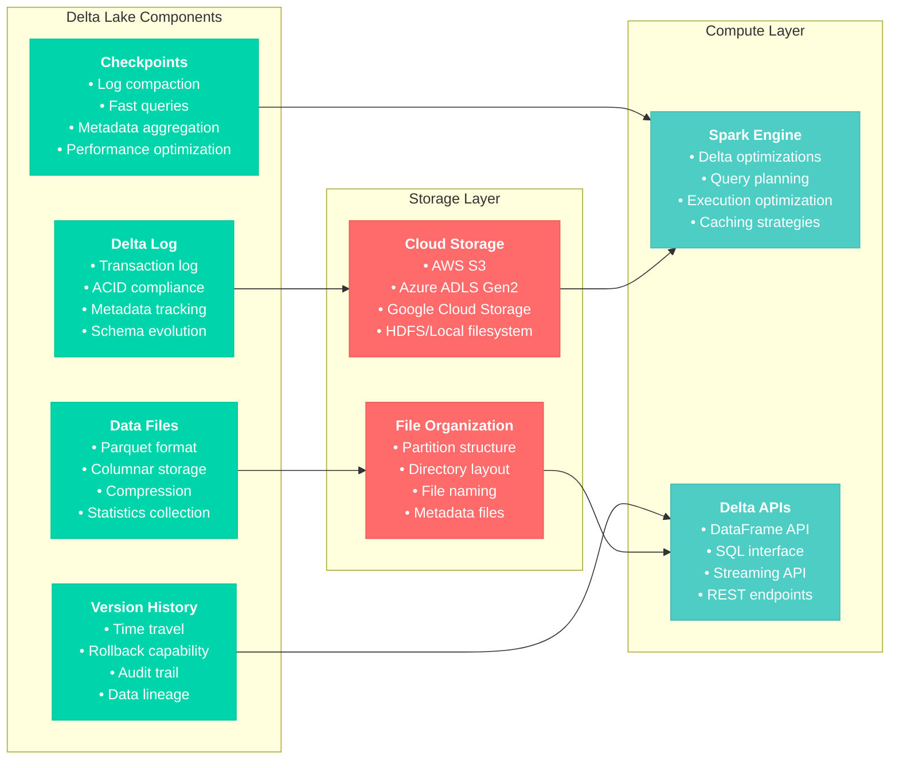
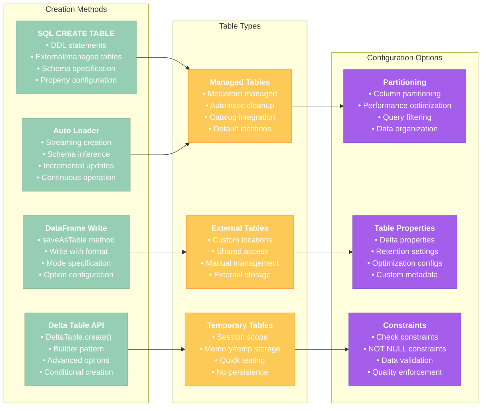
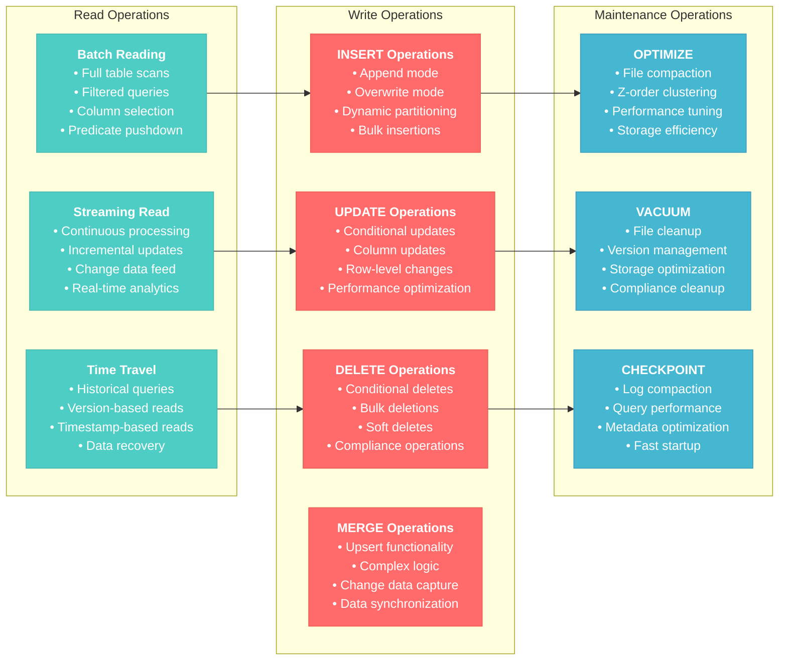
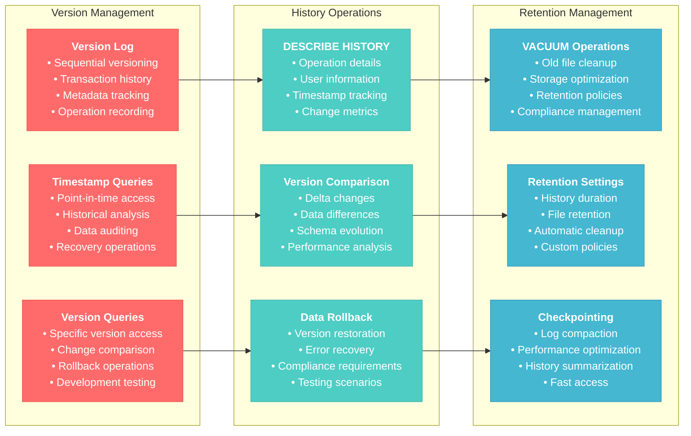
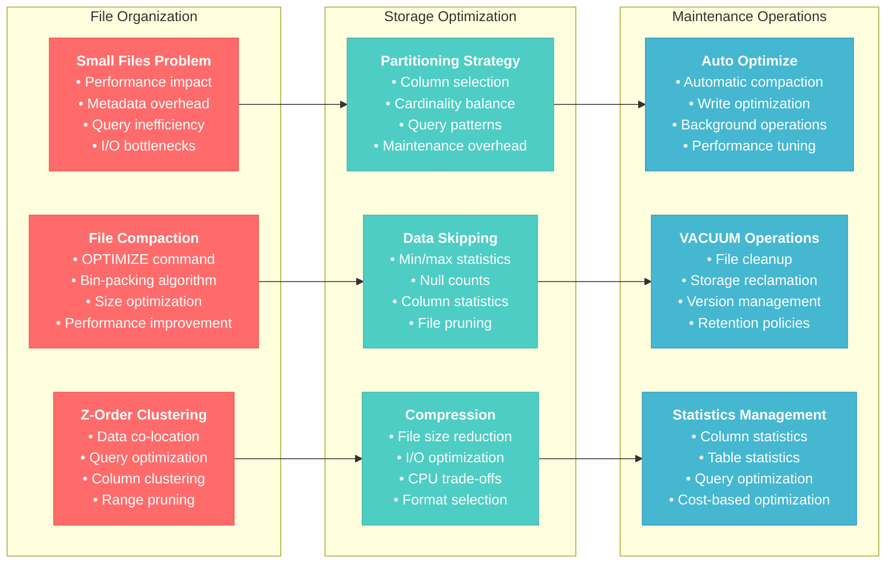

# Delta Lake Basics for Data Engineer Associate

## Overview
This section covers fundamental Delta Lake concepts, basic operations, and essential features for the Databricks Data Engineer Associate certification. Delta Lake provides ACID transactions, schema evolution, time travel, and optimized query performance for data lakes.

## 1. Delta Lake Fundamentals

### 1.1 Delta Lake Architecture



### 1.2 Key Delta Lake Features

#### ACID Transactions
```python
# Create a Delta table with ACID guarantees
df = spark.range(10).withColumn("value", col("id") * 2)

# Write as Delta table
df.write.format("delta").mode("overwrite").save("/tmp/delta-table")

# Register as a table
spark.sql("CREATE TABLE IF NOT EXISTS demo.my_delta_table USING DELTA LOCATION '/tmp/delta-table'")

# Concurrent write operations are automatically handled
df_new = spark.range(10, 20).withColumn("value", col("id") * 3)
df_new.write.format("delta").mode("append").save("/tmp/delta-table")

# Read shows consistent state
df_read = spark.read.format("delta").load("/tmp/delta-table")
display(df_read.orderBy("id"))
```

#### Schema Evolution
```python
from pyspark.sql.types import StructType, StructField, StringType, IntegerType, DoubleType

# Original schema
df_original = spark.createDataFrame([
    (1, "Alice", 25),
    (2, "Bob", 30)
], ["id", "name", "age"])

# Write initial data
df_original.write.format("delta").mode("overwrite").save("/tmp/schema-evolution-demo")

# New data with additional column
df_new_column = spark.createDataFrame([
    (3, "Charlie", 35, "Engineer"),
    (4, "Diana", 28, "Designer")
], ["id", "name", "age", "occupation"])

# Schema evolution - automatic with mergeSchema option
df_new_column.write \
    .format("delta") \
    .mode("append") \
    .option("mergeSchema", "true") \
    .save("/tmp/schema-evolution-demo")

# Verify schema evolution
df_evolved = spark.read.format("delta").load("/tmp/schema-evolution-demo")
df_evolved.printSchema()
display(df_evolved)
```

**Reference**: [Delta Lake Overview](https://docs.delta.io/latest/delta-intro.html)

## 2. Creating and Managing Delta Tables

### 2.1 Table Creation Methods



#### SQL Table Creation
```sql
-- Create managed Delta table with SQL
CREATE TABLE IF NOT EXISTS demo.customers (
    customer_id INT NOT NULL,
    first_name STRING,
    last_name STRING,
    email STRING,
    phone STRING,
    registration_date DATE,
    total_purchases DECIMAL(10,2),
    customer_status STRING,
    last_updated TIMESTAMP
) USING DELTA
PARTITIONED BY (customer_status)
TBLPROPERTIES (
    'delta.autoOptimize.optimizeWrite' = 'true',
    'delta.autoOptimize.autoCompact' = 'true',
    'delta.deletedFileRetentionDuration' = 'interval 7 days'
);

-- Create external Delta table
CREATE TABLE IF NOT EXISTS demo.external_sales (
    order_id INT,
    customer_id INT,
    product_id INT,
    quantity INT,
    unit_price DECIMAL(10,2),
    order_date DATE
) USING DELTA
LOCATION '/mnt/external-data/sales-delta/'
PARTITIONED BY (order_date);

-- Add constraints to ensure data quality
ALTER TABLE demo.customers 
ADD CONSTRAINT customers_email_check 
CHECK (email LIKE '%@%.%');

ALTER TABLE demo.customers 
ADD CONSTRAINT customers_purchases_positive 
CHECK (total_purchases >= 0);
```

#### DataFrame API Table Creation
```python
from delta.tables import DeltaTable
from pyspark.sql.types import *

# Define schema explicitly
customer_schema = StructType([
    StructField("customer_id", IntegerType(), False),
    StructField("first_name", StringType(), True),
    StructField("last_name", StringType(), True),
    StructField("email", StringType(), True),
    StructField("phone", StringType(), True),
    StructField("registration_date", DateType(), True),
    StructField("total_purchases", DecimalType(10, 2), True),
    StructField("customer_status", StringType(), True),
    StructField("last_updated", TimestampType(), True)
])

# Create Delta table using DeltaTable API
DeltaTable.create(spark) \
    .tableName("demo.customers_api") \
    .addColumns(customer_schema) \
    .partitionedBy("customer_status") \
    .property("delta.autoOptimize.optimizeWrite", "true") \
    .property("delta.autoOptimize.autoCompact", "true") \
    .execute()

# Create table from DataFrame
sample_data = spark.createDataFrame([
    (1, "John", "Doe", "john.doe@email.com", "555-1234", "2024-01-15", 1500.00, "ACTIVE", "2024-01-15 10:30:00"),
    (2, "Jane", "Smith", "jane.smith@email.com", "555-5678", "2024-01-16", 2300.00, "ACTIVE", "2024-01-16 14:20:00")
], customer_schema)

sample_data.write \
    .format("delta") \
    .mode("append") \
    .option("mergeSchema", "true") \
    .saveAsTable("demo.customers_api")

# Create external table with custom location
sample_data.write \
    .format("delta") \
    .mode("overwrite") \
    .option("path", "/tmp/external-customers") \
    .saveAsTable("demo.external_customers")
```

#### Streaming Table Creation
```python
# Create Delta table using Auto Loader streaming
def create_streaming_delta_table(source_path, target_table, checkpoint_path):
    """
    Create Delta table from streaming data source
    """
    # Read streaming data
    df_stream = spark.readStream \
        .format("cloudFiles") \
        .option("cloudFiles.format", "json") \
        .option("cloudFiles.schemaLocation", f"{checkpoint_path}/schema") \
        .option("cloudFiles.inferColumnTypes", "true") \
        .load(source_path)
    
    # Add metadata columns
    df_enriched = df_stream \
        .withColumn("ingestion_timestamp", current_timestamp()) \
        .withColumn("source_file", input_file_name())
    
    # Write to Delta table
    query = df_enriched.writeStream \
        .format("delta") \
        .option("checkpointLocation", f"{checkpoint_path}/checkpoint") \
        .option("mergeSchema", "true") \
        .trigger(processingTime="30 seconds") \
        .table(target_table)
    
    return query

# Create streaming table
streaming_query = create_streaming_delta_table(
    source_path="/mnt/raw-data/events/",
    target_table="bronze.events_stream",
    checkpoint_path="/tmp/events-stream"
)
```

**Reference**: [Creating Delta Tables](https://docs.delta.io/latest/delta-batch.html#create-table)

## 3. Basic Delta Lake Operations

### 3.1 CRUD Operations



#### Reading Delta Tables
```python
# Basic table reading
df = spark.read.format("delta").load("/tmp/delta-table")
# or
df = spark.table("demo.customers")

# Reading with filters (predicate pushdown)
df_filtered = spark.table("demo.customers") \
    .filter(col("customer_status") == "ACTIVE") \
    .filter(col("total_purchases") > 1000)

# Reading specific columns (projection pushdown)
df_projected = spark.table("demo.customers") \
    .select("customer_id", "first_name", "last_name", "total_purchases")

# Time travel - read previous versions
# By version number
df_version = spark.read.format("delta").option("versionAsOf", 0).load("/tmp/delta-table")

# By timestamp
df_timestamp = spark.read.format("delta") \
    .option("timestampAsOf", "2024-01-15 10:00:00") \
    .load("/tmp/delta-table")

# SQL time travel
spark.sql("SELECT * FROM demo.customers VERSION AS OF 1")
spark.sql("SELECT * FROM demo.customers TIMESTAMP AS OF '2024-01-15 10:00:00'")

display(df_filtered)
```

#### Writing to Delta Tables
```python
from pyspark.sql.functions import current_timestamp, lit

# Create sample data
new_customers = spark.createDataFrame([
    (3, "Mike", "Johnson", "mike.j@email.com", "555-9999", "2024-01-17", 500.00, "ACTIVE"),
    (4, "Sarah", "Wilson", "sarah.w@email.com", "555-8888", "2024-01-17", 1200.00, "ACTIVE"),
    (5, "Tom", "Brown", "tom.b@email.com", "555-7777", "2024-01-17", 0.00, "INACTIVE")
], ["customer_id", "first_name", "last_name", "email", "phone", "registration_date", "total_purchases", "customer_status"])

# Add timestamp column
new_customers_with_ts = new_customers.withColumn("last_updated", current_timestamp())

# Append data
new_customers_with_ts.write \
    .format("delta") \
    .mode("append") \
    .saveAsTable("demo.customers")

# Overwrite data
new_customers_with_ts.write \
    .format("delta") \
    .mode("overwrite") \
    .saveAsTable("demo.customers_backup")

# Overwrite specific partitions
new_customers_with_ts.write \
    .format("delta") \
    .mode("overwrite") \
    .option("replaceWhere", "customer_status = 'INACTIVE'") \
    .saveAsTable("demo.customers")

display(spark.table("demo.customers"))
```

#### UPDATE Operations
```python
from delta.tables import DeltaTable

# Get Delta table reference
delta_table = DeltaTable.forName(spark, "demo.customers")

# Simple update
delta_table.update(
    condition="customer_status = 'INACTIVE'",
    set={"total_purchases": "0.0", "last_updated": "current_timestamp()"}
)

# Conditional update with complex logic
delta_table.update(
    condition="total_purchases > 2000",
    set={
        "customer_status": "'PREMIUM'",
        "last_updated": "current_timestamp()"
    }
)

# Update with SQL
spark.sql("""
    UPDATE demo.customers 
    SET total_purchases = total_purchases * 1.1,
        last_updated = current_timestamp()
    WHERE customer_status = 'PREMIUM'
""")

# Update using DataFrame operations
customers_df = spark.table("demo.customers")
updated_df = customers_df \
    .withColumn("total_purchases", 
                when(col("customer_status") == "PREMIUM", col("total_purchases") * 1.05)
                .otherwise(col("total_purchases"))) \
    .withColumn("last_updated", current_timestamp())

updated_df.write.format("delta").mode("overwrite").saveAsTable("demo.customers")
```

#### DELETE Operations
```python
# Simple delete
delta_table.delete(condition="customer_status = 'INACTIVE' AND total_purchases = 0")

# Delete with complex conditions
delta_table.delete(
    condition="total_purchases < 100 AND registration_date < '2024-01-01'"
)

# Delete using SQL
spark.sql("""
    DELETE FROM demo.customers 
    WHERE last_updated < current_date() - INTERVAL 30 DAYS
    AND customer_status = 'INACTIVE'
""")

# Soft delete pattern - mark as deleted instead of removing
delta_table.update(
    condition="customer_id IN (1, 2, 3)",
    set={
        "customer_status": "'DELETED'",
        "last_updated": "current_timestamp()"
    }
)
```

#### MERGE Operations (Upsert)
```python
# Sample source data for merge
source_data = spark.createDataFrame([
    (1, "John", "Doe", "john.doe.updated@email.com", "555-1234", "2024-01-15", 1800.00, "PREMIUM"),  # Update existing
    (2, "Jane", "Smith", "jane.smith@email.com", "555-5678", "2024-01-16", 2500.00, "PREMIUM"),     # Update existing
    (6, "Alice", "Green", "alice.g@email.com", "555-3333", "2024-01-18", 300.00, "ACTIVE")          # Insert new
], ["customer_id", "first_name", "last_name", "email", "phone", "registration_date", "total_purchases", "customer_status"])

source_with_ts = source_data.withColumn("last_updated", current_timestamp())

# MERGE operation
delta_table.alias("target").merge(
    source_with_ts.alias("source"),
    "target.customer_id = source.customer_id"
).whenMatchedUpdate(set={
    "first_name": "source.first_name",
    "last_name": "source.last_name", 
    "email": "source.email",
    "phone": "source.phone",
    "total_purchases": "source.total_purchases",
    "customer_status": "source.customer_status",
    "last_updated": "source.last_updated"
}).whenNotMatchedInsert(values={
    "customer_id": "source.customer_id",
    "first_name": "source.first_name",
    "last_name": "source.last_name",
    "email": "source.email", 
    "phone": "source.phone",
    "registration_date": "source.registration_date",
    "total_purchases": "source.total_purchases",
    "customer_status": "source.customer_status",
    "last_updated": "source.last_updated"
}).execute()

# Complex MERGE with conditions
delta_table.alias("target").merge(
    source_with_ts.alias("source"),
    "target.customer_id = source.customer_id"
).whenMatchedUpdate(
    condition="target.last_updated < source.last_updated",
    set={
        "email": "source.email",
        "total_purchases": "target.total_purchases + source.total_purchases",
        "customer_status": "source.customer_status",
        "last_updated": "source.last_updated"
    }
).whenNotMatchedInsert(
    condition="source.total_purchases > 0",
    values={
        "customer_id": "source.customer_id",
        "first_name": "source.first_name",
        "last_name": "source.last_name",
        "email": "source.email",
        "phone": "source.phone", 
        "registration_date": "source.registration_date",
        "total_purchases": "source.total_purchases",
        "customer_status": "source.customer_status",
        "last_updated": "source.last_updated"
    }
).execute()

display(spark.table("demo.customers"))
```

**Reference**: [Delta Lake DML Operations](https://docs.delta.io/latest/delta-update.html)

## 4. Time Travel and History

### 4.1 Version History Management



#### Version History Queries
```python
# View table history
history_df = spark.sql("DESCRIBE HISTORY demo.customers")
display(history_df)

# View history with API
delta_table = DeltaTable.forName(spark, "demo.customers")
history_df = delta_table.history()
display(history_df.select("version", "timestamp", "operation", "operationParameters"))

# Get specific version information
version_info = delta_table.history(1)  # Get last 1 operation
display(version_info)

# Query historical data by version
historical_data_v0 = spark.sql("SELECT * FROM demo.customers VERSION AS OF 0")
historical_data_v1 = spark.sql("SELECT * FROM demo.customers VERSION AS OF 1")

# Query historical data by timestamp
historical_data_ts = spark.sql("""
    SELECT * FROM demo.customers 
    TIMESTAMP AS OF '2024-01-15 10:00:00'
""")

# Compare versions
print("Version 0 count:", historical_data_v0.count())
print("Version 1 count:", historical_data_v1.count())
print("Current count:", spark.table("demo.customers").count())
```

#### Data Recovery and Rollback
```python
# Rollback to previous version by recreating table
def rollback_table(table_name, target_version):
    """
    Rollback Delta table to a specific version
    """
    # Read data from target version
    historical_data = spark.read.format("delta") \
        .option("versionAsOf", target_version) \
        .table(table_name)
    
    # Overwrite current table with historical data
    historical_data.write \
        .format("delta") \
        .mode("overwrite") \
        .option("overwriteSchema", "true") \
        .saveAsTable(table_name)
    
    print(f"Table {table_name} rolled back to version {target_version}")

# Example rollback
# rollback_table("demo.customers", 0)

# Restore deleted data
def restore_deleted_records(table_name, deletion_version):
    """
    Restore records that were deleted in a specific operation
    """
    # Get data before deletion
    before_deletion = spark.read.format("delta") \
        .option("versionAsOf", deletion_version - 1) \
        .table(table_name)
    
    # Get data after deletion
    after_deletion = spark.read.format("delta") \
        .option("versionAsOf", deletion_version) \
        .table(table_name)
    
    # Find deleted records
    deleted_records = before_deletion.exceptAll(after_deletion)
    
    # Insert deleted records back
    if deleted_records.count() > 0:
        deleted_records.write \
            .format("delta") \
            .mode("append") \
            .saveAsTable(table_name)
        
        print(f"Restored {deleted_records.count()} deleted records")
    else:
        print("No deleted records found")
    
    return deleted_records

# Example restore
# restored = restore_deleted_records("demo.customers", 2)
```

#### Time Travel for Analysis
```python
# Analyze data changes over time
def analyze_table_changes(table_name, start_version, end_version):
    """
    Analyze changes between table versions
    """
    changes = []
    
    for version in range(start_version, end_version + 1):
        version_data = spark.read.format("delta") \
            .option("versionAsOf", version) \
            .table(table_name)
        
        changes.append({
            "version": version,
            "record_count": version_data.count(),
            "active_customers": version_data.filter(col("customer_status") == "ACTIVE").count(),
            "total_purchases": version_data.agg(sum("total_purchases")).collect()[0][0] or 0
        })
    
    return spark.createDataFrame(changes)

# Analyze changes
changes_df = analyze_table_changes("demo.customers", 0, 3)
display(changes_df)

# Data audit query
audit_query = """
WITH version_comparison AS (
    SELECT 
        'current' as version_type,
        COUNT(*) as total_records,
        SUM(total_purchases) as total_revenue
    FROM demo.customers
    
    UNION ALL
    
    SELECT 
        'version_0' as version_type,
        COUNT(*) as total_records,
        SUM(total_purchases) as total_revenue
    FROM demo.customers VERSION AS OF 0
)
SELECT * FROM version_comparison
"""

audit_results = spark.sql(audit_query)
display(audit_results)
```

**Reference**: [Delta Lake Time Travel](https://docs.delta.io/latest/delta-batch.html#query-an-older-snapshot-of-a-table-time-travel)

## 5. Basic Performance Optimization

### 5.1 File Management and Optimization



#### OPTIMIZE Operations
```python
# Basic table optimization
spark.sql("OPTIMIZE demo.customers")

# Optimize with Z-ORDER clustering
spark.sql("OPTIMIZE demo.customers ZORDER BY (customer_status, total_purchases)")

# Optimize specific partitions
spark.sql("OPTIMIZE demo.customers WHERE customer_status = 'ACTIVE'")

# Optimize using Delta Table API
delta_table = DeltaTable.forName(spark, "demo.customers")
delta_table.optimize().executeCompaction()

# Z-ORDER optimization with API
delta_table.optimize().executeZOrderBy("customer_status", "total_purchases")

# Check optimization results
optimization_history = spark.sql("""
    DESCRIBE HISTORY demo.customers 
    WHERE operation = 'OPTIMIZE'
    ORDER BY timestamp DESC
    LIMIT 5
""")
display(optimization_history)
```

#### VACUUM Operations
```python
# Vacuum old files (default retention 7 days)
spark.sql("VACUUM demo.customers")

# Vacuum with custom retention period
spark.sql("VACUUM demo.customers RETAIN 168 HOURS")  # 7 days

# Dry run to see what would be deleted
spark.sql("VACUUM demo.customers DRY RUN")

# Vacuum using Delta Table API
delta_table.vacuum()  # Default retention
delta_table.vacuum(168)  # Custom hours

# Set retention properties
spark.sql("""
    ALTER TABLE demo.customers 
    SET TBLPROPERTIES (
        'delta.deletedFileRetentionDuration' = 'interval 168 hours'
    )
""")

# Check vacuum history
vacuum_history = spark.sql("""
    DESCRIBE HISTORY demo.customers 
    WHERE operation = 'VACUUM END'
    ORDER BY timestamp DESC
    LIMIT 3
""")
display(vacuum_history)
```

#### Auto Optimize Configuration
```python
# Enable Auto Optimize for table
spark.sql("""
    ALTER TABLE demo.customers 
    SET TBLPROPERTIES (
        'delta.autoOptimize.optimizeWrite' = 'true',
        'delta.autoOptimize.autoCompact' = 'true'
    )
""")

# Set Auto Optimize at session level
spark.conf.set("spark.databricks.delta.optimizeWrite.enabled", "true")
spark.conf.set("spark.databricks.delta.autoCompact.enabled", "true")

# Create table with Auto Optimize enabled
spark.sql("""
    CREATE TABLE demo.auto_optimized_table (
        id INT,
        name STRING,
        value DOUBLE,
        created_date DATE
    ) USING DELTA
    PARTITIONED BY (created_date)
    TBLPROPERTIES (
        'delta.autoOptimize.optimizeWrite' = 'true',
        'delta.autoOptimize.autoCompact' = 'true',
        'delta.tuneFileSizesForRewrites' = 'true'
    )
""")

# Monitor Auto Optimize operations
auto_opt_history = spark.sql("""
    DESCRIBE HISTORY demo.customers 
    WHERE operation LIKE '%OPTIMIZE%' OR operation LIKE '%COMPACT%'
    ORDER BY timestamp DESC
""")
display(auto_opt_history)
```

#### Performance Monitoring
```python
# Check table file statistics
def analyze_table_files(table_name):
    """
    Analyze Delta table file organization
    """
    # Get table location
    table_detail = spark.sql(f"DESCRIBE DETAIL {table_name}")
    location = table_detail.select("location").collect()[0][0]
    
    # List files
    files_df = spark.sql(f"LIST '{location}'")
    
    # Analyze Parquet files
    parquet_files = files_df.filter(col("path").endswith(".parquet"))
    
    stats = parquet_files.agg(
        count("*").alias("total_files"),
        sum("size").alias("total_size_bytes"),
        avg("size").alias("avg_file_size_bytes"),
        min("size").alias("min_file_size_bytes"),
        max("size").alias("max_file_size_bytes")
    ).collect()[0]
    
    print(f"Table: {table_name}")
    print(f"Total files: {stats['total_files']}")
    print(f"Total size: {stats['total_size_bytes']:,} bytes")
    print(f"Average file size: {stats['avg_file_size_bytes']:,.0f} bytes")
    print(f"Min file size: {stats['min_file_size_bytes']:,} bytes")
    print(f"Max file size: {stats['max_file_size_bytes']:,} bytes")
    
    return parquet_files

# Analyze table files
file_stats = analyze_table_files("demo.customers")

# Check table properties
table_properties = spark.sql("SHOW TBLPROPERTIES demo.customers")
display(table_properties)

# Performance monitoring query
performance_query = """
SELECT 
    operation,
    COUNT(*) as operation_count,
    AVG(operationMetrics.numTargetRowsInserted) as avg_rows_inserted,
    AVG(operationMetrics.numTargetRowsUpdated) as avg_rows_updated,
    AVG(operationMetrics.numTargetRowsDeleted) as avg_rows_deleted,
    AVG(operationMetrics.executionTimeMs) as avg_execution_time_ms
FROM (
    DESCRIBE HISTORY demo.customers
)
WHERE operationMetrics IS NOT NULL
GROUP BY operation
ORDER BY operation_count DESC
"""

performance_stats = spark.sql(performance_query)
display(performance_stats)
```

**Reference**: [Delta Lake Performance Tuning](https://docs.delta.io/latest/optimizations-oss.html)

## 6. Schema Evolution and Management

### 6.1 Schema Changes

#### Schema Evolution Examples
```python
# Enable schema evolution for writes
spark.conf.set("spark.databricks.delta.schema.autoMerge.enabled", "true")

# Add new columns with schema evolution
new_data_with_columns = spark.createDataFrame([
    (7, "David", "Lee", "david.l@email.com", "555-4444", "2024-01-19", 800.00, "ACTIVE", "Engineer", "Corporate"),
    (8, "Lisa", "Chen", "lisa.c@email.com", "555-2222", "2024-01-19", 1500.00, "PREMIUM", "Manager", "Enterprise")
], ["customer_id", "first_name", "last_name", "email", "phone", "registration_date", "total_purchases", "customer_status", "job_title", "account_type"])

# Write with automatic schema merge
new_data_with_columns.withColumn("last_updated", current_timestamp()) \
    .write \
    .format("delta") \
    .mode("append") \
    .option("mergeSchema", "true") \
    .saveAsTable("demo.customers")

# Manual schema evolution using ALTER TABLE
spark.sql("""
    ALTER TABLE demo.customers 
    ADD COLUMN (
        customer_segment STRING,
        loyalty_points INT DEFAULT 0
    )
""")

# Update existing records with new column values
spark.sql("""
    UPDATE demo.customers 
    SET customer_segment = CASE 
        WHEN total_purchases >= 2000 THEN 'HIGH_VALUE'
        WHEN total_purchases >= 1000 THEN 'MEDIUM_VALUE'
        ELSE 'LOW_VALUE'
    END,
    loyalty_points = CAST(total_purchases / 10 AS INT)
    WHERE customer_segment IS NULL
""")

# Check evolved schema
evolved_schema = spark.table("demo.customers")
evolved_schema.printSchema()
display(evolved_schema.limit(5))
```

#### Schema Constraints
```python
# Add CHECK constraints
spark.sql("""
    ALTER TABLE demo.customers 
    ADD CONSTRAINT valid_loyalty_points 
    CHECK (loyalty_points >= 0)
""")

spark.sql("""
    ALTER TABLE demo.customers 
    ADD CONSTRAINT valid_email_format 
    CHECK (email RLIKE '^[A-Za-z0-9._%+-]+@[A-Za-z0-9.-]+\\.[A-Za-z]{2,}$')
""")

# Add NOT NULL constraint
spark.sql("""
    ALTER TABLE demo.customers 
    ALTER COLUMN customer_id SET NOT NULL
""")

# View constraints
constraints_df = spark.sql("SHOW TBLPROPERTIES demo.customers")
display(constraints_df.filter(col("key").startswith("delta.constraints")))

# Test constraint validation
try:
    # This should fail due to email constraint
    invalid_data = spark.createDataFrame([
        (9, "Test", "User", "invalid-email", "555-0000", "2024-01-20", 100.00, "ACTIVE", 10)
    ], ["customer_id", "first_name", "last_name", "email", "phone", "registration_date", "total_purchases", "customer_status", "loyalty_points"])
    
    invalid_data.withColumn("last_updated", current_timestamp()) \
        .write \
        .format("delta") \
        .mode("append") \
        .saveAsTable("demo.customers")
        
except Exception as e:
    print(f"Constraint violation caught: {e}")
```

**Reference**: [Delta Lake Schema Evolution](https://docs.delta.io/latest/delta-batch.html#schema-validation)

## 7. Best Practices Summary

### 7.1 Delta Lake Best Practices
1. **Schema Management**: Use explicit schemas and schema evolution carefully
2. **Partitioning**: Choose partition columns based on query patterns
3. **Optimization**: Regular OPTIMIZE and VACUUM operations
4. **Constraints**: Implement data quality constraints
5. **Monitoring**: Track table performance and file organization

### 7.2 Performance Best Practices
1. **File Sizing**: Aim for 100MB-1GB file sizes
2. **Z-Order**: Use Z-ORDER for columns frequently used in filters
3. **Auto Optimize**: Enable for write-heavy workloads
4. **Retention**: Balance storage costs with time travel needs
5. **Statistics**: Keep table statistics current for query optimization

### 7.3 Operational Best Practices
1. **Version Management**: Understand impact of VACUUM on time travel
2. **Schema Evolution**: Test schema changes in development first
3. **Constraints**: Implement data validation early in pipeline
4. **Monitoring**: Set up alerts for table health and performance
5. **Documentation**: Document schema changes and business logic

## Conclusion

Delta Lake provides powerful capabilities for managing data lakes with ACID transactions, schema evolution, and time travel. Master these fundamentals for efficient data engineering workflows and reliable data processing pipelines.

Practice with different table operations, schema changes, and optimization techniques to build expertise in Delta Lake management and performance tuning.
