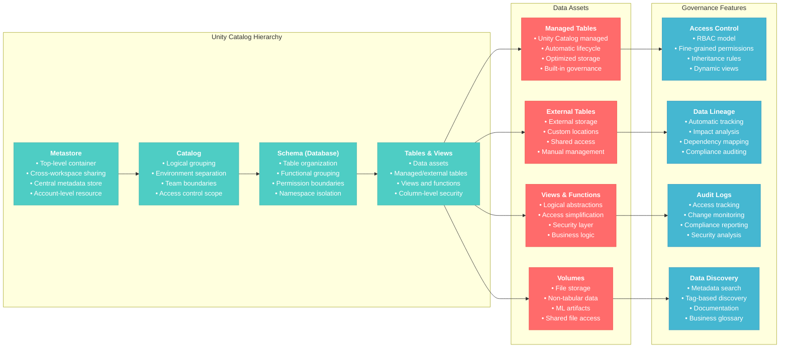
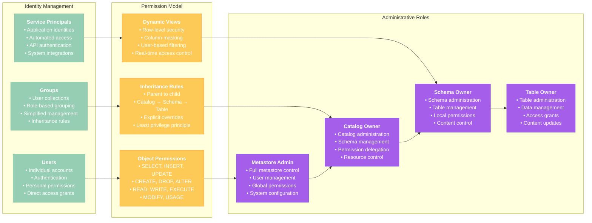
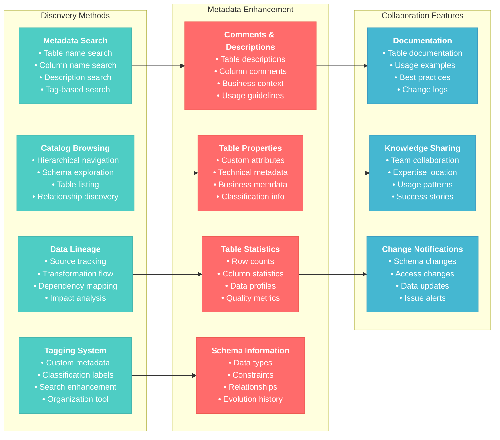
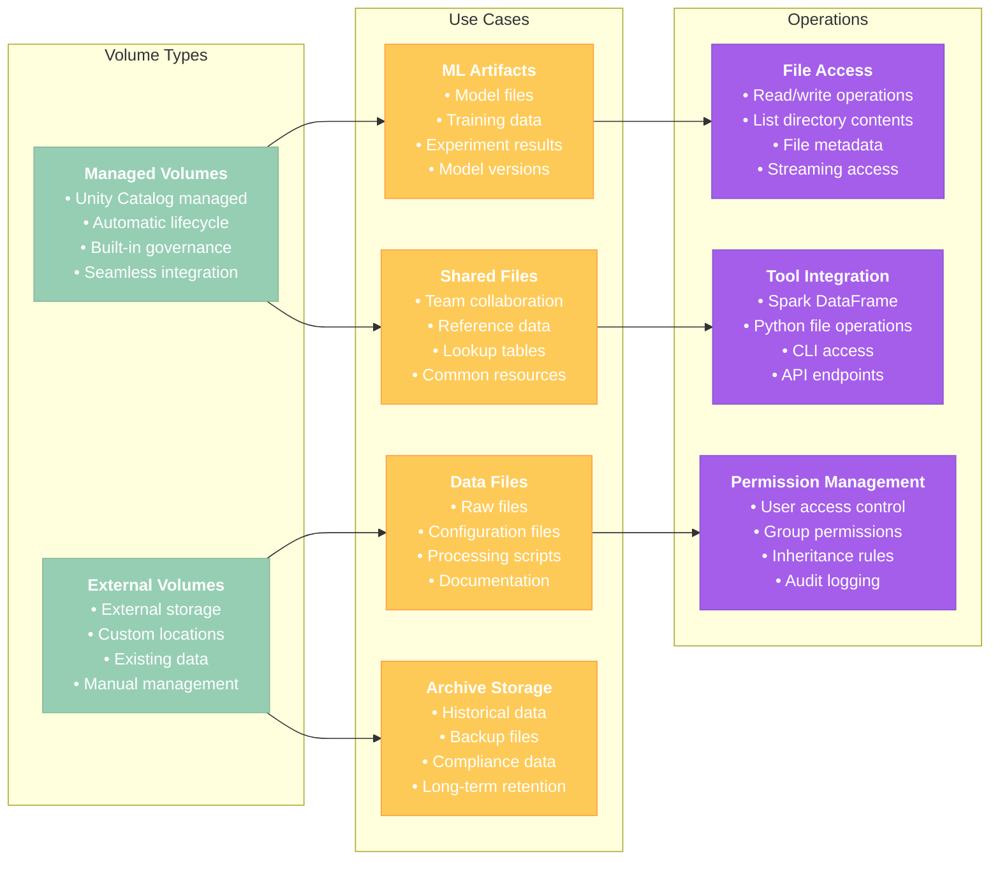
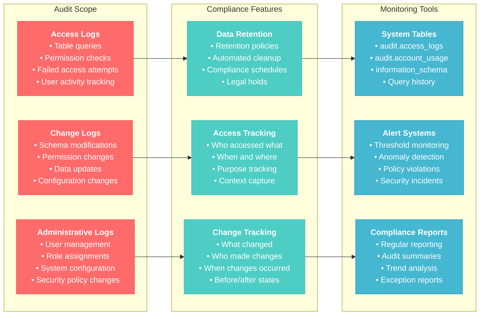

# Data Governance and Unity Catalog Basics for Data Engineer Associate

## Overview
This section covers fundamental data governance concepts, Unity Catalog basics, and security principles essential for the Databricks Data Engineer Associate certification. Focus on understanding access control, data discovery, and basic governance workflows.

## 1. Unity Catalog Fundamentals

### 1.1 Unity Catalog Architecture



### 1.2 Basic Unity Catalog Operations

#### Creating Catalogs and Schemas
```sql
-- Create a new catalog
CREATE CATALOG IF NOT EXISTS development
COMMENT 'Development environment catalog';

-- Create catalog with properties
CREATE CATALOG IF NOT EXISTS production
COMMENT 'Production environment catalog'
TBLPROPERTIES (
    'owner' = 'data-engineering-team',
    'environment' = 'prod',
    'cost-center' = 'analytics'
);

-- Show available catalogs
SHOW CATALOGS;

-- Use a specific catalog
USE CATALOG development;

-- Create schemas within catalog
CREATE SCHEMA IF NOT EXISTS development.bronze
COMMENT 'Raw data landing zone';

CREATE SCHEMA IF NOT EXISTS development.silver
COMMENT 'Cleaned and validated data';

CREATE SCHEMA IF NOT EXISTS development.gold
COMMENT 'Business-ready aggregated data';

-- Create schema with location for external tables
CREATE SCHEMA IF NOT EXISTS development.external_data
LOCATION 's3://my-bucket/external-data/'
COMMENT 'External data sources';

-- Show schemas in current catalog
SHOW SCHEMAS;

-- Show schemas in specific catalog
SHOW SCHEMAS IN CATALOG production;
```

#### Working with Tables in Unity Catalog
```python
# Set current catalog and schema
spark.sql("USE CATALOG development")
spark.sql("USE SCHEMA bronze")

# Create managed table in Unity Catalog
customers_data = spark.createDataFrame([
    (1, "John", "Doe", "john.doe@email.com", "2024-01-15", 1500.00),
    (2, "Jane", "Smith", "jane.smith@email.com", "2024-01-16", 2300.00),
    (3, "Mike", "Johnson", "mike.j@email.com", "2024-01-17", 800.00)
], ["customer_id", "first_name", "last_name", "email", "registration_date", "total_purchases"])

# Write as managed table
customers_data.write \
    .format("delta") \
    .mode("overwrite") \
    .saveAsTable("development.bronze.customers")

# Create external table
spark.sql("""
    CREATE TABLE IF NOT EXISTS development.external_data.external_customers
    USING DELTA
    LOCATION 's3://my-bucket/external-customers/'
    AS SELECT * FROM development.bronze.customers
""")

# Create view
spark.sql("""
    CREATE VIEW development.silver.active_customers AS
    SELECT 
        customer_id,
        first_name,
        last_name,
        email,
        total_purchases
    FROM development.bronze.customers
    WHERE total_purchases > 1000
""")

# Query with three-part naming
df = spark.sql("SELECT * FROM development.bronze.customers")
display(df)

# Show tables in current schema
spark.sql("SHOW TABLES").show()

# Show all tables in catalog
spark.sql("SHOW TABLES IN development.bronze").show()
```

#### Table Information and Metadata
```python
# Get table details
table_info = spark.sql("DESCRIBE TABLE EXTENDED development.bronze.customers")
display(table_info)

# Show table properties
properties = spark.sql("SHOW TBLPROPERTIES development.bronze.customers")
display(properties)

# Show table history
history = spark.sql("DESCRIBE HISTORY development.bronze.customers")
display(history)

# Get column information
columns = spark.sql("DESCRIBE development.bronze.customers")
display(columns)

# Show table schema
schema_info = spark.sql("SHOW CREATE TABLE development.bronze.customers")
display(schema_info)
```

**Reference**: [Unity Catalog Documentation](https://docs.databricks.com/data-governance/unity-catalog/index.html)

## 2. Access Control and Permissions

### 2.1 Role-Based Access Control (RBAC)



#### Basic Permission Management
```sql
-- Grant catalog permissions
GRANT USE CATALOG ON CATALOG development TO `data-engineers@company.com`;
GRANT CREATE SCHEMA ON CATALOG development TO `data-engineers@company.com`;

-- Grant schema permissions
GRANT USE SCHEMA ON SCHEMA development.bronze TO `data-analysts@company.com`;
GRANT SELECT ON SCHEMA development.silver TO `business-users@company.com`;

-- Grant table-level permissions
GRANT SELECT ON TABLE development.bronze.customers TO `analysts@company.com`;
GRANT SELECT, INSERT, UPDATE ON TABLE development.bronze.customers TO `data-engineers@company.com`;

-- Grant permissions to groups
GRANT USE CATALOG ON CATALOG development TO `analytics-team`;
GRANT CREATE TABLE ON SCHEMA development.bronze TO `etl-developers`;

-- Show grants for current user
SHOW GRANTS ON CATALOG development;
SHOW GRANTS ON SCHEMA development.bronze;
SHOW GRANTS ON TABLE development.bronze.customers;

-- Show grants for specific principal
SHOW GRANTS `data-engineers@company.com` ON CATALOG development;

-- Revoke permissions
REVOKE SELECT ON TABLE development.bronze.customers FROM `analysts@company.com`;
REVOKE CREATE SCHEMA ON CATALOG development FROM `junior-developers`;
```

#### Dynamic Views for Row-Level Security
```sql
-- Create dynamic view with row-level filtering
CREATE VIEW development.silver.customer_filtered AS
SELECT 
    customer_id,
    first_name,
    last_name,
    CASE 
        WHEN is_member('sensitive-data-access') THEN email
        ELSE 'REDACTED'
    END as email,
    registration_date,
    total_purchases
FROM development.bronze.customers
WHERE 
    CASE 
        WHEN is_member('all-data-access') THEN TRUE
        WHEN is_member('regional-access-west') THEN region = 'West'
        WHEN is_member('regional-access-east') THEN region = 'East'
        ELSE FALSE
    END;

-- Create view with column masking
CREATE VIEW development.silver.customer_masked AS
SELECT 
    customer_id,
    first_name,
    last_name,
    CASE 
        WHEN is_member('pii-access') THEN email
        ELSE CONCAT(SUBSTRING(email, 1, 3), '***@***.com')
    END as email,
    registration_date,
    CASE 
        WHEN is_member('financial-data-access') THEN total_purchases
        ELSE NULL
    END as total_purchases
FROM development.bronze.customers;

-- Grant access to dynamic views
GRANT SELECT ON VIEW development.silver.customer_filtered TO `business-analysts@company.com`;
GRANT SELECT ON VIEW development.silver.customer_masked TO `external-partners@company.com`;
```

#### Function-Based Access Control
```python
# Create function to check user permissions
spark.sql("""
CREATE FUNCTION development.bronze.check_data_access(required_level STRING)
RETURNS BOOLEAN
LANGUAGE SQL
DETERMINISTIC
RETURN CASE 
    WHEN required_level = 'public' THEN TRUE
    WHEN required_level = 'internal' AND is_member('internal-users') THEN TRUE
    WHEN required_level = 'sensitive' AND is_member('sensitive-data-access') THEN TRUE
    WHEN required_level = 'confidential' AND is_member('confidential-data-access') THEN TRUE
    ELSE FALSE
END
""")

# Create table with data classification
spark.sql("""
CREATE TABLE development.bronze.classified_data (
    id INT,
    public_info STRING,
    internal_info STRING,
    sensitive_info STRING,
    confidential_info STRING,
    data_classification STRING
) USING DELTA
""")

# Create access-controlled view
spark.sql("""
CREATE VIEW development.silver.classified_data_view AS
SELECT 
    id,
    public_info,
    CASE WHEN development.bronze.check_data_access('internal') THEN internal_info ELSE NULL END as internal_info,
    CASE WHEN development.bronze.check_data_access('sensitive') THEN sensitive_info ELSE NULL END as sensitive_info,
    CASE WHEN development.bronze.check_data_access('confidential') THEN confidential_info ELSE NULL END as confidential_info
FROM development.bronze.classified_data
""")
```

**Reference**: [Unity Catalog Permissions](https://docs.databricks.com/data-governance/unity-catalog/manage-privileges/privileges.html)

## 3. Data Discovery and Metadata Management

### 3.1 Data Discovery Features



#### Adding Metadata and Comments
```sql
-- Add table comments and properties
ALTER TABLE development.bronze.customers 
SET TBLPROPERTIES (
    'comment' = 'Customer master data with contact information and purchase history',
    'owner' = 'data-engineering-team',
    'data_classification' = 'internal',
    'retention_policy' = '7_years',
    'update_frequency' = 'daily',
    'data_source' = 'crm_system',
    'created_by' = 'etl_pipeline_v2'
);

-- Add column comments
ALTER TABLE development.bronze.customers 
ALTER COLUMN customer_id COMMENT 'Unique customer identifier from CRM system';

ALTER TABLE development.bronze.customers 
ALTER COLUMN email COMMENT 'Primary email address for customer communication';

ALTER TABLE development.bronze.customers 
ALTER COLUMN total_purchases COMMENT 'Lifetime purchase amount in USD';

-- Add tags to tables
ALTER TABLE development.bronze.customers 
SET TAGS ('pii' = 'contains_email', 'department' = 'sales', 'criticality' = 'high');

-- Create well-documented view
CREATE VIEW development.gold.customer_summary 
(
    customer_id COMMENT 'Unique customer identifier',
    full_name COMMENT 'Customer full name (first + last)',
    contact_email COMMENT 'Primary contact email',
    customer_tier COMMENT 'Customer tier based on purchase history',
    lifetime_value COMMENT 'Total lifetime purchase value in USD'
)
COMMENT 'Summary view of customer data for business reporting'
AS
SELECT 
    customer_id,
    CONCAT(first_name, ' ', last_name) as full_name,
    email as contact_email,
    CASE 
        WHEN total_purchases >= 2000 THEN 'PREMIUM'
        WHEN total_purchases >= 1000 THEN 'STANDARD'
        ELSE 'BASIC'
    END as customer_tier,
    total_purchases as lifetime_value
FROM development.bronze.customers;

-- Set tags on view
ALTER VIEW development.gold.customer_summary 
SET TAGS ('usage' = 'reporting', 'refresh' = 'daily', 'audience' = 'business_users');
```

#### Exploring Metadata
```python
# Search for tables with specific tags
tagged_tables = spark.sql("""
    SELECT 
        table_catalog,
        table_schema,
        table_name,
        table_type,
        comment
    FROM system.information_schema.tables 
    WHERE table_catalog = 'development'
    AND table_name LIKE '%customer%'
""")
display(tagged_tables)

# Get detailed table information
table_details = spark.sql("""
    SELECT 
        table_catalog,
        table_schema, 
        table_name,
        table_type,
        data_source_format,
        location,
        comment,
        owner,
        created
    FROM system.information_schema.tables 
    WHERE table_catalog = 'development'
    AND table_schema = 'bronze'
""")
display(table_details)

# Get column information with comments
column_info = spark.sql("""
    SELECT 
        table_name,
        column_name,
        data_type,
        is_nullable,
        column_default,
        comment
    FROM system.information_schema.columns 
    WHERE table_catalog = 'development'
    AND table_schema = 'bronze'
    AND table_name = 'customers'
    ORDER BY ordinal_position
""")
display(column_info)

# Search for tables by comment content
search_results = spark.sql("""
    SELECT 
        table_catalog,
        table_schema,
        table_name,
        comment
    FROM system.information_schema.tables 
    WHERE comment LIKE '%customer%'
    OR comment LIKE '%purchase%'
""")
display(search_results)
```

#### Data Lineage Exploration
```python
# View table lineage (requires additional setup)
def explore_table_lineage(table_name):
    """
    Explore data lineage for a table
    """
    # Get table dependencies from system tables
    lineage_info = spark.sql(f"""
        DESCRIBE HISTORY {table_name}
    """).select("operation", "operationParameters", "timestamp")
    
    print(f"Lineage information for {table_name}:")
    display(lineage_info)
    
    # Get view dependencies
    if "view" in table_name.lower():
        view_definition = spark.sql(f"SHOW CREATE TABLE {table_name}")
        print("View definition:")
        display(view_definition)

# Example lineage exploration
explore_table_lineage("development.gold.customer_summary")

# Get schema-level statistics
schema_stats = spark.sql("""
    SELECT 
        table_schema,
        COUNT(*) as table_count,
        COUNT(CASE WHEN table_type = 'MANAGED' THEN 1 END) as managed_tables,
        COUNT(CASE WHEN table_type = 'VIEW' THEN 1 END) as views,
        COUNT(CASE WHEN comment IS NOT NULL THEN 1 END) as documented_tables
    FROM system.information_schema.tables
    WHERE table_catalog = 'development'
    GROUP BY table_schema
    ORDER BY table_count DESC
""")
display(schema_stats)
```

**Reference**: [Unity Catalog Data Discovery](https://docs.databricks.com/data-governance/unity-catalog/data-discovery.html)

## 4. Volumes and File Management

### 4.1 Unity Catalog Volumes



#### Creating and Managing Volumes
```sql
-- Create managed volume
CREATE VOLUME development.bronze.data_files
COMMENT 'Volume for raw data files and configuration';

-- Create external volume
CREATE VOLUME development.bronze.external_files
USING 's3://my-bucket/external-files/'
COMMENT 'External volume for shared file access';

-- Show volumes
SHOW VOLUMES IN development.bronze;

-- Grant permissions on volume
GRANT READ FILES ON VOLUME development.bronze.data_files TO `data-analysts@company.com`;
GRANT WRITE FILES ON VOLUME development.bronze.data_files TO `data-engineers@company.com`;

-- Show volume permissions
SHOW GRANTS ON VOLUME development.bronze.data_files;
```

#### Working with Files in Volumes
```python
# List files in volume
volume_path = "/Volumes/development/bronze/data_files"

# List files using dbutils
dbutils.fs.ls(volume_path)

# Upload file to volume (example with sample data)
sample_config = """
{
    "data_source": "customer_api",
    "refresh_interval": "1 hour",
    "retry_count": 3,
    "notification_email": "team@company.com"
}
"""

# Write configuration file to volume
with open(f"{volume_path}/config.json", "w") as f:
    f.write(sample_config)

# Read file from volume
with open(f"{volume_path}/config.json", "r") as f:
    config_content = f.read()
    print(config_content)

# Use pandas to work with CSV files in volumes
import pandas as pd

# Create sample CSV data
sample_data = pd.DataFrame({
    'product_id': [1, 2, 3, 4, 5],
    'product_name': ['Widget A', 'Widget B', 'Widget C', 'Widget D', 'Widget E'],
    'category': ['Electronics', 'Home', 'Electronics', 'Sports', 'Home'],
    'price': [29.99, 19.99, 39.99, 24.99, 34.99]
})

# Save to volume
csv_path = f"{volume_path}/products.csv"
sample_data.to_csv(csv_path, index=False)

# Read CSV from volume with Spark
df_products = spark.read.option("header", "true").csv(csv_path)
display(df_products)

# Copy files between volumes
dbutils.fs.cp(f"{volume_path}/products.csv", "/Volumes/development/silver/processed_files/products.csv")
```

#### File Processing Workflows
```python
# Process files from volume and create tables
def process_volume_files(volume_path, target_table):
    """
    Process CSV files from volume and load into Delta table
    """
    # List all CSV files in volume
    files = dbutils.fs.ls(volume_path)
    csv_files = [f.path for f in files if f.name.endswith('.csv')]
    
    if not csv_files:
        print("No CSV files found in volume")
        return
    
    # Read all CSV files
    dfs = []
    for file_path in csv_files:
        df = spark.read.option("header", "true").option("inferSchema", "true").csv(file_path)
        df = df.withColumn("source_file", lit(file_path))
        df = df.withColumn("processing_timestamp", current_timestamp())
        dfs.append(df)
    
    # Union all DataFrames
    combined_df = dfs[0]
    for df in dfs[1:]:
        combined_df = combined_df.unionByName(df)
    
    # Write to Delta table
    combined_df.write.format("delta").mode("overwrite").saveAsTable(target_table)
    
    print(f"Processed {len(csv_files)} files into {target_table}")
    return combined_df

# Example usage
processed_data = process_volume_files(
    volume_path="/Volumes/development/bronze/data_files",
    target_table="development.bronze.volume_processed_data"
)

# Archive processed files
def archive_processed_files(source_volume, archive_volume):
    """
    Move processed files to archive volume
    """
    source_files = dbutils.fs.ls(source_volume)
    
    for file_info in source_files:
        if file_info.name.endswith('.csv'):
            source_path = file_info.path
            archive_path = f"{archive_volume}/archived_{file_info.name}"
            
            # Copy to archive
            dbutils.fs.cp(source_path, archive_path)
            
            # Remove from source (optional)
            # dbutils.fs.rm(source_path)
            
            print(f"Archived: {file_info.name}")

# Archive files
archive_processed_files(
    source_volume="/Volumes/development/bronze/data_files",
    archive_volume="/Volumes/development/bronze/archive_files"
)
```

**Reference**: [Unity Catalog Volumes](https://docs.databricks.com/data-governance/unity-catalog/volumes.html)

## 5. Audit and Compliance

### 5.1 Audit Logging and Monitoring



#### Audit Queries
```sql
-- Query access logs
SELECT 
    user_identity.email as user_email,
    service_name,
    action_name,
    request_params.full_name_arg as table_name,
    event_time,
    source_ip_address
FROM system.access.audit
WHERE action_name = 'deltaTables.query'
AND event_date >= current_date() - INTERVAL 7 DAYS
ORDER BY event_time DESC
LIMIT 100;

-- Track permission changes
SELECT 
    user_identity.email as admin_user,
    action_name,
    request_params,
    response,
    event_time
FROM system.access.audit
WHERE action_name IN ('update', 'grant', 'revoke')
AND service_name = 'unityCatalog'
AND event_date >= current_date() - INTERVAL 30 DAYS
ORDER BY event_time DESC;

-- Monitor failed access attempts
SELECT 
    user_identity.email as user_email,
    action_name,
    request_params.full_name_arg as resource_name,
    response.error_code,
    response.error_message,
    event_time,
    source_ip_address
FROM system.access.audit
WHERE response.status_code != 200
AND event_date >= current_date() - INTERVAL 1 DAYS
ORDER BY event_time DESC;

-- Table access frequency
SELECT 
    request_params.full_name_arg as table_name,
    COUNT(*) as access_count,
    COUNT(DISTINCT user_identity.email) as unique_users,
    MIN(event_time) as first_access,
    MAX(event_time) as last_access
FROM system.access.audit
WHERE action_name = 'deltaTables.query'
AND event_date >= current_date() - INTERVAL 7 DAYS
AND request_params.full_name_arg IS NOT NULL
GROUP BY request_params.full_name_arg
ORDER BY access_count DESC;
```

#### Compliance Monitoring
```python
# Create compliance monitoring dashboard
def create_compliance_report(days_back=30):
    """
    Generate compliance report for data access and changes
    """
    
    # Access summary
    access_summary = spark.sql(f"""
        SELECT 
            DATE(event_time) as access_date,
            COUNT(*) as total_accesses,
            COUNT(DISTINCT user_identity.email) as unique_users,
            COUNT(DISTINCT request_params.full_name_arg) as unique_tables
        FROM system.access.audit
        WHERE action_name = 'deltaTables.query'
        AND event_date >= current_date() - INTERVAL {days_back} DAYS
        GROUP BY DATE(event_time)
        ORDER BY access_date DESC
    """)
    
    print("=== ACCESS SUMMARY ===")
    display(access_summary)
    
    # Permission changes
    permission_changes = spark.sql(f"""
        SELECT 
            DATE(event_time) as change_date,
            user_identity.email as admin_user,
            action_name,
            request_params.full_name_arg as resource_name,
            request_params.principal as affected_principal
        FROM system.access.audit
        WHERE action_name IN ('grant', 'revoke')
        AND service_name = 'unityCatalog'
        AND event_date >= current_date() - INTERVAL {days_back} DAYS
        ORDER BY event_time DESC
    """)
    
    print("=== PERMISSION CHANGES ===")
    display(permission_changes)
    
    # Failed access attempts
    failed_attempts = spark.sql(f"""
        SELECT 
            DATE(event_time) as attempt_date,
            user_identity.email as user_email,
            request_params.full_name_arg as resource_name,
            response.error_code,
            COUNT(*) as attempt_count
        FROM system.access.audit
        WHERE response.status_code != 200
        AND event_date >= current_date() - INTERVAL {days_back} DAYS
        GROUP BY DATE(event_time), user_identity.email, request_params.full_name_arg, response.error_code
        ORDER BY attempt_date DESC, attempt_count DESC
    """)
    
    print("=== FAILED ACCESS ATTEMPTS ===")
    display(failed_attempts)

# Generate compliance report
create_compliance_report(7)

# Data retention compliance check
def check_data_retention_compliance():
    """
    Check tables for retention policy compliance
    """
    
    tables_with_retention = spark.sql("""
        SELECT 
            table_catalog,
            table_schema,
            table_name,
            created,
            DATEDIFF(current_date(), DATE(created)) as age_days
        FROM system.information_schema.tables
        WHERE table_catalog = 'development'
        AND table_type = 'MANAGED'
    """)
    
    # Check which tables might need attention based on age
    retention_report = tables_with_retention.withColumn(
        "retention_status",
        when(col("age_days") > 2555, "REVIEW_REQUIRED")  # > 7 years
        .when(col("age_days") > 1095, "MONITOR")  # > 3 years
        .otherwise("COMPLIANT")
    )
    
    print("=== DATA RETENTION COMPLIANCE ===")
    display(retention_report.orderBy(desc("age_days")))
    
    return retention_report

# Check retention compliance
retention_status = check_data_retention_compliance()
```

**Reference**: [Unity Catalog Audit Logs](https://docs.databricks.com/administration-guide/system-tables/audit-logs.html)

## 6. Best Practices Summary

### 6.1 Unity Catalog Best Practices
1. **Naming Conventions**: Use consistent, descriptive names for catalogs, schemas, and tables
2. **Access Control**: Follow principle of least privilege
3. **Documentation**: Add meaningful comments and metadata
4. **Organization**: Structure catalogs by environment or business domain
5. **Monitoring**: Regular audit log review and compliance checking

### 6.2 Security Best Practices
1. **Permission Management**: Use groups rather than individual user grants
2. **Dynamic Views**: Implement row-level and column-level security
3. **Regular Reviews**: Periodic access review and cleanup
4. **Sensitive Data**: Use appropriate masking and encryption
5. **Audit Trail**: Maintain comprehensive audit logs

### 6.3 Governance Best Practices
1. **Metadata Management**: Consistent tagging and classification
2. **Data Quality**: Implement validation and quality checks
3. **Lineage Tracking**: Document data flows and dependencies
4. **Compliance**: Establish retention and privacy policies
5. **Training**: Ensure team understanding of governance policies

## Conclusion

Unity Catalog provides comprehensive data governance capabilities essential for modern data engineering. Master these fundamentals to build secure, compliant, and well-organized data platforms.

Focus on understanding the hierarchy, permission model, and basic operations to establish strong governance foundations for your data engineering workflows.
