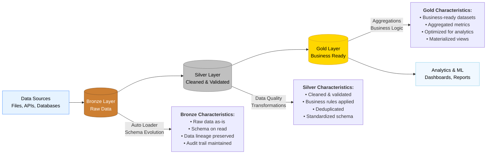
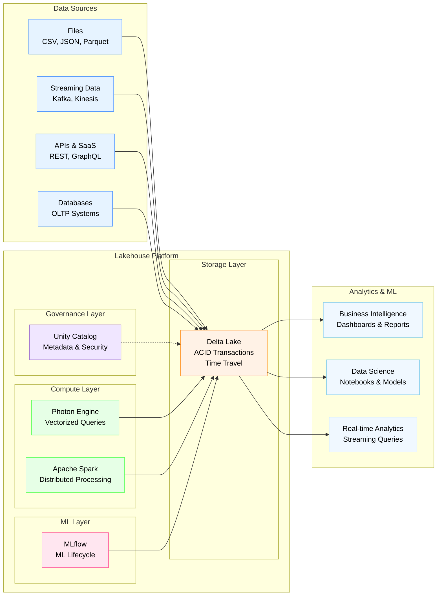
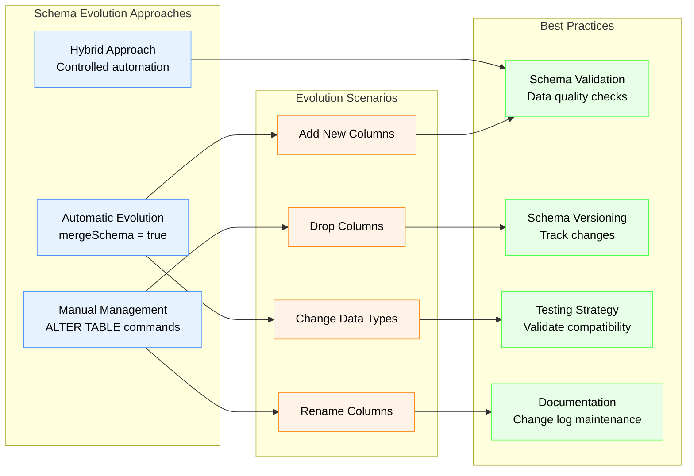
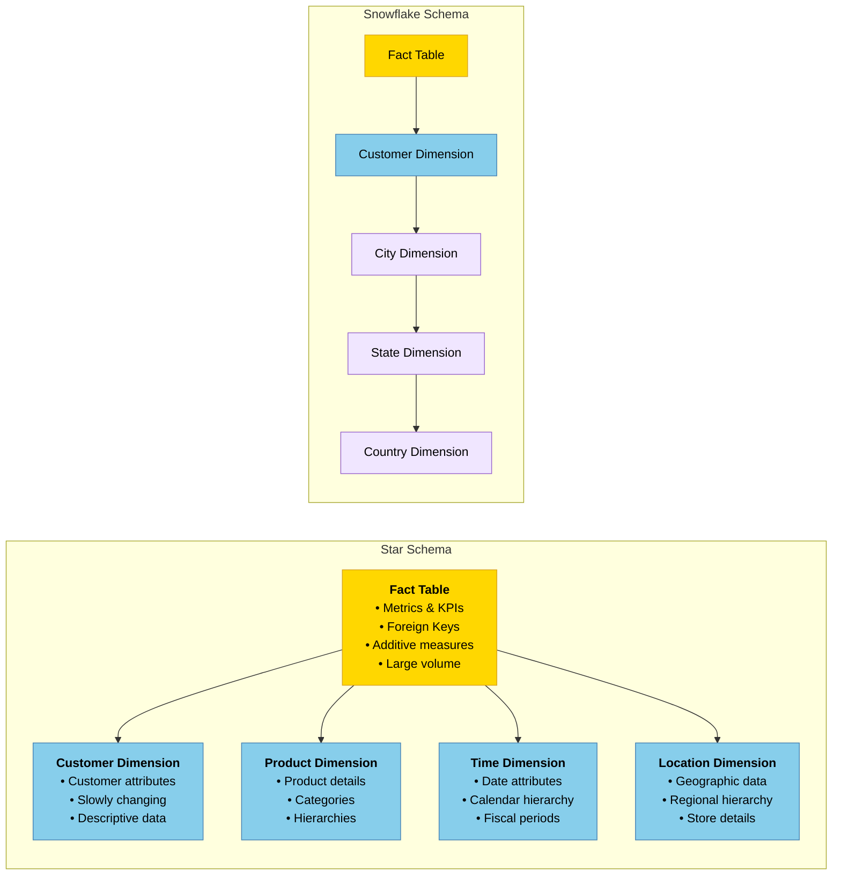
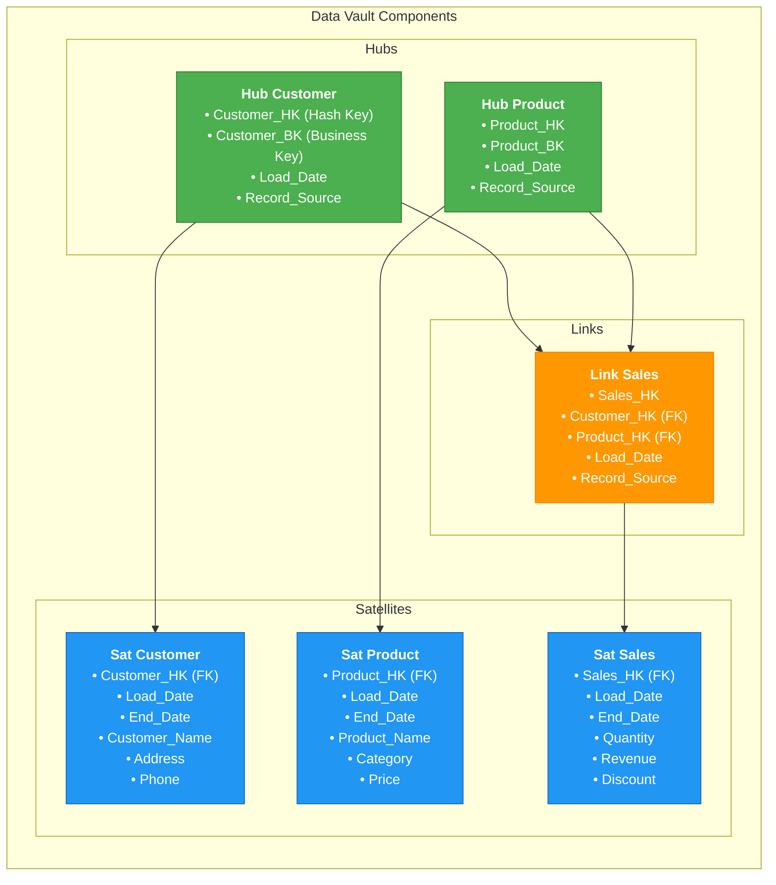
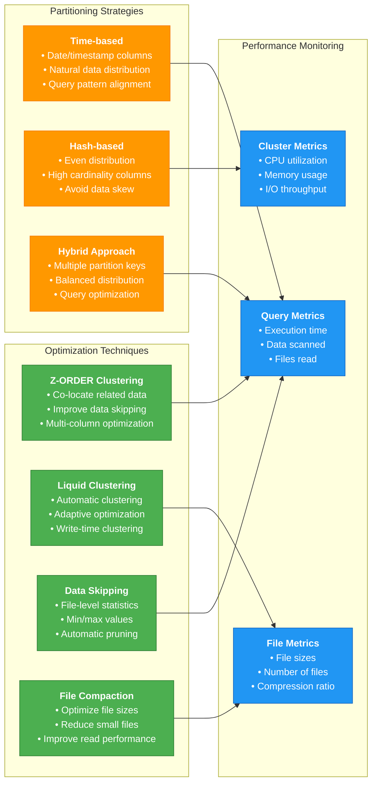

# Data Modeling and Design for Databricks Data Engineer Professional

## Overview
This section covers the fundamental concepts of data modeling and design patterns within the Databricks platform, including data architecture design, schema evolution, and best practices for building scalable data systems.

## 1. Data Architecture Design Patterns

### 1.1 Medallion Architecture (Bronze, Silver, Gold)

The **Medallion Architecture** is Databricks' recommended multi-layered approach to data architecture that organizes data in three layers:



#### Bronze Layer (Raw Data)
- **Purpose**: Ingests and stores raw data in its original format
- **Characteristics**:
  - Data is ingested as-is without transformation
  - Typically stored in formats like JSON, CSV, Parquet, or Avro
  - Preserves data lineage and enables data replay
  - Often includes metadata like ingestion timestamp

**Best Practices:**
- Use Auto Loader for incremental data ingestion
- Implement schema enforcement and evolution
- Store data in cloud storage (S3, ADLS, GCS)
- Use partition strategies for better performance

**Implementation Example:**
```python
# Auto Loader for Bronze layer ingestion
df = (spark.readStream
  .format("cloudFiles")
  .option("cloudFiles.format", "json")
  .option("cloudFiles.schemaLocation", "s3://bucket/schema-location")
  .load("s3://bucket/raw-data/"))
```

#### Silver Layer (Cleaned and Filtered)
- **Purpose**: Cleaned, validated, and deduplicated data
- **Characteristics**:
  - Data quality checks applied
  - Schema standardization
  - Business rule enforcement
  - Optimized for analytics workloads

**Best Practices:**
- Implement data quality checks using Delta Lake constraints
- Use merge operations for upserts
- Apply business logic transformations
- Optimize with Z-ORDER and VACUUM operations

#### Gold Layer (Business-Level Aggregates)
- **Purpose**: Curated datasets ready for analytics and ML
- **Characteristics**:
  - Aggregated and enriched data
  - Optimized for specific business use cases
  - Often denormalized for performance
  - Powers dashboards and reports

**Best Practices:**
- Create materialized views or tables
- Implement proper indexing strategies
- Use caching for frequently accessed data
- Document data definitions and business logic

**Reference**: [Databricks Medallion Architecture](https://docs.databricks.com/lakehouse/medallion.html)

### 1.2 Data Lakehouse Architecture

The **Data Lakehouse** combines the best of data lakes and data warehouses:



#### Key Components:
- **Delta Lake**: Provides ACID transactions and schema enforcement
- **Unity Catalog**: Centralized governance and metadata management
- **Photon**: Vectorized query engine for accelerated analytics
- **MLflow**: End-to-end ML lifecycle management

#### Benefits:
- **Schema Enforcement**: Prevents bad data from corrupting your datasets
- **ACID Transactions**: Ensures data consistency across concurrent operations
- **Time Travel**: Query historical versions of your data
- **Unified Analytics**: Single platform for BI, data science, and ML

**Reference**: [Databricks Lakehouse Platform](https://docs.databricks.com/lakehouse/index.html)

## 2. Schema Design and Evolution

### 2.1 Schema Evolution Strategies



#### Automatic Schema Evolution
Delta Lake supports automatic schema evolution to handle new columns in streaming data:

```python
# Enable automatic schema evolution
df.write \
  .option("mergeSchema", "true") \
  .mode("append") \
  .saveAsTable("table_name")
```

#### Manual Schema Management
For more control over schema changes:

```python
# Add new column to existing table
spark.sql("ALTER TABLE table_name ADD COLUMN new_column STRING")

# Change column data type (when compatible)
spark.sql("ALTER TABLE table_name ALTER COLUMN column_name TYPE BIGINT")
```

### 2.2 Best Practices for Schema Design

#### Naming Conventions
- Use snake_case for column names
- Include meaningful prefixes for related columns
- Avoid reserved keywords
- Use descriptive names that reflect business meaning

#### Data Types
- Choose appropriate data types for efficiency
- Use DECIMAL for financial calculations
- Consider string length for VARCHAR fields
- Use TIMESTAMP for temporal data with timezone awareness

#### Partitioning Strategy
```python
# Partition by date for time-series data
df.write \
  .partitionBy("year", "month", "day") \
  .mode("overwrite") \
  .saveAsTable("partitioned_table")
```

**Reference**: [Delta Lake Schema Evolution](https://docs.delta.io/latest/delta-batch.html#schema-validation)

## 3. Data Modeling Techniques

### 3.1 Dimensional Modeling



#### Star Schema
- **Fact Tables**: Contain measurable metrics and foreign keys
- **Dimension Tables**: Contain descriptive attributes
- **Benefits**: Simple joins, good query performance, intuitive structure

#### Snowflake Schema
- **Normalized dimension tables**: Reduces redundancy
- **Trade-offs**: More complex joins but better storage efficiency

### 3.2 Data Vault Modeling

For enterprise data warehouses requiring auditability and flexibility:



#### Core Components:
- **Hubs**: Unique business keys
- **Links**: Relationships between hubs
- **Satellites**: Descriptive attributes with history

#### Benefits:
- Highly flexible and scalable
- Supports agile development
- Maintains complete audit trail
- Handles changing business requirements

### 3.3 One Big Table (OBT) Approach

For analytical workloads in cloud-native environments:

#### Characteristics:
- Denormalized structure
- Optimized for analytical queries
- Leverages columnar storage benefits
- Simplifies data access for analysts

#### Implementation:
```python
# Create OBT with pre-calculated metrics
obt = (fact_table
  .join(dim_customer, "customer_id")
  .join(dim_product, "product_id")
  .join(dim_time, "date_id")
  .select(
    col("customer_id"),
    col("customer_name"),
    col("product_id"),
    col("product_category"),
    col("order_date"),
    col("revenue"),
    col("quantity"),
    # Pre-calculated metrics
    (col("revenue") / col("quantity")).alias("avg_unit_price")
  ))
```

## 4. Performance Optimization Strategies

### 4.1 Delta Lake Optimization



#### Z-ORDER Clustering
Groups related information in the same set of files:

```python
# Optimize table with Z-ORDER
spark.sql("OPTIMIZE table_name ZORDER BY (column1, column2)")
```

#### Data Skipping
Delta Lake automatically collects statistics to skip irrelevant files:

```python
# Enable data skipping with proper file sizes
spark.conf.set("spark.sql.files.maxPartitionBytes", "1073741824")  # 1GB
```

### 4.2 Partitioning Strategies

#### Time-based Partitioning
```python
# Partition by date for time-series data
df.write \
  .partitionBy("year", "month") \
  .mode("overwrite") \
  .option("overwriteSchema", "true") \
  .saveAsTable("time_partitioned_table")
```

#### Hash Partitioning
For evenly distributed data:

```python
# Use hash partitioning for uniform distribution
df.repartition(col("customer_id")).write.saveAsTable("hash_partitioned_table")
```

### 4.3 Caching Strategies

#### Delta Cache
Automatically caches frequently accessed data:

```python
# Enable Delta cache (automatic)
spark.conf.set("spark.databricks.io.cache.enabled", "true")
```

#### Spark Cache
For programmatic control:

```python
# Cache frequently accessed DataFrame
df.cache()
df.count()  # Trigger caching
```

**Reference**: [Delta Lake Performance Tuning](https://docs.delta.io/latest/optimizations-oss.html)

## 5. Data Governance and Quality

### 5.1 Unity Catalog Integration

#### Schema and Table Management
```python
# Create schema in Unity Catalog
spark.sql("CREATE SCHEMA IF NOT EXISTS catalog.schema")

# Create managed table
spark.sql("""
CREATE TABLE IF NOT EXISTS catalog.schema.table_name (
  id BIGINT,
  name STRING,
  created_at TIMESTAMP
) USING DELTA
""")
```

#### Access Control
```python
# Grant permissions
spark.sql("GRANT SELECT ON TABLE catalog.schema.table_name TO `user@company.com`")
```

### 5.2 Data Quality Checks

#### Delta Lake Constraints
```python
# Add check constraints
spark.sql("""
ALTER TABLE table_name 
ADD CONSTRAINT valid_age CHECK (age >= 0 AND age <= 150)
""")
```

#### Expectations with Great Expectations
```python
# Define data quality expectations
import great_expectations as ge

df_ge = ge.from_pandas(df.toPandas())
df_ge.expect_column_values_to_not_be_null("customer_id")
df_ge.expect_column_values_to_be_unique("customer_id")
```

**Reference**: [Unity Catalog](https://docs.databricks.com/data-governance/unity-catalog/index.html)

## 6. Best Practices Summary

### Design Principles
1. **Start with Bronze**: Always preserve raw data
2. **Incremental Processing**: Use streaming where possible
3. **Schema Evolution**: Plan for changing requirements
4. **Data Quality**: Implement checks at each layer
5. **Documentation**: Maintain clear data lineage

### Performance Considerations
1. **Right-size Clusters**: Match compute to workload
2. **Optimize File Sizes**: Target 100MB-1GB per file
3. **Use Appropriate Partitioning**: Based on query patterns
4. **Monitor and Tune**: Regular performance analysis

### Governance Guidelines
1. **Use Unity Catalog**: Centralized metadata and access control
2. **Implement Lineage**: Track data flow and transformations
3. **Data Classification**: Understand and protect sensitive data
4. **Version Control**: Use Git for code and configs

## Conclusion

Effective data modeling and design in Databricks requires understanding the platform's unique capabilities, including Delta Lake's ACID properties, the Medallion architecture pattern, and Unity Catalog's governance features. Success depends on balancing performance, scalability, and maintainability while ensuring data quality and governance requirements are met.

The key is to start simple with the Bronze-Silver-Gold pattern and evolve your architecture as requirements become more complex, always keeping performance optimization and data governance in mind.
