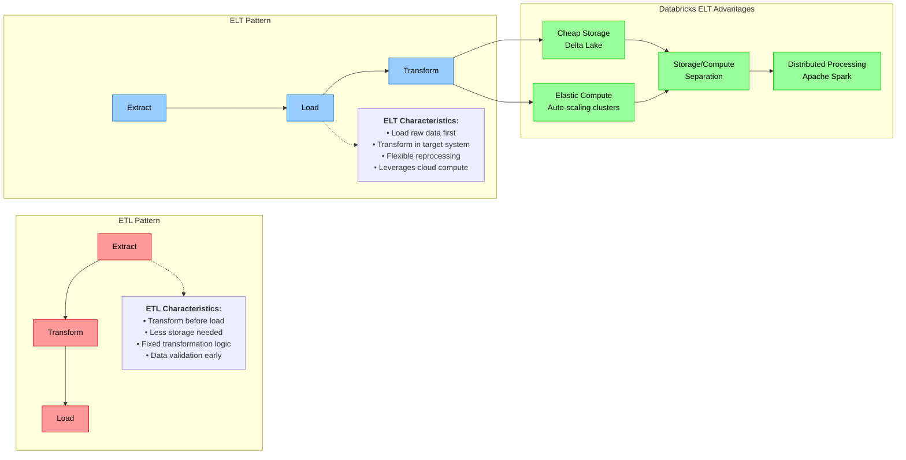
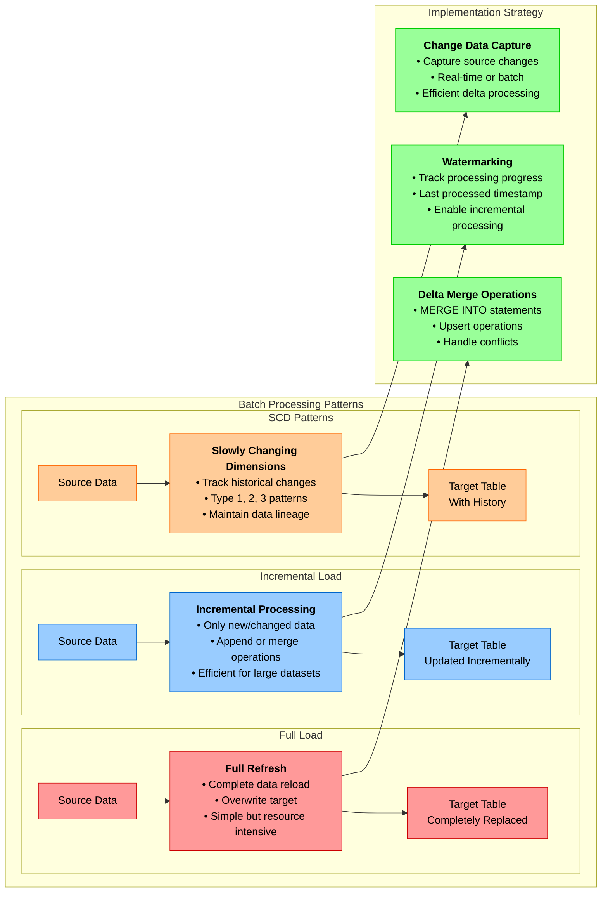
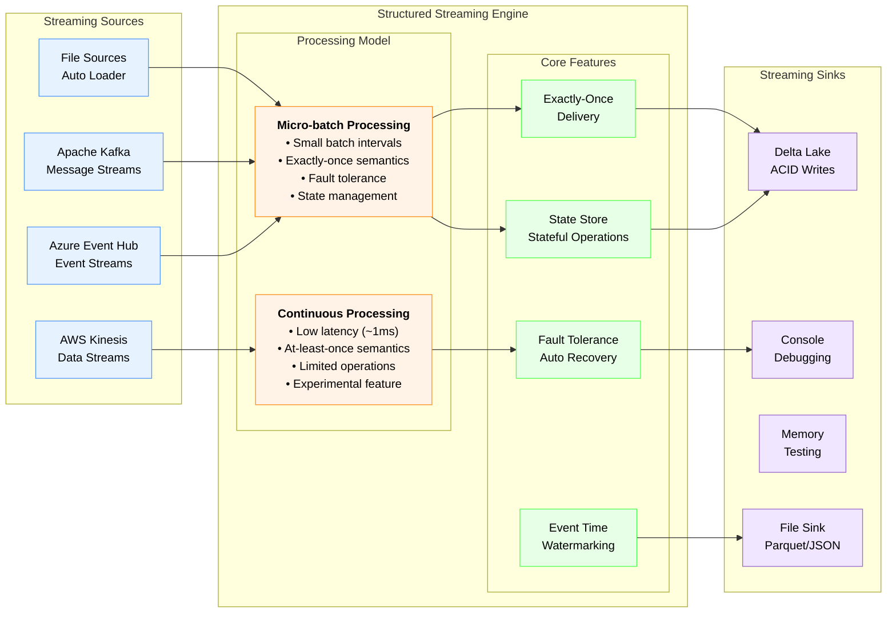
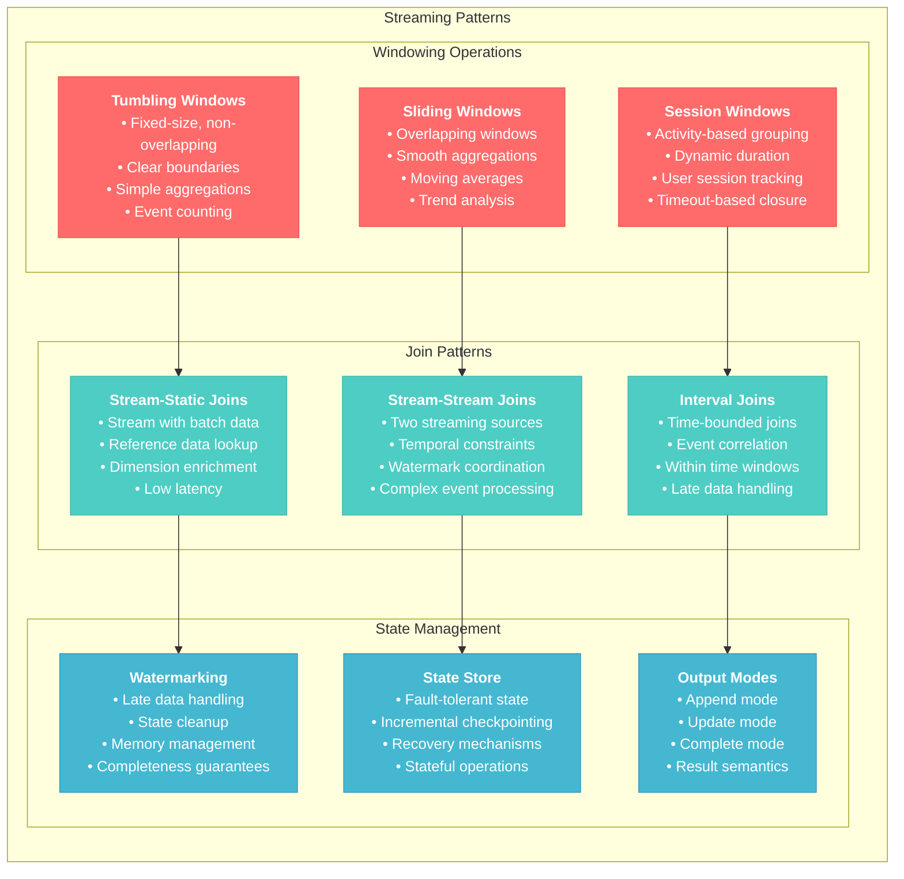
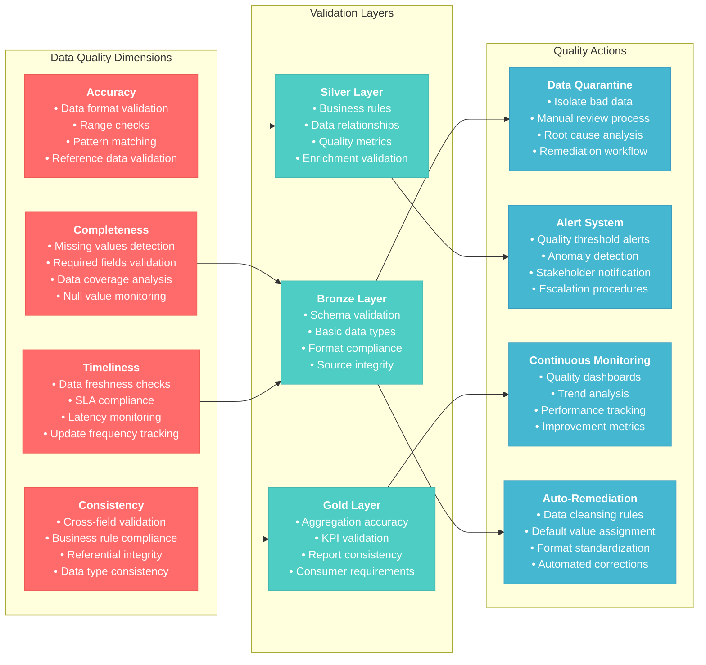

# Data Processing and Engineering for Databricks Data Engineer Professional

## Overview
This section covers advanced data processing techniques, ETL/ELT patterns, stream processing, and data pipeline engineering using Databricks. It focuses on building robust, scalable, and efficient data processing systems.

## 1. ETL/ELT Design Patterns

### 1.1 ETL vs ELT in Modern Data Architecture



### 1.2 Batch Processing Patterns



#### Full Load Pattern
```python
# Full refresh of target table
df_source.write \
  .mode("overwrite") \
  .option("overwriteSchema", "true") \
  .saveAsTable("target_table")
```

#### Incremental Load Pattern
```python
# Delta merge for incremental updates
from delta.tables import DeltaTable

# Read source data with watermark
df_updates = spark.read.table("source_table") \
  .filter(col("last_modified") > lit("2024-01-01"))

# Merge into target table
target_table = DeltaTable.forName(spark, "target_table")

target_table.alias("target") \
  .merge(
    df_updates.alias("updates"),
    "target.id = updates.id"
  ) \
  .whenMatchedUpdateAll() \
  .whenNotMatchedInsertAll() \
  .execute()
```

#### Slowly Changing Dimensions (SCD)

**Type 1 SCD - Overwrite**:
```python
# SCD Type 1 - overwrite with latest values
target_table.alias("target") \
  .merge(
    df_updates.alias("updates"),
    "target.customer_id = updates.customer_id"
  ) \
  .whenMatchedUpdate(set={
    "name": "updates.name",
    "address": "updates.address",
    "last_updated": "current_timestamp()"
  }) \
  .whenNotMatchedInsertAll() \
  .execute()
```

**Type 2 SCD - Historical Tracking**:
```python
# SCD Type 2 - maintain history with effective dates
from pyspark.sql.functions import current_timestamp, date_sub

# Close existing records
target_table.alias("target") \
  .merge(
    df_updates.alias("updates"),
    "target.customer_id = updates.customer_id AND target.is_current = true"
  ) \
  .whenMatchedUpdate(
    condition="target.name != updates.name OR target.address != updates.address",
    set={
      "is_current": "false",
      "end_date": "current_date()"
    }
  ) \
  .execute()

# Insert new records
df_new_records = df_updates.select(
  col("customer_id"),
  col("name"),
  col("address"),
  current_timestamp().alias("start_date"),
  lit(None).cast("date").alias("end_date"),
  lit(True).alias("is_current")
)

df_new_records.write.mode("append").saveAsTable("target_table")
```

**Reference**: [Delta Lake Merge Operations](https://docs.delta.io/latest/delta-update.html#upsert-into-a-table-using-merge)

## 2. Stream Processing with Structured Streaming

### 2.1 Streaming Fundamentals



#### Basic Streaming Pattern
```python
# Read from streaming source
df_stream = spark.readStream \
  .format("cloudFiles") \
  .option("cloudFiles.format", "json") \
  .option("cloudFiles.schemaLocation", "/path/to/schema") \
  .load("/path/to/source")

# Apply transformations
df_processed = df_stream \
  .select("*", current_timestamp().alias("processed_at")) \
  .filter(col("amount") > 0)

# Write to sink
query = df_processed.writeStream \
  .format("delta") \
  .outputMode("append") \
  .option("checkpointLocation", "/path/to/checkpoint") \
  .table("processed_events")

query.awaitTermination()
```

### 2.2 Advanced Streaming Patterns


```python
from pyspark.sql.functions import window

# Define watermark for handling late arrivals
df_windowed = df_stream \
  .withWatermark("event_time", "10 minutes") \
  .groupBy(
    window(col("event_time"), "5 minutes"),
    col("user_id")
  ) \
  .agg(
    count("*").alias("event_count"),
    sum("amount").alias("total_amount")
  )
```

#### Stream-Stream Joins
```python
# Join two streams with watermarks
stream1 = spark.readStream.table("events") \
  .withWatermark("event_time", "10 minutes")

stream2 = spark.readStream.table("user_profiles") \
  .withWatermark("profile_time", "5 minutes")

joined_stream = stream1.alias("e") \
  .join(
    stream2.alias("p"),
    expr("""
      e.user_id = p.user_id AND
      e.event_time >= p.profile_time AND
      e.event_time <= p.profile_time + interval 1 hour
    """)
  )
```

#### Streaming Aggregations with State
```python
# Stateful aggregations
df_aggregated = df_stream \
  .withWatermark("event_time", "1 hour") \
  .groupBy(
    col("user_id"),
    window(col("event_time"), "1 hour", "15 minutes")  # Sliding window
  ) \
  .agg(
    sum("amount").alias("hourly_total"),
    count("*").alias("hourly_count"),
    avg("amount").alias("hourly_avg")
  )
```

**Reference**: [Structured Streaming Programming Guide](https://spark.apache.org/docs/latest/structured-streaming-programming-guide.html)

### 2.3 Auto Loader for Incremental Data Ingestion

#### Basic Auto Loader Setup
```python
# Auto Loader with schema inference
df = spark.readStream \
  .format("cloudFiles") \
  .option("cloudFiles.format", "parquet") \
  .option("cloudFiles.schemaLocation", "/schema/location") \
  .option("cloudFiles.inferColumnTypes", "true") \
  .load("/data/source/path")

# Process and write
df.writeStream \
  .format("delta") \
  .option("checkpointLocation", "/checkpoint/location") \
  .trigger(availableNow=True) \
  .table("bronze_table")
```

#### Advanced Auto Loader Configuration
```python
# Auto Loader with rescue data column and schema evolution
df = spark.readStream \
  .format("cloudFiles") \
  .option("cloudFiles.format", "json") \
  .option("cloudFiles.schemaLocation", "/schema/location") \
  .option("cloudFiles.rescuedDataColumn", "_rescued_data") \
  .option("cloudFiles.schemaEvolutionMode", "addNewColumns") \
  .option("cloudFiles.maxFilesPerTrigger", "1000") \
  .load("/data/source/path")
```

**Reference**: [Auto Loader](https://docs.databricks.com/ingestion/auto-loader/index.html)

## 3. Data Quality and Validation

### 3.1 Data Quality Framework


```python
def validate_bronze_data(df):
    """Basic validation for bronze layer"""
    # Check for null primary keys
    null_keys = df.filter(col("id").isNull()).count()
    if null_keys > 0:
        raise ValueError(f"Found {null_keys} null primary keys")
    
    # Check for duplicate keys
    total_count = df.count()
    unique_count = df.select("id").distinct().count()
    if total_count != unique_count:
        raise ValueError(f"Found duplicate keys: {total_count - unique_count}")
    
    return df

def validate_silver_data(df):
    """Enhanced validation for silver layer"""
    # Business rule validation
    invalid_amounts = df.filter(col("amount") < 0).count()
    if invalid_amounts > 0:
        raise ValueError(f"Found {invalid_amounts} negative amounts")
    
    # Date range validation
    from datetime import datetime, timedelta
    max_date = datetime.now() + timedelta(days=1)
    future_dates = df.filter(col("transaction_date") > lit(max_date)).count()
    if future_dates > 0:
        raise ValueError(f"Found {future_dates} future dates")
    
    return df
```

#### Constraint-based Validation
```python
# Delta Lake check constraints
spark.sql("""
ALTER TABLE transactions 
ADD CONSTRAINT valid_amount CHECK (amount >= 0)
""")

spark.sql("""
ALTER TABLE transactions 
ADD CONSTRAINT valid_status CHECK (status IN ('pending', 'completed', 'failed'))
""")
```

### 3.2 Data Profiling and Monitoring

#### Statistical Profiling
```python
def profile_data(df, table_name):
    """Generate data profile statistics"""
    profile_stats = {}
    
    # Basic statistics
    profile_stats['row_count'] = df.count()
    profile_stats['column_count'] = len(df.columns)
    
    # Null analysis
    null_counts = {}
    for col_name in df.columns:
        null_count = df.filter(col(col_name).isNull()).count()
        null_counts[col_name] = null_count
    
    profile_stats['null_counts'] = null_counts
    
    # Duplicate analysis
    profile_stats['duplicate_count'] = df.count() - df.distinct().count()
    
    # Save profile to table
    profile_df = spark.createDataFrame([{
        'table_name': table_name,
        'profile_date': current_timestamp(),
        'statistics': json.dumps(profile_stats)
    }])
    
    profile_df.write.mode("append").saveAsTable("data_quality_profiles")
    
    return profile_stats
```

### 3.3 Error Handling and Dead Letter Queues

#### Robust Error Handling
```python
def process_with_error_handling(df):
    """Process data with comprehensive error handling"""
    
    # Separate valid and invalid records
    valid_df = df.filter(
        col("id").isNotNull() & 
        (col("amount") >= 0) &
        col("transaction_date").isNotNull()
    )
    
    invalid_df = df.subtract(valid_df) \
        .withColumn("error_reason", 
            when(col("id").isNull(), "Missing ID")
            .when(col("amount") < 0, "Negative amount")
            .when(col("transaction_date").isNull(), "Missing date")
            .otherwise("Unknown error")
        ) \
        .withColumn("error_timestamp", current_timestamp())
    
    # Write valid records to main table
    valid_df.write.mode("append").saveAsTable("transactions")
    
    # Write invalid records to error table
    invalid_df.write.mode("append").saveAsTable("transaction_errors")
    
    return valid_df.count(), invalid_df.count()
```

**Reference**: [Delta Lake Data Quality](https://docs.databricks.com/delta/delta-constraints.html)

## 4. Performance Optimization

### 4.1 Spark Configuration Tuning

#### Cluster Configuration
```python
# Optimal Spark configurations for different workloads

# For ETL workloads
spark.conf.set("spark.sql.adaptive.enabled", "true")
spark.conf.set("spark.sql.adaptive.coalescePartitions.enabled", "true")
spark.conf.set("spark.sql.adaptive.skewJoin.enabled", "true")
spark.conf.set("spark.sql.files.maxPartitionBytes", "134217728")  # 128MB

# For streaming workloads
spark.conf.set("spark.sql.streaming.kafka.useDeprecatedOffsetFetching", "false")
spark.conf.set("spark.sql.streaming.checkpointLocation.compression.codec", "zstd")
```

#### Dynamic Resource Allocation
```python
# Enable dynamic allocation for varying workloads
spark.conf.set("spark.dynamicAllocation.enabled", "true")
spark.conf.set("spark.dynamicAllocation.minExecutors", "2")
spark.conf.set("spark.dynamicAllocation.maxExecutors", "20")
spark.conf.set("spark.dynamicAllocation.initialExecutors", "5")
```

### 4.2 Delta Lake Performance Optimization

#### Table Optimization Strategies
```python
# Optimize table layout and clustering
spark.sql("OPTIMIZE transactions ZORDER BY (customer_id, transaction_date)")

# Vacuum old files (run carefully in production)
spark.sql("VACUUM transactions RETAIN 168 HOURS")  # 7 days retention

# Analyze table statistics
spark.sql("ANALYZE TABLE transactions COMPUTE STATISTICS FOR ALL COLUMNS")
```

#### Liquid Clustering (Modern Alternative to Z-ORDER)
```python
# Create table with liquid clustering
spark.sql("""
CREATE TABLE transactions_clustered (
  id BIGINT,
  customer_id STRING,
  amount DECIMAL(10,2),
  transaction_date DATE
) USING DELTA
CLUSTER BY (customer_id, transaction_date)
""")
```

### 4.3 Caching and Materialized Views

#### Strategic Caching
```python
# Cache frequently accessed data
df_customer_summary = spark.sql("""
  SELECT customer_id, 
         COUNT(*) as transaction_count,
         SUM(amount) as total_amount
  FROM transactions 
  GROUP BY customer_id
""")

df_customer_summary.cache()
df_customer_summary.createOrReplaceTempView("customer_summary_cached")
```

#### Materialized Views for Performance
```python
# Create materialized view for common aggregations
spark.sql("""
CREATE MATERIALIZED VIEW customer_monthly_summary AS
SELECT 
  customer_id,
  YEAR(transaction_date) as year,
  MONTH(transaction_date) as month,
  COUNT(*) as transaction_count,
  SUM(amount) as total_amount,
  AVG(amount) as avg_amount
FROM transactions
GROUP BY customer_id, YEAR(transaction_date), MONTH(transaction_date)
""")
```

**Reference**: [Delta Lake Performance Tuning](https://docs.delta.io/latest/optimizations-oss.html)

## 5. Advanced Processing Techniques

### 5.1 Change Data Capture (CDC)

#### Processing CDC Data
```python
def process_cdc_data(df_cdc):
    """Process Change Data Capture events"""
    
    # Separate different operation types
    inserts = df_cdc.filter(col("_change_type") == "insert")
    updates = df_cdc.filter(col("_change_type") == "update")
    deletes = df_cdc.filter(col("_change_type") == "delete")
    
    # Get target table
    target_table = DeltaTable.forName(spark, "target_table")
    
    # Process inserts
    inserts.write.mode("append").saveAsTable("target_table")
    
    # Process updates
    target_table.alias("target") \
        .merge(
            updates.alias("updates"),
            "target.id = updates.id"
        ) \
        .whenMatchedUpdateAll() \
        .execute()
    
    # Process deletes (soft delete)
    target_table.alias("target") \
        .merge(
            deletes.alias("deletes"),
            "target.id = deletes.id"
        ) \
        .whenMatchedUpdate(set={"is_deleted": "true"}) \
        .execute()
```

### 5.2 Data Deduplication

#### Deduplication Strategies
```python
# Strategy 1: Keep latest record based on timestamp
def deduplicate_latest(df, key_cols, timestamp_col):
    """Keep the latest record for each key"""
    window_spec = Window.partitionBy(*key_cols).orderBy(desc(timestamp_col))
    
    return df.withColumn("rank", row_number().over(window_spec)) \
             .filter(col("rank") == 1) \
             .drop("rank")

# Strategy 2: Remove exact duplicates
def remove_exact_duplicates(df):
    """Remove exact duplicate rows"""
    return df.distinct()

# Strategy 3: Advanced deduplication with business rules
def deduplicate_with_priority(df, key_cols, priority_col):
    """Keep record with highest priority value"""
    window_spec = Window.partitionBy(*key_cols).orderBy(desc(priority_col))
    
    return df.withColumn("rank", row_number().over(window_spec)) \
             .filter(col("rank") == 1) \
             .drop("rank")
```

### 5.3 Data Lineage and Auditing

#### Implementing Data Lineage
```python
def track_lineage(source_table, target_table, transformation_type, job_id):
    """Track data lineage for auditing"""
    
    lineage_record = spark.createDataFrame([{
        'job_id': job_id,
        'source_table': source_table,
        'target_table': target_table,
        'transformation_type': transformation_type,
        'execution_time': current_timestamp(),
        'row_count_source': spark.table(source_table).count(),
        'row_count_target': spark.table(target_table).count()
    }])
    
    lineage_record.write.mode("append").saveAsTable("data_lineage_audit")
```

## 6. Best Practices for Data Processing

### 6.1 Code Organization and Modularity

#### Modular ETL Framework
```python
class ETLPipeline:
    def __init__(self, spark, config):
        self.spark = spark
        self.config = config
    
    def extract(self, source_path):
        """Extract data from source"""
        return self.spark.read.format(self.config['source_format']) \
                         .load(source_path)
    
    def transform(self, df):
        """Apply transformations"""
        # Business logic here
        return df.select("*").filter(col("is_active") == True)
    
    def load(self, df, target_table):
        """Load data to target"""
        df.write.mode(self.config['write_mode']).saveAsTable(target_table)
    
    def run(self, source_path, target_table):
        """Execute full pipeline"""
        df = self.extract(source_path)
        df_transformed = self.transform(df)
        self.load(df_transformed, target_table)
```

### 6.2 Testing Strategies

#### Unit Testing for Data Functions
```python
import pytest
from pyspark.sql.types import StructType, StructField, StringType, IntegerType

def test_data_transformation():
    """Test data transformation logic"""
    # Create test data
    schema = StructType([
        StructField("id", IntegerType(), True),
        StructField("name", StringType(), True),
        StructField("amount", IntegerType(), True)
    ])
    
    test_data = [(1, "Alice", 100), (2, "Bob", -50), (3, "Charlie", 200)]
    df_test = spark.createDataFrame(test_data, schema)
    
    # Apply transformation
    df_result = df_test.filter(col("amount") > 0)
    
    # Assert results
    assert df_result.count() == 2
    assert df_result.filter(col("name") == "Bob").count() == 0
```

### 6.3 Monitoring and Alerting

#### Custom Monitoring Framework
```python
def monitor_pipeline_health(table_name, expected_min_rows, max_processing_time):
    """Monitor pipeline health and send alerts"""
    
    # Check row count
    current_count = spark.table(table_name).count()
    if current_count < expected_min_rows:
        send_alert(f"Low row count in {table_name}: {current_count}")
    
    # Check processing time
    last_update = spark.sql(f"""
        SELECT MAX(last_updated) as max_update 
        FROM {table_name}
    """).collect()[0]['max_update']
    
    time_diff = current_timestamp() - last_update
    if time_diff > max_processing_time:
        send_alert(f"Stale data in {table_name}: {time_diff}")

def send_alert(message):
    """Send alert notification"""
    # Implementation depends on alerting system (Slack, email, etc.)
    print(f"ALERT: {message}")
```

## Conclusion

Effective data processing and engineering in Databricks requires mastering multiple concepts: ETL/ELT patterns, streaming architectures, performance optimization, and data quality assurance. The key is to build resilient, scalable pipelines that can handle varying data volumes and complexity while maintaining high data quality standards.

Success in this domain comes from understanding how to leverage Databricks' unique features like Delta Lake's ACID properties, Auto Loader's schema evolution, and Spark's adaptive query execution to build robust data processing systems that scale with your organization's needs.

**Reference**: [Databricks Data Engineering](https://docs.databricks.com/data-engineering/index.html)
