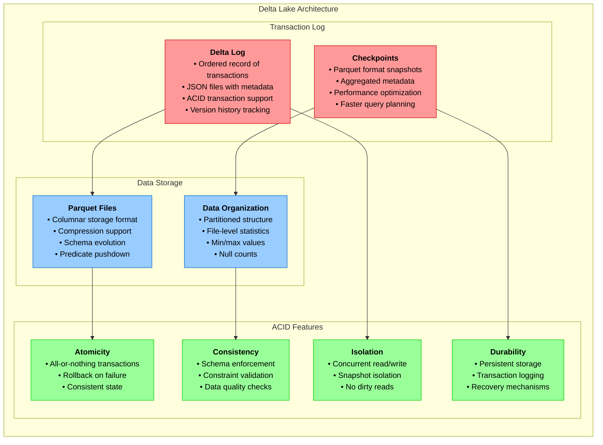
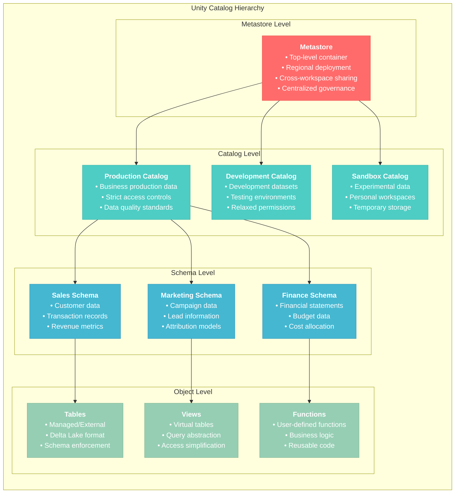
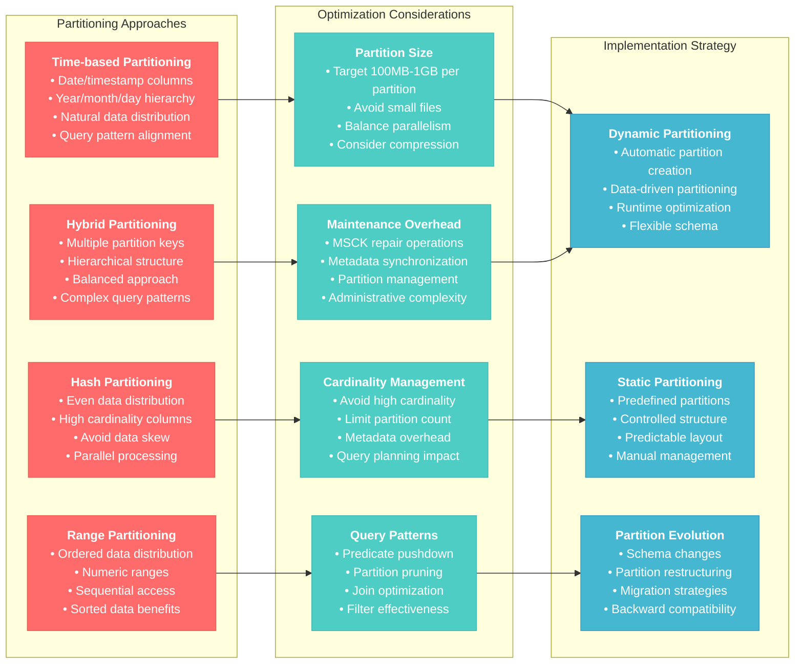

# Data Storage and Management for Databricks Data Engineer Professional

## Overview
This section covers comprehensive data storage strategies, management techniques, and optimization approaches within the Databricks platform. It focuses on Delta Lake, Unity Catalog, storage optimization, and data lifecycle management.

## 1. Delta Lake Deep Dive

### 1.1 Delta Lake Architecture and Features



#### ACID Properties Implementation
```python
# Demonstration of ACID properties

# Atomicity: All operations in a transaction succeed or fail together
try:
    with spark.sql("BEGIN TRANSACTION"):
        spark.sql("INSERT INTO orders VALUES (1, 'product_a', 100)")
        spark.sql("UPDATE inventory SET quantity = quantity - 1 WHERE product = 'product_a'")
        spark.sql("COMMIT")
except Exception as e:
    spark.sql("ROLLBACK")
    print(f"Transaction failed: {e}")

# Consistency: Data constraints are always enforced
spark.sql("""
ALTER TABLE orders 
ADD CONSTRAINT positive_quantity CHECK (quantity > 0)
""")

# Isolation: Concurrent operations don't interfere
# Delta Lake handles this automatically with optimistic concurrency control

# Durability: Committed transactions persist even after system failure
# Ensured by Delta Lake's transaction log mechanism
```

### 1.2 Advanced Delta Lake Operations

#### Time Travel and Versioning
```python
# Query historical versions
df_version_10 = spark.read.format("delta").option("versionAsOf", 10).table("orders")
df_timestamp = spark.read.format("delta").option("timestampAsOf", "2024-01-01").table("orders")

# View table history
display(spark.sql("DESCRIBE HISTORY orders"))

# Restore table to previous version
spark.sql("RESTORE TABLE orders TO VERSION AS OF 10")
spark.sql("RESTORE TABLE orders TO TIMESTAMP AS OF '2024-01-01'")
```

#### Advanced Merge Operations
```python
from delta.tables import DeltaTable
from pyspark.sql.functions import col, lit, when, current_timestamp

def advanced_upsert(source_df, target_table_name, business_key, update_condition=None):
    """
    Advanced upsert with conditional logic and audit tracking
    """
    target_table = DeltaTable.forName(spark, target_table_name)
    
    # Add audit columns to source
    source_with_audit = source_df.withColumn("last_updated", current_timestamp()) \
                                 .withColumn("operation_type", lit("upsert"))
    
    merge_builder = target_table.alias("target") \
        .merge(source_with_audit.alias("source"), f"target.{business_key} = source.{business_key}")
    
    # Conditional updates
    if update_condition:
        merge_builder = merge_builder.whenMatchedUpdate(
            condition=update_condition,
            set={col: f"source.{col}" for col in source_df.columns}
        )
    else:
        merge_builder = merge_builder.whenMatchedUpdateAll()
    
    # Handle not matched records
    merge_builder = merge_builder.whenNotMatchedInsertAll()
    
    # Execute merge
    merge_builder.execute()
    
    # Log operation metrics
    merge_metrics = target_table.history(1).select("operationMetrics").collect()[0]["operationMetrics"]
    print(f"Merge completed: {merge_metrics}")

# Example usage
source_data = spark.table("staging_customers")
advanced_upsert(source_data, "customers", "customer_id", "target.last_updated < source.last_updated")
```

#### Schema Evolution and Management
```python
# Enable schema evolution
spark.conf.set("spark.databricks.delta.schema.autoMerge.enabled", "true")

# Controlled schema evolution
def evolve_schema(df, target_table, evolution_mode="add_new_columns"):
    """
    Controlled schema evolution with validation
    """
    if evolution_mode == "add_new_columns":
        df.write \
          .mode("append") \
          .option("mergeSchema", "true") \
          .saveAsTable(target_table)
    
    elif evolution_mode == "strict":
        # Validate schema before writing
        target_schema = spark.table(target_table).schema
        source_schema = df.schema
        
        if source_schema != target_schema:
            raise ValueError("Schema mismatch detected. Manual intervention required.")
        
        df.write.mode("append").saveAsTable(target_table)

# Column mapping for schema changes
spark.sql("""
ALTER TABLE orders 
ADD COLUMN new_field STRING
""")

# Rename columns with column mapping
spark.sql("""
ALTER TABLE orders 
RENAME COLUMN old_column TO new_column
""")
```

**Reference**: [Delta Lake Documentation](https://docs.delta.io/latest/index.html)

### 1.3 Delta Lake Performance Optimization

#### File Management and Compaction
```python
# Optimize file sizes and layout
def optimize_delta_table(table_name, zorder_columns=None, vacuum_hours=168):
    """
    Comprehensive Delta table optimization
    """
    # Optimize file layout
    if zorder_columns:
        spark.sql(f"OPTIMIZE {table_name} ZORDER BY ({', '.join(zorder_columns)})")
    else:
        spark.sql(f"OPTIMIZE {table_name}")
    
    # Clean up old files
    spark.sql(f"VACUUM {table_name} RETAIN {vacuum_hours} HOURS")
    
    # Update table statistics
    spark.sql(f"ANALYZE TABLE {table_name} COMPUTE STATISTICS FOR ALL COLUMNS")
    
    # Check optimization results
    file_stats = spark.sql(f"DESCRIBE DETAIL {table_name}").collect()[0]
    print(f"Table {table_name} optimized:")
    print(f"  Files: {file_stats['numFiles']}")
    print(f"  Size: {file_stats['sizeInBytes'] / (1024**3):.2f} GB")

# Example usage
optimize_delta_table("orders", ["customer_id", "order_date"], 168)
```

#### Liquid Clustering (Preview Feature)
```python
# Create table with liquid clustering for better performance
spark.sql("""
CREATE TABLE orders_clustered (
    order_id BIGINT,
    customer_id STRING,
    product_id STRING,
    order_date DATE,
    amount DECIMAL(10,2)
) USING DELTA
CLUSTER BY (customer_id, order_date)
LOCATION '/path/to/orders_clustered'
""")

# Cluster existing table
spark.sql("ALTER TABLE orders CLUSTER BY (customer_id, order_date)")
```

## 2. Unity Catalog: Comprehensive Data Governance

### 2.1 Unity Catalog Architecture



#### Setting Up Unity Catalog
```python
# Create catalog
spark.sql("CREATE CATALOG IF NOT EXISTS production")
spark.sql("CREATE CATALOG IF NOT EXISTS development")

# Create schemas
spark.sql("CREATE SCHEMA IF NOT EXISTS production.sales")
spark.sql("CREATE SCHEMA IF NOT EXISTS production.marketing")
spark.sql("CREATE SCHEMA IF NOT EXISTS development.staging")

# Set default catalog and schema
spark.sql("USE CATALOG production")
spark.sql("USE SCHEMA sales")
```

### 2.2 Access Control and Security

#### Privilege Management
```python
# Grant catalog-level permissions
spark.sql("GRANT USE CATALOG ON CATALOG production TO `data-analysts`")
spark.sql("GRANT CREATE SCHEMA ON CATALOG production TO `data-engineers`")

# Grant schema-level permissions
spark.sql("GRANT USE SCHEMA ON SCHEMA production.sales TO `sales-team`")
spark.sql("GRANT SELECT ON SCHEMA production.sales TO `sales-analysts`")

# Grant table-level permissions
spark.sql("GRANT SELECT ON TABLE production.sales.orders TO `reporting-service`")
spark.sql("GRANT ALL PRIVILEGES ON TABLE production.sales.customers TO `data-engineers`")

# Row-level security with dynamic views
spark.sql("""
CREATE VIEW production.sales.orders_filtered AS
SELECT * FROM production.sales.orders 
WHERE region = current_user_region()
""")

# Column-level security
spark.sql("""
CREATE VIEW production.sales.customers_masked AS
SELECT 
    customer_id,
    CASE 
        WHEN is_member('pii-access') THEN email 
        ELSE 'REDACTED' 
    END as email,
    order_count
FROM production.sales.customers
""")
```

#### Data Classification and Tagging
```python
# Add tags for data classification
spark.sql("""
ALTER TABLE production.sales.customers 
SET TAGS ('data_classification' = 'PII', 'retention_period' = '7_years')
""")

# Set column-level tags
spark.sql("""
ALTER TABLE production.sales.customers 
ALTER COLUMN email SET TAGS ('sensitivity' = 'high', 'encryption' = 'required')
""")
```

### 2.3 Data Lineage and Discovery

#### Automatic Lineage Tracking
```python
# Query lineage information
lineage_info = spark.sql("""
SELECT 
    table_catalog,
    table_schema,
    table_name,
    upstream_tables,
    downstream_tables
FROM system.information_schema.table_lineage
WHERE table_name = 'customer_metrics'
""")

display(lineage_info)
```

#### Data Discovery and Documentation
```python
# Add table comments and properties
spark.sql("""
COMMENT ON TABLE production.sales.orders IS 
'Contains all customer orders with payment and shipping information'
""")

spark.sql("""
ALTER TABLE production.sales.orders 
SET TBLPROPERTIES (
    'owner' = 'data-engineering-team',
    'update_frequency' = 'daily',
    'data_source' = 'e-commerce-platform'
)
""")

# Column-level documentation
spark.sql("""
ALTER TABLE production.sales.orders 
ALTER COLUMN customer_id 
COMMENT 'Unique identifier for customer, FK to customers table'
""")
```

**Reference**: [Unity Catalog Documentation](https://docs.databricks.com/data-governance/unity-catalog/index.html)

## 3. Storage Optimization Strategies

### 3.1 Partitioning Strategies


```python
# Create partitioned table
spark.sql("""
CREATE TABLE sales_partitioned (
    order_id BIGINT,
    customer_id STRING,
    amount DECIMAL(10,2),
    order_date DATE
) USING DELTA
PARTITIONED BY (year(order_date), month(order_date))
""")

# Dynamic partitioning with optimal partition size
def create_optimal_partitions(df, partition_columns, target_partition_size_mb=128):
    """
    Create partitions with optimal size for performance
    """
    # Calculate optimal number of partitions
    total_size_mb = df.rdd.map(lambda x: len(str(x))).sum() / (1024 * 1024)
    optimal_partitions = max(1, int(total_size_mb / target_partition_size_mb))
    
    # Repartition before writing
    df_partitioned = df.repartition(optimal_partitions, *partition_columns)
    
    return df_partitioned

# Example usage
df_orders = spark.table("raw_orders")
df_optimized = create_optimal_partitions(df_orders, ["year", "month"])
df_optimized.write.mode("overwrite").saveAsTable("sales_partitioned")
```

#### Hash Partitioning for Even Distribution
```python
# Hash partitioning for uniform distribution
from pyspark.sql.functions import hash, abs

def hash_partition_data(df, partition_column, num_partitions=100):
    """
    Create hash partitions for even data distribution
    """
    return df.withColumn(
        "partition_id", 
        abs(hash(col(partition_column))) % num_partitions
    ).repartition(col("partition_id"))

# Example: Partition customer data by customer_id hash
df_customers = spark.table("customers")
df_hash_partitioned = hash_partition_data(df_customers, "customer_id", 50)
df_hash_partitioned.write.partitionBy("partition_id").saveAsTable("customers_hash_partitioned")
```

### 3.2 File Format Optimization

#### Choosing the Right File Format
```python
# Comparative analysis of file formats
def analyze_file_formats(df, table_name):
    """
    Compare different file formats for storage efficiency
    """
    formats = ["delta", "parquet", "orc"]
    results = {}
    
    for fmt in formats:
        # Write in each format
        path = f"/tmp/{table_name}_{fmt}"
        df.write.format(fmt).mode("overwrite").save(path)
        
        # Measure storage size
        size_bytes = dbutils.fs.du(path)[0].size
        results[fmt] = {
            "size_mb": size_bytes / (1024 * 1024),
            "compression_ratio": results.get("delta", {}).get("size_mb", size_bytes) / size_bytes
        }
    
    return results

# Example usage
df_sample = spark.table("large_table").sample(0.1)
format_comparison = analyze_file_formats(df_sample, "format_test")
print(format_comparison)
```

#### Compression Strategies
```python
# Configure compression for optimal storage
spark.conf.set("spark.sql.parquet.compression.codec", "zstd")  # Best compression
spark.conf.set("spark.io.compression.codec", "zstd")

# Table-specific compression settings
spark.sql("""
CREATE TABLE compressed_data (
    id BIGINT,
    data STRING,
    created_at TIMESTAMP
) USING DELTA
TBLPROPERTIES (
    'delta.autoOptimize.optimizeWrite' = 'true',
    'delta.autoOptimize.autoCompact' = 'true'
)
""")
```

### 3.3 Storage Monitoring and Management

#### Storage Usage Analysis
```python
def analyze_storage_usage(catalog_name=None):
    """
    Comprehensive storage usage analysis
    """
    if catalog_name:
        tables_query = f"""
        SELECT 
            table_catalog,
            table_schema,
            table_name,
            table_type
        FROM system.information_schema.tables 
        WHERE table_catalog = '{catalog_name}'
        """
    else:
        tables_query = """
        SELECT 
            table_catalog,
            table_schema,
            table_name,
            table_type
        FROM system.information_schema.tables
        """
    
    tables_df = spark.sql(tables_query)
    storage_stats = []
    
    for row in tables_df.collect():
        table_full_name = f"{row.table_catalog}.{row.table_schema}.{row.table_name}"
        
        try:
            # Get table details
            details = spark.sql(f"DESCRIBE DETAIL {table_full_name}").collect()[0]
            
            storage_stats.append({
                "catalog": row.table_catalog,
                "schema": row.table_schema,
                "table": row.table_name,
                "size_gb": details["sizeInBytes"] / (1024**3) if details["sizeInBytes"] else 0,
                "num_files": details["numFiles"] if details["numFiles"] else 0,
                "format": details["format"]
            })
        except Exception as e:
            print(f"Could not analyze {table_full_name}: {e}")
    
    return spark.createDataFrame(storage_stats)

# Generate storage report
storage_report = analyze_storage_usage("production")
storage_report.orderBy(desc("size_gb")).display()
```

## 4. Data Lifecycle Management

### 4.1 Data Retention Policies

#### Automated Data Retention
```python
def implement_retention_policy(table_name, retention_column, retention_days):
    """
    Implement automated data retention policy
    """
    cutoff_date = current_date() - expr(f"INTERVAL {retention_days} DAYS")
    
    # Soft delete approach
    spark.sql(f"""
    UPDATE {table_name} 
    SET is_deleted = true, deleted_at = current_timestamp()
    WHERE {retention_column} < '{cutoff_date}' AND is_deleted = false
    """)
    
    # Hard delete (use with caution)
    # spark.sql(f"""
    # DELETE FROM {table_name} 
    # WHERE {retention_column} < '{cutoff_date}'
    # """)
    
    print(f"Applied retention policy to {table_name}: data older than {retention_days} days")

# Example: Retain only last 2 years of order data
implement_retention_policy("production.sales.orders", "order_date", 730)
```

#### Archival Strategies
```python
def archive_old_data(source_table, archive_table, archive_condition):
    """
    Archive old data to separate table/location
    """
    # Copy data to archive
    archive_data = spark.table(source_table).filter(archive_condition)
    archive_data.write.mode("append").saveAsTable(archive_table)
    
    # Remove from source (with verification)
    archive_count = archive_data.count()
    
    # Delete from source
    spark.sql(f"""
    DELETE FROM {source_table} 
    WHERE {archive_condition}
    """)
    
    # Verify deletion
    remaining_old_data = spark.table(source_table).filter(archive_condition).count()
    
    if remaining_old_data == 0:
        print(f"Successfully archived {archive_count} records")
    else:
        print(f"Warning: {remaining_old_data} records not archived")

# Example: Archive orders older than 5 years
archive_old_data(
    "production.sales.orders",
    "production.archive.orders_historical",
    "order_date < current_date() - INTERVAL 5 YEARS"
)
```

### 4.2 Backup and Recovery

#### Automated Backup Strategy
```python
def create_backup_strategy(table_name, backup_location, backup_frequency="daily"):
    """
    Create automated backup for critical tables
    """
    from datetime import datetime
    
    timestamp = datetime.now().strftime("%Y%m%d_%H%M%S")
    backup_path = f"{backup_location}/{table_name.replace('.', '_')}/backup_{timestamp}"
    
    # Create backup
    df = spark.table(table_name)
    df.write.format("delta").mode("overwrite").save(backup_path)
    
    # Store backup metadata
    backup_metadata = spark.createDataFrame([{
        "table_name": table_name,
        "backup_path": backup_path,
        "backup_timestamp": current_timestamp(),
        "backup_frequency": backup_frequency,
        "record_count": df.count()
    }])
    
    backup_metadata.write.mode("append").saveAsTable("system.backup_registry")
    
    return backup_path

# Point-in-time recovery
def restore_table_to_timestamp(table_name, target_timestamp):
    """
    Restore table to specific timestamp using time travel
    """
    backup_table_name = f"{table_name}_backup_{int(time.time())}"
    
    # Create backup of current state
    current_data = spark.table(table_name)
    current_data.write.saveAsTable(backup_table_name)
    
    # Restore to target timestamp
    historical_data = spark.read.format("delta") \
                          .option("timestampAsOf", target_timestamp) \
                          .table(table_name)
    
    historical_data.write.mode("overwrite").saveAsTable(table_name)
    
    print(f"Table {table_name} restored to {target_timestamp}")
    print(f"Current state backed up as {backup_table_name}")
```

### 4.3 Data Quality Monitoring

#### Continuous Data Quality Monitoring
```python
def setup_data_quality_monitoring(table_name, quality_rules):
    """
    Setup continuous monitoring for data quality
    """
    
    def check_data_quality():
        df = spark.table(table_name)
        quality_results = []
        
        for rule_name, rule_condition in quality_rules.items():
            # Count violations
            violations = df.filter(f"NOT ({rule_condition})").count()
            total_records = df.count()
            
            quality_score = (total_records - violations) / total_records if total_records > 0 else 0
            
            quality_results.append({
                "table_name": table_name,
                "rule_name": rule_name,
                "rule_condition": rule_condition,
                "total_records": total_records,
                "violations": violations,
                "quality_score": quality_score,
                "check_timestamp": current_timestamp()
            })
        
        # Store results
        quality_df = spark.createDataFrame(quality_results)
        quality_df.write.mode("append").saveAsTable("data_quality_metrics")
        
        return quality_results
    
    return check_data_quality

# Example usage
quality_rules = {
    "non_null_customer_id": "customer_id IS NOT NULL",
    "positive_amount": "amount > 0",
    "valid_email": "email RLIKE '^[^@]+@[^@]+\\.[^@]+$'",
    "future_date_check": "order_date <= current_date()"
}

quality_checker = setup_data_quality_monitoring("production.sales.orders", quality_rules)
quality_results = quality_checker()
```

## 5. Advanced Storage Patterns

### 5.1 Multi-Cloud Storage Strategy

#### Cross-Cloud Data Replication
```python
def setup_cross_cloud_replication(source_table, target_clouds):
    """
    Setup data replication across multiple cloud providers
    """
    source_df = spark.table(source_table)
    
    replication_configs = {
        "aws": "s3a://bucket/path/",
        "azure": "abfss://container@account.dfs.core.windows.net/path/",
        "gcp": "gs://bucket/path/"
    }
    
    for cloud in target_clouds:
        if cloud in replication_configs:
            target_path = replication_configs[cloud]
            
            # Replicate data
            source_df.write \
                .format("delta") \
                .mode("overwrite") \
                .save(target_path)
            
            print(f"Data replicated to {cloud}: {target_path}")

# Example usage
setup_cross_cloud_replication("production.sales.orders", ["aws", "azure"])
```

### 5.2 Storage Tiering Strategy

#### Implement Hot/Warm/Cold Storage Tiers
```python
def implement_storage_tiering(table_name, access_patterns):
    """
    Implement storage tiering based on access patterns
    """
    current_date = datetime.now()
    
    # Define tier criteria
    tiers = {
        "hot": "accessed_date >= current_date() - INTERVAL 30 DAYS",
        "warm": "accessed_date >= current_date() - INTERVAL 365 DAYS AND accessed_date < current_date() - INTERVAL 30 DAYS",
        "cold": "accessed_date < current_date() - INTERVAL 365 DAYS"
    }
    
    source_df = spark.table(table_name)
    
    for tier, condition in tiers.items():
        tier_data = source_df.filter(condition)
        tier_path = f"/mnt/storage/{tier}/{table_name}"
        
        # Configure storage class based on tier
        if tier == "hot":
            # High-performance storage
            tier_data.write.format("delta").mode("overwrite").save(tier_path)
        elif tier == "warm":
            # Standard storage with compression
            tier_data.write.format("delta") \
                .option("compression", "zstd") \
                .mode("overwrite") \
                .save(tier_path)
        else:  # cold
            # Archive storage
            tier_data.write.format("parquet") \
                .option("compression", "gzip") \
                .mode("overwrite") \
                .save(tier_path)
        
        print(f"Moved {tier_data.count()} records to {tier} tier")
```

## 6. Best Practices for Storage and Management

### 6.1 Storage Optimization Checklist

#### Regular Maintenance Tasks
```python
def storage_maintenance_routine(table_list):
    """
    Automated storage maintenance routine
    """
    maintenance_results = []
    
    for table_name in table_list:
        print(f"Maintaining table: {table_name}")
        
        # 1. Optimize table layout
        spark.sql(f"OPTIMIZE {table_name}")
        
        # 2. Update statistics
        spark.sql(f"ANALYZE TABLE {table_name} COMPUTE STATISTICS FOR ALL COLUMNS")
        
        # 3. Vacuum old files (7 days retention)
        spark.sql(f"VACUUM {table_name} RETAIN 168 HOURS")
        
        # 4. Check table health
        table_details = spark.sql(f"DESCRIBE DETAIL {table_name}").collect()[0]
        
        maintenance_results.append({
            "table_name": table_name,
            "num_files": table_details["numFiles"],
            "size_gb": table_details["sizeInBytes"] / (1024**3),
            "maintenance_timestamp": current_timestamp()
        })
    
    # Store maintenance log
    maintenance_df = spark.createDataFrame(maintenance_results)
    maintenance_df.write.mode("append").saveAsTable("system.maintenance_log")
    
    return maintenance_results

# Schedule regular maintenance
critical_tables = [
    "production.sales.orders",
    "production.sales.customers",
    "production.inventory.products"
]

maintenance_results = storage_maintenance_routine(critical_tables)
```

### 6.2 Performance Monitoring

#### Storage Performance Metrics
```python
def monitor_storage_performance():
    """
    Monitor storage performance metrics
    """
    # Query execution metrics
    query_metrics = spark.sql("""
    SELECT 
        query_id,
        query_text,
        total_time_ms,
        rows_read,
        bytes_read,
        files_read
    FROM system.query.history 
    WHERE start_time >= current_timestamp() - INTERVAL 1 DAY
    ORDER BY total_time_ms DESC
    LIMIT 10
    """)
    
    # Table access patterns
    access_patterns = spark.sql("""
    SELECT 
        table_catalog,
        table_schema,
        table_name,
        COUNT(*) as access_count,
        AVG(rows_read) as avg_rows_read,
        MAX(last_accessed) as last_access_time
    FROM system.access.table_access_history
    WHERE access_date >= current_date() - INTERVAL 7 DAYS
    GROUP BY table_catalog, table_schema, table_name
    ORDER BY access_count DESC
    """)
    
    return {
        "slow_queries": query_metrics,
        "table_access": access_patterns
    }

# Generate performance report
performance_metrics = monitor_storage_performance()
display(performance_metrics["slow_queries"])
display(performance_metrics["table_access"])
```

## Conclusion

Effective data storage and management in Databricks requires mastering Delta Lake's advanced features, implementing proper governance with Unity Catalog, optimizing storage layouts and formats, and establishing robust data lifecycle management practices.

The key to success is building a comprehensive strategy that addresses performance, cost, security, and governance requirements while leveraging Databricks' unique capabilities like time travel, ACID transactions, and unified governance.

**References**:
- [Delta Lake Documentation](https://docs.delta.io/latest/index.html)
- [Unity Catalog Documentation](https://docs.databricks.com/data-governance/unity-catalog/index.html)
- [Databricks Storage Best Practices](https://docs.databricks.com/optimizations/index.html)
