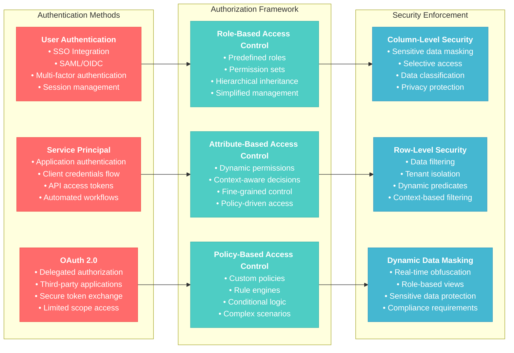
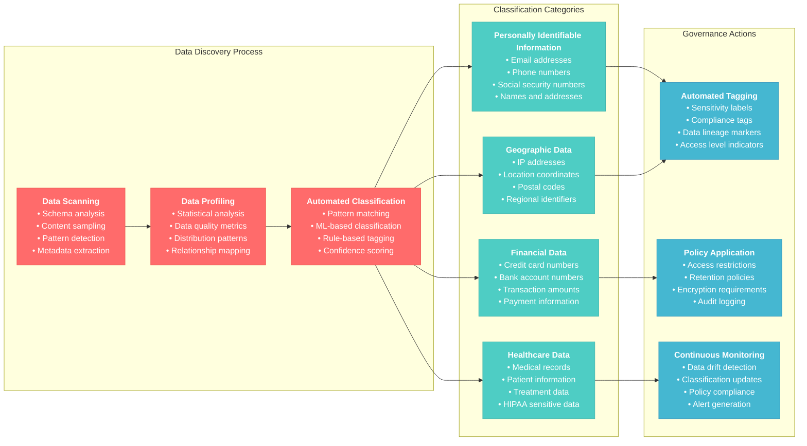
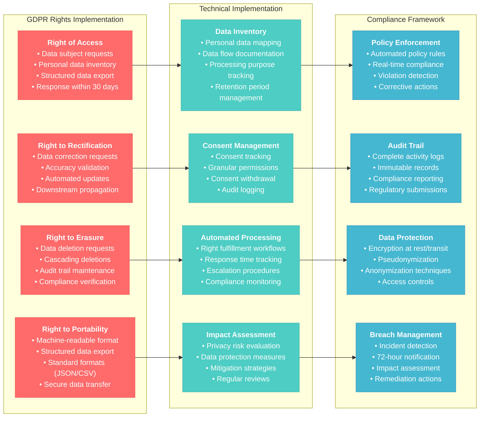

# Data Security and Governance for Databricks Data Engineer Professional

## Overview
This section covers comprehensive data security, governance, compliance, and privacy management within the Databricks platform. It focuses on Unity Catalog governance features, security best practices, compliance frameworks, and data privacy implementations.

## 1. Unity Catalog Security Framework

### 1.1 Identity and Access Management (IAM)


```python
# Service Principal Authentication
from databricks.sdk import WorkspaceClient
from databricks.sdk.core import Config

# Using service principal
config = Config(
    host="https://your-workspace.databricks.com",
    client_id="your-client-id",
    client_secret="your-client-secret"
)

workspace_client = WorkspaceClient(config=config)

# OAuth 2.0 Authentication for applications
oauth_config = Config(
    host="https://your-workspace.databricks.com",
    auth_type="oauth"
)
```

#### Role-Based Access Control (RBAC)
```python
# Create custom roles
spark.sql("""
CREATE ROLE data_analyst_role;
CREATE ROLE data_engineer_role;
CREATE ROLE data_scientist_role;
""")

# Grant privileges to roles
spark.sql("""
GRANT USE CATALOG ON CATALOG production TO ROLE data_analyst_role;
GRANT SELECT ON SCHEMA production.analytics TO ROLE data_analyst_role;
""")

spark.sql("""
GRANT ALL PRIVILEGES ON CATALOG development TO ROLE data_engineer_role;
GRANT CREATE, USAGE ON SCHEMA production.* TO ROLE data_engineer_role;
""")

# Assign roles to users/groups
spark.sql("GRANT ROLE data_analyst_role TO `analyst-group`")
spark.sql("GRANT ROLE data_engineer_role TO `engineer-group`")
```

#### Attribute-Based Access Control (ABAC)
```python
# Dynamic access control based on user attributes
spark.sql("""
CREATE FUNCTION get_user_department()
RETURNS STRING
LANGUAGE PYTHON
AS $$
  # This would integrate with your identity provider
  import requests
  user_email = spark.sql("SELECT current_user()").collect()[0][0]
  # API call to get user department
  return "sales"  # Example return
$$
""")

# Create department-specific views
spark.sql("""
CREATE VIEW sales_data_filtered AS
SELECT * FROM production.sales.orders
WHERE department = get_user_department()
   OR is_member('admin-group')
""")
```

### 1.2 Fine-Grained Access Control

#### Column-Level Security
```python
# Implement column masking based on user privileges
spark.sql("""
CREATE VIEW customer_data_secure AS
SELECT 
  customer_id,
  name,
  CASE 
    WHEN is_member('pii-access-group') THEN email
    WHEN is_member('partial-pii-access') THEN regexp_replace(email, '(.+)@(.+)', 'xxx@$2')
    ELSE 'REDACTED'
  END as email,
  CASE 
    WHEN is_member('financial-access-group') THEN credit_score
    ELSE NULL
  END as credit_score,
  registration_date
FROM production.customers.customer_data
""")

# Dynamic column masking function
def create_secure_view(table_name, sensitive_columns, access_groups):
    """
    Create a secure view with dynamic column masking
    """
    column_definitions = []
    
    for col_name, col_type in spark.table(table_name).dtypes:
        if col_name in sensitive_columns:
            access_group = access_groups.get(col_name, 'admin-group')
            if col_type.startswith('string'):
                masked_col = f"""
                CASE 
                  WHEN is_member('{access_group}') THEN {col_name}
                  ELSE 'REDACTED'
                END as {col_name}
                """
            else:
                masked_col = f"""
                CASE 
                  WHEN is_member('{access_group}') THEN {col_name}
                  ELSE NULL
                END as {col_name}
                """
            column_definitions.append(masked_col)
        else:
            column_definitions.append(col_name)
    
    view_sql = f"""
    CREATE OR REPLACE VIEW {table_name}_secure AS
    SELECT {', '.join(column_definitions)}
    FROM {table_name}
    """
    
    spark.sql(view_sql)
    return f"{table_name}_secure"

# Example usage
sensitive_columns = {'email': 'pii-access', 'ssn': 'high-security', 'salary': 'hr-access'}
secure_view = create_secure_view('production.hr.employees', sensitive_columns.keys(), sensitive_columns)
```

#### Row-Level Security (RLS)
```python
# Implement row-level security
def implement_rls(table_name, security_predicate):
    """
    Implement row-level security with dynamic predicates
    """
    secure_view_name = f"{table_name}_rls"
    
    rls_sql = f"""
    CREATE OR REPLACE VIEW {secure_view_name} AS
    SELECT * FROM {table_name}
    WHERE {security_predicate}
    """
    
    spark.sql(rls_sql)
    
    # Grant access to the secure view instead of base table
    spark.sql(f"REVOKE ALL PRIVILEGES ON TABLE {table_name} FROM `public`")
    spark.sql(f"GRANT SELECT ON VIEW {secure_view_name} TO `users`")
    
    return secure_view_name

# Examples of RLS predicates
rls_predicates = {
    "regional_data": "region = get_user_region() OR is_member('global-access')",
    "tenant_data": "tenant_id = get_user_tenant() OR is_member('cross-tenant-access')",
    "hierarchical_data": "manager_id = current_user() OR employee_id = current_user()"
}

# Apply RLS to tables
for table_suffix, predicate in rls_predicates.items():
    table_name = f"production.sales.{table_suffix}"
    secure_view = implement_rls(table_name, predicate)
    print(f"Created secure view: {secure_view}")
```

**Reference**: [Unity Catalog Security](https://docs.databricks.com/data-governance/unity-catalog/manage-privileges/index.html)

## 2. Data Classification and Cataloging

### 2.1 Automated Data Discovery and Classification



#### Data Profiling for Classification
```python
def classify_sensitive_data(df, table_name):
    """
    Automatically classify sensitive data using pattern matching
    """
    import re
    
    classification_rules = {
        'PII': {
            'email': r'^[a-zA-Z0-9._%+-]+@[a-zA-Z0-9.-]+\.[a-zA-Z]{2,}$',
            'phone': r'^[\+]?[1-9]?[0-9]{7,15}$',
            'ssn': r'^\d{3}-?\d{2}-?\d{4}$',
            'credit_card': r'^(?:4[0-9]{12}(?:[0-9]{3})?|5[1-5][0-9]{14}|3[47][0-9]{13})$'
        },
        'Financial': {
            'amount': r'^\$?[0-9]+\.?[0-9]*$',
            'account_number': r'^[0-9]{8,17}$'
        },
        'Geographic': {
            'ip_address': r'^(?:[0-9]{1,3}\.){3}[0-9]{1,3}$',
            'zip_code': r'^\d{5}(-\d{4})?$'
        }
    }
    
    column_classifications = {}
    
    for col_name in df.columns:
        col_sample = df.select(col_name).limit(1000).toPandas()[col_name].dropna()
        
        for category, patterns in classification_rules.items():
            for data_type, pattern in patterns.items():
                if col_sample.astype(str).str.match(pattern).any():
                    column_classifications[col_name] = {
                        'category': category,
                        'type': data_type,
                        'confidence': col_sample.astype(str).str.match(pattern).mean()
                    }
                    break
    
    # Apply tags to table
    for col_name, classification in column_classifications.items():
        tag_sql = f"""
        ALTER TABLE {table_name} 
        ALTER COLUMN {col_name} 
        SET TAGS (
          'classification' = '{classification["category"]}',
          'data_type' = '{classification["type"]}',
          'confidence' = '{classification["confidence"]:.2f}'
        )
        """
        spark.sql(tag_sql)
    
    return column_classifications

# Example usage
df_customers = spark.table("production.sales.customers")
classifications = classify_sensitive_data(df_customers, "production.sales.customers")
print("Data classifications:", classifications)
```

#### Metadata Management
```python
def create_comprehensive_catalog(catalog_name):
    """
    Create comprehensive data catalog with metadata
    """
    # Get all tables in catalog
    tables_df = spark.sql(f"""
    SELECT table_catalog, table_schema, table_name, table_type
    FROM system.information_schema.tables
    WHERE table_catalog = '{catalog_name}'
    """)
    
    catalog_metadata = []
    
    for row in tables_df.collect():
        table_full_name = f"{row.table_catalog}.{row.table_schema}.{row.table_name}"
        
        try:
            # Get table details
            table_details = spark.sql(f"DESCRIBE DETAIL {table_full_name}").collect()[0]
            
            # Get column information
            columns_info = spark.sql(f"DESCRIBE {table_full_name}").collect()
            
            # Get table tags
            table_info = spark.sql(f"""
            SELECT * FROM system.information_schema.table_tags
            WHERE catalog_name = '{row.table_catalog}'
              AND schema_name = '{row.table_schema}'
              AND table_name = '{row.table_name}'
            """).collect()
            
            metadata = {
                'catalog': row.table_catalog,
                'schema': row.table_schema,
                'table_name': row.table_name,
                'table_type': row.table_type,
                'location': table_details.get('location'),
                'size_bytes': table_details.get('sizeInBytes', 0),
                'num_files': table_details.get('numFiles', 0),
                'created_at': table_details.get('createdAt'),
                'last_modified': table_details.get('lastModified'),
                'columns': [{'name': col.col_name, 'type': col.data_type} for col in columns_info],
                'tags': {tag.tag_name: tag.tag_value for tag in table_info}
            }
            
            catalog_metadata.append(metadata)
            
        except Exception as e:
            print(f"Error processing {table_full_name}: {e}")
    
    # Store catalog metadata
    catalog_df = spark.createDataFrame(catalog_metadata)
    catalog_df.write.mode("overwrite").saveAsTable("system.data_catalog_metadata")
    
    return catalog_metadata

# Generate comprehensive catalog
catalog_metadata = create_comprehensive_catalog("production")
```

### 2.2 Data Lineage Tracking

#### Advanced Lineage Implementation
```python
def track_data_lineage(source_tables, target_table, transformation_logic, job_id):
    """
    Track comprehensive data lineage
    """
    lineage_record = {
        'job_id': job_id,
        'target_table': target_table,
        'source_tables': source_tables,
        'transformation_logic': transformation_logic,
        'execution_timestamp': current_timestamp(),
        'executed_by': spark.sql("SELECT current_user()").collect()[0][0],
        'spark_application_id': spark.sparkContext.applicationId
    }
    
    # Calculate data statistics
    for source_table in source_tables:
        source_count = spark.table(source_table).count()
        lineage_record[f'{source_table}_row_count'] = source_count
    
    target_count = spark.table(target_table).count()
    lineage_record['target_row_count'] = target_count
    
    # Store lineage information
    lineage_df = spark.createDataFrame([lineage_record])
    lineage_df.write.mode("append").saveAsTable("system.data_lineage")
    
    return lineage_record

# Example usage in ETL job
def etl_with_lineage(source_tables, target_table, transformation_func, job_id):
    """
    ETL process with automatic lineage tracking
    """
    # Load source data
    source_dfs = {table: spark.table(table) for table in source_tables}
    
    # Apply transformation
    result_df = transformation_func(source_dfs)
    
    # Save result
    result_df.write.mode("overwrite").saveAsTable(target_table)
    
    # Track lineage
    transformation_logic = transformation_func.__name__
    lineage_record = track_data_lineage(source_tables, target_table, transformation_logic, job_id)
    
    return lineage_record
```

**Reference**: [Data Lineage in Unity Catalog](https://docs.databricks.com/data-governance/unity-catalog/data-lineage.html)

## 3. Privacy and Compliance

### 3.1 GDPR Compliance Implementation


```python
def implement_gdpr_erasure(table_name, user_identifier, identifier_column="user_id"):
    """
    Implement GDPR right to erasure
    """
    from delta.tables import DeltaTable
    
    # Audit before deletion
    user_data_count = spark.table(table_name).filter(col(identifier_column) == user_identifier).count()
    
    if user_data_count == 0:
        return {"status": "no_data_found", "records_deleted": 0}
    
    # Log erasure request
    erasure_log = spark.createDataFrame([{
        'table_name': table_name,
        'user_identifier': user_identifier,
        'request_timestamp': current_timestamp(),
        'records_to_delete': user_data_count,
        'status': 'initiated'
    }])
    erasure_log.write.mode("append").saveAsTable("compliance.gdpr_erasure_log")
    
    # Perform deletion
    delta_table = DeltaTable.forName(spark, table_name)
    delta_table.delete(col(identifier_column) == user_identifier)
    
    # Verify deletion
    remaining_records = spark.table(table_name).filter(col(identifier_column) == user_identifier).count()
    
    # Update log
    completion_log = spark.createDataFrame([{
        'table_name': table_name,
        'user_identifier': user_identifier,
        'completion_timestamp': current_timestamp(),
        'records_deleted': user_data_count,
        'remaining_records': remaining_records,
        'status': 'completed' if remaining_records == 0 else 'failed'
    }])
    completion_log.write.mode("append").saveAsTable("compliance.gdpr_erasure_log")
    
    return {
        "status": "completed" if remaining_records == 0 else "failed",
        "records_deleted": user_data_count,
        "remaining_records": remaining_records
    }

# Example usage
erasure_result = implement_gdpr_erasure("production.users.profiles", "user_12345", "user_id")
print(f"Erasure result: {erasure_result}")
```

#### Data Portability Implementation
```python
def export_user_data_gdpr(user_identifier, output_format="json"):
    """
    Export all user data for GDPR data portability
    """
    # Find all tables containing user data
    user_tables = spark.sql("""
    SELECT DISTINCT table_catalog, table_schema, table_name
    FROM system.information_schema.columns
    WHERE column_name IN ('user_id', 'customer_id', 'email')
    """).collect()
    
    user_data_export = {}
    
    for table_row in user_tables:
        table_name = f"{table_row.table_catalog}.{table_row.table_schema}.{table_row.table_name}"
        
        try:
            # Check which identifier column exists
            table_columns = [col.name for col in spark.table(table_name).schema.fields]
            identifier_col = None
            
            for possible_col in ['user_id', 'customer_id', 'email']:
                if possible_col in table_columns:
                    identifier_col = possible_col
                    break
            
            if identifier_col:
                user_data = spark.table(table_name).filter(col(identifier_col) == user_identifier)
                
                if user_data.count() > 0:
                    if output_format == "json":
                        user_data_export[table_name] = user_data.toPandas().to_dict('records')
                    else:
                        user_data_export[table_name] = user_data.toPandas().to_csv(index=False)
        
        except Exception as e:
            print(f"Error processing {table_name}: {e}")
    
    # Log export request
    export_log = spark.createDataFrame([{
        'user_identifier': user_identifier,
        'export_timestamp': current_timestamp(),
        'tables_exported': len(user_data_export),
        'output_format': output_format
    }])
    export_log.write.mode("append").saveAsTable("compliance.gdpr_export_log")
    
    return user_data_export
```

### 3.2 Data Anonymization and Pseudonymization

#### Advanced Anonymization Techniques
```python
import hashlib
import uuid
from pyspark.sql.functions import udf
from pyspark.sql.types import StringType

def create_anonymization_functions():
    """
    Create various anonymization functions
    """
    
    # Hashing function for pseudonymization
    @udf(returnType=StringType())
    def hash_pii(value, salt="your-secret-salt"):
        if value is None:
            return None
        return hashlib.sha256((str(value) + salt).encode()).hexdigest()
    
    # K-anonymity grouping
    @udf(returnType=StringType())
    def generalize_age(age):
        if age is None:
            return None
        age_int = int(age)
        if age_int < 18:
            return "Under 18"
        elif age_int < 30:
            return "18-29"
        elif age_int < 50:
            return "30-49"
        elif age_int < 65:
            return "50-64"
        else:
            return "65+"
    
    # Geographic generalization
    @udf(returnType=StringType())
    def generalize_zipcode(zipcode):
        if zipcode is None or len(zipcode) < 5:
            return None
        return zipcode[:3] + "XX"  # Keep only first 3 digits
    
    return hash_pii, generalize_age, generalize_zipcode

def anonymize_dataset(table_name, anonymization_config):
    """
    Apply anonymization based on configuration
    """
    df = spark.table(table_name)
    hash_pii, generalize_age, generalize_zipcode = create_anonymization_functions()
    
    # Apply anonymization rules
    for column, method in anonymization_config.items():
        if method == "hash":
            df = df.withColumn(column, hash_pii(col(column)))
        elif method == "generalize_age":
            df = df.withColumn(column, generalize_age(col(column)))
        elif method == "generalize_zipcode":
            df = df.withColumn(column, generalize_zipcode(col(column)))
        elif method == "remove":
            df = df.drop(column)
        elif method == "mask":
            df = df.withColumn(column, lit("***MASKED***"))
    
    return df

# Example anonymization configuration
anonymization_config = {
    "email": "hash",
    "phone": "hash",
    "age": "generalize_age",
    "zipcode": "generalize_zipcode",
    "ssn": "remove",
    "credit_card": "remove"
}

# Apply anonymization
anonymized_df = anonymize_dataset("production.users.profiles", anonymization_config)
anonymized_df.write.mode("overwrite").saveAsTable("analytics.users.profiles_anonymized")
```

#### Differential Privacy Implementation
```python
def apply_differential_privacy(df, epsilon=1.0, sensitive_columns=None):
    """
    Apply differential privacy with noise addition
    """
    import numpy as np
    from pyspark.sql.functions import rand, when
    
    if sensitive_columns is None:
        # Identify numeric columns as potentially sensitive
        sensitive_columns = [field.name for field in df.schema.fields 
                           if field.dataType.simpleString() in ['int', 'bigint', 'float', 'double']]
    
    df_private = df
    
    for column in sensitive_columns:
        # Add Laplace noise for differential privacy
        # Scale = sensitivity / epsilon (assuming sensitivity = 1)
        scale = 1.0 / epsilon
        
        # Generate noise
        noise_col = f"{column}_noise"
        df_private = df_private.withColumn(
            noise_col,
            (rand() - 0.5) * 2 * scale  # Simple noise generation
        )
        
        # Add noise to original value
        df_private = df_private.withColumn(
            column,
            when(col(column).isNotNull(), col(column) + col(noise_col))
            .otherwise(col(column))
        ).drop(noise_col)
    
    return df_private

# Example usage
df_original = spark.table("production.sales.customer_metrics")
df_private = apply_differential_privacy(df_original, epsilon=0.5, sensitive_columns=["total_spent", "order_count"])
df_private.write.mode("overwrite").saveAsTable("analytics.sales.customer_metrics_private")
```

**Reference**: [Data Privacy Best Practices](https://docs.databricks.com/security/privacy/index.html)

## 4. Audit and Compliance Monitoring

### 4.1 Comprehensive Audit Logging

#### Access Audit Implementation
```python
def setup_access_auditing():
    """
    Setup comprehensive access auditing
    """
    # Create audit tables
    spark.sql("""
    CREATE TABLE IF NOT EXISTS audit.access_log (
        timestamp TIMESTAMP,
        user_id STRING,
        table_accessed STRING,
        operation STRING,
        query_id STRING,
        rows_accessed BIGINT,
        bytes_read BIGINT,
        ip_address STRING,
        user_agent STRING,
        success BOOLEAN,
        error_message STRING
    ) USING DELTA
    PARTITIONED BY (DATE(timestamp))
    """)
    
    spark.sql("""
    CREATE TABLE IF NOT EXISTS audit.privilege_changes (
        timestamp TIMESTAMP,
        admin_user STRING,
        target_principal STRING,
        privilege_type STRING,
        object_name STRING,
        operation STRING,
        previous_privileges ARRAY<STRING>,
        new_privileges ARRAY<STRING>
    ) USING DELTA
    PARTITIONED BY (DATE(timestamp))
    """)

def log_data_access(user_id, table_name, operation, query_id, rows_accessed=None, success=True, error_message=None):
    """
    Log data access for audit purposes
    """
    audit_record = spark.createDataFrame([{
        'timestamp': current_timestamp(),
        'user_id': user_id,
        'table_accessed': table_name,
        'operation': operation,
        'query_id': query_id,
        'rows_accessed': rows_accessed,
        'success': success,
        'error_message': error_message
    }])
    
    audit_record.write.mode("append").saveAsTable("audit.access_log")

# Example integration with data access
def secure_table_access(table_name, operation="SELECT"):
    """
    Wrapper for table access with automatic auditing
    """
    user_id = spark.sql("SELECT current_user()").collect()[0][0]
    query_id = spark.sparkContext.applicationId
    
    try:
        df = spark.table(table_name)
        row_count = df.count() if operation == "SELECT" else None
        
        # Log successful access
        log_data_access(user_id, table_name, operation, query_id, row_count, True)
        
        return df
        
    except Exception as e:
        # Log failed access
        log_data_access(user_id, table_name, operation, query_id, None, False, str(e))
        raise e

# Usage
df_orders = secure_table_access("production.sales.orders", "SELECT")
```

### 4.2 Compliance Reporting

#### Automated Compliance Reports
```python
def generate_compliance_report(report_type="gdpr", start_date=None, end_date=None):
    """
    Generate compliance reports for various regulations
    """
    if start_date is None:
        start_date = current_date() - expr("INTERVAL 30 DAYS")
    if end_date is None:
        end_date = current_date()
    
    reports = {}
    
    if report_type == "gdpr":
        # GDPR compliance report
        reports['data_processing_activities'] = spark.sql(f"""
        SELECT 
            table_accessed,
            COUNT(*) as access_count,
            COUNT(DISTINCT user_id) as unique_users,
            MIN(timestamp) as first_access,
            MAX(timestamp) as last_access
        FROM audit.access_log
        WHERE DATE(timestamp) BETWEEN '{start_date}' AND '{end_date}'
        GROUP BY table_accessed
        ORDER BY access_count DESC
        """)
        
        reports['user_rights_requests'] = spark.sql(f"""
        SELECT 
            'erasure' as request_type,
            COUNT(*) as request_count,
            SUM(records_deleted) as total_records_affected
        FROM compliance.gdpr_erasure_log
        WHERE DATE(request_timestamp) BETWEEN '{start_date}' AND '{end_date}'
        
        UNION ALL
        
        SELECT 
            'export' as request_type,
            COUNT(*) as request_count,
            NULL as total_records_affected
        FROM compliance.gdpr_export_log
        WHERE DATE(export_timestamp) BETWEEN '{start_date}' AND '{end_date}'
        """)
    
    elif report_type == "sox":
        # SOX compliance report
        reports['privilege_changes'] = spark.sql(f"""
        SELECT 
            admin_user,
            target_principal,
            privilege_type,
            object_name,
            operation,
            COUNT(*) as change_count
        FROM audit.privilege_changes
        WHERE DATE(timestamp) BETWEEN '{start_date}' AND '{end_date}'
        GROUP BY admin_user, target_principal, privilege_type, object_name, operation
        """)
        
        reports['sensitive_data_access'] = spark.sql(f"""
        SELECT 
            user_id,
            table_accessed,
            COUNT(*) as access_count,
            SUM(rows_accessed) as total_rows_accessed
        FROM audit.access_log
        WHERE DATE(timestamp) BETWEEN '{start_date}' AND '{end_date}'
          AND table_accessed LIKE '%sensitive%'
        GROUP BY user_id, table_accessed
        """)
    
    return reports

# Generate monthly GDPR report
gdpr_report = generate_compliance_report("gdpr")
for report_name, report_df in gdpr_report.items():
    print(f"\n{report_name.upper()} Report:")
    report_df.display()
```

### 4.3 Data Quality and Compliance Validation

#### Compliance Rule Engine
```python
def create_compliance_rule_engine():
    """
    Create a rule engine for compliance validation
    """
    
    class ComplianceRule:
        def __init__(self, name, description, validation_sql, severity="ERROR"):
            self.name = name
            self.description = description
            self.validation_sql = validation_sql
            self.severity = severity
    
    # Define compliance rules
    rules = [
        ComplianceRule(
            "gdpr_consent_required",
            "All customer records must have consent flag",
            "consent_given IS NOT NULL AND consent_given = true",
            "ERROR"
        ),
        ComplianceRule(
            "data_retention_check",
            "Data should not exceed retention period",
            "created_date >= current_date() - INTERVAL 7 YEARS",
            "WARNING"
        ),
        ComplianceRule(
            "pii_masking_check",
            "PII fields should be properly masked in non-prod",
            "email NOT LIKE '%@%' OR current_database() = 'production'",
            "ERROR"
        ),
        ComplianceRule(
            "encryption_required",
            "Sensitive tables must be encrypted",
            "table_properties['encryption'] = 'enabled'",
            "ERROR"
        )
    ]
    
    return rules

def validate_compliance(table_name, rules):
    """
    Validate table against compliance rules
    """
    validation_results = []
    df = spark.table(table_name)
    
    for rule in rules:
        try:
            # Count violations
            violations = df.filter(f"NOT ({rule.validation_sql})").count()
            total_records = df.count()
            
            compliance_percentage = (total_records - violations) / total_records * 100 if total_records > 0 else 100
            
            result = {
                'table_name': table_name,
                'rule_name': rule.name,
                'rule_description': rule.description,
                'severity': rule.severity,
                'total_records': total_records,
                'violations': violations,
                'compliance_percentage': compliance_percentage,
                'status': 'PASS' if violations == 0 else 'FAIL',
                'validation_timestamp': current_timestamp()
            }
            
            validation_results.append(result)
            
        except Exception as e:
            validation_results.append({
                'table_name': table_name,
                'rule_name': rule.name,
                'rule_description': rule.description,
                'severity': rule.severity,
                'total_records': 0,
                'violations': 0,
                'compliance_percentage': 0,
                'status': 'ERROR',
                'error_message': str(e),
                'validation_timestamp': current_timestamp()
            })
    
    # Store validation results
    results_df = spark.createDataFrame(validation_results)
    results_df.write.mode("append").saveAsTable("compliance.validation_results")
    
    return validation_results

# Example usage
compliance_rules = create_compliance_rule_engine()
validation_results = validate_compliance("production.customers.profiles", compliance_rules)

# Generate compliance score
compliance_score = sum(1 for r in validation_results if r['status'] == 'PASS') / len(validation_results) * 100
print(f"Overall compliance score: {compliance_score:.1f}%")
```

## 5. Security Best Practices

### 5.1 Data Encryption

#### Encryption at Rest and in Transit
```python
# Configure encryption for Delta tables
def create_encrypted_table(table_name, schema, encryption_key=None):
    """
    Create table with encryption configuration
    """
    encryption_properties = {
        'delta.encryption.enabled': 'true',
        'delta.encryption.algorithm': 'AES-256-GCM'
    }
    
    if encryption_key:
        encryption_properties['delta.encryption.key'] = encryption_key
    
    properties_str = ', '.join([f"'{k}' = '{v}'" for k, v in encryption_properties.items()])
    
    create_sql = f"""
    CREATE TABLE {table_name} ({schema})
    USING DELTA
    TBLPROPERTIES ({properties_str})
    """
    
    spark.sql(create_sql)
    print(f"Created encrypted table: {table_name}")

# Example
customer_schema = """
    customer_id BIGINT,
    email STRING,
    phone STRING,
    created_at TIMESTAMP
"""
create_encrypted_table("production.customers.encrypted_profiles", customer_schema)
```

### 5.2 Network Security

#### IP Whitelist and Access Control
```python
def setup_network_security():
    """
    Setup network-level security controls
    """
    # This would typically be configured at the workspace level
    network_policies = {
        'allowed_ip_ranges': [
            '10.0.0.0/8',    # Corporate network
            '172.16.0.0/12', # VPN range
            '192.168.0.0/16' # Development network
        ],
        'blocked_countries': ['CN', 'RU', 'KP'],  # Example blocked countries
        'require_vpn': True,
        'max_session_duration': '8 hours'
    }
    
    return network_policies

# Monitor access from unauthorized locations
def monitor_access_anomalies():
    """
    Monitor for suspicious access patterns
    """
    anomaly_query = """
    SELECT 
        user_id,
        ip_address,
        COUNT(*) as access_count,
        COUNT(DISTINCT table_accessed) as unique_tables
    FROM audit.access_log
    WHERE DATE(timestamp) = current_date()
    GROUP BY user_id, ip_address
    HAVING access_count > 1000  -- Threshold for suspicious activity
       OR unique_tables > 50    -- Access to too many tables
    """
    
    anomalies = spark.sql(anomaly_query)
    
    if anomalies.count() > 0:
        print("SECURITY ALERT: Suspicious access patterns detected!")
        anomalies.display()
        
        # Send alerts (implementation depends on alerting system)
        send_security_alert(anomalies.collect())
    
    return anomalies

def send_security_alert(anomaly_records):
    """
    Send security alerts for anomalous access
    """
    for record in anomaly_records:
        alert_message = f"""
        SECURITY ALERT: Suspicious activity detected
        User: {record.user_id}
        IP: {record.ip_address}
        Access Count: {record.access_count}
        Unique Tables: {record.unique_tables}
        """
        print(alert_message)
        # Integration with alerting system (Slack, email, etc.)
```

## 6. Best Practices Summary

### 6.1 Security Implementation Checklist

```python
def security_health_check():
    """
    Comprehensive security health check
    """
    health_checks = []
    
    # Check 1: Unity Catalog enabled
    try:
        spark.sql("SHOW CATALOGS")
        health_checks.append({"check": "Unity Catalog", "status": "ENABLED"})
    except:
        health_checks.append({"check": "Unity Catalog", "status": "DISABLED", "severity": "HIGH"})
    
    # Check 2: Default permissions
    default_permissions = spark.sql("""
    SELECT COUNT(*) as public_tables
    FROM system.information_schema.table_privileges
    WHERE grantee = 'public'
    """).collect()[0].public_tables
    
    if default_permissions > 0:
        health_checks.append({"check": "Public Access", "status": f"{default_permissions} tables", "severity": "MEDIUM"})
    else:
        health_checks.append({"check": "Public Access", "status": "SECURE"})
    
    # Check 3: Encryption status
    unencrypted_tables = spark.sql("""
    SELECT COUNT(*) as count
    FROM system.information_schema.tables t
    LEFT JOIN system.information_schema.table_properties p
      ON t.table_catalog = p.catalog_name
      AND t.table_schema = p.schema_name
      AND t.table_name = p.table_name
      AND p.property_name = 'delta.encryption.enabled'
    WHERE p.property_value != 'true' OR p.property_value IS NULL
    """).collect()[0].count
    
    health_checks.append({
        "check": "Encryption", 
        "status": f"{unencrypted_tables} unencrypted tables",
        "severity": "HIGH" if unencrypted_tables > 0 else "NONE"
    })
    
    return health_checks

# Run security health check
security_status = security_health_check()
for check in security_status:
    print(f"{check['check']}: {check['status']} {check.get('severity', '')}")
```

### 6.2 Governance Implementation Guide

1. **Start with Classification**: Automatically classify data and apply appropriate tags
2. **Implement Least Privilege**: Grant minimum necessary permissions
3. **Enable Auditing**: Comprehensive logging of all data access
4. **Regular Reviews**: Periodic access reviews and privilege cleanup
5. **Compliance Automation**: Automated compliance validation and reporting
6. **Incident Response**: Clear procedures for security incidents
7. **Training**: Regular security training for all users

## Conclusion

Effective data security and governance in Databricks requires a comprehensive approach combining Unity Catalog's governance features, proper access controls, compliance automation, and continuous monitoring. The key is to implement security by design, ensuring that governance and compliance are built into every aspect of your data platform.

Success in this domain requires understanding regulatory requirements, implementing appropriate technical controls, and maintaining ongoing vigilance through monitoring and auditing. The investment in proper governance pays dividends in reduced risk, improved compliance, and increased trust in your data platform.

**References**:
- [Unity Catalog Security](https://docs.databricks.com/data-governance/unity-catalog/manage-privileges/index.html)
- [Data Privacy Best Practices](https://docs.databricks.com/security/privacy/index.html)
- [Compliance and Auditing](https://docs.databricks.com/administration-guide/workspace-settings/compliance-security-audit.html)
