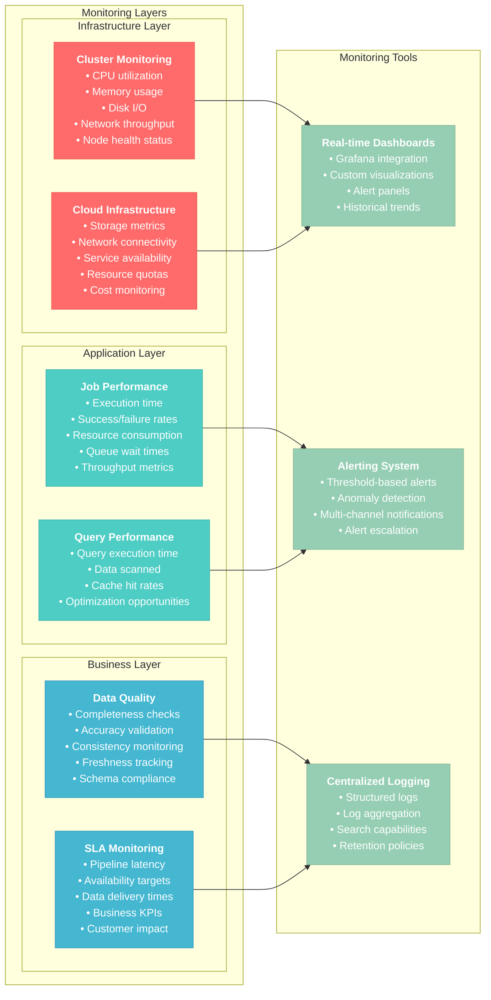
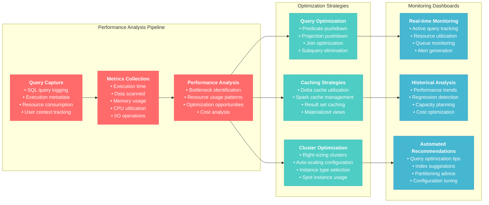
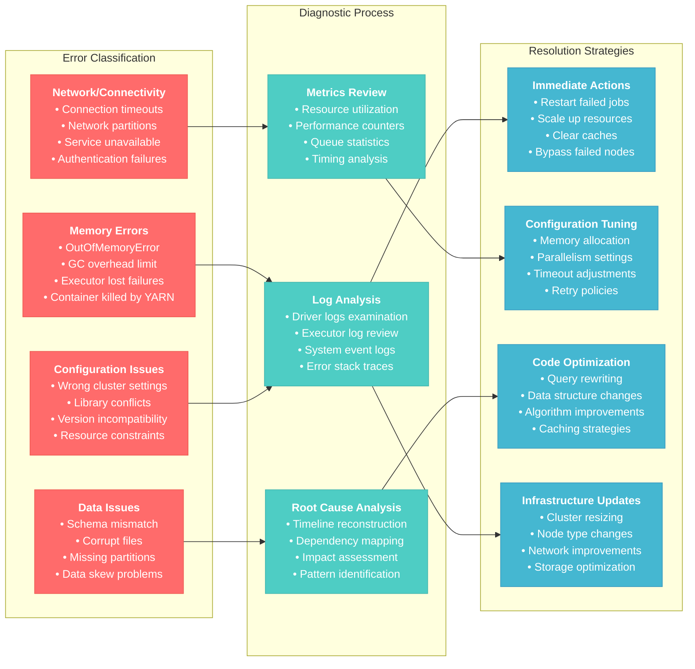

# Monitoring, Logging, and Troubleshooting for Databricks Data Engineer Professional

## Overview
This section covers comprehensive monitoring, logging, troubleshooting, and observability practices within the Databricks platform. It focuses on proactive monitoring, effective debugging techniques, performance optimization, and building resilient data systems.

## 1. Observability and Monitoring Framework

### 1.1 Multi-layered Monitoring Strategy


```python
def setup_infrastructure_monitoring():
    """
    Setup comprehensive infrastructure monitoring
    """
    # Cluster metrics monitoring
    cluster_metrics_query = """
    SELECT 
        cluster_id,
        cluster_name,
        node_type,
        num_workers,
        cpu_utilization,
        memory_utilization,
        disk_utilization,
        network_io,
        timestamp
    FROM system.compute.cluster_metrics
    WHERE timestamp >= current_timestamp() - INTERVAL 1 HOUR
    """
    
    # Job performance monitoring
    job_metrics_query = """
    SELECT 
        job_id,
        run_id,
        job_name,
        start_time,
        end_time,
        execution_duration_ms,
        task_count,
        failed_task_count,
        cluster_id,
        cost_estimate
    FROM system.jobs.run_metrics
    WHERE start_time >= current_timestamp() - INTERVAL 24 HOURS
    """
    
    # Query performance monitoring
    query_metrics_query = """
    SELECT 
        query_id,
        query_text,
        user_name,
        warehouse_id,
        start_time,
        end_time,
        execution_time_ms,
        rows_read,
        bytes_read,
        bytes_written,
        cache_hit_ratio
    FROM system.query.history
    WHERE start_time >= current_timestamp() - INTERVAL 1 HOUR
    ORDER BY execution_time_ms DESC
    LIMIT 100
    """
    
    return {
        "cluster_metrics": spark.sql(cluster_metrics_query),
        "job_metrics": spark.sql(job_metrics_query),
        "query_metrics": spark.sql(query_metrics_query)
    }

# Real-time monitoring dashboard
def create_monitoring_dashboard():
    """
    Create real-time monitoring dashboard
    """
    # Get current metrics
    metrics = setup_infrastructure_monitoring()
    
    # Cluster health summary
    cluster_health = metrics["cluster_metrics"].agg(
        avg("cpu_utilization").alias("avg_cpu"),
        avg("memory_utilization").alias("avg_memory"),
        max("cpu_utilization").alias("max_cpu"),
        max("memory_utilization").alias("max_memory"),
        count("cluster_id").alias("active_clusters")
    ).collect()[0]
    
    # Job failure rate
    job_stats = metrics["job_metrics"].agg(
        count("job_id").alias("total_jobs"),
        sum(when(col("failed_task_count") > 0, 1).otherwise(0)).alias("failed_jobs"),
        avg("execution_duration_ms").alias("avg_duration")
    ).collect()[0]
    
    # Slow query identification
    slow_queries = metrics["query_metrics"].filter(
        col("execution_time_ms") > 300000  # 5 minutes
    ).count()
    
    dashboard_data = {
        "cluster_health": {
            "avg_cpu": f"{cluster_health.avg_cpu:.1f}%",
            "avg_memory": f"{cluster_health.avg_memory:.1f}%",
            "max_cpu": f"{cluster_health.max_cpu:.1f}%",
            "max_memory": f"{cluster_health.max_memory:.1f}%",
            "active_clusters": cluster_health.active_clusters
        },
        "job_performance": {
            "total_jobs": job_stats.total_jobs,
            "failed_jobs": job_stats.failed_jobs,
            "failure_rate": f"{(job_stats.failed_jobs / job_stats.total_jobs * 100):.1f}%" if job_stats.total_jobs > 0 else "0%",
            "avg_duration_min": f"{(job_stats.avg_duration / 60000):.1f}"
        },
        "query_performance": {
            "slow_queries": slow_queries
        }
    }
    
    return dashboard_data
```

#### Application-Level Monitoring
```python
def setup_application_monitoring():
    """
    Setup application-level monitoring for data pipelines
    """
    
    # Custom metrics collection
    def collect_pipeline_metrics(pipeline_name, stage, start_time, end_time, 
                                input_records, output_records, errors=0):
        """
        Collect custom pipeline metrics
        """
        metrics_data = [{
            'pipeline_name': pipeline_name,
            'stage': stage,
            'start_time': start_time,
            'end_time': end_time,
            'duration_seconds': (end_time - start_time).total_seconds(),
            'input_records': input_records,
            'output_records': output_records,
            'error_count': errors,
            'success_rate': (output_records / input_records * 100) if input_records > 0 else 0,
            'timestamp': current_timestamp()
        }]
        
        metrics_df = spark.createDataFrame(metrics_data)
        metrics_df.write.mode("append").saveAsTable("monitoring.pipeline_metrics")
        
        return metrics_data[0]
    
    # Data quality metrics
    def collect_data_quality_metrics(table_name, quality_checks):
        """
        Collect data quality metrics
        """
        df = spark.table(table_name)
        total_records = df.count()
        
        quality_results = []
        for check_name, check_condition in quality_checks.items():
            passed_records = df.filter(check_condition).count()
            failed_records = total_records - passed_records
            
            quality_results.append({
                'table_name': table_name,
                'check_name': check_name,
                'total_records': total_records,
                'passed_records': passed_records,
                'failed_records': failed_records,
                'pass_rate': (passed_records / total_records * 100) if total_records > 0 else 0,
                'timestamp': current_timestamp()
            })
        
        quality_df = spark.createDataFrame(quality_results)
        quality_df.write.mode("append").saveAsTable("monitoring.data_quality_metrics")
        
        return quality_results
    
    return collect_pipeline_metrics, collect_data_quality_metrics

# Example usage in ETL pipeline
def monitored_etl_pipeline():
    """
    ETL pipeline with comprehensive monitoring
    """
    from datetime import datetime
    
    collect_pipeline_metrics, collect_data_quality_metrics = setup_application_monitoring()
    pipeline_name = "customer_data_pipeline"
    
    # Stage 1: Data Extraction
    stage_start = datetime.now()
    try:
        source_df = spark.table("raw.customer_data")
        input_count = source_df.count()
        
        collect_pipeline_metrics(
            pipeline_name, "extraction", stage_start, datetime.now(),
            0, input_count, 0
        )
        
    except Exception as e:
        collect_pipeline_metrics(
            pipeline_name, "extraction", stage_start, datetime.now(),
            0, 0, 1
        )
        raise e
    
    # Stage 2: Data Transformation
    stage_start = datetime.now()
    try:
        transformed_df = source_df.filter(col("status") == "active") \
                                 .withColumn("processed_at", current_timestamp())
        output_count = transformed_df.count()
        
        collect_pipeline_metrics(
            pipeline_name, "transformation", stage_start, datetime.now(),
            input_count, output_count, 0
        )
        
    except Exception as e:
        collect_pipeline_metrics(
            pipeline_name, "transformation", stage_start, datetime.now(),
            input_count, 0, 1
        )
        raise e
    
    # Stage 3: Data Loading
    stage_start = datetime.now()
    try:
        transformed_df.write.mode("overwrite").saveAsTable("processed.customer_data")
        
        collect_pipeline_metrics(
            pipeline_name, "loading", stage_start, datetime.now(),
            output_count, output_count, 0
        )
        
    except Exception as e:
        collect_pipeline_metrics(
            pipeline_name, "loading", stage_start, datetime.now(),
            output_count, 0, 1
        )
        raise e
    
    # Data quality validation
    quality_checks = {
        "non_null_id": "customer_id IS NOT NULL",
        "valid_email": "email RLIKE '^[^@]+@[^@]+\\.[^@]+$'",
        "positive_age": "age > 0"
    }
    
    collect_data_quality_metrics("processed.customer_data", quality_checks)
    
    print(f"Pipeline {pipeline_name} completed successfully")
```

**Reference**: [Databricks Monitoring and Observability](https://docs.databricks.com/administration-guide/workspace-settings/index.html)

### 1.2 Log Management and Analysis

#### Centralized Logging Strategy
```python
def setup_centralized_logging():
    """
    Setup centralized logging for comprehensive log management
    """
    
    # Configure log aggregation
    log_config = {
        "cluster_logs": {
            "destination": "dbfs:/databricks/cluster-logs/",
            "retention_days": 30,
            "log_levels": ["ERROR", "WARN", "INFO"]
        },
        "driver_logs": {
            "destination": "dbfs:/databricks/driver-logs/",
            "retention_days": 7,
            "log_levels": ["ERROR", "WARN"]
        },
        "application_logs": {
            "destination": "dbfs:/databricks/application-logs/",
            "retention_days": 14,
            "log_levels": ["ERROR", "WARN", "INFO", "DEBUG"]
        }
    }
    
    return log_config

def parse_spark_logs(log_path):
    """
    Parse Spark logs for error analysis
    """
    # Read log files
    log_df = spark.read.text(log_path)
    
    # Extract structured information
    parsed_logs = log_df.select(
        regexp_extract(col("value"), r"(\d{4}-\d{2}-\d{2} \d{2}:\d{2}:\d{2})", 1).alias("timestamp"),
        regexp_extract(col("value"), r"\[(.*?)\]", 1).alias("log_level"),
        regexp_extract(col("value"), r"(\w+Exception)", 1).alias("exception_type"),
        regexp_extract(col("value"), r"Task (\d+)", 1).alias("task_id"),
        col("value").alias("raw_message")
    ).filter(col("timestamp") != "")
    
    return parsed_logs

def analyze_error_patterns(log_df):
    """
    Analyze error patterns from logs
    """
    # Error frequency analysis
    error_summary = log_df.filter(col("log_level") == "ERROR") \
                          .groupBy("exception_type") \
                          .agg(count("*").alias("error_count")) \
                          .orderBy(desc("error_count"))
    
    # Time-based error analysis
    error_timeline = log_df.filter(col("log_level") == "ERROR") \
                           .withColumn("hour", hour(col("timestamp"))) \
                           .groupBy("hour") \
                           .agg(count("*").alias("errors_per_hour")) \
                           .orderBy("hour")
    
    # Task failure analysis
    task_failures = log_df.filter(col("task_id") != "") \
                          .filter(col("log_level") == "ERROR") \
                          .groupBy("task_id") \
                          .agg(count("*").alias("failure_count")) \
                          .orderBy(desc("failure_count"))
    
    return {
        "error_summary": error_summary,
        "error_timeline": error_timeline,
        "task_failures": task_failures
    }

# Example log analysis workflow
def comprehensive_log_analysis():
    """
    Comprehensive log analysis workflow
    """
    # Parse different log sources
    cluster_logs = parse_spark_logs("dbfs:/databricks/cluster-logs/")
    driver_logs = parse_spark_logs("dbfs:/databricks/driver-logs/")
    
    # Combine logs
    all_logs = cluster_logs.union(driver_logs)
    
    # Analyze patterns
    error_analysis = analyze_error_patterns(all_logs)
    
    # Create alerts for critical errors
    critical_errors = error_analysis["error_summary"].filter(col("error_count") > 10)
    
    if critical_errors.count() > 0:
        print("CRITICAL: High frequency errors detected!")
        critical_errors.display()
        
        # Send alerts
        send_error_alerts(critical_errors.collect())
    
    return error_analysis

def send_error_alerts(error_records):
    """
    Send alerts for critical errors
    """
    for error in error_records:
        alert_message = f"""
        HIGH FREQUENCY ERROR DETECTED:
        Exception Type: {error.exception_type}
        Error Count: {error.error_count}
        Time: {datetime.now()}
        
        Please investigate immediately.
        """
        print(alert_message)
        # Integration with alerting system (Slack, PagerDuty, etc.)
```

## 2. Performance Monitoring and Optimization

### 2.1 Query Performance Analysis


```python
def analyze_query_performance():
    """
    Comprehensive query performance analysis
    """
    
    # Get slow queries
    slow_queries = spark.sql("""
    SELECT 
        query_id,
        query_text,
        user_name,
        start_time,
        end_time,
        execution_time_ms,
        rows_read,
        bytes_read,
        bytes_written,
        cache_hit_ratio,
        warehouse_id
    FROM system.query.history
    WHERE execution_time_ms > 60000  -- Queries taking more than 1 minute
      AND start_time >= current_timestamp() - INTERVAL 24 HOURS
    ORDER BY execution_time_ms DESC
    LIMIT 50
    """)
    
    # Analyze query patterns
    query_patterns = spark.sql("""
    SELECT 
        regexp_extract(lower(query_text), '(select|insert|update|delete|create)', 1) as query_type,
        COUNT(*) as query_count,
        AVG(execution_time_ms) as avg_execution_time,
        MAX(execution_time_ms) as max_execution_time,
        AVG(rows_read) as avg_rows_read,
        AVG(bytes_read) as avg_bytes_read
    FROM system.query.history
    WHERE start_time >= current_timestamp() - INTERVAL 24 HOURS
    GROUP BY regexp_extract(lower(query_text), '(select|insert|update|delete|create)', 1)
    ORDER BY avg_execution_time DESC
    """)
    
    # Identify resource-intensive queries
    resource_intensive = spark.sql("""
    SELECT 
        query_id,
        query_text,
        execution_time_ms,
        bytes_read / (1024 * 1024) as mb_read,
        rows_read,
        (bytes_read / execution_time_ms) as bytes_per_ms
    FROM system.query.history
    WHERE start_time >= current_timestamp() - INTERVAL 24 HOURS
      AND bytes_read > 1073741824  -- More than 1GB read
    ORDER BY bytes_read DESC
    LIMIT 25
    """)
    
    return {
        "slow_queries": slow_queries,
        "query_patterns": query_patterns,
        "resource_intensive": resource_intensive
    }

def generate_optimization_recommendations(query_analysis):
    """
    Generate optimization recommendations based on query analysis
    """
    recommendations = []
    
    # Analyze slow queries for common issues
    slow_queries = query_analysis["slow_queries"].collect()
    
    for query in slow_queries:
        query_text = query.query_text.lower()
        
        # Check for missing WHERE clauses
        if "select" in query_text and "where" not in query_text and query.rows_read > 1000000:
            recommendations.append({
                "query_id": query.query_id,
                "issue": "Full table scan detected",
                "recommendation": "Add WHERE clause to filter data",
                "potential_impact": "High"
            })
        
        # Check for missing JOINs optimization
        if "join" in query_text and query.execution_time_ms > 300000:
            recommendations.append({
                "query_id": query.query_id,
                "issue": "Slow JOIN operation",
                "recommendation": "Consider broadcast join or optimize join keys",
                "potential_impact": "Medium"
            })
        
        # Check for large result sets
        if query.bytes_written > 536870912:  # 512MB
            recommendations.append({
                "query_id": query.query_id,
                "issue": "Large result set",
                "recommendation": "Consider pagination or result filtering",
                "potential_impact": "Medium"
            })
    
    # Store recommendations
    if recommendations:
        recommendations_df = spark.createDataFrame(recommendations)
        recommendations_df.write.mode("append").saveAsTable("monitoring.optimization_recommendations")
    
    return recommendations
```

#### Spark Configuration Optimization
```python
def optimize_spark_configuration(workload_type="general"):
    """
    Optimize Spark configuration based on workload type
    """
    
    configurations = {
        "general": {
            "spark.sql.adaptive.enabled": "true",
            "spark.sql.adaptive.coalescePartitions.enabled": "true",
            "spark.sql.adaptive.skewJoin.enabled": "true",
            "spark.sql.files.maxPartitionBytes": "134217728",  # 128MB
            "spark.sql.execution.arrow.pyspark.enabled": "true"
        },
        "etl": {
            "spark.sql.adaptive.enabled": "true",
            "spark.sql.adaptive.coalescePartitions.enabled": "true",
            "spark.sql.adaptive.skewJoin.enabled": "true",
            "spark.sql.files.maxPartitionBytes": "268435456",  # 256MB
            "spark.sql.shuffle.partitions": "400",
            "spark.sql.execution.arrow.pyspark.enabled": "true",
            "spark.serializer": "org.apache.spark.serializer.KryoSerializer"
        },
        "ml": {
            "spark.sql.adaptive.enabled": "true",
            "spark.sql.adaptive.coalescePartitions.enabled": "true",
            "spark.ml.cache.enabled": "true",
            "spark.sql.execution.arrow.pyspark.enabled": "true",
            "spark.python.worker.memory": "2g"
        },
        "streaming": {
            "spark.sql.streaming.kafka.useDeprecatedOffsetFetching": "false",
            "spark.sql.streaming.checkpointLocation.compression.codec": "zstd",
            "spark.sql.adaptive.enabled": "false",  # Not recommended for streaming
            "spark.sql.streaming.metricsEnabled": "true"
        }
    }
    
    if workload_type in configurations:
        config = configurations[workload_type]
        
        for key, value in config.items():
            spark.conf.set(key, value)
            print(f"Set {key} = {value}")
    
    return configurations.get(workload_type, {})

def monitor_resource_utilization():
    """
    Monitor cluster resource utilization
    """
    
    # Get current resource usage
    resource_query = """
    SELECT 
        cluster_id,
        cluster_name,
        avg(cpu_utilization) as avg_cpu,
        max(cpu_utilization) as max_cpu,
        avg(memory_utilization) as avg_memory,
        max(memory_utilization) as max_memory,
        avg(disk_utilization) as avg_disk,
        max(disk_utilization) as max_disk
    FROM system.compute.cluster_metrics
    WHERE timestamp >= current_timestamp() - INTERVAL 1 HOUR
    GROUP BY cluster_id, cluster_name
    """
    
    resource_usage = spark.sql(resource_query)
    
    # Identify resource bottlenecks
    bottlenecks = resource_usage.filter(
        (col("max_cpu") > 90) | 
        (col("max_memory") > 85) | 
        (col("max_disk") > 80)
    )
    
    if bottlenecks.count() > 0:
        print("Resource bottlenecks detected:")
        bottlenecks.display()
        
        # Generate scaling recommendations
        scaling_recommendations = []
        for row in bottlenecks.collect():
            recommendations = []
            
            if row.max_cpu > 90:
                recommendations.append("Consider adding more workers or using CPU-optimized instances")
            if row.max_memory > 85:
                recommendations.append("Consider using memory-optimized instances")
            if row.max_disk > 80:
                recommendations.append("Consider using instances with more storage")
            
            scaling_recommendations.append({
                "cluster_id": row.cluster_id,
                "cluster_name": row.cluster_name,
                "recommendations": recommendations
            })
        
        return scaling_recommendations
    
    return []
```

**Reference**: [Spark Performance Tuning](https://spark.apache.org/docs/latest/tuning.html)

### 2.2 Delta Lake Performance Monitoring

#### Table Health Analysis
```python
def analyze_delta_table_health(table_name):
    """
    Comprehensive Delta table health analysis
    """
    
    # Get table details
    table_details = spark.sql(f"DESCRIBE DETAIL {table_name}").collect()[0]
    
    # Get table history
    table_history = spark.sql(f"DESCRIBE HISTORY {table_name} LIMIT 20")
    
    # Analyze file structure
    file_analysis = {
        "total_files": table_details.numFiles,
        "total_size_gb": table_details.sizeInBytes / (1024**3) if table_details.sizeInBytes else 0,
        "avg_file_size_mb": (table_details.sizeInBytes / table_details.numFiles / (1024**2)) if table_details.numFiles > 0 else 0,
        "location": table_details.location,
        "format": table_details.format
    }
    
    # Check for optimization opportunities
    optimization_needed = []
    
    if file_analysis["total_files"] > 1000:
        optimization_needed.append("High file count - consider OPTIMIZE")
    
    if file_analysis["avg_file_size_mb"] < 10:
        optimization_needed.append("Small files detected - run OPTIMIZE")
    
    if file_analysis["avg_file_size_mb"] > 1000:
        optimization_needed.append("Large files detected - consider repartitioning")
    
    # Analyze operation patterns
    operation_stats = table_history.groupBy("operation") \
                                  .agg(count("*").alias("operation_count")) \
                                  .orderBy(desc("operation_count"))
    
    health_report = {
        "table_name": table_name,
        "file_analysis": file_analysis,
        "optimization_needed": optimization_needed,
        "operation_stats": operation_stats.collect(),
        "last_optimized": None  # Would be extracted from history
    }
    
    return health_report

def automated_table_maintenance():
    """
    Automated table maintenance based on health analysis
    """
    
    # Get all Delta tables
    delta_tables = spark.sql("""
    SELECT table_catalog, table_schema, table_name
    FROM system.information_schema.tables
    WHERE table_type = 'MANAGED' 
      AND data_source_format = 'DELTA'
    """).collect()
    
    maintenance_results = []
    
    for table_row in delta_tables:
        table_name = f"{table_row.table_catalog}.{table_row.table_schema}.{table_row.table_name}"
        
        try:
            # Analyze table health
            health_report = analyze_delta_table_health(table_name)
            
            # Perform maintenance if needed
            if "High file count - consider OPTIMIZE" in health_report["optimization_needed"]:
                print(f"Optimizing {table_name} due to high file count...")
                spark.sql(f"OPTIMIZE {table_name}")
                maintenance_results.append({"table": table_name, "action": "OPTIMIZE", "reason": "high_file_count"})
            
            if "Small files detected - run OPTIMIZE" in health_report["optimization_needed"]:
                print(f"Optimizing {table_name} due to small files...")
                spark.sql(f"OPTIMIZE {table_name}")
                maintenance_results.append({"table": table_name, "action": "OPTIMIZE", "reason": "small_files"})
            
            # Vacuum old files (7 days retention)
            if health_report["file_analysis"]["total_files"] > 100:
                print(f"Vacuuming {table_name}...")
                spark.sql(f"VACUUM {table_name} RETAIN 168 HOURS")
                maintenance_results.append({"table": table_name, "action": "VACUUM", "reason": "cleanup"})
            
        except Exception as e:
            print(f"Error maintaining {table_name}: {e}")
            maintenance_results.append({"table": table_name, "action": "ERROR", "reason": str(e)})
    
    # Store maintenance log
    if maintenance_results:
        maintenance_df = spark.createDataFrame(maintenance_results)
        maintenance_df.withColumn("timestamp", current_timestamp()) \
                     .write.mode("append").saveAsTable("monitoring.table_maintenance_log")
    
    return maintenance_results
```

## 3. Troubleshooting and Debugging

### 3.1 Common Error Patterns and Solutions


```python
def classify_and_resolve_errors():
    """
    Classify common errors and provide resolution guidance
    """
    
    error_patterns = {
        "OutOfMemoryError": {
            "description": "Executor or driver running out of memory",
            "common_causes": [
                "Large dataset processed without proper partitioning",
                "Memory-intensive operations like collect()",
                "Insufficient cluster memory configuration"
            ],
            "solutions": [
                "Increase executor memory: spark.executor.memory",
                "Increase driver memory: spark.driver.memory",
                "Use persist() instead of cache() for large datasets",
                "Repartition data to smaller chunks",
                "Use broadcast joins for small tables"
            ],
            "prevention": [
                "Monitor memory usage patterns",
                "Use sampling for development",
                "Implement proper partitioning strategy"
            ]
        },
        "TaskFailedException": {
            "description": "Individual task failures in Spark job",
            "common_causes": [
                "Data skew causing uneven task distribution",
                "Network issues between nodes",
                "Corrupted input data"
            ],
            "solutions": [
                "Enable adaptive query execution",
                "Use salting for skewed joins",
                "Increase task retry attempts",
                "Check data quality and corruption"
            ],
            "prevention": [
                "Monitor task execution times",
                "Implement data validation",
                "Use appropriate partitioning keys"
            ]
        },
        "FileNotFoundException": {
            "description": "Missing files or paths in data processing",
            "common_causes": [
                "Incorrect file paths",
                "Files moved or deleted",
                "Permissions issues"
            ],
            "solutions": [
                "Verify file paths and permissions",
                "Implement file existence checks",
                "Use try-catch for file operations",
                "Check mount points and credentials"
            ],
            "prevention": [
                "Validate file paths before processing",
                "Monitor file system changes",
                "Implement robust error handling"
            ]
        }
    }
    
    return error_patterns

def debug_failed_job(job_id):
    """
    Debug a failed job with comprehensive analysis
    """
    
    # Get job details
    job_info = spark.sql(f"""
    SELECT *
    FROM system.jobs.run_metrics
    WHERE job_id = '{job_id}'
    ORDER BY start_time DESC
    LIMIT 1
    """).collect()
    
    if not job_info:
        return {"error": "Job not found"}
    
    job = job_info[0]
    
    # Get failed tasks
    failed_tasks = spark.sql(f"""
    SELECT *
    FROM system.compute.task_metrics
    WHERE job_id = '{job_id}'
      AND task_status = 'FAILED'
    """)
    
    # Analyze failure patterns
    failure_analysis = failed_tasks.groupBy("failure_reason", "executor_id") \
                                  .agg(count("*").alias("failure_count")) \
                                  .orderBy(desc("failure_count"))
    
    # Get error messages from logs
    error_patterns = classify_and_resolve_errors()
    
    debug_report = {
        "job_id": job_id,
        "job_name": job.job_name,
        "failure_time": job.end_time,
        "total_tasks": job.task_count,
        "failed_tasks": job.failed_task_count,
        "failure_analysis": failure_analysis.collect(),
        "recommended_actions": []
    }
    
    # Generate recommendations based on failure patterns
    for failure in failure_analysis.collect():
        failure_reason = failure.failure_reason
        
        for error_type, error_info in error_patterns.items():
            if error_type.lower() in failure_reason.lower():
                debug_report["recommended_actions"].extend(error_info["solutions"])
                break
    
    return debug_report

# Example debugging workflow
def comprehensive_debugging_workflow(job_id):
    """
    Complete debugging workflow for failed jobs
    """
    
    print(f"Debugging job: {job_id}")
    
    # 1. Get basic job information
    debug_report = debug_failed_job(job_id)
    
    if "error" in debug_report:
        print(f"Error: {debug_report['error']}")
        return
    
    # 2. Display failure summary
    print(f"\nJob Failure Summary:")
    print(f"Job Name: {debug_report['job_name']}")
    print(f"Failed Tasks: {debug_report['failed_tasks']}/{debug_report['total_tasks']}")
    print(f"Failure Time: {debug_report['failure_time']}")
    
    # 3. Show failure patterns
    print(f"\nFailure Patterns:")
    for failure in debug_report['failure_analysis']:
        print(f"  {failure.failure_reason}: {failure.failure_count} occurrences")
    
    # 4. Display recommendations
    print(f"\nRecommended Actions:")
    for action in debug_report['recommended_actions']:
        print(f"  - {action}")
    
    # 5. Check cluster health at time of failure
    cluster_health = spark.sql(f"""
    SELECT cluster_id, avg(cpu_utilization), avg(memory_utilization)
    FROM system.compute.cluster_metrics
    WHERE timestamp BETWEEN '{debug_report['failure_time']}' - INTERVAL 1 HOUR 
      AND '{debug_report['failure_time']}' + INTERVAL 1 HOUR
    GROUP BY cluster_id
    """)
    
    print(f"\nCluster Health During Failure:")
    cluster_health.display()
    
    return debug_report
```

### 3.2 Performance Troubleshooting

#### Query Performance Debugging
```python
def debug_slow_query(query_id):
    """
    Debug slow query performance
    """
    
    # Get query details
    query_info = spark.sql(f"""
    SELECT *
    FROM system.query.history
    WHERE query_id = '{query_id}'
    """).collect()
    
    if not query_info:
        return {"error": "Query not found"}
    
    query = query_info[0]
    
    # Analyze query execution plan
    query_plan_analysis = {
        "execution_time_ms": query.execution_time_ms,
        "rows_read": query.rows_read,
        "bytes_read": query.bytes_read,
        "bytes_written": query.bytes_written,
        "cache_hit_ratio": query.cache_hit_ratio,
        "warehouse_id": query.warehouse_id
    }
    
    # Identify performance bottlenecks
    bottlenecks = []
    recommendations = []
    
    # Check for large data scans
    if query.bytes_read > 1073741824:  # 1GB
        bottlenecks.append("Large data scan")
        recommendations.append("Add WHERE clauses to filter data")
        recommendations.append("Consider partitioning by commonly filtered columns")
    
    # Check for low cache hit ratio
    if query.cache_hit_ratio and query.cache_hit_ratio < 0.5:
        bottlenecks.append("Low cache hit ratio")
        recommendations.append("Consider caching frequently accessed tables")
        recommendations.append("Review query patterns for optimization")
    
    # Check execution time vs data processed
    if query.execution_time_ms > 60000 and query.rows_read < 1000000:  # 1 minute for < 1M rows
        bottlenecks.append("Inefficient query execution")
        recommendations.append("Review JOIN operations and ordering")
        recommendations.append("Consider using broadcast joins for small tables")
    
    debug_report = {
        "query_id": query_id,
        "query_text": query.query_text,
        "performance_metrics": query_plan_analysis,
        "bottlenecks": bottlenecks,
        "recommendations": recommendations
    }
    
    return debug_report

def analyze_resource_contention():
    """
    Analyze resource contention across the cluster
    """
    
    # Get concurrent query analysis
    concurrent_queries = spark.sql("""
    WITH query_overlaps AS (
        SELECT 
            q1.query_id as query1,
            q2.query_id as query2,
            q1.warehouse_id,
            q1.start_time as start1,
            q1.end_time as end1,
            q2.start_time as start2,
            q2.end_time as end2
        FROM system.query.history q1
        JOIN system.query.history q2 
          ON q1.warehouse_id = q2.warehouse_id
          AND q1.query_id != q2.query_id
        WHERE q1.start_time >= current_timestamp() - INTERVAL 1 HOUR
          AND q2.start_time >= current_timestamp() - INTERVAL 1 HOUR
          AND (
            (q1.start_time <= q2.end_time AND q1.end_time >= q2.start_time)
          )
    )
    SELECT 
        warehouse_id,
        COUNT(*) as concurrent_pairs,
        COUNT(DISTINCT query1) as unique_queries
    FROM query_overlaps
    GROUP BY warehouse_id
    ORDER BY concurrent_pairs DESC
    """)
    
    # Resource utilization during high concurrency
    resource_during_contention = spark.sql("""
    SELECT 
        cluster_id,
        timestamp,
        cpu_utilization,
        memory_utilization,
        active_tasks
    FROM system.compute.cluster_metrics
    WHERE timestamp >= current_timestamp() - INTERVAL 1 HOUR
      AND (cpu_utilization > 80 OR memory_utilization > 80)
    ORDER BY timestamp DESC
    """)
    
    contention_report = {
        "concurrent_queries": concurrent_queries.collect(),
        "resource_pressure": resource_during_contention.collect()
    }
    
    return contention_report
```

## 4. Alerting and Notification Systems

### 4.1 Proactive Alert Configuration

#### Multi-tier Alerting System
```python
def setup_alerting_system():
    """
    Setup comprehensive alerting system
    """
    
    class AlertManager:
        def __init__(self):
            self.alert_rules = []
            self.notification_channels = {}
        
        def add_alert_rule(self, name, condition, severity, notification_channel):
            rule = {
                "name": name,
                "condition": condition,
                "severity": severity,
                "notification_channel": notification_channel,
                "created_at": current_timestamp()
            }
            self.alert_rules.append(rule)
        
        def add_notification_channel(self, name, channel_type, config):
            self.notification_channels[name] = {
                "type": channel_type,
                "config": config
            }
        
        def evaluate_alerts(self):
            triggered_alerts = []
            
            for rule in self.alert_rules:
                try:
                    # Evaluate condition
                    result = spark.sql(rule["condition"]).collect()
                    
                    if result and result[0][0] > 0:  # Alert condition met
                        alert = {
                            "rule_name": rule["name"],
                            "severity": rule["severity"],
                            "value": result[0][0],
                            "timestamp": current_timestamp(),
                            "notification_channel": rule["notification_channel"]
                        }
                        triggered_alerts.append(alert)
                        
                        # Send notification
                        self.send_notification(alert)
                
                except Exception as e:
                    print(f"Error evaluating alert rule {rule['name']}: {e}")
            
            # Store alert history
            if triggered_alerts:
                alerts_df = spark.createDataFrame(triggered_alerts)
                alerts_df.write.mode("append").saveAsTable("monitoring.alert_history")
            
            return triggered_alerts
        
        def send_notification(self, alert):
            channel_name = alert["notification_channel"]
            
            if channel_name in self.notification_channels:
                channel = self.notification_channels[channel_name]
                
                message = f"""
                ALERT: {alert['rule_name']}
                Severity: {alert['severity']}
                Value: {alert['value']}
                Time: {alert['timestamp']}
                """
                
                if channel["type"] == "email":
                    self.send_email(channel["config"], message)
                elif channel["type"] == "slack":
                    self.send_slack(channel["config"], message)
                elif channel["type"] == "webhook":
                    self.send_webhook(channel["config"], alert)
        
        def send_email(self, config, message):
            # Email implementation
            print(f"EMAIL ALERT: {message}")
        
        def send_slack(self, config, message):
            # Slack implementation
            print(f"SLACK ALERT: {message}")
        
        def send_webhook(self, config, alert):
            # Webhook implementation
            print(f"WEBHOOK ALERT: {alert}")
    
    return AlertManager()

# Configure alerting system
def configure_production_alerts():
    """
    Configure production alerting rules
    """
    alert_manager = setup_alerting_system()
    
    # Add notification channels
    alert_manager.add_notification_channel("critical", "email", {"recipients": ["ops-team@company.com"]})
    alert_manager.add_notification_channel("warnings", "slack", {"webhook_url": "https://hooks.slack.com/..."})
    alert_manager.add_notification_channel("info", "webhook", {"url": "https://monitoring.company.com/webhook"})
    
    # Critical alerts
    alert_manager.add_alert_rule(
        "High Job Failure Rate",
        """
        SELECT COUNT(*) FROM system.jobs.run_metrics 
        WHERE start_time >= current_timestamp() - INTERVAL 1 HOUR 
          AND failed_task_count > 0
        HAVING COUNT(*) > 5
        """,
        "CRITICAL",
        "critical"
    )
    
    alert_manager.add_alert_rule(
        "Cluster Resource Exhaustion",
        """
        SELECT COUNT(*) FROM system.compute.cluster_metrics 
        WHERE timestamp >= current_timestamp() - INTERVAL 15 MINUTES 
          AND (cpu_utilization > 95 OR memory_utilization > 90)
        """,
        "CRITICAL",
        "critical"
    )
    
    # Warning alerts
    alert_manager.add_alert_rule(
        "Slow Query Detection",
        """
        SELECT COUNT(*) FROM system.query.history 
        WHERE start_time >= current_timestamp() - INTERVAL 1 HOUR 
          AND execution_time_ms > 300000
        """,
        "WARNING",
        "warnings"
    )
    
    alert_manager.add_alert_rule(
        "Data Quality Issues",
        """
        SELECT COUNT(*) FROM monitoring.data_quality_metrics 
        WHERE timestamp >= current_timestamp() - INTERVAL 1 HOUR 
          AND pass_rate < 95
        """,
        "WARNING",
        "warnings"
    )
    
    # Info alerts
    alert_manager.add_alert_rule(
        "High Storage Usage",
        """
        SELECT COUNT(*) FROM monitoring.storage_usage 
        WHERE usage_percentage > 80
        """,
        "INFO",
        "info"
    )
    
    return alert_manager

# Run alerting system
def run_monitoring_cycle():
    """
    Run complete monitoring cycle
    """
    alert_manager = configure_production_alerts()
    
    # Evaluate all alerts
    triggered_alerts = alert_manager.evaluate_alerts()
    
    print(f"Monitoring cycle completed. {len(triggered_alerts)} alerts triggered.")
    
    for alert in triggered_alerts:
        print(f"  {alert['severity']}: {alert['rule_name']}")
    
    return triggered_alerts
```

### 4.2 Automated Recovery Actions

#### Self-healing Mechanisms
```python
def implement_auto_recovery():
    """
    Implement automated recovery mechanisms
    """
    
    class AutoRecoveryManager:
        def __init__(self):
            self.recovery_actions = {}
        
        def register_recovery_action(self, error_pattern, action_func):
            self.recovery_actions[error_pattern] = action_func
        
        def attempt_recovery(self, error_type, error_details):
            for pattern, action in self.recovery_actions.items():
                if pattern in error_type.lower():
                    try:
                        result = action(error_details)
                        self.log_recovery_attempt(error_type, pattern, "SUCCESS", result)
                        return result
                    except Exception as e:
                        self.log_recovery_attempt(error_type, pattern, "FAILED", str(e))
                        return None
            
            self.log_recovery_attempt(error_type, "no_pattern_matched", "SKIPPED", "No recovery action available")
            return None
        
        def log_recovery_attempt(self, error_type, action_pattern, status, details):
            recovery_log = spark.createDataFrame([{
                'timestamp': current_timestamp(),
                'error_type': error_type,
                'action_pattern': action_pattern,
                'status': status,
                'details': details
            }])
            recovery_log.write.mode("append").saveAsTable("monitoring.recovery_log")
    
    # Recovery actions
    def restart_failed_cluster(error_details):
        """Restart cluster for resource exhaustion"""
        # Implementation would depend on Databricks API
        print(f"Attempting cluster restart for: {error_details}")
        return "Cluster restart initiated"
    
    def optimize_slow_table(error_details):
        """Optimize table causing slow queries"""
        table_name = error_details.get("table_name")
        if table_name:
            spark.sql(f"OPTIMIZE {table_name}")
            return f"Optimized table {table_name}"
        return "No table specified for optimization"
    
    def clear_cache_on_memory_error(error_details):
        """Clear cache when memory errors occur"""
        spark.catalog.clearCache()
        return "Cache cleared"
    
    # Setup recovery manager
    recovery_manager = AutoRecoveryManager()
    recovery_manager.register_recovery_action("outofmemoryerror", clear_cache_on_memory_error)
    recovery_manager.register_recovery_action("cluster", restart_failed_cluster)
    recovery_manager.register_recovery_action("slow", optimize_slow_table)
    
    return recovery_manager

# Example integration with monitoring
def enhanced_monitoring_with_recovery():
    """
    Enhanced monitoring with automatic recovery
    """
    alert_manager = configure_production_alerts()
    recovery_manager = implement_auto_recovery()
    
    # Monitor and recover
    triggered_alerts = alert_manager.evaluate_alerts()
    
    for alert in triggered_alerts:
        if alert["severity"] == "CRITICAL":
            print(f"Attempting automatic recovery for: {alert['rule_name']}")
            
            recovery_result = recovery_manager.attempt_recovery(
                alert["rule_name"], 
                {"alert": alert}
            )
            
            if recovery_result:
                print(f"Recovery successful: {recovery_result}")
            else:
                print("Automatic recovery failed - manual intervention required")
    
    return triggered_alerts
```

## 5. Best Practices for Monitoring and Troubleshooting

### 5.1 Monitoring Strategy Framework

#### Comprehensive Monitoring Implementation
```python
def implement_monitoring_best_practices():
    """
    Implement comprehensive monitoring best practices
    """
    
    monitoring_framework = {
        "infrastructure": {
            "metrics": ["CPU", "Memory", "Disk", "Network"],
            "frequency": "1 minute",
            "retention": "30 days",
            "alerts": ["High utilization", "Resource exhaustion"]
        },
        "application": {
            "metrics": ["Job success rate", "Query performance", "Data quality"],
            "frequency": "5 minutes",
            "retention": "90 days",
            "alerts": ["Job failures", "Performance degradation", "Quality issues"]
        },
        "business": {
            "metrics": ["Data freshness", "SLA compliance", "Cost optimization"],
            "frequency": "15 minutes",
            "retention": "1 year",
            "alerts": ["SLA violations", "Cost overruns"]
        }
    }
    
    # Implement monitoring for each layer
    for layer, config in monitoring_framework.items():
        print(f"Setting up {layer} monitoring:")
        for metric in config["metrics"]:
            print(f"  - {metric} (every {config['frequency']})")
    
    return monitoring_framework

def create_monitoring_checklist():
    """
    Create comprehensive monitoring checklist
    """
    checklist = {
        "setup": [
            "✓ Unity Catalog monitoring enabled",
            "✓ System tables access configured",
            "✓ Log aggregation setup",
            "✓ Alert channels configured",
            "✓ Dashboards created"
        ],
        "daily": [
            "□ Review job failures",
            "□ Check resource utilization",
            "□ Validate data quality metrics",
            "□ Monitor cost trends",
            "□ Check alert status"
        ],
        "weekly": [
            "□ Performance trend analysis",
            "□ Storage optimization review",
            "□ Security audit review",
            "□ Capacity planning review",
            "□ Alert rule effectiveness"
        ],
        "monthly": [
            "□ Comprehensive performance review",
            "□ Cost optimization analysis",
            "□ Monitoring system health check",
            "□ Documentation updates",
            "□ Disaster recovery testing"
        ]
    }
    
    return checklist
```

### 5.2 Troubleshooting Methodology

#### Systematic Troubleshooting Approach
```python
def troubleshooting_methodology():
    """
    Systematic approach to troubleshooting
    """
    
    methodology = {
        "step_1_identify": {
            "description": "Identify the problem",
            "actions": [
                "Gather error messages and logs",
                "Identify affected components",
                "Determine impact scope",
                "Check recent changes"
            ]
        },
        "step_2_isolate": {
            "description": "Isolate the root cause",
            "actions": [
                "Reproduce the issue",
                "Check system metrics at failure time",
                "Analyze error patterns",
                "Review configuration changes"
            ]
        },
        "step_3_resolve": {
            "description": "Implement resolution",
            "actions": [
                "Apply immediate fixes",
                "Test the solution",
                "Monitor for recurrence",
                "Document the resolution"
            ]
        },
        "step_4_prevent": {
            "description": "Prevent future occurrences",
            "actions": [
                "Update monitoring rules",
                "Improve error handling",
                "Add preventive measures",
                "Share learnings with team"
            ]
        }
    }
    
    return methodology

def create_runbook_template():
    """
    Create standardized runbook template
    """
    runbook_template = {
        "incident_info": {
            "title": "",
            "severity": "",
            "affected_systems": [],
            "start_time": "",
            "detected_by": ""
        },
        "symptoms": {
            "error_messages": [],
            "affected_metrics": [],
            "user_impact": ""
        },
        "investigation": {
            "steps_taken": [],
            "findings": [],
            "root_cause": ""
        },
        "resolution": {
            "actions_taken": [],
            "verification_steps": [],
            "resolution_time": ""
        },
        "follow_up": {
            "monitoring_improvements": [],
            "process_improvements": [],
            "documentation_updates": []
        }
    }
    
    return runbook_template
```

## Conclusion

Effective monitoring, logging, and troubleshooting in Databricks requires a multi-layered approach combining infrastructure monitoring, application performance tracking, proactive alerting, and systematic troubleshooting methodologies.

The key to success is building observability into every aspect of your data platform, from individual queries to complex data pipelines. This includes implementing comprehensive monitoring, maintaining detailed logs, setting up intelligent alerting, and developing robust troubleshooting procedures.

By following the practices outlined in this guide, you can build a resilient data platform that not only detects issues quickly but also provides the tools and information needed to resolve them efficiently. The investment in monitoring and observability pays dividends in reduced downtime, improved performance, and increased confidence in your data systems.

**References**:
- [Databricks Monitoring and Observability](https://docs.databricks.com/administration-guide/workspace-settings/index.html)
- [Spark Performance Tuning](https://spark.apache.org/docs/latest/tuning.html)
- [Delta Lake Performance Tuning](https://docs.delta.io/latest/optimizations-oss.html)
