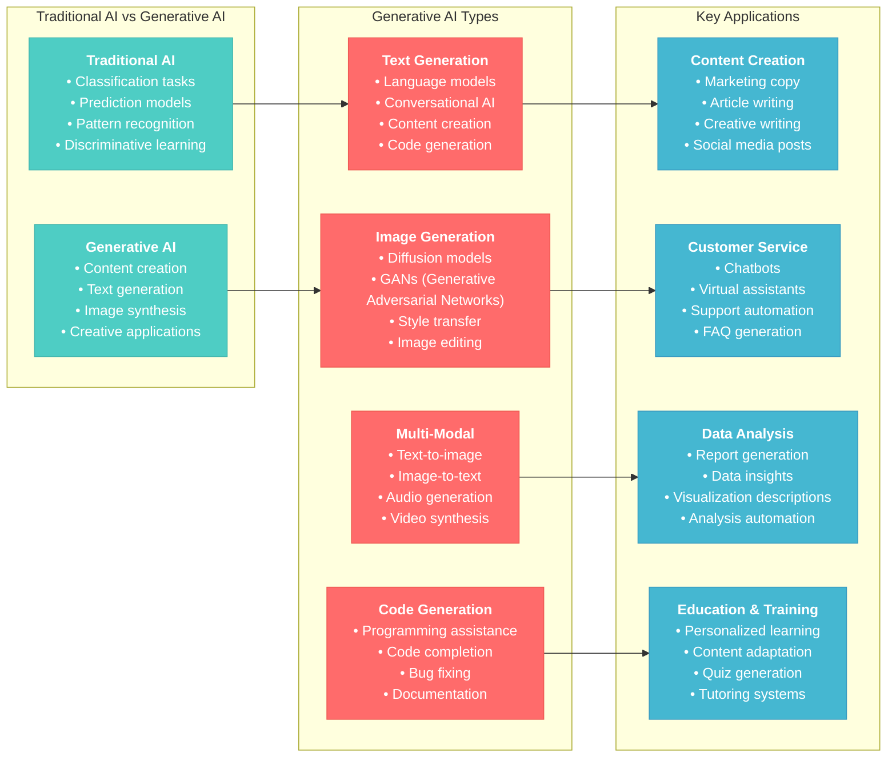
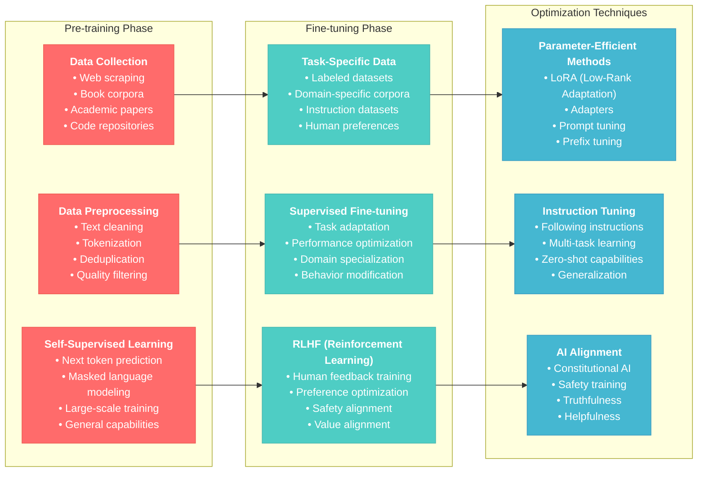
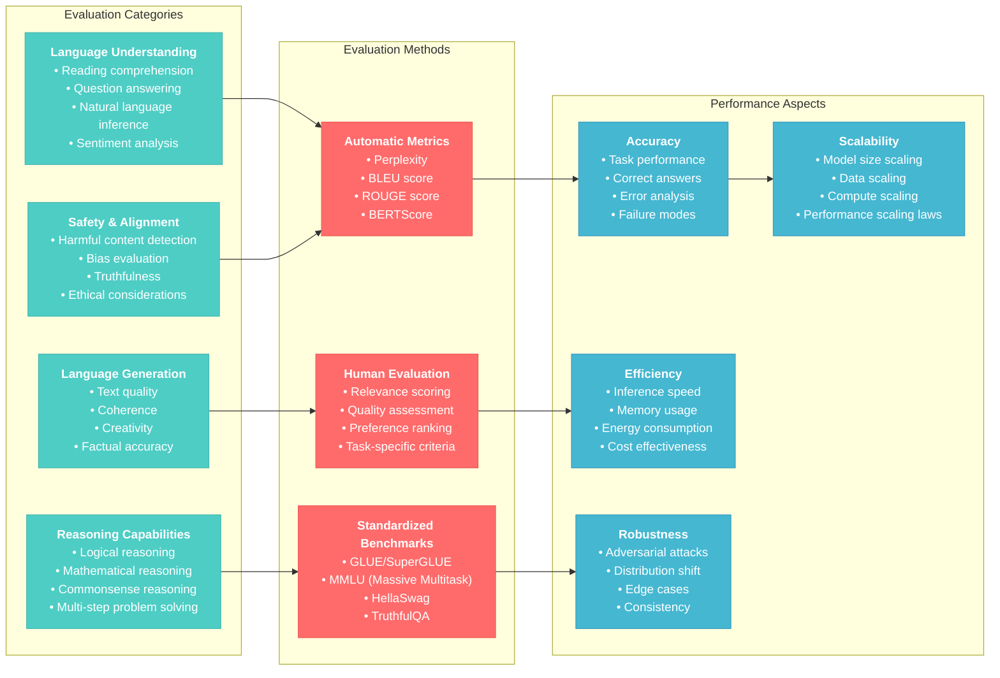

# Generative AI Fundamentals for AI Engineer Associate

## Overview
This section covers fundamental concepts of Generative AI, Large Language Models (LLMs), and the AI landscape essential for the Databricks Generative AI Engineer Associate certification. Focus on understanding core principles, model architectures, and the evolution of generative AI technologies.

## 1. Introduction to Generative AI

### 1.1 What is Generative AI?



### 1.2 Evolution of AI and Language Models

#### Timeline of AI Development
```python
# Historical development of AI and language models
ai_timeline = {
    "1950s-1960s": "Early AI concepts and rule-based systems",
    "1980s-1990s": "Expert systems and knowledge representation",
    "2000s": "Machine learning and statistical approaches",
    "2010s": "Deep learning revolution",
    "2017": "Transformer architecture (Attention is All You Need)",
    "2018-2019": "BERT, GPT-1, GPT-2 - breakthrough in NLP",
    "2020": "GPT-3 - large-scale language generation",
    "2021-2022": "ChatGPT, GPT-4 - mainstream adoption",
    "2023-2024": "Multimodal models, specialized applications",
    "2024-2025": "Enterprise AI, model optimization, responsible AI"
}

# Key breakthrough technologies
breakthrough_technologies = {
    "Transformer Architecture": {
        "year": 2017,
        "impact": "Revolutionized sequence-to-sequence learning",
        "key_innovation": "Self-attention mechanism",
        "applications": ["Machine translation", "Text summarization", "Question answering"]
    },
    "BERT (Bidirectional Encoder)": {
        "year": 2018,
        "impact": "Better understanding of context",
        "key_innovation": "Bidirectional training",
        "applications": ["Search", "Classification", "Named entity recognition"]
    },
    "GPT Series": {
        "year": "2018-2024",
        "impact": "Autoregressive text generation",
        "key_innovation": "Scale and few-shot learning",
        "applications": ["Content generation", "Conversational AI", "Code generation"]
    },
    "Diffusion Models": {
        "year": "2020-2022", 
        "impact": "High-quality image generation",
        "key_innovation": "Denoising process",
        "applications": ["Image generation", "Art creation", "Image editing"]
    }
}

print("AI Evolution Timeline:")
for year, development in ai_timeline.items():
    print(f"{year}: {development}")
```

### 1.3 Large Language Models (LLMs) Fundamentals

#### Understanding LLM Architecture
```python
# LLM characteristics and capabilities
llm_characteristics = {
    "Scale": {
        "parameters": "Billions to trillions of parameters",
        "training_data": "Massive text corpora (internet-scale)",
        "compute_requirements": "Thousands of GPUs/TPUs",
        "examples": ["GPT-4: ~1.7T parameters", "PaLM: 540B parameters"]
    },
    "Capabilities": {
        "text_generation": "Coherent, contextual text production",
        "few_shot_learning": "Learning from minimal examples",
        "in_context_learning": "Adapting behavior based on prompts",
        "transfer_learning": "Applying knowledge across domains"
    },
    "Limitations": {
        "hallucination": "Generation of false or inconsistent information",
        "knowledge_cutoff": "Training data has temporal limitations",
        "context_length": "Limited input/output sequence length",
        "computational_cost": "High inference and training costs"
    },
    "Training_Process": {
        "pre_training": "Self-supervised learning on large text corpus",
        "fine_tuning": "Task-specific optimization",
        "alignment": "Human feedback and preference learning",
        "evaluation": "Benchmarking and safety testing"
    }
}

# Model families and their specializations
model_families = {
    "GPT Family (OpenAI)": {
        "architecture": "Decoder-only transformer",
        "strengths": ["Text generation", "Conversational AI", "Code generation"],
        "use_cases": ["Content creation", "Programming assistance", "Customer service"]
    },
    "BERT Family (Google)": {
        "architecture": "Encoder-only transformer", 
        "strengths": ["Text understanding", "Classification", "Question answering"],
        "use_cases": ["Search", "Document analysis", "Information extraction"]
    },
    "T5 Family (Google)": {
        "architecture": "Encoder-decoder transformer",
        "strengths": ["Text-to-text tasks", "Translation", "Summarization"],
        "use_cases": ["Document processing", "Content transformation", "Multi-task learning"]
    },
    "LLaMA Family (Meta)": {
        "architecture": "Decoder-only transformer",
        "strengths": ["Efficient training", "Open research", "Customization"],
        "use_cases": ["Research applications", "Custom fine-tuning", "Resource-efficient deployment"]
    }
}

print("LLM Model Families:")
for family, details in model_families.items():
    print(f"\n{family}:")
    print(f"  Architecture: {details['architecture']}")
    print(f"  Strengths: {', '.join(details['strengths'])}")
    print(f"  Use Cases: {', '.join(details['use_cases'])}")
```

**Reference**: [Understanding Large Language Models](https://arxiv.org/abs/2307.06435)

## 2. Transformer Architecture Deep Dive

### 2.1 Transformer Components

```mermaid
flowchart LR
    subgraph "Transformer Architecture"
        Input["`**Input Processing**
        • Tokenization
        • Embedding layers
        • Positional encoding
        • Input representation`"]
        
        Attention["`**Self-Attention**
        • Query, Key, Value
        • Multi-head attention
        • Attention weights
        • Context understanding`"]
        
        FeedForward["`**Feed Forward**
        • Position-wise MLPs
        • Non-linear transformations
        • Feature processing
        • Representation learning`"]
        
        Output["`**Output Generation**
        • Layer normalization
        • Residual connections
        • Final projections
        • Token prediction`"]
    end
    
    subgraph "Attention Mechanism"
        SelfAttention["`**Self-Attention**
        • Within sequence attention
        • Context aggregation
        • Parallel processing
        • Long-range dependencies`"]
        
        MultiHead["`**Multi-Head Attention**
        • Multiple attention heads
        • Different representation spaces
        • Parallel attention computation
        • Enhanced expressiveness`"]
        
        CrossAttention["`**Cross-Attention**
        • Between sequence attention
        • Encoder-decoder interaction
        • Translation applications
        • Conditional generation`"]
    end
    
    subgraph "Training Objectives"
        Autoregressive["`**Autoregressive (GPT)**
        • Next token prediction
        • Left-to-right generation
        • Causal masking
        • Generation tasks`"]
        
        MaskedLM["`**Masked LM (BERT)**
        • Bidirectional context
        • Mask token prediction
        • Understanding tasks
        • Representation learning`"]
        
        Seq2Seq["`**Sequence-to-Sequence**
        • Input-output mapping
        • Encoder-decoder structure
        • Translation tasks
        • Conditional generation`"]
    end
    
    Input --> Attention
    Attention --> FeedForward
    FeedForward --> Output
    
    Attention --> SelfAttention
    SelfAttention --> MultiHead
    MultiHead --> CrossAttention
    
    Output --> Autoregressive
    Autoregressive --> MaskedLM
    MaskedLM --> Seq2Seq
    
    classDef architectureClass fill:#96ceb4,stroke:#85b894,color:#fff
    classDef attentionClass fill:#feca57,stroke:#ff9f43,color:#fff
    classDef trainingClass fill:#a55eea,stroke:#8854d0,color:#fff
    
    class Input,Attention,FeedForward,Output architectureClass
    class SelfAttention,MultiHead,CrossAttention attentionClass
    class Autoregressive,MaskedLM,Seq2Seq trainingClass
```



#### Understanding Attention Mechanisms
```python
import numpy as np
import torch
import torch.nn as nn
import torch.nn.functional as F

# Simplified attention mechanism implementation
class AttentionMechanism:
    """
    Educational implementation of attention mechanism
    """
    
    def __init__(self, d_model=512, num_heads=8):
        self.d_model = d_model
        self.num_heads = num_heads
        self.d_k = d_model // num_heads
        
    def scaled_dot_product_attention(self, Q, K, V, mask=None):
        """
        Compute scaled dot-product attention
        """
        # Calculate attention scores
        scores = torch.matmul(Q, K.transpose(-2, -1)) / np.sqrt(self.d_k)
        
        # Apply mask if provided (for causal attention)
        if mask is not None:
            scores = scores.masked_fill(mask == 0, -1e9)
        
        # Apply softmax to get attention weights
        attention_weights = F.softmax(scores, dim=-1)
        
        # Apply attention to values
        output = torch.matmul(attention_weights, V)
        
        return output, attention_weights
    
    def multi_head_attention(self, query, key, value, mask=None):
        """
        Multi-head attention implementation
        """
        batch_size = query.size(0)
        
        # Linear projections for Q, K, V
        Q = self.project_to_heads(query)  # (batch, num_heads, seq_len, d_k)
        K = self.project_to_heads(key)
        V = self.project_to_heads(value)
        
        # Apply attention
        attention_output, attention_weights = self.scaled_dot_product_attention(Q, K, V, mask)
        
        # Concatenate heads
        attention_output = attention_output.transpose(1, 2).contiguous().view(
            batch_size, -1, self.d_model
        )
        
        return attention_output, attention_weights
    
    def project_to_heads(self, x):
        """Project to multiple attention heads"""
        batch_size, seq_len, d_model = x.size()
        return x.view(batch_size, seq_len, self.num_heads, self.d_k).transpose(1, 2)

# Example usage and visualization
def demonstrate_attention():
    """
    Demonstrate attention mechanism with example
    """
    # Create example input
    batch_size, seq_len, d_model = 1, 10, 512
    input_sequence = torch.randn(batch_size, seq_len, d_model)
    
    # Initialize attention
    attention = AttentionMechanism(d_model=512, num_heads=8)
    
    # Compute attention
    output, weights = attention.multi_head_attention(
        query=input_sequence,
        key=input_sequence, 
        value=input_sequence
    )
    
    print(f"Input shape: {input_sequence.shape}")
    print(f"Output shape: {output.shape}")
    print(f"Attention weights shape: {weights.shape}")
    
    # Visualize attention patterns (simplified)
    attention_matrix = weights[0, 0].detach().numpy()  # First head, first batch
    print(f"Attention matrix for first head:\n{attention_matrix}")
    
    return output, weights

# Run demonstration
if __name__ == "__main__":
    output, weights = demonstrate_attention()
```

#### Positional Encoding
```python
import math

class PositionalEncoding:
    """
    Positional encoding for transformer models
    """
    
    def __init__(self, d_model, max_len=5000):
        self.d_model = d_model
        
        # Create positional encoding matrix
        pe = torch.zeros(max_len, d_model)
        position = torch.arange(0, max_len, dtype=torch.float).unsqueeze(1)
        
        # Calculate division term for sinusoidal encoding
        div_term = torch.exp(torch.arange(0, d_model, 2).float() * 
                           (-math.log(10000.0) / d_model))
        
        # Apply sinusoidal functions
        pe[:, 0::2] = torch.sin(position * div_term)  # Even indices
        pe[:, 1::2] = torch.cos(position * div_term)  # Odd indices
        
        self.pe = pe.unsqueeze(0).transpose(0, 1)
    
    def apply_positional_encoding(self, x):
        """
        Add positional encoding to input embeddings
        """
        seq_len = x.size(1)
        return x + self.pe[:seq_len, :].transpose(0, 1)

# Demonstrate positional encoding
def visualize_positional_encoding():
    """
    Visualize positional encoding patterns
    """
    d_model = 512
    max_len = 100
    
    pos_encoding = PositionalEncoding(d_model, max_len)
    
    # Create sample input
    batch_size, seq_len = 1, 50
    sample_embeddings = torch.randn(batch_size, seq_len, d_model)
    
    # Apply positional encoding
    encoded_input = pos_encoding.apply_positional_encoding(sample_embeddings)
    
    print(f"Original embeddings shape: {sample_embeddings.shape}")
    print(f"Encoded input shape: {encoded_input.shape}")
    
    # Show positional encoding values for first few positions
    pe_values = pos_encoding.pe[:10, 0, :10]  # First 10 positions, first 10 dimensions
    print(f"Positional encoding values (first 10 pos, first 10 dim):\n{pe_values}")
    
    return encoded_input

# Run positional encoding demonstration
encoded_input = visualize_positional_encoding()
```

**Reference**: [Attention Is All You Need](https://arxiv.org/abs/1706.03762)

## 3. Training and Fine-tuning Concepts

### 3.1 Training Phases



#### Training Process Implementation
```python
# Training concepts and implementation patterns

class LLMTrainingPipeline:
    """
    Educational implementation of LLM training concepts
    """
    
    def __init__(self, model_config):
        self.model_config = model_config
        self.training_phases = {}
        
    def pretraining_phase(self, dataset_config):
        """
        Pre-training phase configuration
        """
        pretraining_config = {
            "objective": "causal_language_modeling",  # Next token prediction
            "dataset_size": "100B+ tokens",
            "training_steps": "1M+ steps",
            "batch_size": "2M+ tokens per batch",
            "learning_rate": "1e-4 to 6e-4",
            "optimization": {
                "optimizer": "AdamW",
                "weight_decay": 0.1,
                "gradient_clipping": 1.0,
                "warmup_steps": "10K steps"
            },
            "data_processing": {
                "tokenization": "BPE/SentencePiece",
                "sequence_length": "2048 to 8192 tokens",
                "packing": "efficient sequence packing",
                "masking": "causal attention masks"
            }
        }
        
        self.training_phases["pretraining"] = pretraining_config
        return pretraining_config
    
    def fine_tuning_phase(self, task_config):
        """
        Fine-tuning phase configuration
        """
        fine_tuning_config = {
            "objective": task_config.get("objective", "instruction_following"),
            "dataset_size": "1K to 100K examples",
            "training_steps": "1K to 10K steps",
            "learning_rate": "1e-5 to 5e-5",  # Lower than pretraining
            "techniques": {
                "full_fine_tuning": {
                    "description": "Update all model parameters",
                    "memory_usage": "High",
                    "performance": "Best for large datasets"
                },
                "lora": {
                    "description": "Low-rank adaptation",
                    "memory_usage": "Low",
                    "parameters": "rank=16, alpha=32"
                },
                "prompt_tuning": {
                    "description": "Learn soft prompts",
                    "memory_usage": "Very low",
                    "parameters": "prompt_length=20-100"
                }
            }
        }
        
        self.training_phases["fine_tuning"] = fine_tuning_config
        return fine_tuning_config
    
    def rlhf_phase(self, preference_config):
        """
        Reinforcement Learning from Human Feedback
        """
        rlhf_config = {
            "stages": {
                "1_sft": {
                    "name": "Supervised Fine-Tuning",
                    "data": "High-quality instruction-response pairs",
                    "objective": "Imitation learning"
                },
                "2_reward_modeling": {
                    "name": "Reward Model Training",
                    "data": "Human preference comparisons",
                    "objective": "Learn human preferences"
                },
                "3_ppo": {
                    "name": "PPO Optimization",
                    "data": "Policy optimization with reward model",
                    "objective": "Maximize reward while maintaining capabilities"
                }
            },
            "hyperparameters": {
                "reward_model_lr": "9e-6",
                "ppo_lr": "1.4e-5",
                "ppo_epochs": 4,
                "kl_penalty": 0.2
            }
        }
        
        self.training_phases["rlhf"] = rlhf_config
        return rlhf_config

# Example training configuration
def create_training_example():
    """
    Create example training configuration
    """
    model_config = {
        "architecture": "decoder_only_transformer",
        "parameters": "7B",
        "layers": 32,
        "attention_heads": 32,
        "hidden_size": 4096
    }
    
    pipeline = LLMTrainingPipeline(model_config)
    
    # Configure pre-training
    pretraining = pipeline.pretraining_phase({
        "dataset": "web_text_corpus",
        "size": "100B tokens"
    })
    
    # Configure fine-tuning
    fine_tuning = pipeline.fine_tuning_phase({
        "objective": "instruction_following",
        "dataset": "alpaca_instructions"
    })
    
    # Configure RLHF
    rlhf = pipeline.rlhf_phase({
        "preference_dataset": "human_feedback_comparisons"
    })
    
    print("Training Pipeline Configuration:")
    print(f"Pre-training: {pretraining['objective']}")
    print(f"Fine-tuning: {fine_tuning['objective']}")
    print(f"RLHF stages: {len(rlhf['stages'])}")
    
    return pipeline

# Create example
training_pipeline = create_training_example()
```

#### Parameter-Efficient Fine-tuning (PEFT)
```python
# LoRA (Low-Rank Adaptation) implementation concept

class LoRALayer:
    """
    Educational implementation of LoRA concept
    """
    
    def __init__(self, original_weight, rank=16, alpha=32):
        """
        Initialize LoRA adaptation layer
        
        Args:
            original_weight: Original model weight matrix
            rank: Low-rank dimension
            alpha: Scaling parameter
        """
        self.original_weight = original_weight
        self.rank = rank
        self.alpha = alpha
        
        # LoRA parameters (much smaller than original)
        d_in, d_out = original_weight.shape
        self.lora_A = torch.randn(rank, d_in) * 0.01  # Down-projection
        self.lora_B = torch.zeros(d_out, rank)         # Up-projection
        
        self.scaling = alpha / rank
        
    def forward(self, x):
        """
        Forward pass with LoRA adaptation
        """
        # Original transformation
        original_output = torch.matmul(x, self.original_weight.T)
        
        # LoRA adaptation
        lora_output = torch.matmul(
            torch.matmul(x, self.lora_A.T), 
            self.lora_B.T
        ) * self.scaling
        
        return original_output + lora_output
    
    def get_parameter_count(self):
        """
        Compare parameter counts
        """
        original_params = self.original_weight.numel()
        lora_params = self.lora_A.numel() + self.lora_B.numel()
        
        return {
            "original_parameters": original_params,
            "lora_parameters": lora_params,
            "reduction_ratio": original_params / lora_params,
            "trainable_ratio": lora_params / original_params
        }

# Demonstrate PEFT efficiency
def demonstrate_peft_efficiency():
    """
    Demonstrate parameter efficiency of LoRA
    """
    # Simulate large model layer
    d_model = 4096
    original_weight = torch.randn(d_model, d_model)
    
    # Create LoRA layer
    lora_layer = LoRALayer(original_weight, rank=16, alpha=32)
    
    # Calculate efficiency
    efficiency = lora_layer.get_parameter_count()
    
    print("Parameter Efficiency Analysis:")
    print(f"Original parameters: {efficiency['original_parameters']:,}")
    print(f"LoRA parameters: {efficiency['lora_parameters']:,}")
    print(f"Reduction ratio: {efficiency['reduction_ratio']:.1f}x")
    print(f"Trainable ratio: {efficiency['trainable_ratio']:.1%}")
    
    # Test forward pass
    batch_size, seq_len = 4, 512
    input_tensor = torch.randn(batch_size, seq_len, d_model)
    output = lora_layer.forward(input_tensor)
    
    print(f"\nForward pass test:")
    print(f"Input shape: {input_tensor.shape}")
    print(f"Output shape: {output.shape}")
    
    return efficiency

# Run PEFT demonstration
peft_efficiency = demonstrate_peft_efficiency()
```

**Reference**: [LoRA: Low-Rank Adaptation](https://arxiv.org/abs/2106.09685)

## 4. Evaluation and Performance Metrics

### 4.1 LLM Evaluation Framework



#### Evaluation Implementation
```python
import numpy as np
from collections import Counter
import re

class LLMEvaluator:
    """
    Comprehensive LLM evaluation framework
    """
    
    def __init__(self):
        self.evaluation_results = {}
        
    def calculate_perplexity(self, model_logits, target_tokens):
        """
        Calculate perplexity - measure of how well model predicts text
        Lower perplexity = better language modeling
        """
        # Simplified perplexity calculation
        log_probs = torch.log_softmax(model_logits, dim=-1)
        target_log_probs = log_probs.gather(-1, target_tokens.unsqueeze(-1)).squeeze(-1)
        avg_log_prob = target_log_probs.mean()
        perplexity = torch.exp(-avg_log_prob)
        
        return perplexity.item()
    
    def calculate_bleu_score(self, predicted_text, reference_texts, n=4):
        """
        Calculate BLEU score for text generation quality
        Measures n-gram overlap between prediction and references
        """
        def get_ngrams(text, n):
            words = text.lower().split()
            return [tuple(words[i:i+n]) for i in range(len(words)-n+1)]
        
        predicted_ngrams = get_ngrams(predicted_text, n)
        
        bleu_scores = []
        for ref_text in reference_texts:
            ref_ngrams = get_ngrams(ref_text, n)
            
            # Count matches
            pred_counter = Counter(predicted_ngrams)
            ref_counter = Counter(ref_ngrams)
            
            matches = sum(min(pred_counter[ngram], ref_counter[ngram]) 
                         for ngram in pred_counter)
            
            if len(predicted_ngrams) > 0:
                precision = matches / len(predicted_ngrams)
                bleu_scores.append(precision)
            else:
                bleu_scores.append(0.0)
        
        return max(bleu_scores) if bleu_scores else 0.0
    
    def evaluate_factual_accuracy(self, generated_text, knowledge_base):
        """
        Evaluate factual accuracy of generated content
        """
        # Extract claims from generated text
        claims = self.extract_factual_claims(generated_text)
        
        accuracy_scores = []
        for claim in claims:
            is_accurate = self.verify_claim_accuracy(claim, knowledge_base)
            accuracy_scores.append(is_accurate)
        
        if accuracy_scores:
            factual_accuracy = sum(accuracy_scores) / len(accuracy_scores)
        else:
            factual_accuracy = 0.0
        
        return {
            "factual_accuracy": factual_accuracy,
            "total_claims": len(claims),
            "accurate_claims": sum(accuracy_scores)
        }
    
    def extract_factual_claims(self, text):
        """
        Extract factual claims from text (simplified)
        """
        # Simple approach: sentences with factual indicators
        sentences = re.split(r'[.!?]+', text)
        
        factual_indicators = [
            'is', 'was', 'are', 'were', 'has', 'have', 'had',
            'founded', 'created', 'born', 'died', 'located'
        ]
        
        claims = []
        for sentence in sentences:
            sentence = sentence.strip()
            if any(indicator in sentence.lower() for indicator in factual_indicators):
                claims.append(sentence)
        
        return claims
    
    def verify_claim_accuracy(self, claim, knowledge_base):
        """
        Verify claim against knowledge base (simplified)
        """
        # In practice, this would use sophisticated fact-checking
        # Here we simulate with keyword matching
        claim_words = set(claim.lower().split())
        
        for fact in knowledge_base:
            fact_words = set(fact.lower().split())
            if len(claim_words.intersection(fact_words)) >= 3:
                return True
        
        return False
    
    def evaluate_coherence(self, text):
        """
        Evaluate text coherence using linguistic features
        """
        sentences = re.split(r'[.!?]+', text)
        sentences = [s.strip() for s in sentences if s.strip()]
        
        if len(sentences) < 2:
            return {"coherence_score": 1.0, "analysis": "Single sentence"}
        
        # Simplified coherence metrics
        metrics = {
            "sentence_length_variance": self.calculate_sentence_length_variance(sentences),
            "lexical_diversity": self.calculate_lexical_diversity(text),
            "transition_quality": self.calculate_transition_quality(sentences)
        }
        
        # Combine metrics into overall coherence score
        coherence_score = (
            (1.0 - min(metrics["sentence_length_variance"] / 100, 1.0)) * 0.3 +
            metrics["lexical_diversity"] * 0.4 +
            metrics["transition_quality"] * 0.3
        )
        
        return {
            "coherence_score": coherence_score,
            "metrics": metrics
        }
    
    def calculate_sentence_length_variance(self, sentences):
        """Calculate variance in sentence lengths"""
        lengths = [len(s.split()) for s in sentences]
        return np.var(lengths)
    
    def calculate_lexical_diversity(self, text):
        """Calculate lexical diversity (TTR - Type-Token Ratio)"""
        words = text.lower().split()
        unique_words = set(words)
        
        if len(words) == 0:
            return 0.0
        
        return len(unique_words) / len(words)
    
    def calculate_transition_quality(self, sentences):
        """Evaluate transition quality between sentences"""
        if len(sentences) < 2:
            return 1.0
        
        transition_words = [
            'however', 'therefore', 'moreover', 'furthermore', 'additionally',
            'consequently', 'nevertheless', 'meanwhile', 'similarly', 'likewise'
        ]
        
        transitions_found = 0
        for sentence in sentences[1:]:  # Skip first sentence
            if any(word in sentence.lower() for word in transition_words):
                transitions_found += 1
        
        return transitions_found / (len(sentences) - 1)
    
    def comprehensive_evaluation(self, model_output, evaluation_config):
        """
        Run comprehensive evaluation suite
        """
        results = {}
        
        # Language modeling evaluation
        if "perplexity" in evaluation_config:
            results["perplexity"] = self.calculate_perplexity(
                evaluation_config["model_logits"],
                evaluation_config["target_tokens"]
            )
        
        # Generation quality evaluation
        if "bleu_score" in evaluation_config:
            results["bleu_score"] = self.calculate_bleu_score(
                model_output,
                evaluation_config["reference_texts"]
            )
        
        # Factual accuracy evaluation
        if "factual_accuracy" in evaluation_config:
            results["factual_accuracy"] = self.evaluate_factual_accuracy(
                model_output,
                evaluation_config["knowledge_base"]
            )
        
        # Coherence evaluation
        results["coherence"] = self.evaluate_coherence(model_output)
        
        return results

# Example evaluation usage
def run_evaluation_example():
    """
    Demonstrate comprehensive LLM evaluation
    """
    evaluator = LLMEvaluator()
    
    # Sample model output
    model_output = """
    Artificial intelligence has revolutionized many industries. Machine learning algorithms 
    can process vast amounts of data efficiently. However, there are still challenges in 
    ensuring AI safety and alignment. Therefore, continued research is essential for 
    responsible AI development.
    """
    
    # Sample evaluation configuration
    evaluation_config = {
        "bleu_score": True,
        "reference_texts": [
            "AI has transformed industries through machine learning and data processing capabilities.",
            "Artificial intelligence revolutionizes industries but faces safety challenges requiring research."
        ],
        "factual_accuracy": True,
        "knowledge_base": [
            "artificial intelligence revolutionized industries through machine learning",
            "machine learning algorithms process large datasets efficiently",
            "AI safety research is important for responsible development"
        ]
    }
    
    # Run evaluation
    results = evaluator.comprehensive_evaluation(model_output, evaluation_config)
    
    print("Evaluation Results:")
    print(f"BLEU Score: {results['bleu_score']:.3f}")
    print(f"Factual Accuracy: {results['factual_accuracy']['factual_accuracy']:.3f}")
    print(f"Coherence Score: {results['coherence']['coherence_score']:.3f}")
    print(f"Lexical Diversity: {results['coherence']['metrics']['lexical_diversity']:.3f}")
    
    return results

# Run evaluation example
evaluation_results = run_evaluation_example()
```

**Reference**: [Holistic Evaluation of Language Models](https://arxiv.org/abs/2211.09110)

## 5. Ethical Considerations and Responsible AI

### 5.1 AI Safety and Alignment

#### Bias and Fairness
```python
class BiasEvaluator:
    """
    Tools for evaluating bias in language models
    """
    
    def __init__(self):
        self.bias_categories = [
            "gender", "race", "religion", "age", "socioeconomic", "geographic"
        ]
    
    def evaluate_demographic_bias(self, model_responses, demographic_groups):
        """
        Evaluate bias across demographic groups
        """
        bias_results = {}
        
        for group in demographic_groups:
            sentiment_scores = []
            for response in model_responses[group]:
                sentiment = self.analyze_sentiment(response)
                sentiment_scores.append(sentiment)
            
            bias_results[group] = {
                "avg_sentiment": np.mean(sentiment_scores),
                "sentiment_variance": np.var(sentiment_scores),
                "response_count": len(sentiment_scores)
            }
        
        # Calculate bias metrics
        sentiments = [results["avg_sentiment"] for results in bias_results.values()]
        bias_magnitude = max(sentiments) - min(sentiments)
        
        return {
            "group_results": bias_results,
            "bias_magnitude": bias_magnitude,
            "fairness_score": 1.0 - min(bias_magnitude, 1.0)
        }
    
    def analyze_sentiment(self, text):
        """
        Simple sentiment analysis (placeholder)
        """
        positive_words = ["good", "great", "excellent", "amazing", "wonderful"]
        negative_words = ["bad", "terrible", "awful", "horrible", "poor"]
        
        words = text.lower().split()
        positive_count = sum(1 for word in words if word in positive_words)
        negative_count = sum(1 for word in words if word in negative_words)
        
        if positive_count + negative_count == 0:
            return 0.0
        
        return (positive_count - negative_count) / (positive_count + negative_count)

# Responsible AI guidelines
responsible_ai_principles = {
    "Fairness": {
        "description": "AI systems should treat all individuals and groups fairly",
        "implementation": [
            "Diverse training data",
            "Bias testing and mitigation",
            "Inclusive design processes",
            "Regular auditing"
        ]
    },
    "Transparency": {
        "description": "AI systems should be interpretable and explainable",
        "implementation": [
            "Model documentation",
            "Decision explanations",
            "Clear limitations disclosure",
            "Open research practices"
        ]
    },
    "Privacy": {
        "description": "AI systems should protect individual privacy",
        "implementation": [
            "Data minimization",
            "Differential privacy",
            "Secure computation",
            "User consent"
        ]
    },
    "Safety": {
        "description": "AI systems should be safe and reliable",
        "implementation": [
            "Robust testing",
            "Failure mode analysis",
            "Safety controls",
            "Human oversight"
        ]
    },
    "Accountability": {
        "description": "Clear responsibility for AI system outcomes",
        "implementation": [
            "Clear governance",
            "Audit trails",
            "Human oversight",
            "Remediation processes"
        ]
    }
}

print("Responsible AI Principles:")
for principle, details in responsible_ai_principles.items():
    print(f"\n{principle}: {details['description']}")
    print("Implementation strategies:")
    for strategy in details['implementation']:
        print(f"  • {strategy}")
```

## 6. Best Practices Summary

### 6.1 Generative AI Development Best Practices
1. **Model Selection**: Choose appropriate model size and architecture for task
2. **Data Quality**: Ensure high-quality, diverse training data
3. **Evaluation**: Implement comprehensive evaluation frameworks
4. **Safety**: Build in safety measures and alignment techniques
5. **Efficiency**: Optimize for computational and memory efficiency

### 6.2 Responsible Development
1. **Bias Mitigation**: Actively identify and address biases
2. **Transparency**: Document capabilities and limitations
3. **Human Oversight**: Maintain meaningful human control
4. **Privacy Protection**: Implement privacy-preserving techniques
5. **Continuous Monitoring**: Ongoing evaluation and improvement

### 6.3 Technical Implementation
1. **Architecture Understanding**: Master transformer components
2. **Training Techniques**: Understand pre-training, fine-tuning, and RLHF
3. **Parameter Efficiency**: Use PEFT methods for cost-effective adaptation
4. **Evaluation Metrics**: Implement appropriate evaluation frameworks
5. **Performance Optimization**: Balance quality, speed, and cost

## Conclusion

Understanding generative AI fundamentals is crucial for building effective AI applications. Master the core concepts of transformer architecture, training methodologies, evaluation techniques, and responsible AI practices to develop robust and ethical AI systems.

Focus on practical implementation while maintaining awareness of ethical considerations and safety requirements in all AI development workflows.
