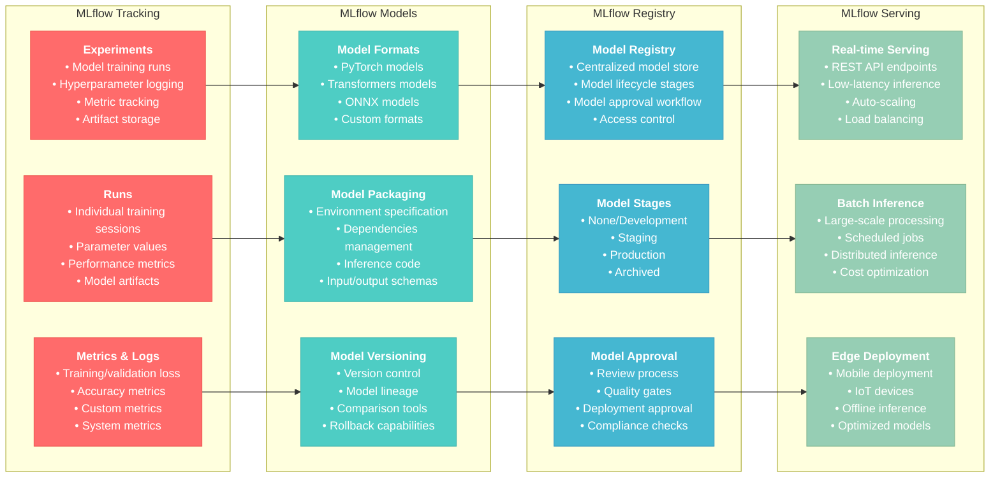
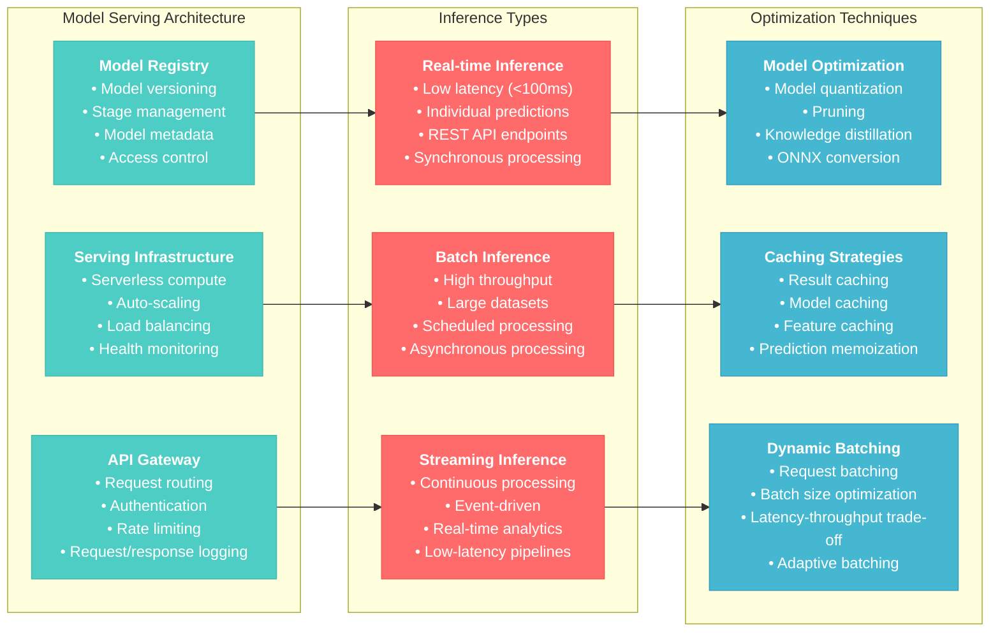
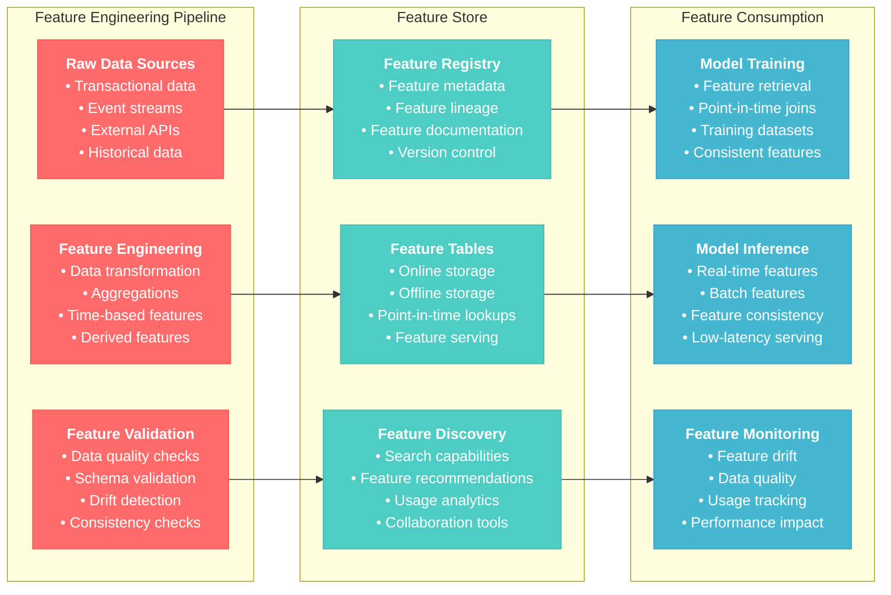

# Databricks for AI Applications

## Overview
This section covers how to leverage Databricks platform capabilities specifically for AI and machine learning applications, focusing on MLflow, model serving, feature engineering, and AI-specific workflows essential for the Databricks Generative AI Engineer Associate certification.

## 1. Databricks AI Platform Architecture

### 1.1 Databricks AI Stack

```mermaid
flowchart LR
    subgraph "Data Layer"
        DataSources["`**Data Sources**
        • Structured data (tables)
        • Unstructured data (text, images)
        • Streaming data
        • External APIs`"]
        
        DeltaLake["`**Delta Lake**
        • ACID transactions
        • Schema evolution
        • Time travel
        • Optimized storage`"]
        
        FeatureStore["`**Feature Store**
        • Feature discovery
        • Feature sharing
        • Feature lineage
        • Feature serving`"]
    end
    
    subgraph "Compute Layer"
        Clusters["`**Compute Clusters**
        • CPU clusters
        • GPU clusters (ML/AI workloads)
        • Serverless compute
        • Auto-scaling`"]
        
        SparkML["`**Spark ML**
        • Distributed ML algorithms
        • Feature engineering
        • Data preprocessing
        • Model training`"]
        
        MLRuntime["`**ML Runtime**
        • Pre-installed ML libraries
        • GPU optimization
        • Deep learning frameworks
        • Optimized performance`"]
    end
    
    subgraph "ML Platform"
        MLflow["`**MLflow**
        • Experiment tracking
        • Model registry
        • Model deployment
        • Lifecycle management`"]
        
        AutoML["`**AutoML**
        • Automated feature engineering
        • Model selection
        • Hyperparameter tuning
        • No-code ML`"]
        
        ModelServing["`**Model Serving**
        • Real-time inference
        • Batch inference
        • Model endpoints
        • Serverless serving`"]
        
        Monitoring["`**Model Monitoring**
        • Performance tracking
        • Data drift detection
        • Model quality metrics
        • Alerts and notifications`"]
    end
    
    subgraph "AI Applications"
        GenAI["`**Generative AI**
        • LLM fine-tuning
        • Prompt engineering
        • RAG applications
        • Custom AI models`"]
        
        Computer Vision["`**Computer Vision**
        • Image classification
        • Object detection
        • Image generation
        • Visual AI`"]
        
        NLP["`**Natural Language Processing**
        • Text classification
        • Sentiment analysis
        • Named entity recognition
        • Language translation`"]
    end
    
    DataSources --> Clusters
    DeltaLake --> SparkML
    FeatureStore --> MLRuntime
    
    Clusters --> MLflow
    SparkML --> AutoML
    MLRuntime --> ModelServing
    
    MLflow --> GenAI
    AutoML --> ComputerVision
    ModelServing --> NLP
    Monitoring --> GenAI
    
    classDef dataClass fill:#4ecdc4,stroke:#45b7af,color:#fff
    classDef computeClass fill:#ff6b6b,stroke:#ee5a52,color:#fff
    classDef mlClass fill:#45b7d1,stroke:#3a9bc1,color:#fff
    classDef aiClass fill:#96ceb4,stroke:#85b894,color:#fff
    
    class DataSources,DeltaLake,FeatureStore dataClass
    class Clusters,SparkML,MLRuntime computeClass
    class MLflow,AutoML,ModelServing,Monitoring mlClass
    class GenAI,ComputerVision,NLP aiClass
```

### 1.2 GPU Clusters for AI Workloads

#### GPU Cluster Configuration
```python
# GPU cluster configuration for AI workloads
gpu_cluster_config = {
    "cluster_name": "ai-gpu-cluster",
    "spark_version": "13.3.x-gpu-ml-scala2.12",
    "node_type_id": "g5.xlarge",  # AWS GPU instance
    "driver_node_type_id": "i3.xlarge",
    "num_workers": 2,
    "autoscale": {
        "min_workers": 1,
        "max_workers": 8
    },
    "spark_conf": {
        "spark.rapids.sql.enabled": "true",
        "spark.sql.adaptive.enabled": "true",
        "spark.sql.adaptive.localShuffleReader.enabled": "true",
        "spark.databricks.cluster.profile": "ml"
    },
    "custom_tags": {
        "team": "ai-engineering",
        "project": "generative-ai",
        "environment": "development"
    },
    "init_scripts": [
        {
            "dbfs": {
                "destination": "dbfs:/databricks/init-scripts/gpu-setup.sh"
            }
        }
    ]
}

# Example GPU setup script
gpu_setup_script = """
#!/bin/bash

# Install additional GPU libraries
pip install transformers[torch]
pip install accelerate
pip install bitsandbytes
pip install datasets

# Configure CUDA environment
export CUDA_VISIBLE_DEVICES=0

# Set memory optimization
export PYTORCH_CUDA_ALLOC_CONF=max_split_size_mb:128
"""

print("GPU Cluster Configuration:")
print(f"Spark Version: {gpu_cluster_config['spark_version']}")
print(f"Node Type: {gpu_cluster_config['node_type_id']}")
print(f"Auto-scaling: {gpu_cluster_config['autoscale']['min_workers']}-{gpu_cluster_config['autoscale']['max_workers']} workers")
```

#### GPU Memory Management
```python
import torch
import gc

class GPUMemoryManager:
    """
    Utility class for managing GPU memory in Databricks
    """
    
    def __init__(self):
        self.device = torch.device("cuda" if torch.cuda.is_available() else "cpu")
        
    def check_gpu_availability(self):
        """
        Check GPU availability and memory
        """
        if not torch.cuda.is_available():
            return {"gpu_available": False, "message": "No GPU available"}
        
        gpu_info = {
            "gpu_available": True,
            "device_count": torch.cuda.device_count(),
            "current_device": torch.cuda.current_device(),
            "device_name": torch.cuda.get_device_name(),
            "memory_allocated": torch.cuda.memory_allocated() / 1024**3,  # GB
            "memory_reserved": torch.cuda.memory_reserved() / 1024**3,     # GB
            "memory_total": torch.cuda.get_device_properties(0).total_memory / 1024**3  # GB
        }
        
        return gpu_info
    
    def clear_gpu_memory(self):
        """
        Clear GPU memory cache
        """
        if torch.cuda.is_available():
            torch.cuda.empty_cache()
            gc.collect()
            print("GPU memory cache cleared")
        else:
            print("No GPU available")
    
    def monitor_memory_usage(self, operation_name):
        """
        Context manager for monitoring memory usage
        """
        class MemoryMonitor:
            def __init__(self, manager, name):
                self.manager = manager
                self.name = name
                self.start_memory = 0
                
            def __enter__(self):
                if torch.cuda.is_available():
                    torch.cuda.synchronize()
                    self.start_memory = torch.cuda.memory_allocated()
                return self
                
            def __exit__(self, exc_type, exc_val, exc_tb):
                if torch.cuda.is_available():
                    torch.cuda.synchronize()
                    end_memory = torch.cuda.memory_allocated()
                    memory_used = (end_memory - self.start_memory) / 1024**3
                    print(f"{self.name} used {memory_used:.2f} GB GPU memory")
        
        return MemoryMonitor(self, operation_name)

# Example usage
gpu_manager = GPUMemoryManager()
gpu_info = gpu_manager.check_gpu_availability()
print("GPU Information:")
for key, value in gpu_info.items():
    print(f"  {key}: {value}")
```

**Reference**: [Databricks GPU Clusters](https://docs.databricks.com/compute/gpu.html)

## 2. MLflow for AI Model Management

### 2.1 MLflow Components for AI



#### MLflow Experiment Tracking
```python
import mlflow
import mlflow.pytorch
import torch
import torch.nn as nn
from transformers import AutoTokenizer, AutoModel
import numpy as np

# Set up MLflow experiment
mlflow.set_experiment("generative-ai-experiments")

class TextClassifier(nn.Module):
    """
    Simple text classifier using pre-trained transformer
    """
    def __init__(self, model_name, num_classes):
        super().__init__()
        self.bert = AutoModel.from_pretrained(model_name)
        self.dropout = nn.Dropout(0.1)
        self.classifier = nn.Linear(self.bert.config.hidden_size, num_classes)
        
    def forward(self, input_ids, attention_mask):
        outputs = self.bert(input_ids=input_ids, attention_mask=attention_mask)
        pooled_output = outputs.pooler_output
        pooled_output = self.dropout(pooled_output)
        logits = self.classifier(pooled_output)
        return logits

def train_model_with_mlflow():
    """
    Train model with comprehensive MLflow tracking
    """
    # Start MLflow run
    with mlflow.start_run() as run:
        # Log hyperparameters
        hyperparams = {
            "model_name": "bert-base-uncased",
            "num_classes": 3,
            "learning_rate": 2e-5,
            "batch_size": 16,
            "epochs": 3,
            "max_length": 128
        }
        
        mlflow.log_params(hyperparams)
        
        # Initialize model
        model = TextClassifier(hyperparams["model_name"], hyperparams["num_classes"])
        tokenizer = AutoTokenizer.from_pretrained(hyperparams["model_name"])
        
        # Log model info
        mlflow.log_param("total_parameters", sum(p.numel() for p in model.parameters()))
        mlflow.log_param("trainable_parameters", sum(p.numel() for p in model.parameters() if p.requires_grad))
        
        # Simulate training loop
        optimizer = torch.optim.AdamW(model.parameters(), lr=hyperparams["learning_rate"])
        criterion = nn.CrossEntropyLoss()
        
        for epoch in range(hyperparams["epochs"]):
            # Simulate training step
            train_loss = simulate_training_step(model, optimizer, criterion)
            val_loss, val_accuracy = simulate_validation_step(model, criterion)
            
            # Log metrics
            mlflow.log_metrics({
                "train_loss": train_loss,
                "val_loss": val_loss,
                "val_accuracy": val_accuracy,
                "epoch": epoch
            }, step=epoch)
            
            print(f"Epoch {epoch+1}: Train Loss: {train_loss:.4f}, Val Loss: {val_loss:.4f}, Val Acc: {val_accuracy:.4f}")
        
        # Log final model
        mlflow.pytorch.log_model(
            pytorch_model=model,
            artifact_path="model",
            registered_model_name="text-classifier-bert",
            input_example=torch.randint(0, 1000, (1, 128)),  # Example input
            signature=mlflow.models.infer_signature(
                torch.randint(0, 1000, (2, 128)),
                torch.randn(2, 3)
            )
        )
        
        # Log additional artifacts
        mlflow.log_artifact("model_config.json")
        mlflow.log_text(str(hyperparams), "hyperparameters.txt")
        
        # Log model summary
        model_summary = {
            "architecture": "BERT-based classifier",
            "base_model": hyperparams["model_name"],
            "task": "text classification",
            "performance": {
                "final_val_accuracy": val_accuracy,
                "final_val_loss": val_loss
            }
        }
        
        mlflow.log_dict(model_summary, "model_summary.json")
        
        return run.info.run_id

def simulate_training_step(model, optimizer, criterion):
    """Simulate training step"""
    model.train()
    # Simulate batch processing
    fake_input_ids = torch.randint(0, 1000, (16, 128))
    fake_attention_mask = torch.ones(16, 128)
    fake_labels = torch.randint(0, 3, (16,))
    
    optimizer.zero_grad()
    outputs = model(fake_input_ids, fake_attention_mask)
    loss = criterion(outputs, fake_labels)
    loss.backward()
    optimizer.step()
    
    return loss.item()

def simulate_validation_step(model, criterion):
    """Simulate validation step"""
    model.eval()
    with torch.no_grad():
        fake_input_ids = torch.randint(0, 1000, (8, 128))
        fake_attention_mask = torch.ones(8, 128)
        fake_labels = torch.randint(0, 3, (8,))
        
        outputs = model(fake_input_ids, fake_attention_mask)
        loss = criterion(outputs, fake_labels)
        
        # Calculate accuracy
        predictions = torch.argmax(outputs, dim=1)
        accuracy = (predictions == fake_labels).float().mean().item()
        
    return loss.item(), accuracy

# Run training with MLflow tracking
run_id = train_model_with_mlflow()
print(f"MLflow run completed: {run_id}")
```

#### Model Registry Management
```python
from mlflow.tracking import MlflowClient

class ModelRegistryManager:
    """
    Manage models in MLflow Model Registry
    """
    
    def __init__(self):
        self.client = MlflowClient()
        
    def register_model(self, run_id, model_name, description=None):
        """
        Register model from run to Model Registry
        """
        model_uri = f"runs:/{run_id}/model"
        
        model_version = mlflow.register_model(
            model_uri=model_uri,
            name=model_name,
            description=description
        )
        
        print(f"Model {model_name} version {model_version.version} registered")
        return model_version
    
    def transition_model_stage(self, model_name, version, stage, description=None):
        """
        Transition model to different stage
        """
        self.client.transition_model_version_stage(
            name=model_name,
            version=version,
            stage=stage,
            archive_existing_versions=False,
            description=description
        )
        
        print(f"Model {model_name} v{version} transitioned to {stage}")
    
    def get_latest_model_version(self, model_name, stage=None):
        """
        Get latest model version for given stage
        """
        if stage:
            versions = self.client.get_latest_versions(model_name, stages=[stage])
        else:
            versions = self.client.search_model_versions(f"name='{model_name}'")
            versions = sorted(versions, key=lambda x: int(x.version), reverse=True)
        
        if versions:
            return versions[0]
        return None
    
    def compare_model_versions(self, model_name, version1, version2):
        """
        Compare two model versions
        """
        v1 = self.client.get_model_version(model_name, version1)
        v2 = self.client.get_model_version(model_name, version2)
        
        comparison = {
            "version_1": {
                "version": v1.version,
                "stage": v1.current_stage,
                "run_id": v1.run_id,
                "creation_timestamp": v1.creation_timestamp
            },
            "version_2": {
                "version": v2.version,
                "stage": v2.current_stage,
                "run_id": v2.run_id,
                "creation_timestamp": v2.creation_timestamp
            }
        }
        
        # Get metrics for comparison
        run1_metrics = self.client.get_run(v1.run_id).data.metrics
        run2_metrics = self.client.get_run(v2.run_id).data.metrics
        
        comparison["metrics_comparison"] = {
            "version_1_metrics": run1_metrics,
            "version_2_metrics": run2_metrics
        }
        
        return comparison
    
    def archive_old_versions(self, model_name, keep_versions=3):
        """
        Archive old model versions, keeping only the latest N versions
        """
        versions = self.client.search_model_versions(f"name='{model_name}'")
        versions = sorted(versions, key=lambda x: int(x.version), reverse=True)
        
        versions_to_archive = versions[keep_versions:]
        
        for version in versions_to_archive:
            if version.current_stage not in ["Production", "Staging"]:
                self.transition_model_stage(
                    model_name, 
                    version.version, 
                    "Archived",
                    f"Auto-archived old version"
                )
                print(f"Archived version {version.version}")

# Example usage
registry_manager = ModelRegistryManager()

# Register model from recent run
# model_version = registry_manager.register_model(
#     run_id=run_id,
#     model_name="text-classifier-bert",
#     description="BERT-based text classifier for sentiment analysis"
# )

# Model lifecycle management
def manage_model_lifecycle():
    """
    Demonstrate model lifecycle management
    """
    model_name = "text-classifier-bert"
    
    # Get latest version
    latest_version = registry_manager.get_latest_model_version(model_name)
    if latest_version:
        print(f"Latest version: {latest_version.version}, Stage: {latest_version.current_stage}")
        
        # Promote to staging
        registry_manager.transition_model_stage(
            model_name,
            latest_version.version,
            "Staging",
            "Ready for staging evaluation"
        )
        
        # After validation, promote to production
        registry_manager.transition_model_stage(
            model_name,
            latest_version.version,
            "Production",
            "Validated and ready for production"
        )
    
    # Archive old versions
    registry_manager.archive_old_versions(model_name, keep_versions=3)

# Run lifecycle management
manage_model_lifecycle()
```

**Reference**: [MLflow Model Registry](https://mlflow.org/docs/latest/model-registry.html)

## 3. Model Serving and Inference

### 3.1 Real-time Model Serving



#### Model Endpoint Deployment
```python
import mlflow
import requests
import json
import time
from typing import Dict, List, Any

class ModelServingManager:
    """
    Manage model serving endpoints in Databricks
    """
    
    def __init__(self, workspace_url, token):
        self.workspace_url = workspace_url.rstrip('/')
        self.token = token
        self.headers = {
            'Authorization': f'Bearer {token}',
            'Content-Type': 'application/json'
        }
    
    def create_endpoint(self, endpoint_config):
        """
        Create model serving endpoint
        """
        endpoint_url = f"{self.workspace_url}/api/2.0/serving-endpoints"
        
        payload = {
            "name": endpoint_config["name"],
            "config": {
                "served_models": [{
                    "name": endpoint_config["model_name"],
                    "model_name": endpoint_config["model_name"],
                    "model_version": endpoint_config["model_version"],
                    "workload_size": endpoint_config.get("workload_size", "Small"),
                    "scale_to_zero_enabled": endpoint_config.get("scale_to_zero", True)
                }]
            }
        }
        
        response = requests.post(endpoint_url, json=payload, headers=self.headers)
        
        if response.status_code == 200:
            print(f"Endpoint {endpoint_config['name']} created successfully")
            return response.json()
        else:
            print(f"Failed to create endpoint: {response.text}")
            return None
    
    def update_endpoint(self, endpoint_name, new_model_version):
        """
        Update endpoint with new model version
        """
        endpoint_url = f"{self.workspace_url}/api/2.0/serving-endpoints/{endpoint_name}/config"
        
        # Get current config first
        current_config = self.get_endpoint_config(endpoint_name)
        if not current_config:
            return None
        
        # Update model version
        served_models = current_config["config"]["served_models"]
        for model in served_models:
            model["model_version"] = new_model_version
        
        payload = {
            "served_models": served_models,
            "traffic_config": current_config["config"].get("traffic_config", {})
        }
        
        response = requests.put(endpoint_url, json=payload, headers=self.headers)
        
        if response.status_code == 200:
            print(f"Endpoint {endpoint_name} updated to version {new_model_version}")
            return response.json()
        else:
            print(f"Failed to update endpoint: {response.text}")
            return None
    
    def get_endpoint_config(self, endpoint_name):
        """
        Get endpoint configuration
        """
        endpoint_url = f"{self.workspace_url}/api/2.0/serving-endpoints/{endpoint_name}"
        
        response = requests.get(endpoint_url, headers=self.headers)
        
        if response.status_code == 200:
            return response.json()
        else:
            print(f"Failed to get endpoint config: {response.text}")
            return None
    
    def test_endpoint(self, endpoint_name, test_data):
        """
        Test model endpoint with sample data
        """
        endpoint_url = f"{self.workspace_url}/serving-endpoints/{endpoint_name}/invocations"
        
        payload = {
            "inputs": test_data
        }
        
        response = requests.post(endpoint_url, json=payload, headers=self.headers)
        
        if response.status_code == 200:
            return response.json()
        else:
            print(f"Endpoint test failed: {response.text}")
            return None
    
    def monitor_endpoint_health(self, endpoint_name, check_interval=30):
        """
        Monitor endpoint health and performance
        """
        print(f"Monitoring endpoint {endpoint_name}...")
        
        while True:
            config = self.get_endpoint_config(endpoint_name)
            if config:
                state = config.get("state", {})
                print(f"Endpoint state: {state.get('ready', 'Unknown')}")
                print(f"Config update state: {state.get('config_update', 'Unknown')}")
                
                # Check for any errors
                if "error" in state:
                    print(f"Error detected: {state['error']}")
                
            time.sleep(check_interval)

# Example endpoint configuration
def deploy_text_classifier():
    """
    Deploy text classifier to serving endpoint
    """
    # Note: This is an example - actual deployment requires valid credentials
    endpoint_config = {
        "name": "text-classifier-endpoint",
        "model_name": "text-classifier-bert",
        "model_version": "1",
        "workload_size": "Small",
        "scale_to_zero": True
    }
    
    # serving_manager = ModelServingManager(workspace_url, token)
    # endpoint_info = serving_manager.create_endpoint(endpoint_config)
    
    print("Endpoint configuration:")
    for key, value in endpoint_config.items():
        print(f"  {key}: {value}")
    
    # Test data for the endpoint
    test_data = [
        "This product is amazing! I love it.",
        "The service was terrible and disappointing.",
        "It's an okay product, nothing special."
    ]
    
    print(f"\nTest data: {test_data}")
    return endpoint_config

# Deploy example
endpoint_config = deploy_text_classifier()
```

#### Batch Inference Pipeline
```python
from pyspark.sql import SparkSession
from pyspark.sql.functions import col, udf, struct
from pyspark.sql.types import StringType, ArrayType, FloatType
import mlflow.pyfunc

class BatchInferencePipeline:
    """
    Batch inference pipeline for large-scale model predictions
    """
    
    def __init__(self, spark):
        self.spark = spark
        
    def load_model_as_udf(self, model_uri):
        """
        Load MLflow model as Spark UDF for distributed inference
        """
        # Load model
        model = mlflow.pyfunc.load_model(model_uri)
        
        # Create UDF
        def predict_batch(texts):
            # Convert to format expected by model
            import pandas as pd
            df = pd.DataFrame({"text": texts})
            predictions = model.predict(df)
            return predictions.tolist()
        
        return udf(predict_batch, ArrayType(FloatType()))
    
    def run_batch_inference(self, input_table, model_uri, output_table):
        """
        Run batch inference on large dataset
        """
        print(f"Starting batch inference from {input_table} to {output_table}")
        
        # Load input data
        input_df = self.spark.table(input_table)
        print(f"Input data count: {input_df.count()}")
        
        # Load model as UDF
        predict_udf = self.load_model_as_udf(model_uri)
        
        # Apply model predictions
        result_df = input_df.withColumn(
            "predictions",
            predict_udf(col("text"))
        )
        
        # Add metadata
        from pyspark.sql.functions import current_timestamp, lit
        result_df = result_df.withColumn("prediction_timestamp", current_timestamp()) \
                           .withColumn("model_uri", lit(model_uri))
        
        # Write results
        result_df.write.mode("overwrite").saveAsTable(output_table)
        print(f"Batch inference completed. Results saved to {output_table}")
        
        # Return summary statistics
        summary = result_df.agg(
            {"predictions": "count"}
        ).collect()[0][0]
        
        return {
            "input_records": input_df.count(),
            "output_records": summary,
            "model_uri": model_uri,
            "output_table": output_table
        }
    
    def create_inference_job(self, job_config):
        """
        Create scheduled batch inference job
        """
        job_definition = {
            "name": job_config["job_name"],
            "new_cluster": {
                "spark_version": "13.3.x-scala2.12",
                "node_type_id": "i3.xlarge",
                "num_workers": job_config.get("num_workers", 2),
                "spark_conf": {
                    "spark.sql.adaptive.enabled": "true",
                    "spark.sql.adaptive.coalescePartitions.enabled": "true"
                }
            },
            "notebook_task": {
                "notebook_path": job_config["notebook_path"],
                "base_parameters": {
                    "input_table": job_config["input_table"],
                    "output_table": job_config["output_table"],
                    "model_uri": job_config["model_uri"]
                }
            },
            "schedule": {
                "quartz_cron_expression": job_config.get("cron_schedule", "0 0 2 * * ?"),  # Daily at 2 AM
                "timezone_id": "UTC"
            },
            "email_notifications": {
                "on_failure": job_config.get("notification_emails", [])
            }
        }
        
        print("Batch inference job configuration:")
        print(json.dumps(job_definition, indent=2))
        return job_definition

# Example batch inference usage
def run_batch_inference_example():
    """
    Example of running batch inference
    """
    spark = SparkSession.builder.appName("BatchInference").getOrCreate()
    
    # Create sample data
    sample_data = [
        ("1", "This is a positive review"),
        ("2", "This is a negative review"), 
        ("3", "This is a neutral review"),
        ("4", "Another positive comment"),
        ("5", "A very negative experience")
    ]
    
    df = spark.createDataFrame(sample_data, ["id", "text"])
    df.write.mode("overwrite").saveAsTable("batch_input_data")
    
    # Run batch inference
    pipeline = BatchInferencePipeline(spark)
    
    # Note: In practice, use actual model URI from MLflow
    model_uri = "models:/text-classifier-bert/Production"
    
    # Simulate batch inference (without actual model)
    print("Simulating batch inference pipeline...")
    
    job_config = {
        "job_name": "daily-sentiment-inference",
        "notebook_path": "/Shared/batch-inference-notebook",
        "input_table": "batch_input_data",
        "output_table": "batch_predictions",
        "model_uri": model_uri,
        "num_workers": 4,
        "cron_schedule": "0 0 2 * * ?",  # Daily at 2 AM
        "notification_emails": ["team@company.com"]
    }
    
    job_definition = pipeline.create_inference_job(job_config)
    
    print("Batch inference pipeline configured successfully")
    return job_definition

# Run example
batch_job = run_batch_inference_example()
```

**Reference**: [Databricks Model Serving](https://docs.databricks.com/machine-learning/model-serving/index.html)

## 4. Feature Engineering for AI

### 4.1 Feature Store Integration



#### Feature Store Implementation
```python
from databricks.feature_store import FeatureStoreClient
from pyspark.sql import functions as F
from pyspark.sql.types import *
import pandas as pd

class AIFeatureStore:
    """
    Feature Store management for AI applications
    """
    
    def __init__(self):
        self.fs = FeatureStoreClient()
        
    def create_text_features(self, raw_text_df):
        """
        Create text-based features for NLP models
        """
        # Text statistics features
        text_features_df = raw_text_df.withColumn(
            "text_length", F.length(F.col("text"))
        ).withColumn(
            "word_count", F.size(F.split(F.col("text"), " "))
        ).withColumn(
            "sentence_count", F.size(F.split(F.col("text"), "[.!?]"))
        ).withColumn(
            "avg_word_length", 
            F.expr("length(regexp_replace(text, ' ', '')) / size(split(text, ' '))")
        ).withColumn(
            "exclamation_count", 
            F.size(F.split(F.col("text"), "!")) - 1
        ).withColumn(
            "question_count", 
            F.size(F.split(F.col("text"), "?")) - 1
        ).withColumn(
            "uppercase_ratio",
            F.expr("length(regexp_extract(text, '[A-Z]', 0)) / length(text)")
        ).withColumn(
            "feature_timestamp", F.current_timestamp()
        )
        
        return text_features_df
    
    def create_user_behavior_features(self, user_events_df):
        """
        Create user behavior features
        """
        # Aggregate user behavior over different time windows
        user_features = user_events_df.groupBy("user_id").agg(
            F.count("*").alias("total_events"),
            F.countDistinct("event_type").alias("unique_event_types"),
            F.avg("session_duration").alias("avg_session_duration"),
            F.max("session_duration").alias("max_session_duration"),
            F.sum(F.when(F.col("event_type") == "purchase", 1).otherwise(0)).alias("purchase_count"),
            F.sum(F.when(F.col("event_type") == "view", 1).otherwise(0)).alias("view_count"),
            F.avg("rating").alias("avg_rating"),
            F.stddev("rating").alias("rating_std")
        ).withColumn(
            "purchase_rate", F.col("purchase_count") / F.col("total_events")
        ).withColumn(
            "engagement_score", 
            F.col("total_events") * F.col("avg_session_duration") / 1000
        ).withColumn(
            "feature_timestamp", F.current_timestamp()
        )
        
        return user_features
    
    def create_time_based_features(self, df, timestamp_col):
        """
        Create time-based features
        """
        time_features_df = df.withColumn(
            "hour_of_day", F.hour(F.col(timestamp_col))
        ).withColumn(
            "day_of_week", F.dayofweek(F.col(timestamp_col))
        ).withColumn(
            "day_of_month", F.dayofmonth(F.col(timestamp_col))
        ).withColumn(
            "month", F.month(F.col(timestamp_col))
        ).withColumn(
            "is_weekend", 
            F.when(F.dayofweek(F.col(timestamp_col)).isin([1, 7]), 1).otherwise(0)
        ).withColumn(
            "is_business_hour",
            F.when(F.hour(F.col(timestamp_col)).between(9, 17), 1).otherwise(0)
        ).withColumn(
            "season",
            F.when(F.month(F.col(timestamp_col)).isin([12, 1, 2]), "winter")
             .when(F.month(F.col(timestamp_col)).isin([3, 4, 5]), "spring")
             .when(F.month(F.col(timestamp_col)).isin([6, 7, 8]), "summer")
             .otherwise("fall")
        )
        
        return time_features_df
    
    def register_feature_table(self, df, table_name, primary_keys, description):
        """
        Register feature table in Feature Store
        """
        try:
            # Create feature table
            self.fs.create_table(
                name=table_name,
                primary_keys=primary_keys,
                df=df,
                description=description
            )
            print(f"Feature table {table_name} created successfully")
            
        except Exception as e:
            print(f"Feature table might already exist: {e}")
            # Write features to existing table
            self.fs.write_table(
                name=table_name,
                df=df,
                mode="merge"
            )
            print(f"Features written to existing table {table_name}")
    
    def create_training_dataset(self, inference_df, feature_lookups):
        """
        Create training dataset with feature store lookups
        """
        training_set = self.fs.create_training_set(
            df=inference_df,
            feature_lookups=feature_lookups,
            label="label",
            exclude_columns=["feature_timestamp"]
        )
        
        training_df = training_set.load_df()
        return training_df, training_set
    
    def get_online_features(self, feature_table, lookup_keys):
        """
        Get online features for real-time inference
        """
        online_features = self.fs.get_online_features(
            feature_table_name=feature_table,
            lookup_key=lookup_keys
        )
        
        return online_features

# Example feature engineering workflow
def create_ai_features_workflow():
    """
    Complete feature engineering workflow for AI applications
    """
    spark = SparkSession.builder.appName("AIFeatures").getOrCreate()
    feature_store = AIFeatureStore()
    
    # Create sample data
    sample_text_data = [
        ("user_1", "This is a great product! I love it.", "positive"),
        ("user_2", "The service was terrible. Very disappointed.", "negative"),
        ("user_3", "It's okay, nothing special but decent quality.", "neutral"),
        ("user_4", "AMAZING!!! Best purchase ever!", "positive"),
        ("user_5", "Poor quality, broke after one day...", "negative")
    ]
    
    text_df = spark.createDataFrame(
        sample_text_data, 
        ["user_id", "text", "sentiment"]
    )
    
    # Create text features
    text_features = feature_store.create_text_features(text_df)
    
    # Register text features table
    feature_store.register_feature_table(
        df=text_features,
        table_name="ai_features.text_features",
        primary_keys=["user_id"],
        description="Text-based features for sentiment analysis"
    )
    
    # Create sample user behavior data
    user_behavior_data = [
        ("user_1", "view", 120, 4.5),
        ("user_1", "purchase", 300, 5.0),
        ("user_2", "view", 60, 2.0),
        ("user_3", "view", 180, 3.5),
        ("user_3", "purchase", 240, 4.0)
    ]
    
    behavior_df = spark.createDataFrame(
        user_behavior_data,
        ["user_id", "event_type", "session_duration", "rating"]
    )
    
    # Create user behavior features
    user_features = feature_store.create_user_behavior_features(behavior_df)
    
    # Register user features table
    feature_store.register_feature_table(
        df=user_features,
        table_name="ai_features.user_behavior_features",
        primary_keys=["user_id"],
        description="User behavior features for recommendation systems"
    )
    
    print("Feature engineering workflow completed successfully")
    
    # Show feature tables
    print("\nText Features:")
    text_features.select("user_id", "text_length", "word_count", "sentiment").show()
    
    print("\nUser Behavior Features:")
    user_features.select("user_id", "total_events", "avg_rating", "engagement_score").show()
    
    return text_features, user_features

# Run feature engineering workflow
text_features, user_features = create_ai_features_workflow()
```

**Reference**: [Databricks Feature Store](https://docs.databricks.com/machine-learning/feature-store/index.html)

## 5. AutoML for AI Applications

### 5.1 AutoML Capabilities

#### AutoML for Text Classification
```python
import databricks.automl

class AutoMLManager:
    """
    Manage AutoML experiments for AI applications
    """
    
    def __init__(self):
        self.experiments = {}
        
    def run_text_classification_automl(self, dataset_name, target_col, timeout_minutes=120):
        """
        Run AutoML for text classification
        """
        print(f"Starting AutoML for text classification on {dataset_name}")
        
        # Run AutoML
        summary = databricks.automl.classify(
            dataset=dataset_name,
            target_col=target_col,
            timeout_minutes=timeout_minutes,
            max_trials=50,
            primary_metric="f1"
        )
        
        self.experiments[dataset_name] = summary
        
        print(f"AutoML completed for {dataset_name}")
        print(f"Best trial F1 score: {summary.best_trial.metrics['val_f1_score']}")
        print(f"Best model: {summary.best_trial.model_path}")
        
        return summary
    
    def run_regression_automl(self, dataset_name, target_col, timeout_minutes=120):
        """
        Run AutoML for regression tasks
        """
        print(f"Starting AutoML for regression on {dataset_name}")
        
        summary = databricks.automl.regress(
            dataset=dataset_name,
            target_col=target_col,
            timeout_minutes=timeout_minutes,
            max_trials=50,
            primary_metric="rmse"
        )
        
        self.experiments[dataset_name] = summary
        
        print(f"AutoML completed for {dataset_name}")
        print(f"Best trial RMSE: {summary.best_trial.metrics['val_rmse']}")
        
        return summary
    
    def evaluate_automl_results(self, summary):
        """
        Evaluate AutoML results and provide insights
        """
        evaluation = {
            "experiment_id": summary.experiment.experiment_id,
            "best_trial_id": summary.best_trial.mlflow_run_id,
            "best_metrics": summary.best_trial.metrics,
            "model_path": summary.best_trial.model_path,
            "total_trials": len(summary.trials),
            "successful_trials": len([t for t in summary.trials if t.status == "FINISHED"]),
            "failed_trials": len([t for t in summary.trials if t.status == "FAILED"])
        }
        
        # Analyze trial results
        successful_trials = [t for t in summary.trials if t.status == "FINISHED"]
        if successful_trials:
            metrics = [t.metrics for t in successful_trials]
            
            # Get primary metric values
            primary_metric_key = list(metrics[0].keys())[0]  # Simplified assumption
            metric_values = [m[primary_metric_key] for m in metrics if primary_metric_key in m]
            
            if metric_values:
                evaluation["metric_statistics"] = {
                    "mean": np.mean(metric_values),
                    "std": np.std(metric_values),
                    "min": np.min(metric_values),
                    "max": np.max(metric_values)
                }
        
        return evaluation
    
    def deploy_best_model(self, summary, endpoint_name):
        """
        Deploy best AutoML model to serving endpoint
        """
        best_model_uri = summary.best_trial.model_path
        
        # Register model
        model_name = f"automl-{endpoint_name}"
        model_version = mlflow.register_model(
            model_uri=best_model_uri,
            name=model_name,
            description=f"Best AutoML model for {endpoint_name}"
        )
        
        print(f"Model registered as {model_name} version {model_version.version}")
        
        # Create serving endpoint configuration
        endpoint_config = {
            "name": endpoint_name,
            "model_name": model_name,
            "model_version": model_version.version,
            "workload_size": "Small",
            "scale_to_zero": True
        }
        
        return endpoint_config

# Example AutoML workflow
def run_automl_workflow():
    """
    Complete AutoML workflow for AI applications
    """
    automl_manager = AutoMLManager()
    
    # Prepare dataset for AutoML
    spark = SparkSession.builder.appName("AutoMLWorkflow").getOrCreate()
    
    # Create sample dataset for text classification
    sample_data = [
        ("This movie is fantastic! Great acting and plot.", "positive"),
        ("Terrible movie, waste of time.", "negative"),
        ("The film was okay, not great but watchable.", "neutral"),
        ("Amazing cinematography and outstanding performances!", "positive"),
        ("Boring and predictable storyline.", "negative"),
        ("Decent movie with good moments.", "neutral"),
        ("One of the best movies I've ever seen!", "positive"),
        ("Poor quality production and bad acting.", "negative")
    ]
    
    df = spark.createDataFrame(sample_data, ["text", "sentiment"])
    
    # Save as table for AutoML
    table_name = "automl_text_classification_data"
    df.write.mode("overwrite").saveAsTable(table_name)
    
    print(f"Dataset prepared: {table_name}")
    print(f"Dataset size: {df.count()} rows")
    
    # Note: Actual AutoML run would require sufficient data and compute resources
    print("AutoML workflow simulation (actual run requires production environment):")
    
    # Simulate AutoML results
    simulated_results = {
        "best_f1_score": 0.85,
        "best_model_type": "Random Forest",
        "total_trials": 25,
        "successful_trials": 23,
        "experiment_duration": "45 minutes"
    }
    
    print("Simulated AutoML Results:")
    for key, value in simulated_results.items():
        print(f"  {key}: {value}")
    
    return simulated_results

# Run AutoML workflow
automl_results = run_automl_workflow()
```

**Reference**: [Databricks AutoML](https://docs.databricks.com/machine-learning/automl/index.html)

## 6. Best Practices Summary

### 6.1 Databricks AI Platform Best Practices
1. **GPU Optimization**: Use appropriate GPU instances for AI workloads
2. **Memory Management**: Implement proper GPU memory management
3. **Model Versioning**: Leverage MLflow for comprehensive model lifecycle
4. **Feature Engineering**: Use Feature Store for consistent feature management
5. **Serving Optimization**: Optimize model serving for performance and cost

### 6.2 MLflow Best Practices
1. **Experiment Organization**: Structure experiments logically by project/task
2. **Comprehensive Logging**: Log parameters, metrics, artifacts, and metadata
3. **Model Registry**: Use registry for production model management
4. **Model Packaging**: Include all dependencies and inference code
5. **Performance Monitoring**: Track model performance in production

### 6.3 Production Deployment
1. **Endpoint Testing**: Thoroughly test endpoints before production
2. **Gradual Rollout**: Use traffic splitting for safe deployments
3. **Monitoring Setup**: Implement comprehensive monitoring and alerting
4. **Cost Optimization**: Use auto-scaling and right-sized compute
5. **Security**: Implement proper authentication and access controls

## Conclusion

Databricks provides a comprehensive platform for AI applications with integrated tools for the complete ML lifecycle. Master MLflow, model serving, feature engineering, and AutoML capabilities to build scalable and production-ready AI solutions.

Focus on understanding the platform's AI-specific features while following best practices for performance, reliability, and cost optimization in your AI workflows.
